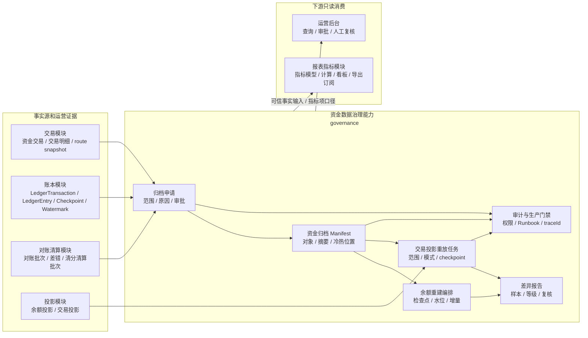
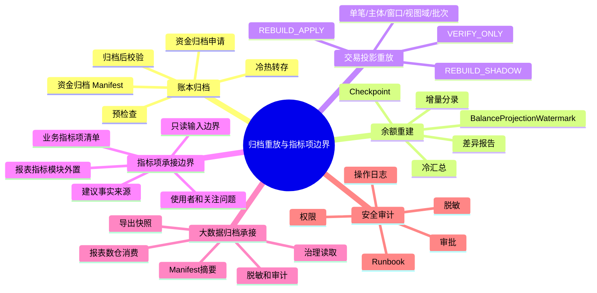
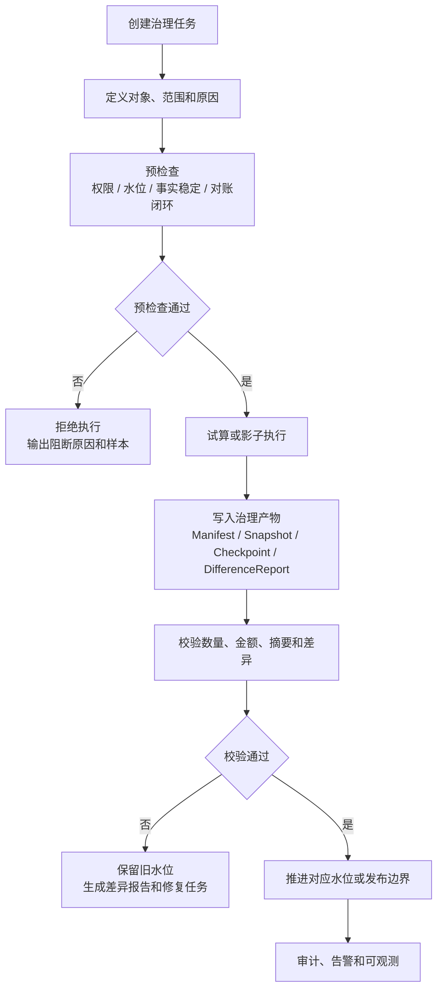
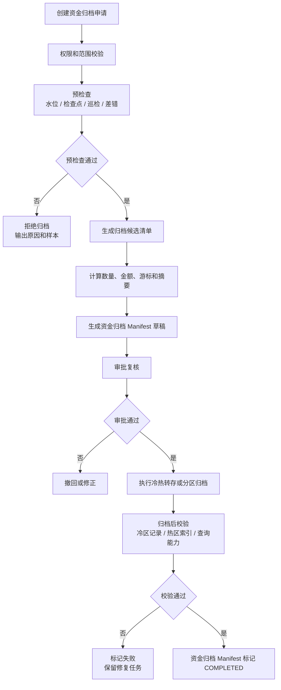
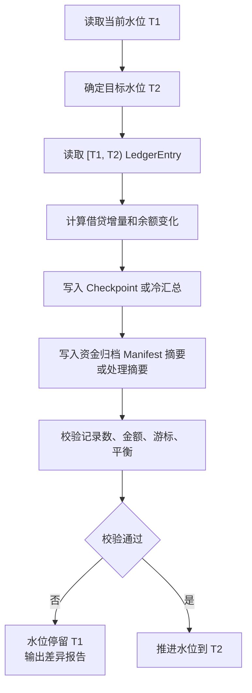
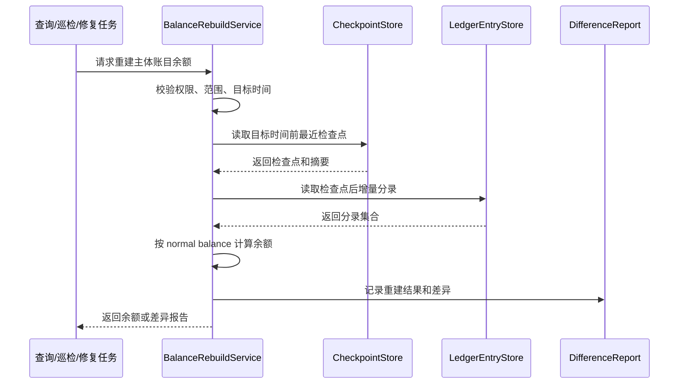
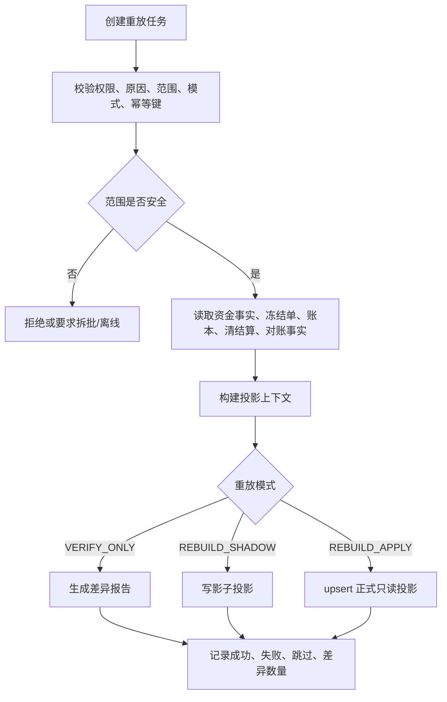

# 资金数据治理能力系统分析设计

## 文档定位

本文是资金数据治理能力的系统分析设计分册。逻辑模块名为 governance，负责说明大数据量下资金事实归档、投影重放、余额检查点和余额水位如何通过账本模块落地并被治理能力引用、校验和编排，以及资金归档 Manifest、差异报告和指标项承接边界如何落到系统对象、数据表、任务状态、核心 API、可观测和准入门禁。governance 是逻辑模块名和能力边界名；物理落点必须保持独立逻辑边界和 face/port 依赖，不得把治理对象混入交易或账本事实表。

模块定位结论：governance 属于支付资金底座的逻辑能力边界，但它不是通用数据平台，也不是报表指标模块。它只负责资金事实治理规则、生产修复控制面、证据链和统一治理流程的资金域适配；普通指标、报表、看板、导出订阅、OLAP 宽表、普通指标快照任务和指标质量治理由独立报表指标模块承接。账本余额快照可以复用指标快照式的任务流程，但事实归属仍是账本模块，确认结论用于余额证明、归档门禁和余额重建，不归报表指标模块所有。

本分册按 P0 资金内核的数据证明能力优先落地。资金事实归档、余额检查点、余额水位、余额重建、Manifest 和差异报告必须先稳定；交易投影重放属于 P1 只读修复能力；VCC、全球账户和收单业务只能通过业务引用、外部轨道引用、币种费用和争议证据扩展归档视图，不新增独立归档水位、独立余额快照或独立报表事实源。

## 一、需求背景

账本交易、分录、交易明细、余额投影、交易投影、清结算批次和对账差错会持续增长。系统必须在大数据量下仍能证明三件事：

1. 历史事实归档后，余额仍能被重建。
2. 只读投影出错后，可以有边界地重放修复。
3. 资金交易指标只作为报表指标模块的业务输入和可信事实边界，不反向污染资金事实。

本设计定义归档、余额重建、交易投影重放和指标项承接边界。

## 二、目标

### 2.1 业务目标

1. 让历史账本事实在归档后仍然可查、可核对、可重建。
2. 让余额投影和交易投影出现差异时，可以有范围、有审批、有差异报告地修复。
3. 让资金交易指标项作为报表指标模块输入，不进入交易、账本、余额、清结算和对账主链路。
4. 明确数据归档、普通指标快照和账本余额快照的校验确认边界，避免把统一任务完成误当成资金域事实确认。

### 2.2 技术目标

| 目标 | 系统设计要求 |
| --- | --- |
| 归档可审计 | 每次归档必须接入统一治理流程，并有范围、检查点、资金归档 Manifest、摘要、审批和归档后校验。 |
| 余额可重建 | 余额从检查点或冷汇总加增量分录重建，不读取交易投影或报表。 |
| 重放有边界 | 交易投影重放必须指定单笔、主体、时间窗口、视图域或批次范围。 |
| 水位不混用 | 余额水位、资金归档 Manifest 和交易投影重放范围独立管理。 |
| 指标项只读承接 | 指标项只作为报表指标模块输入，不修改交易、账本、余额、清结算或对账状态。 |
| 快照确认隔离 | 普通指标快照、账本余额快照和归档 Manifest 分别确认、分别推进边界；任何一个确认结果都不能替代另一个。 |
| 生产可控 | 归档、重建、重放必须有权限、原因、审批、差异报告和 Runbook。 |

### 2.3 非目标

1. 不通过交易投影、用户账单、商户账单或报表反推余额。
2. 不把资金归档 Manifest、余额水位和重放 checkpoint 复用为同一个对象。
3. 不在本分册设计报表指标模块内部实现，包括指标模型、指标计算、指标快照任务、报表看板、导出订阅、OLAP 宽表、指标质量和正式口径版本治理。
4. 不让报表指标模块复用资金归档 Manifest、余额水位、账本余额检查点或交易投影重放 checkpoint 表达指标任务进度。
5. 不把普通指标快照发布成功当作账本余额已确认、归档已完成或交易投影可覆盖的依据。
6. 不允许生产环境无范围、无审批、无差异报告的全量在线重放。

### 2.4 系分完整性索引

本分册进入编码或独立 OpenSpec change 前按下表确认结构完整性，避免把治理能力边界误读成通用数据平台或报表指标模块。

| 完整性项 | 本分册落点 | 准入要求 |
| --- | --- | --- |
| 需求背景和问题 | 第 1 节说明大数据量下历史事实归档、余额重建和只读投影修复问题。 | 必须能说明不做的风险：余额不可证明、投影无法有界修复、指标反写污染资金事实。 |
| 目标、非目标和边界 | 第 2.1 至 2.3 节定义业务目标、技术目标和非目标；第 3.1 至 3.5 节定义系统边界、数据边界和治理流程接入边界。 | 未确认物理落点前，不得把治理对象混入交易、账本、清结算或报表指标事实表。 |
| 概要设计和关键依赖 | 第 3 节覆盖模块定位、依赖关系、能力地图、分层边界和统一治理流程。 | 只能读取事实源和编排治理动作，不得反向修改交易、账本、清结算、对账或报表指标状态。 |
| 详细设计、接口设计和数据设计 | 第 4.1 至 4.6 节覆盖归档、余额重建、投影重放、指标边界、Java 模型、服务 API 和表设计。 | 触碰 API、表结构、H2 schema、状态机或服务入口时必须另起 Execution Grant。 |
| 主流程、异常流程、补偿流程和人工介入 | 第 4.1.2、4.2.3、4.3.3、4.7 节覆盖归档流程、余额重建流程、重放流程、一致性和补偿。 | 无范围、无审批、无差异报告、缺 Manifest 或 digest 冲突时必须失败或转人工处理。 |
| 非功能、可用性和生产就绪 | 第 5 节覆盖性能容量、可用性、生产就绪、可观测性、安全和生产红线。 | 归档、重建和重放必须有容量假设、范围锁、续跑、回滚、告警、Runbook 和审计。 |
| 测试设计和回归测试 | 第 4.5.10、4.8 节覆盖 TDD API 模拟验证矩阵和测试设计。 | 编码前必须明确契约测试、服务级测试、H2 schema、差异报告、幂等并发和红线失败测试。 |
| 研发计划、负责人和验收方式 | 第 6 节交付切片与准入门禁。 | 具体负责人、里程碑和验收方式以独立 OpenSpec change、Harness Plan 与 Execution Grant 为准。 |

### 2.5 能力落地优先级

| 优先级 | 系统能力 | 编码准入判断 |
| --- | --- | --- |
| P0 | 资金归档申请、资金归档 Manifest、余额检查点、余额水位、余额重建、差异报告和审计门禁。 | 必须先证明范围、摘要、冷热位置、checkpoint、watermark、差异报告、审批和审计可闭环。 |
| P1 | 交易投影重放、指标项输入边界和只读治理查询。 | 只能重建或验证只读视图，不反写交易、账本、清结算、对账、余额或指标结果。 |
| P2 | VCC、全球账户和收单业务的归档与重放视图扩展。 | 只能增加业务引用、外部文件引用、币种/费用/争议/商户结算视图和脱敏证据，不新增平行治理模块。 |

### 2.6 系分交付状态与编码准入门禁

本分册从系统分析视角已具备交付评审状态：治理逻辑边界、物理落点候选、归档 Manifest、余额检查点、余额水位、交易投影重放、差异报告、指标边界、大数据归档承接和生产修复控制面已经承接产品分册。该状态只能说明“系分可交付评审”，不能替代编码授权。

| 门禁 | 准入结论 | 系分要求 |
| --- | --- | --- |
| 系分交付 | 通过 | 可作为独立 OpenSpec change、Execution Grant 和研发拆解输入。 |
| PRD/TDD 门禁映射 | 通过 | 必须绑定产品 05 第 5.6.2 节的 `GOV-GATE-001` 至 `GOV-GATE-009`，以及 TDD 第 13.0.3、13.0.4 节的 `TDD-B8-RED-001` 至 `TDD-B8-RED-005`。 |
| TDD 分析 | 可进入 | 可以输出首批 Red、治理物理落点、Manifest/H2 范围、dry-run/apply、指标水位隔离、治理导出和大数据归档边界测试矩阵。 |
| 编码准入 | 未打开 | 必须由用户确认独立 Execution Grant，逐项填写 `GOV-GATE-*`，明确写入范围、禁止范围、验证命令和停止条件。 |
| 数据库级落地 | 未完成 | 需补归档任务、运行记录、Manifest、checkpoint、watermark、冷热对象清单、余额快照、差异报告、人工处理、导出快照、消费方登记、审计对象和 H2 schema。 |
| 服务级落地 | 未完成 | 需补真实 H2 服务流程测试、dry-run/apply 幂等、范围锁、回滚续跑、差异报告、只读事实边界、指标水位隔离和失败无副作用测试。 |
| 生产准入 | 未完成 | 需补 NFR、容量、观测告警、Runbook、灰度回滚、外部规则核验、专业确认状态、使用者解释字段、治理导出脱敏、职责分离和证据最小化。 |

Execution Grant 至少需要确认：治理物理落点；是否复用 `governance-face`、`governance-impl`；依赖方向；是否新增公共契约、DTO、Entity、Mapper、DDL/H2 schema；`TDD-B8-RED-001` 至 `TDD-B8-RED-005` 首批 Red；Manifest、checkpoint、watermark、余额快照、差异报告、人工处理、dry-run/apply、指标水位隔离、大数据归档承接、治理导出、回滚续跑和边界测试范围。缺少任一 `GOV-GATE-*` 时，本分册只能继续做 TDD 分析、契约草案或 dry-run，不得进入 apply、正式水位推进、生产修复控制面、生产代码、测试代码、DDL/H2 schema 或运行时配置写入。

## 三、概要设计

### 3.1 模块名称与定位

| 项目 | 内容 |
| --- | --- |
| 模块中文名 | 资金数据治理能力 |
| 逻辑模块名 | governance，作为独立逻辑能力和跨模块编排边界。 |
| Java 包建议 | 编码前必须在 Execution Grant 中二选一确认物理落点：独立 governance 模块，或由 ledger / transaction / reconciliation 等归属模块承接局部能力。无论采用哪种落点，都必须保留 governance 编排语义、独立 API/port、差异报告、统一治理接入边界和独立表职责，不得把治理对象混入交易、账本、投影、清结算或指标事实表。 |
| 模块定位 | 支付资金底座的数据治理适配层和生产修复控制面，负责把资金事实归档、余额重建、交易投影重放和差异报告接入统一治理流程，并保留资金域 Manifest、金额摘要、审批审计和生产门禁。 |
| 拥有对象 | 资金归档申请、资金归档 Manifest、交易投影重放任务、差异报告、归档重放审计摘要。 |
| 协作对象 | 余额检查点、余额水位、账本事实、资金交易事实、清结算与对账对象、报表指标模块输入、普通指标快照发布摘要。 |
| 不拥有对象 | 资金交易、交易明细、账本交易、账本分录、余额投影事实、交易投影事实、清结算对象、对账差错对象、指标模型、指标任务、普通指标快照、指标水位、指标质量报告、报表看板、导出订阅、报表指标结果。 |
| 基础准入能力 | 归档申请、预检查、资金归档 Manifest、交易投影重放任务、差异报告和快照校验确认边界；余额检查点和水位通过账本能力协作落地。 |

模块一句话定义：

资金数据治理能力负责把“历史事实能否安全归档、归档后能否证明、投影出错能否有界重放”变成可审批、可执行、可审计、可控的资金域治理能力；它只定义资金域规则、编排和证明，不重写资金事实，也不替代通用数据治理或报表指标模块。

这里的 governance 只治理资金事实、投影、归档、重放、差异和生产修复证据链，不承接权限治理、规则治理、风控治理、指标计算、报表展示、OLAP 宽表或平台治理。

模块命名取舍：

| 候选名称 | 判断 | 结论 |
| --- | --- | --- |
| governance | 命名简短；结合资金域上下文和中文名“资金数据治理能力”限定后，可承接归档、重放、差异报告和生产修复门禁，并通过账本能力引用检查点和水位。 | 采用。 |
| archive | 只覆盖归档，无法表达交易投影重放和差异报告。 | 不采用。 |
| archive-replay | 准确但偏窄，无法同时表达数据质量、证据链和生产修复门禁。 | 不采用。 |
| funds-data-governance | 语义完整但模块名过长，不符合当前模块命名简洁性。 | 不采用。 |

#### 3.1.1 治理物理落点决策矩阵

治理能力先按逻辑边界建模，编码前再由 Execution Grant 确认物理落点。选择物理落点时必须优先保护事实边界、依赖方向、测试可证明性和后续迁移成本，不能因为已有包名或短期实现方便把治理对象混进交易、账本、清结算或指标事实表。

| 落点方案 | 适用条件 | 允许写入范围 | 禁止 | 迁移代价和风险 | 必须先补的测试 |
| --- | --- | --- | --- | --- | --- |
| 复用既有 `governance-face` / `governance-impl` | 当前代码已有交易投影重放骨架，且本批次要落归档、重放、差异报告或生产修复控制面中的跨模块能力。 | governance 契约、任务对象、Manifest、差异报告、审计摘要、编排服务和必要的 H2 schema。 | 依赖 transaction-impl、ledger-impl 或 reconciliation-impl；在 governance 内直接写交易、账本、清结算、对账、余额或指标事实。 | 最符合长期治理边界，但公共契约一旦发布会带来兼容约束；需要补足模块边界测试和 DDL/H2。 | `TDD-B8-RED-001` 至 `TDD-B8-RED-005`、模块依赖边界测试、Manifest 幂等测试、指标水位隔离测试。 |
| 归属模块内落地 | 只落账本检查点/水位、交易投影重放端口、归档对象读取等局部能力，且能力完全由单一事实归属模块拥有。 | 归属模块的 face、domain/application 包和内部端口；只写该模块拥有的控制表或索引表。 | 用局部能力承接跨模块治理任务；把 Manifest、差异报告或统一治理任务拆散到多个事实表；跨 impl 依赖。 | 短期改动小，但后续升级为统一 governance 时需要迁移契约、表和测试夹具；容易形成隐形规则。 | 归属模块服务级测试、只读端口测试、迁移兼容测试、不得反写其他模块事实的边界测试。 |
| 新增独立物理模块 | 现有 governance 骨架不足以承载完整治理闭环，或需要单独部署、单独权限、单独审计和跨模块治理生命周期。 | 新增 governance-face / governance-impl、独立表、Mapper、DTO、Service、审计和 H2 schema。 | 未有 Execution Grant 就创建空壳模块；把指标计算、报表查询、看板、导出订阅放进 governance；跳过 BOM/依赖/CI 影响评估。 | 长期边界最清晰，但初始成本最高；需要调整多模块构建、依赖聚合、测试和发布门禁。 | 模块依赖架构测试、契约兼容测试、表结构 H2 测试、失败回滚测试、权限审计测试和 `just verify-cad`。 |

选择规则：

1. 若本批次要做正式 apply、生产修复控制面、跨模块 Manifest 或差异报告，优先复用或建设独立 governance 落点，不应散落到事实归属模块。
2. 若只补账本检查点、水位或单一事实读取端口，可暂放归属模块，但必须保留 governance 语义、差异报告接口和后续迁移路径。
3. 若 Execution Grant 未确认物理落点、依赖方向、是否新增公共契约、DDL/H2、Mapper/Entity 归属和边界测试，则只能做设计、contract-only 或 dry-run，不得写入生产代码。
4. 无论选择哪种落点，指标项只作为报表指标模块输入；普通指标快照不得推进余额水位、归档 Manifest 或交易投影 checkpoint。

### 3.2 与其他模块的依赖关系



依赖边界：

| 依赖对象 | 本模块读取 | 本模块可触发 | 禁止 |
| --- | --- | --- | --- |
| 交易模块 | 资金交易、交易明细、route snapshot、交易生命周期和交易投影来源事实。 | 发起只读投影重放或归档候选读取。 | 直接修改交易状态、补写交易明细、重新路由或重新入账。 |
| 账本模块 | 账本交易、posting plan、ledger entry、余额检查点、余额水位和账本周期。 | 触发余额检查点计算、余额重建校验或水位推进申请。 | 直接改历史分录、直接修正余额投影、用归档日期替代账本周期。 |
| 对账清算模块 | 对账批次、差错闭环、清分批次、清算批次、结算单、出款单和审计引用。 | 读取已闭环结果作为归档准入证据，或把重大差异关联到差错单。 | 归档或重放反向推进对账、清分、清算、结算或出款状态。 |
| 投影模块 | 余额投影和交易投影当前结果，用于比对和重放。 | 在审批和影子校验通过后触发只读投影 upsert。 | 把投影当事实源，或用投影反推交易、分录和余额。 |
| 报表指标模块 | 归档、重放、差异和任务摘要的只读事实输入。 | 提供指标项、建议事实来源和业务口径边界。 | 指标结果反写归档、重放、账本、交易、清结算或对账状态；复用本模块的 Manifest、水位或 checkpoint 表达报表任务进度。 |

### 3.3 能力地图



### 3.4 分层边界

| 能力 | 事实来源 | 写入对象 | 禁止 |
| --- | --- | --- | --- |
| 账本归档 | LedgerTransaction、LedgerPostingPlan、LedgerEntry | 资金归档清单、冷区数据、归档索引、资金归档 Manifest | 改变事实身份或删除审计链路。 |
| 余额重建 | LedgerEntry、Checkpoint、Watermark、资金归档 Manifest | 差异报告、修复任务、重建后的余额投影 | 从交易投影、用户账单、商户账单或报表反推余额。 |
| 交易投影重放 | 交易事实、冻结单、账本、清结算、对账差错 | 影子投影、正式只读投影、差异报告 | 重新入账、补写交易明细、修改分录。 |
| 指标项承接边界 | 交易、账本、投影、清结算、对账、外部文件 | 指标项清单、使用者、关注问题、建议事实来源 | 在本分册设计报表指标模块内部实现、反写资金事实，或复用归档重放控制对象表达指标任务。 |
| 大数据归档承接边界 | 资金冷归档、Manifest、投影、清结算、对账和治理导出快照 | 治理读取授权、导出快照、Manifest 摘要、脱敏策略、digest、消费方审计记录 | 报表数仓直接扫描在线资金冷归档、反写资金事实、推进资金水位，或替代余额快照和交易重放 checkpoint。 |

### 3.5 统一治理流程接入边界

大表冷数据归档、指标快照、账本余额检查点和交易投影重放都属于“有范围、有水位、有产物、有差异、有审计”的治理任务。系统可以统一任务流程、审批、调度、分批、差异报告和可观测模型，但不能统一业务语义、事实来源和水位对象。

本分册将“指标快照”拆成两层理解：

1. 广义指标快照是任务形态，表示系统对某个范围、口径、时间边界和事实来源进行一次批量计算、校验和确认。
2. 普通指标快照属于报表指标模块，服务查询、看板、导出、订阅和运营分析。
3. 账本余额快照可以认为是广义指标快照的特殊场景，但它确认的是资金域账本 bucket 余额，不是普通报表指标；它的事实来源、确认状态、水位和失败后果必须由账本和资金治理边界共同约束。

校验确认的核心原则：

1. 数据归档确认的是“事实安全迁移并可被 Manifest 证明”，不确认余额正确，也不确认指标已发布。
2. 普通指标快照确认的是“某个指标口径在某个指标水位下完成计算、质量校验和发布审批”，不确认账本余额，也不推进资金域水位。
3. 账本余额快照确认的是“某个账本 bucket 在某个账务边界上的余额可由分录、借贷方向、账本周期和摘要证明”，可以作为余额水位推进、归档门禁和余额重建依据。
4. 统一任务完成只代表任务框架完成，不能替代资金归档 Manifest 完成、账本余额快照校验通过、指标快照发布成功或交易投影重放正式覆盖。

校验确认必须回答五个问题：

| 问题 | 数据归档 | 普通指标快照 | 账本余额快照 |
| --- | --- | --- | --- |
| 确认对象是什么 | 归档对象、冷热位置、Manifest 和查询路由。 | 指标口径、指标水位、质量结果和发布批次。 | 账本 bucket、检查点、余额水位和分录游标。 |
| 谁拥有确认结论 | 资金数据治理能力拥有 Manifest 结论。 | 报表指标模块拥有指标发布结论。 | 账本模块拥有余额事实结论，资金数据治理能力只编排、引用和校验。 |
| 依赖哪些事实 | 交易事实、账本事实、冷热记录、金额摘要、对账闭环和防篡改摘要。 | 指标模块按口径选择的只读来源和质量规则。 | ledger entry、ledger transaction、posting plan 摘要、normal balance、账本周期、检查点和必要的 Manifest 覆盖。 |
| 确认后能推进什么 | Manifest 状态、冷热查询路由和归档引用边界。 | 指标水位、指标发布和报表查询。 | 余额水位、冷热拼接边界、余额重建基准和归档准入门禁。 |
| 确认后仍不能做什么 | 不能推进余额水位，不能证明指标发布，不能修改资金事实。 | 不能证明余额正确，不能推进资金域水位，不能作为调账或清结算依据。 | 不能替代 Manifest，不能作为普通报表指标发布，不能覆盖交易投影。 |

统一的是流程骨架：



统一治理流程与资金域语义的关系：

| 能力 | 可复用的统一流程能力 | 资金域必须自定义的语义 | 水位或边界对象 | 归属判断 |
| --- | --- | --- | --- | --- |
| 大表冷数据归档 | 任务申请、分批迁移、冷区校验、归档后查询、审计和告警。 | 资金事实可归档前提、金额摘要、账务摘要、对账闭环和 Manifest 证明。 | 归档边界、资金归档 Manifest、冷热位置。 | 通用数据治理提供流程能力；governance 提供资金域规则和证据要求。 |
| 普通指标快照 | 快照任务、指标水位、历史累计值、热数据实时计算、质量报告和发布审批。 | 资金指标项的建议事实来源和只读边界。 | 指标水位、指标快照批次。 | 报表指标模块拥有；governance 只提供输入边界。 |
| 账本余额检查点 | 批处理、范围、摘要、差异报告、先算后推水位。 | 只能从账本分录、借贷方向、账本周期、normal balance 计算；用于余额证明和归档门禁。 | 余额检查点、余额水位。 | 账本模块拥有事实能力；governance 编排、引用和校验。 |
| 交易投影重放 | 有界任务、断点续跑、影子结果、差异报告、审批和审计。 | 只修复只读交易视图，不生成 route、posting plan、交易事实或分录。 | 交易投影重放 checkpoint。 | governance 可编排任务；投影写入通过投影端口完成。 |

校验确认矩阵：

| 治理能力 | 确认对象 | 确认前必须校验 | 确认后允许推进 | 确认后仍禁止 |
| --- | --- | --- | --- | --- |
| 大表冷数据归档 | 资金归档 Manifest。 | 申请范围、对象清单、冷热记录数、金额摘要、防篡改摘要、冷区可读性、热区索引、余额检查点和对账闭环证据。 | Manifest 状态、归档查询路由、允许余额重建或交易投影重放引用该 Manifest。 | 修改交易事实、账本分录、余额投影事实；推进余额水位；发布普通指标快照。 |
| 普通指标快照 | 指标快照批次和指标水位。 | 指标口径版本、数据来源、质量规则、缺数处理、权限脱敏、发布审批和失败处理。 | 指标水位、指标查询、报表展示、导出订阅。 | 作为余额证明、归档完成依据、调账依据或清结算状态推进依据。 |
| 账本余额快照 | 余额检查点和余额水位。 | 账本分录闭合、借贷方向、normal balance、账本周期、分录游标、金额摘要、覆盖模式、必要的 Manifest 覆盖和差异报告。 | 余额水位、冷热拼接边界、余额重建基准、归档准入门禁。 | 作为普通指标发布结果；替代归档 Manifest；覆盖交易投影视图；跳过分录校验。 |
| 交易投影重放 | 投影重放任务和重放 checkpoint。 | 范围、事实源位置、Manifest 一致性、规则解释起点、重放模式、影子结果、差异报告和审批。 | 影子投影或正式只读投影 upsert。 | 重新入账、补写交易事实、修改账本分录、推进余额水位或指标水位。 |

统一流程设计红线：

1. 统一流程可以复用任务状态、审批、调度、分批、差异报告和可观测模型。
2. 统一流程不得让指标水位、余额水位、归档 Manifest、账本检查点和交易投影重放 checkpoint 互相替代。
3. 账本余额检查点可以看作特殊的“指标快照流程”，但语义上是余额证明和归档门禁，不是普通报表指标。
4. 资金归档 Manifest 可以被普通归档任务框架引用，但 Manifest 的金额摘要、账务摘要和防篡改证明由资金域定义。
5. 报表指标模块可以消费 governance 产出的归档、重放和差异任务摘要，但不得用指标结果驱动余额修复、归档完成或交易投影正式覆盖。

统一数据归档治理接入契约：

| 接入项 | 统一治理能力提供 | 资金域必须提供 | 状态映射 | 失败兜底 | 不得复用 |
| --- | --- | --- | --- | --- | --- |
| 归档任务申请 | 任务号、申请人、审批、调度、批次运行记录。 | 资金归档范围、可归档前提、账务摘要、金额摘要、对账闭环证据和 Manifest 规则。 | 统一任务 APPROVED/RUNNING/FAILED/COMPLETED 映射到资金归档申请状态；资金归档 Manifest 状态独立维护。 | 统一任务失败时，Manifest 保留旧状态和已处理游标；不删除热区索引，不推进归档完成。 | 不得用统一任务号替代资金归档 Manifest。 |
| 冷热转存执行 | 分批、限流、断点、重试、冷区写入和基础校验。 | 热区事实读取边界、冷区金额摘要、冷热位置、游标、防篡改摘要和查询路由要求。 | 批次状态只表达执行进度；资金归档 Manifest 完成才表达归档结果可信。 | 冷区校验失败时保留失败批次和差异报告，等待修复或重跑。 | 不得用冷区分区时间替代余额水位、账本周期或报表周期。 |
| 余额检查点类任务 | 通用批处理、试算、差异报告、审批和观测。 | 账本分录、借贷方向、账本周期、normal balance、检查点摘要和水位推进规则。 | 统一任务完成不等于水位推进成功；水位必须由账本能力先算后推。 | 试算失败或摘要不一致时，水位停留旧值并生成差异报告。 | 不得用指标水位、归档 Manifest 或重放 checkpoint 替代余额水位。 |
| 交易投影重放任务 | 任务调度、范围拆批、断点续跑、影子执行和审批记录。 | 交易投影事实源、视图域、重放模式、正式覆盖门禁和投影写入端口。 | VERIFY_ONLY、REBUILD_SHADOW、REBUILD_APPLY 映射到重放任务模式；统一任务只承载执行生命周期。 | 正式覆盖失败时保留影子结果和差异报告，不重写事实。 | 不得复用余额水位、资金归档 Manifest 或报表 checkpoint 表达重放进度。 |
| 差异报告 | 差异任务编号、样本、等级、处理状态和审计查询。 | 差异类型、金额或摘要口径、来源事实引用、对账差错关联规则和关闭证据。 | 统一差异状态可映射到 OPEN/CONFIRMING/RESOLVED/CLOSED；是否放行由资金域审批和差错闭环决定。 | 重大差异必须关联对账差错或标准资金事实处理链。 | 不得让差异报告直接触发调账、冲正、清算确认或余额修复。 |

广义指标快照接入契约：

| 接入项 | 普通指标快照 | 账本余额快照 |
| --- | --- | --- |
| 任务分类 | REPORTING_METRIC_SNAPSHOT。 | LEDGER_BALANCE_CHECKPOINT。 |
| 口径来源 | 报表指标模块维护指标编码、版本、维度、聚合方式和质量规则。 | 账本模块维护账本 bucket、借贷方向、normal balance、账本周期、检查点和余额水位规则。 |
| 水位对象 | 指标水位，只表达指标计算到哪个业务边界。 | 余额水位，只表达账本分录已被检查点或冷汇总安全覆盖到哪个边界。 |
| 校验产物 | 指标质量报告、发布审批、回滚记录。 | BalanceSnapshotVerifyRef、差异报告、检查点状态和水位推进结果。 |
| 成功状态 | 指标可发布或可查询。 | 检查点可进入 VERIFIED，且余额水位可按先算后推规则推进。 |
| 失败状态 | 指标不发布、保留当前有效结果或标记质量异常。 | 检查点不得进入 VERIFIED，余额水位停留旧值，归档准入被阻断。 |
| 本分册处理方式 | 只定义只读输入和不得复用资金域控制对象。 | 定义资金域校验确认边界、接口、表字段约束和测试门禁。 |

普通指标快照与账本余额快照的边界确认：

| 比较项 | 普通指标快照 | 账本余额快照 |
| --- | --- | --- |
| 主要目的 | 服务报表、看板、运营分析、导出订阅和指标追踪。 | 服务余额证明、冷热拼接、归档门禁、余额重建和资金安全校验。 |
| 事实来源 | 报表指标模块按口径选择交易、账本、投影、清结算、对账、归档任务和外部维度。 | 只能来自账本分录、借贷方向、normal balance、账本周期、检查点、余额水位和必要的已完成 Manifest。 |
| 拥有模块 | 报表指标模块。 | 账本模块拥有事实能力，governance 负责编排、引用和校验。 |
| 水位对象 | 指标水位。 | 余额水位。 |
| 确认结论 | 指标口径在该水位可查询或发布。 | 余额在该账本 bucket 和边界上可重建、可审计、可作为归档准入。 |
| 失败影响 | 指标不发布、保留当前有效结果或标记质量异常。 | 余额水位不推进、归档阻断、重建失败并生成差异报告。 |
| 不得承担 | 不得作为余额修复、归档完成、清算确认、差错核销或资金调整依据。 | 不得作为普通报表指标水位、增长分析结果或报表发布审批。 |

## 四、详细设计

### 4.1 账本归档设计

#### 4.1.1 归档前置条件

| 条件 | 系统校验 |
| --- | --- |
| 范围明确 | 租户、主体、账本、账目、币种、时间范围、原因、发起人。 |
| 水位覆盖 | 归档截止小于等于已校验余额水位或检查点覆盖边界。 |
| 检查点存在 | 范围末端有已校验 Checkpoint 或冷汇总。 |
| 事实摘要一致 | 账本交易、posting plan、ledger entry 数量和金额摘要一致。 |
| 差错已处理 | 范围内不存在未关闭的高风险账务差异。 |
| 资金归档 Manifest 草稿 | 归档对象、范围、数量、金额、游标、冷热位置、摘要已生成。 |
| 审批通过 | 财务、研发或安全按风险等级审批。 |

#### 4.1.2 归档流程



#### 4.1.3 资金归档申请与资金归档 Manifest

| 字段 | 说明 |
| --- | --- |
| archiveRequestSn | 资金归档申请号，表达谁在什么原因下申请归档、申请范围是什么、审批是否通过。 |
| archiveManifestSn | 资金归档 Manifest 号，表达实际归档了哪些对象、归档到哪里、数量和金额摘要是否闭合。 |
| tenantId | 租户。 |
| scope | 主体、账本、账目、币种、时间范围。 |
| objectTypes | 账本交易、posting plan、分录、相关投影索引。 |
| recordCount | 实际纳入归档清单的记录数。 |
| debitAmount/creditAmount | 借贷金额摘要。 |
| lastCursor | 最后游标，用于断点续跑和定位归档边界。 |
| checkpointRef | 检查点或冷汇总引用，用于证明归档范围之前的余额可重建。 |
| watermarkRef | 余额水位引用，用于证明归档截止时间不超过已校验水位。 |
| hotLocation/coldLocation | 热区索引和冷区数据位置。 |
| digest | 防篡改摘要。 |
| status | 申请状态和 Manifest 状态分别维护，不能互相替代。 |
| audit | 发起人、审批人、执行人、原因、traceId。 |

资金归档申请和资金归档 Manifest 的职责边界：

| 对象 | 解决的问题 | 写入时机 | 主要使用方 | 不允许承担的职责 |
| --- | --- | --- | --- | --- |
| 资金归档申请 | 证明这次归档为什么发起、归档范围是否合法、谁审批、是否允许执行。 | 运营或系统创建归档任务时写入；预检查、审批、执行和完成时更新状态。 | 运营后台、归档调度器、审批流、审计查询。 | 不证明实际归档结果，不作为余额水位，不作为冷区查询索引。 |
| 资金归档 Manifest | 证明实际归档的对象、范围、记录数、金额摘要、冷热位置、游标、检查点、水位和防篡改摘要。 | 预检查通过后生成草稿；归档执行中更新游标；归档后校验通过才完成。 | 归档执行器、冷区查询路由、余额重建、交易投影重放、审计。 | 不替代审批，不扩大申请范围，不作为报表统计窗口，不作为交易或账本事实源。 |

协作规则：

1. 资金归档申请是控制面，资金归档 Manifest 是证据面；申请批准只代表允许执行，Manifest 完成才代表本次归档结果可被审计和重建引用。
2. 一个资金归档申请可以拆分生成多个资金归档 Manifest，例如按对象类型、账本分片、时间分片或冷热位置拆分；每个 Manifest 必须回指同一个申请号。
3. 资金归档 Manifest 的范围不得超过申请范围；若预检查后需要扩大范围，必须撤回或重新发起申请。
4. 归档任务失败时，申请状态记录本次任务失败，Manifest 保留已处理游标、摘要和失败原因，用于续跑、修复或审计。
5. 余额重建和交易投影重放只能读取已完成并校验通过的资金归档 Manifest；不能读取仅审批通过但未完成的申请。

资金归档 Manifest 红线：

1. 缺资金归档 Manifest 不得标记归档成功。
2. 资金归档 Manifest 与冷区记录、热区索引或金额摘要不一致时不得推进状态。
3. 资金归档 Manifest 只能证明归档范围，不能作为余额水位、报表统计窗口或其他处理边界复用。

归档校验确认能力边界：

| 边界项 | 设计要求 |
| --- | --- |
| 确认粒度 | 按租户、对象类型、归档范围、冷热位置和 Manifest 拆分确认；不得笼统确认“历史数据已归档”。 |
| 确认来源 | 归档申请、归档候选清单、热区事实摘要、冷区事实摘要、冷热查询路由、检查点引用、水位引用、审批和对账闭环证据。 |
| 必须校验 | 范围未越权、对象清单完整、冷热记录数一致、借贷金额摘要一致、last cursor 连续、防篡改摘要一致、冷区可读、热区索引仍可定位、查询路由可解释。 |
| 确认状态 | 只有 Manifest 进入 COMPLETED 才表示归档结果可信；申请 APPROVED、统一任务 COMPLETED 或冷区写入完成都不能单独表示归档完成。 |
| 确认后允许 | 允许冷区查询路由引用该 Manifest，允许余额重建或交易投影重放读取该 Manifest 作为事实位置证据。 |
| 确认后禁止 | 不允许修改账本事实、交易事实或余额投影事实；不允许推进余额水位；不允许发布普通指标快照。 |

归档确认失败时，Manifest 必须保留已处理范围、失败批次、摘要、差异报告、冷区位置和热区索引状态。系统只能进入修复、续跑、撤销或重新发起流程，不得删除热区索引或把失败 Manifest 标记为可引用边界。

### 4.2 余额重建设计

#### 4.2.1 水位模型

```text
cold balance = watermark 之前的已校验检查点或冷汇总
hot delta    = [watermark, targetTime) 的增量 LedgerEntry
balance      = cold balance + hot delta
```

BalanceProjectionWatermark 表示余额冷热拼接和检查点覆盖边界，不是自然日、归档日期、清算账期、报表周期或热数据保留天数。

#### 4.2.2 水位推进



水位推进约束：

1. 必须先计算、写入、校验，再推进水位。
2. 失败时水位停留在旧值。
3. 不能用当前时间、自然日或 180 天热保留期替代水位。
4. 水位推进必须有批次号、操作者、处理范围和摘要。

#### 4.2.3 余额重建流程



余额重建红线：

1. 不从用户账单、商户账单、交易投影或指标报表反推余额。
2. 缺检查点、缺水位、缺资金归档 Manifest 或摘要不一致时，不得返回成功。
3. 重建发现差异时输出差异报告，不直接修改历史分录。
4. 生产重建必须限制范围并保留审批和审计。

#### 4.2.4 账本余额快照确认能力边界

账本余额快照在实现上可以复用“指标快照”的任务骨架，例如范围、批次、试算、差异报告、审批和水位推进。更准确地说，它是广义指标快照的特殊场景：任务形态像指标快照，确认对象却是账本 bucket 的余额事实。它不是普通报表指标，也不属于报表指标模块。

| 边界项 | 设计要求 |
| --- | --- |
| 快照粒度 | 必须按租户、主体、账目、币种、账本周期、checkpoint time 和 last entry cursor 生成。 |
| 事实来源 | 只读取 ledger entry、ledger transaction、posting plan 摘要、normal balance、上一检查点，以及覆盖冷区或混合区的已完成资金归档 Manifest。 |
| 校验内容 | 分录数量、借贷金额、余额方向、周期隔离、last entry cursor、digest、Manifest 覆盖模式和差异报告。 |
| 确认动作 | 只有快照状态为 VERIFIED 且差异报告无阻断项，才允许推进余额水位。 |
| 对外用途 | 作为余额重建基准、冷热拼接边界、归档准入门禁和余额巡检证据。 |
| 禁止用途 | 不作为普通指标快照发布，不作为报表指标水位，不直接展示给业务用户替代余额查询。 |

Manifest 覆盖模式：

| 覆盖模式 | 适用范围 | Manifest 要求 | 校验要求 |
| --- | --- | --- | --- |
| 热区覆盖 | 目标边界内分录仍在热区，尚未进入冷归档。 | 可以没有 Manifest，但必须有热区分录、上一检查点和 last entry cursor。 | 校验热区分录数量、借贷金额、digest、账本周期和游标连续性。 |
| 冷区覆盖 | 目标边界内分录已经进入冷区。 | 必须引用已完成并校验通过的资金归档 Manifest。 | 校验 Manifest 覆盖范围、冷区可读性、冷热摘要和分录游标。 |
| 混合覆盖 | 目标边界横跨热区和冷区。 | 冷区部分必须引用 Manifest，热区部分必须引用热区游标。 | 分别校验冷区 Manifest 与热区分录，再校验合并后的借贷摘要、余额方向和 digest。 |

余额快照确认结论只能从 CREATED 或 VERIFYING 进入 VERIFIED 或 FAILED。VERIFIED 表示该账本 bucket 在指定 checkpoint time 和 last entry cursor 上可被账本事实证明；它不表示归档完成，不表示报表指标发布，也不表示交易投影可以覆盖。

账本余额快照确认红线：

1. 不能用普通指标快照任务的成功状态替代余额快照 VERIFIED。
2. 不能用指标水位、报表周期、自然日或归档日期替代余额水位。
3. 不能跳过 last entry cursor、借贷摘要、digest 和必要的 Manifest 覆盖校验。
4. 余额快照失败只能生成差异报告或修复任务，不得自动修改账本分录、余额投影或交易投影。
5. 热区覆盖、冷区覆盖和混合覆盖必须显式区分；不得因为 manifestSn 为空就跳过冷区覆盖校验。

### 4.3 交易投影重放设计

#### 4.3.1 重放范围

| 范围 | 必填参数 |
| --- | --- |
| 单笔 | 来源对象类型、来源流水号。 |
| 主体 | 主体类型、主体 ID、币种、时间范围。 |
| 时间窗口 | 开始时间、结束时间、最大窗口限制。 |
| 视图域 | 用户账单、商户账单、运营时间线、财务报表投影。 |
| 批次 | 清算批次、结算单、出款单、对账批次或差错单引用。 |

#### 4.3.2 重放模式

| 模式 | 行为 | 写入 |
| --- | --- | --- |
| VERIFY_ONLY | 只比对事实源和当前投影。 | 写差异报告，不写投影。 |
| REBUILD_SHADOW | 重建影子投影。 | 写影子表或影子索引。 |
| REBUILD_APPLY | 重建并 upsert 正式只读投影。 | 写正式只读投影，不写事实。 |

#### 4.3.3 重放流程



重放任务字段：

| 字段 | 说明 |
| --- | --- |
| taskSn | 任务号。 |
| tenantId | 租户。 |
| scopeType/scopeValue | 重放范围。 |
| viewDomain | 用户、商户、运营、财务。 |
| mode | VERIFY_ONLY、REBUILD_SHADOW、REBUILD_APPLY。 |
| idempotencyKey | 幂等键。 |
| status | CREATED、RUNNING、PAUSED、COMPLETED、FAILED。 |
| checkpoint | 断点续跑位置。 |
| resultSummary | 成功数、失败数、跳过数、差异数。 |
| audit | 发起人、审批、原因、traceId。 |

重放红线：

1. 重放不得重新入账。
2. 重放不得补写资金交易或交易明细。
3. 重放不得修改账本交易、分录或余额投影。
4. 无范围全量在线重放必须失败。
5. 超过最大窗口或记录数必须拆批、离线或先跑影子重放。

### 4.4 资金交易指标项承接边界

资金交易指标是报表指标模块承接的只读能力，不是交易、路由、钱包、账本、清结算或对账主链路的一部分。本分册只提供报表指标模块需要理解的业务输入：指标域、可能关心的指标项、使用者、关注问题和建议事实来源。

本分册不设计报表指标模块内部实现。指标采集、计算、存储、调度、展示、导出、订阅、质量校验、OLAP 宽表和正式口径版本治理由报表指标模块在独立系分中完成。

#### 4.4.1 承接输入

| 输入 | 说明 | 承接边界 |
| --- | --- | --- |
| 指标项 | 产品和业务可能关心的观察项。 | 报表指标模块定义正式编码、名称和状态。 |
| 业务问题 | 指标用于回答增长、风险、资金安全、运营效率或异常定位问题。 | 报表指标模块定义使用场景、看板和报表。 |
| 使用者 | 产品、运营、财务、风控、客服、审计或管理层。 | 报表指标模块定义权限、脱敏和导出审计。 |
| 理解口径 | 用自然语言解释纳入范围、排除范围和常见误用。 | 报表指标模块定义正式口径版本和数据质量规则。 |
| 建议事实来源 | 交易、账本、余额投影、清结算、对账、归档和重放任务。 | 报表指标模块选择具体数据链路、存储方案、计算任务和权限模型。 |

#### 4.4.2 产品和业务关注指标项

| 指标域 | 可能关心的指标项 | 主要使用者 | 建议事实来源 |
| --- | --- | --- | --- |
| 交易规模 | 交易笔数、交易金额、成功交易、失败交易、授权批准、授权拒绝、退款、手续费。 | 产品、运营、财务 | 资金交易、交易明细、账本交易、费用分录。 |
| 余额账户 | 用户可用余额、冻结余额、授权占用、商户待清算、可结算、出款中、负余额主体数和金额。 | 产品、运营、风控、财务 | 余额投影、账本分录、冻结单、授权交易。 |
| 清结算 | 清算候选、清算确认、结算净额、出款提交、出款成功、出款失败、准备金。 | 财务、运营 | 清算批次、结算单、出款单、账本分录。 |
| 对账差错 | 对账批次、对平笔数、差错金额、挂账金额、核销金额、平均处理时长、超 SLA 差错数。 | 财务、运营、审计 | 对账批次、匹配结果、差错单、核销记录。 |
| 风控运营 | 冻结金额、解冻金额、风控阻断、审批通过率、争议案件、追偿金额。 | 风控、运营、客服 | 冻结单、审批单、争议记录、追偿单。 |
| 归档重放 | 归档批次、归档记录、余额重建差异、重放任务、重放成功率、重放差异数。 | 研发、运营、审计 | 资金归档申请、资金归档 Manifest、重放任务、差异报告。 |

#### 4.4.3 系分边界

1. 指标项只读消费事实或读模型，不反写交易、账本、余额、清结算或对账状态。
2. 指标结果不能作为余额修复、账务调整、清算确认或差错核销依据。
3. 报表指标模块可独立设计指标编码、口径版本、数据质量、权限导出、订阅和报表展示，本分册不提前约束其实现形态。
4. 涉及监管、合规、外汇、备付金或持牌报送的指标，需要在报表指标模块系分和上线前补规则来源、版本或发布日期、生效日期、适用主体或适用范围、适用法域、核验日期、确认方和确认状态。
5. 报表指标模块不得复用归档 Manifest、余额水位、余额检查点或交易投影重放 checkpoint 表达指标任务进度。

普通指标快照承接边界：

| 边界项 | 报表指标模块负责 | 资金数据治理能力负责 | 禁止 |
| --- | --- | --- | --- |
| 指标口径 | 指标编码、名称、口径版本、维度、聚合方式、发布状态。 | 提供资金域指标项、业务问题、建议事实来源和只读边界。 | 资金数据治理能力提前定义报表指标内部模型。 |
| 指标快照 | 指标快照批次、指标水位、质量校验、缺数处理、发布审批、回滚。 | 只允许读取归档、重放和差异任务摘要作为指标输入。 | 使用指标快照状态推进余额水位、归档 Manifest 或投影重放 checkpoint。 |
| 指标质量 | 数据质量规则、异常报告、重算任务、发布阻断和通知。 | 对资金域事实输入给出不可反写红线。 | 用指标质量报告替代资金差异报告或对账差错单。 |
| 指标权限 | 看板、查询、导出、订阅、脱敏和审计。 | 标明高风险指标需要权限和审计。 | 在 governance-face 暴露报表查询、导出或订阅 API。 |

指标快照误用红线：

1. 指标快照失败不得阻断资金事实写入链路，但可以阻断报表发布。
2. 指标快照成功不得证明余额正确、归档成功或投影重放可正式覆盖。
3. 指标水位不得回写到余额水位、归档 Manifest、交易投影重放 checkpoint 或清结算状态。
4. 指标快照结果不得作为调账、冲正、清算确认、差错核销或余额修复的直接依据。

### 4.5 Java 模型、接口与服务 API 设计

本节定义资金数据治理能力的 Java 契约设计，明确逻辑契约、枚举、Request、Query、DTO、服务接口和内部端口。局部能力可以落在事实归属模块；归档、重放和生产修复控制面整体落地时，可以使用独立 governance-face / governance-impl，但必须保持 face/port 依赖和事实边界隔离。

#### 4.5.1 模块与包结构

资金数据治理能力保留独立逻辑包名；物理模块有两种落地方式：

| 落地方式 | 适用条件 | 契约位置 | 实现位置 | 约束 |
| --- | --- | --- | --- | --- |
| 归属模块内落地 | 只实现账本检查点、水位、交易投影重放端口或归档 Manifest 的局部能力。 | 归属模块 face 或内部端口，例如 ledger-face、transaction-face。 | 归属模块 impl。 | 必须保留 governance 逻辑语义、差异报告和统一治理接入边界，不得把治理表混入交易或账本事实表。 |
| 独立物理模块 | 归档申请、Manifest、重放任务、差异报告和生产修复控制面整体落地。 | governance-face。 | governance-impl。 | 只能通过 face/port 依赖交易、账本和对账清算能力，不得依赖其他模块 impl。 |

若新增独立物理模块，建议按仓库既有模块风格组织：

```text
governance/
  governance-face/
    src/main/java/com/capte/funds/governance/
      enums/
      model/
      query/
      request/
      services/
  governance-impl/
    src/main/java/com/capte/funds/governance/
      application/
      domain/
      infrastructure/
      mapstruct/
      services/impl/
```

模块职责边界：

| 模块 | 职责 | 禁止 |
| --- | --- | --- |
| governance-face | 独立物理模块存在时，暴露资金数据治理能力的公共 Java 契约，包括枚举、Request、Query、DTO 和 Service API。 | 暴露 Entity、Mapper、冷区实现、调度器细节或数据库细节；在未确认物理模块前提前创建空壳契约。 |
| governance-impl | 独立物理模块存在时，实现归档申请、预检查、Manifest、余额重建编排、交易投影重放、差异报告和审计。 | 直接修改交易事实、账本分录、余额投影事实、清结算对象或报表指标结果。 |
| transaction-face | 提供资金交易、交易明细、route snapshot 和交易投影来源事实查询。 | 被资金数据治理能力绕过后直接访问 transaction-impl Mapper。 |
| ledger-face | 提供账本交易、ledger entry、余额检查点、余额水位和余额重建能力。 | 被资金数据治理能力绕过后直接修改账本分录或余额投影。 |
| reconciliation-face | 提供对账清算闭环结果、差错、清分清算批次和审计引用。 | 被资金数据治理能力反向推进对账清算状态。 |

编码落地原则：

1. 未确认独立物理模块前，不新增空壳 governance-face / governance-impl。
2. 若新增 governance-face，只放稳定契约，不放 Entity、Mapper、DO、Job 或内部端口实现。
3. 若新增 governance-impl，可以依赖 transaction-face、ledger-face、reconciliation-face 和 core，禁止依赖其他模块 impl。
4. 归档申请、资金归档 Manifest、交易投影重放任务和差异报告使用独立状态机，不能复用对账批次状态或清算批次状态。
5. 余额检查点和余额水位的事实能力归属账本模块；资金数据治理能力只编排、引用和校验。
6. 指标项只作为报表指标模块输入，不在 governance-face 设计指标计算、报表查询、看板、导出或订阅 API。

#### 4.5.2 枚举模型

| 枚举 | 语义 | 候选值 |
| --- | --- | --- |
| ArchiveObjectType | 归档对象类型 | FUNDS_TRANSACTION、FUNDS_TRANSACTION_DETAIL、LEDGER_TRANSACTION、LEDGER_POSTING_PLAN、LEDGER_ENTRY、BALANCE_PROJECTION_INDEX、TRANSACTION_PROJECTION_INDEX、RECONCILIATION_OBJECT |
| ArchiveScopeType | 归档范围类型 | LEDGER_BUCKET、SUBJECT、BOOK、OBJECT_TYPE、TIME_WINDOW、BATCH、MIXED |
| ArchiveRequestStatus | 归档申请状态 | CREATED、PRECHECKING、PRECHECK_FAILED、APPROVING、APPROVED、RUNNING、COMPLETED、FAILED、CANCELLED |
| ArchiveManifestStatus | Manifest 状态 | DRAFT、READY、RUNNING、VERIFYING、COMPLETED、FAILED、CANCELLED |
| ArchivePrecheckItem | 归档预检查项 | SCOPE_VALID、WATERMARK_COVERED、CHECKPOINT_EXISTS、DIGEST_MATCHED、RECONCILIATION_CLOSED、REPLAY_BOUNDARY_DEFINED、APPROVAL_REQUIRED |
| ProjectionReplayScopeType | 交易投影重放范围类型 | SINGLE_TRANSACTION、SUBJECT、TIME_WINDOW、VIEW_DOMAIN、BATCH |
| ProjectionReplayMode | 交易投影重放模式 | VERIFY_ONLY、REBUILD_SHADOW、REBUILD_APPLY |
| ProjectionViewDomain | 投影视图域 | USER_BILL、MERCHANT_BILL、OPERATION_TIMELINE、FINANCE_VIEW、REPORTING_INPUT |
| ProjectionReplayTaskStatus | 重放任务状态 | CREATED、APPROVING、APPROVED、RUNNING、PAUSED、COMPLETED、FAILED、CANCELLED |
| DifferenceTaskType | 差异来源任务类型 | ARCHIVE_PRECHECK、ARCHIVE_VERIFY、BALANCE_REBUILD、PROJECTION_REPLAY |
| DifferenceType | 差异类型 | COUNT_MISMATCH、AMOUNT_MISMATCH、DIGEST_MISMATCH、MISSING_SOURCE、MISSING_PROJECTION、STATUS_MISMATCH、BOUNDARY_UNSAFE |
| DifferenceSeverity | 差异等级 | LOW、MEDIUM、HIGH、BLOCKER |
| DifferenceStatus | 差异状态 | OPEN、CONFIRMING、LINKED_EXCEPTION、ACCEPTED、RESOLVED、CLOSED |
| SnapshotTaskCategory | 快照任务分类 | REPORTING_METRIC_SNAPSHOT、LEDGER_BALANCE_CHECKPOINT |
| BalanceSnapshotCoverageMode | 余额快照覆盖模式 | HOT_ONLY、COLD_MANIFEST、MIXED |
| BalanceCheckpointStatus | 余额检查点状态 | CREATED、VERIFYING、VERIFIED、FAILED、CANCELLED |
| BoundaryAdvanceStatus | 边界推进状态 | NOT_STARTED、CALCULATED、VERIFYING、ADVANCED、FAILED |

枚举红线：

1. ProjectionReplayMode 不得增加会写资金事实、交易事实或账本事实的模式。
2. ArchiveManifestStatus 不得与 ArchiveRequestStatus 合并；申请批准不等于 Manifest 完成。
3. DifferenceSeverity 只表达差异风险等级，不等同于是否可以放行；是否放行必须由审批、Runbook 和差错闭环决定。
4. SnapshotTaskCategory 只用于区分统一任务骨架下的快照类别；不得把 REPORTING_METRIC_SNAPSHOT 的结果当成 LEDGER_BALANCE_CHECKPOINT 的校验结果。
5. BalanceSnapshotCoverageMode 必须参与余额快照校验；冷区或混合覆盖场景不得省略 Manifest 校验。

#### 4.5.3 通用值对象

| 模型 | 字段 | 说明 |
| --- | --- | --- |
| ArchiveScope | scopeType、tenantId、subjectRef、ledgerBookCode、accountCode、currency、periodType、periodId、windowStart、windowEnd、batchRefs、objectTypes | 归档范围，必须能被预检查和 Manifest 复核。 |
| ArchiveDigestSummary | recordCount、debitAmount、creditAmount、businessAmount、firstCursor、lastCursor、digest | 归档或重建摘要，金额使用最小货币单位。 |
| StorageLocationRef | storageType、location、partitionKey、version、digest | 热区索引、冷区对象、历史分区或外部归档存储引用。 |
| CheckpointRef | checkpointSn、watermarkSn、checkpointTime、lastEntrySn、digest | 余额检查点和水位引用，只用于证明边界，不作为任务 checkpoint 混用。 |
| ReplayCheckpointRef | checkpointType、checkpointValue、lastCursor、processedCount | 交易投影重放断点，只允许表达投影重放进度。 |
| MetricSnapshotRef | metricSnapshotSn、metricCode、metricVersion、metricWatermark、publishStatus、qualityStatus | 普通指标快照引用，只允许作为报表指标模块的发布和质量上下文，不进入资金域水位推进。 |
| BalanceSnapshotVerifyRef | checkpointSn、watermarkSn、bucketKey、coverageMode、manifestSn、hotLastEntrySn、coldLastEntrySn、lastEntrySn、entryCount、debitAmount、creditAmount、balanceAmount、digest、verifyStatus | 账本余额快照校验引用，用于余额证明、归档门禁和余额重建。 |
| ApprovalRef | approvalSn、approvalStatus、approverId、approvedAt、reason | 归档、重建和生产重放审批引用。 |
| OperatorRef | operatorId、operatorType、traceId、requestIp | 操作者和链路审计引用。 |
| EvidenceRef | evidenceType、evidenceSn、digest | 对账差错、外部凭证、Runbook、审批或样本证据引用。 |

#### 4.5.4 归档申请模型与服务 API

归档申请只负责控制面：谁申请、归档什么、为什么归档、是否允许执行。

| 类型 | 字段或方法 | 说明 |
| --- | --- | --- |
| CreateArchiveRequest | requestSn、requestDigest、tenantId、archiveScope、archiveReason、expectedCutoffTime、operatorRef、evidenceRefs | 创建归档申请，不执行迁移。 |
| RunArchivePrecheckRequest | requestSn、requestDigest、archiveRequestSn、precheckItems、operatorRef | 执行归档准入预检查。 |
| SubmitArchiveApprovalRequest | requestSn、requestDigest、archiveRequestSn、approvalRef、operatorRef | 记录审批结果。 |
| CancelArchiveRequest | requestSn、requestDigest、archiveRequestSn、cancelReason、operatorRef | 取消未完成归档申请。 |
| ArchiveRequestQuery | tenantId、status、objectType、subjectRef、timeWindow、approvalSn | 按租户、状态、对象类型、主体、时间窗口、审批号查询归档申请。 |
| ArchiveRequestDTO | archiveRequestSn、archiveScope、precheckSummary、approvalRef、status、manifestSn、archiveReason、audit | 返回申请号、范围、预检查摘要、审批、状态、主 Manifest、原因和审计。 |

服务接口：

```java
public interface FundsArchiveRequestService {

    ArchiveRequestDTO createArchiveRequest(CreateArchiveRequest request);

    ArchivePrecheckResultDTO runPrecheck(RunArchivePrecheckRequest request);

    ArchiveRequestDTO submitApproval(SubmitArchiveApprovalRequest request);

    ArchiveRequestDTO cancelArchiveRequest(CancelArchiveRequest request);

    ArchiveRequestDTO getArchiveRequest(String archiveRequestSn);

    Page<ArchiveRequestDTO> queryArchiveRequests(ArchiveRequestQuery query);
}
```

API 红线：

1. createArchiveRequest 不得执行冷热迁移。
2. runPrecheck 失败时不得生成可执行 Manifest。
3. submitApproval 只改变申请控制面状态，不证明归档完成。
4. 所有写 API 必须有 requestSn 和 requestDigest。

#### 4.5.5 资金归档 Manifest 模型与服务 API

资金归档 Manifest 是证据面：实际归档了哪些对象、到了哪里、数量金额摘要是否闭合。

| 类型 | 字段或方法 | 说明 |
| --- | --- | --- |
| CreateArchiveManifestRequest | requestSn、requestDigest、archiveRequestSn、archiveScope、objectTypes、checkpointRef、operatorRef | 基于已通过预检查的申请创建 Manifest 草稿。 |
| ExecuteArchiveManifestRequest | requestSn、requestDigest、manifestSn、runbookRef、operatorRef | 执行分批归档或冷热转存。 |
| VerifyArchiveManifestRequest | requestSn、requestDigest、manifestSn、verifyItems、operatorRef | 校验冷区、热区索引、摘要和查询能力。 |
| CompleteArchiveManifestRequest | requestSn、requestDigest、manifestSn、operatorRef | 归档后校验通过才允许完成。 |
| ArchiveManifestQuery | archiveRequestSn、manifestSn、status、objectType、checkpointRef、watermarkRef、archiveScope | 按申请号、Manifest、状态、对象类型、检查点、水位和范围查询。 |
| ArchiveManifestDTO | manifestSn、archiveScope、objectTypes、locations、digest、cursorRef、checkpointRef、watermarkRef、status、audit | 返回 Manifest 范围、对象、冷热位置、摘要、游标、检查点、水位、状态和审计。 |

服务接口：

```java
public interface FundsArchiveManifestService {

    ArchiveManifestDTO createManifest(CreateArchiveManifestRequest request);

    ArchiveManifestDTO executeManifest(ExecuteArchiveManifestRequest request);

    ArchiveManifestVerifyResultDTO verifyManifest(VerifyArchiveManifestRequest request);

    ArchiveManifestDTO completeManifest(CompleteArchiveManifestRequest request);

    ArchiveManifestDTO getManifest(String manifestSn);

    Page<ArchiveManifestDTO> queryManifests(ArchiveManifestQuery query);
}
```

API 红线：

1. Manifest 范围不得超过归档申请范围。
2. completeManifest 必须依赖校验通过结果；冷区数量、金额、摘要不一致时必须失败。
3. Manifest 不得作为余额水位、报表窗口或交易事实源复用。

#### 4.5.6 余额重建编排模型与服务 API

余额重建事实能力归属账本模块，资金数据治理能力只负责生产任务控制、范围校验、审批、差异报告和审计。

| 类型 | 字段或方法 | 说明 |
| --- | --- | --- |
| CreateBalanceRebuildTaskRequest | requestSn、requestDigest、tenantId、archiveScope、targetTime、checkpointRef、reason、approvalRef、operatorRef | 创建余额重建任务。 |
| RunBalanceRebuildRequest | requestSn、requestDigest、taskSn、runMode、operatorRef | 执行校验或重建。 |
| AdvanceBalanceWatermarkRequest | requestSn、requestDigest、taskSn、fromWatermark、toWatermark、checkpointRef、operatorRef | 申请推进余额水位。 |
| BalanceRebuildTaskDTO | taskSn、archiveScope、targetTime、checkpointRef、watermarkRef、differenceSummary、status、audit | 返回任务范围、目标时间、检查点、水位、差异摘要、状态和审计。 |
| VerifyBalanceSnapshotRequest | requestSn、requestDigest、tenantId、bucketKey、checkpointRef、coverageMode、manifestSn、expectedDigest、operatorRef | 校验账本余额快照，确认检查点能否作为余额水位推进和归档门禁依据。 |
| BalanceSnapshotVerifyResultDTO | checkpointRef、coverageMode、manifestCoverage、hotCursor、coldCursor、debitAmount、creditAmount、balanceAmount、differenceSummary、verifyStatus | 返回检查点、覆盖模式、Manifest 覆盖、热区游标、冷区游标、借贷摘要、余额摘要、差异摘要和校验状态。 |

服务接口：

```java
public interface FundsBalanceRebuildGovernanceService {

    BalanceRebuildTaskDTO createRebuildTask(CreateBalanceRebuildTaskRequest request);

    BalanceRebuildResultDTO runRebuild(RunBalanceRebuildRequest request);

    BalanceSnapshotVerifyResultDTO verifyBalanceSnapshot(VerifyBalanceSnapshotRequest request);

    BalanceRebuildTaskDTO advanceWatermark(AdvanceBalanceWatermarkRequest request);

    BalanceRebuildTaskDTO getRebuildTask(String taskSn);
}
```

API 红线：

1. runRebuild 不得从用户账单、商户账单、交易投影或报表反推余额。
2. advanceWatermark 必须先计算、写检查点、校验摘要，再推进水位；校验摘要必须来自 verifyBalanceSnapshot 或账本模块等价校验能力。
3. 缺检查点、缺水位、摘要不一致、覆盖模式不匹配，或冷区和混合覆盖场景缺 Manifest 时不得返回成功。
4. verifyBalanceSnapshot 不得读取普通指标快照、指标水位、报表结果或交易投影作为余额来源。
5. verifyBalanceSnapshot 必须区分热区覆盖、冷区覆盖和混合覆盖；热区覆盖不得强制要求 Manifest，冷区和混合覆盖不得跳过 Manifest。

#### 4.5.7 交易投影重放模型与服务 API

交易投影重放只修复只读视图，不补写资金交易，不修改账本分录，不更新余额事实。

| 类型 | 字段或方法 | 说明 |
| --- | --- | --- |
| CreateProjectionReplayTaskRequest | requestSn、requestDigest、tenantId、scopeType、scopeValue、viewDomain、mode、reason、approvalRef、operatorRef | 创建交易投影重放任务。 |
| RunProjectionReplayTaskRequest | requestSn、requestDigest、taskSn、replayCheckpointRef、maxBatchSize、operatorRef | 执行一批重放。 |
| PauseProjectionReplayTaskRequest | requestSn、requestDigest、taskSn、pauseReason、operatorRef | 暂停任务。 |
| CompleteProjectionReplayTaskRequest | requestSn、requestDigest、taskSn、operatorRef | 完成任务。 |
| ProjectionReplayTaskQuery | tenantId、status、viewDomain、scopeType、scopeValue、mode、timeWindow | 按租户、状态、视图域、范围、模式和时间查询。 |
| ProjectionReplayTaskDTO | taskSn、scopeType、scopeValue、mode、status、checkpoint、successCount、failedCount、skippedCount、differenceCount、audit | 返回任务范围、模式、状态、checkpoint、成功数、失败数、跳过数、差异数和审计。 |

服务接口：

```java
public interface FundsProjectionReplayService {

    ProjectionReplayTaskDTO createReplayTask(CreateProjectionReplayTaskRequest request);

    ProjectionReplayResultDTO runReplayTask(RunProjectionReplayTaskRequest request);

    ProjectionReplayTaskDTO pauseReplayTask(PauseProjectionReplayTaskRequest request);

    ProjectionReplayTaskDTO completeReplayTask(CompleteProjectionReplayTaskRequest request);

    ProjectionReplayTaskDTO getReplayTask(String taskSn);

    Page<ProjectionReplayTaskDTO> queryReplayTasks(ProjectionReplayTaskQuery query);
}
```

API 红线：

1. VERIFY_ONLY 只写差异报告，不写投影。
2. REBUILD_SHADOW 只写影子投影。
3. REBUILD_APPLY 必须有审批、范围、影子校验或差异报告。
4. 无范围全量在线重放必须失败。
5. 重放 checkpoint 不得复用余额水位、资金归档 Manifest 或报表 checkpoint。

#### 4.5.8 差异报告模型与服务 API

差异报告承载归档校验、余额重建和交易投影重放的异常样本，不直接改事实。

| 类型 | 字段或方法 | 说明 |
| --- | --- | --- |
| CreateDifferenceReportRequest | requestSn、requestDigest、tenantId、taskType、taskSn、differenceType、sourceType、sourceSn、expectedValue、actualValue、severity、blockingReason、impactScope、responsibilityOwner、rerunCondition、operatorRef | 创建差异报告，必须说明阻断原因、影响范围、责任归属和可重跑条件。 |
| LinkDifferenceToExceptionRequest | requestSn、requestDigest、reportSn、exceptionSn、operatorRef | 将重大差异关联对账差错单。 |
| ResolveDifferenceReportRequest | requestSn、requestDigest、reportSn、resolution、resolutionAction、evidenceRefs、operatorRef | 关闭差异报告；动作只能是审批通过、补证据、调整范围、重跑或关闭差异。 |
| DifferenceReportQuery | taskType、taskSn、sourceType、sourceSn、severity、status、exceptionSn、timeWindow | 按任务、来源、等级、状态、差错单和时间查询。 |
| DifferenceReportDTO | reportSn、sourceRef、expectedValue、actualValue、severity、blockingReason、impactScope、responsibilityOwner、rerunCondition、status、exceptionSn、evidenceRefs、audit | 返回差异来源、期望值、实际值、等级、阻断原因、影响范围、责任归属、可重跑条件、状态、差错关联、证据和审计。 |

服务接口：

```java
public interface FundsDifferenceReportService {

    DifferenceReportDTO createDifferenceReport(CreateDifferenceReportRequest request);

    DifferenceReportDTO linkToException(LinkDifferenceToExceptionRequest request);

    DifferenceReportDTO resolveDifferenceReport(ResolveDifferenceReportRequest request);

    DifferenceReportDTO getDifferenceReport(String reportSn);

    Page<DifferenceReportDTO> queryDifferenceReports(DifferenceReportQuery query);
}
```

API 红线：

1. 差异报告不能直接触发调账、冲正、清算确认或余额修复。
2. 重大差异需要资金处理时，必须关联对账差错或标准资金事实处理链。
3. 差异关闭必须有证据、责任确认或重新校验结果。
4. 人工处理只能审批、补证据、调整范围、重跑或关闭差异，不得直接修改交易、账目、余额或投影事实。

#### 4.5.9 内部端口接口设计

资金数据治理能力需要读取多类事实源，但只能通过端口隔离实现细节。

| 端口 | 方向 | 职责 |
| --- | --- | --- |
| ArchiveFactReadPort | outbound | 按归档范围读取交易事实、账本事实、清结算对象和对账闭环证据。 |
| ArchiveStoragePort | outbound | 执行冷热转存、历史分区、冷区读取和摘要校验。 |
| LedgerCheckpointPort | outbound | 读取或触发账本检查点、余额水位和增量分录摘要。 |
| ProjectionReplayPort | outbound | 读取投影事实源、比对当前投影、写影子投影或正式只读投影。 |
| ReconciliationEvidencePort | outbound | 查询对账差错、阻断、放行、重新对账和审计证据。 |
| ApprovalAuditPort | outbound | 校验审批、记录高危操作审计、输出 Runbook 引用。 |

端口约束：

1. 未新增独立物理模块时，端口接口优先放在实际归属模块的 domain 或 application 包内；新增独立物理模块后，再放入 governance-impl，需要跨模块复用的稳定契约再迁移到 governance-face。
2. 端口只能暴露 DTO 或值对象，不暴露对方模块 Entity、Mapper 或内部状态机。
3. 冷区存储、对象存储、分区表、消息或调度器实现属于基础设施细节，不进入 face 契约。

#### 4.5.10 TDD API 模拟验证矩阵

| TDD 用例 | API 入口 | 前置条件 | 动作 | 关键断言 |
| --- | --- | --- | --- | --- |
| TDD-ARCH-001 归档缺范围失败 | createArchiveRequest、runPrecheck | 缺主体、账目、币种或时间窗口。 | 创建并预检查归档申请。 | 预检查失败；不生成可执行 Manifest；不移动数据。 |
| TDD-ARCH-002 缺检查点失败 | runPrecheck | 账目明细归档范围末端无检查点或冷汇总。 | 执行预检查。 | 返回 CHECKPOINT_EXISTS 失败；水位不推进。 |
| TDD-ARCH-003 Manifest 摘要不一致失败 | verifyManifest、completeManifest | 冷区数量或金额摘要与 Manifest 不一致。 | 校验并尝试完成 Manifest。 | 完成失败；写差异报告；热区索引不删除。 |
| TDD-ARCH-006 账本余额快照计算 | verifyBalanceSnapshot、advanceWatermark | 检查点覆盖某个账本 bucket，存在 ledger entry、last entry cursor、覆盖模式和期望摘要。 | 校验余额快照并尝试推进余额水位。 | 只从账本事实计算；普通指标快照不能替代；校验失败时水位不推进。 |
| TDD-ARCH-006A 热区余额快照 | verifyBalanceSnapshot | 覆盖模式为 HOT_ONLY，分录仍在热区，无 Manifest。 | 校验余额快照。 | 不强制要求 Manifest；必须校验热区分录、游标、借贷摘要和 digest。 |
| TDD-ARCH-006B 冷区余额快照 | verifyBalanceSnapshot | 覆盖模式为 COLD_MANIFEST，分录已归档。 | 校验余额快照。 | 必须引用已完成 Manifest；缺 Manifest 或 Manifest 不一致必须失败。 |
| TDD-ARCH-006C 混合余额快照 | verifyBalanceSnapshot | 覆盖模式为 MIXED，范围横跨热区和冷区。 | 校验余额快照。 | 冷区按 Manifest 校验，热区按分录游标校验，合并摘要一致后才可 VERIFIED。 |
| TDD-ARCH-009 归档重放异常人工处理 | createDifferenceReport、resolveDifferenceReport、runPrecheck、runReplayTask | 缺范围、缺 Manifest、冷热摘要不一致、检查点不连续、重放差异、权限不足或外部规则待确认。 | 输出差异报告并进入人工处理。 | 差异报告包含阻断原因、影响范围、责任归属、证据引用和可重跑条件；人工处理只能审批、补证据、调整范围、重跑或关闭差异，不得直接修改交易、账目、余额或投影事实。 |
| TDD-ARCH-010 大数据归档边界 | createGovernanceExportSnapshot、authorizeColdFactRead、recordExportAudit | 报表数仓、离线指标或经营分析需要消费资金历史事实。 | 通过治理读取或导出快照承接。 | 必须有范围、权限、审批、Manifest 摘要、脱敏策略、digest、消费方和审计引用；不得直接扫描在线资金冷归档，不得反写交易、账目、余额、清结算、对账或投影事实，不得推进资金水位、替代余额快照或交易重放 checkpoint。 |
| TDD-REPLAY-001 只校验重放 | createReplayTask、runReplayTask | 有单笔或窗口范围，模式为 VERIFY_ONLY。 | 执行交易投影重放。 | 只生成差异报告，不写影子投影和正式投影。 |
| TDD-REPLAY-002 无范围全量失败 | createReplayTask | 未传范围或范围超过在线上限。 | 创建重放任务。 | 创建失败或要求拆批；不读取全量事实。 |
| TDD-REPLAY-003 checkpoint 混用失败 | runReplayTask | 使用余额水位或 Manifest 作为重放 checkpoint。 | 执行重放。 | 明确失败；提示重放 checkpoint 独立。 |
| TDD-REPLAY-004 正式投影写入门禁 | runReplayTask | 模式为 REBUILD_APPLY，缺审批或影子校验。 | 执行重放。 | 必须失败；不写正式投影。 |
| TDD-RED-026 归档不改事实 | 所有归档 API | 归档申请、Manifest、执行和完成。 | 执行归档流程。 | 不修改交易事实、账本分录和余额事实。 |
| TDD-RED-027 余额重建不读交易投影 | runRebuild | 余额投影存在差异。 | 执行余额重建。 | 只读取检查点和 ledger entry；不读取用户账单、商户账单或报表。 |
| TDD-METRIC-001 指标只读边界 | 指标项承接查询或导出 | 报表模块消费指标项。 | 尝试用指标结果修复余额或清算状态，或复用归档 Manifest、水位、重放 checkpoint 表达指标任务。 | 设计和测试均阻断；指标不反写事实，不复用治理控制对象。 |
| TDD-METRIC-003 指标水位隔离 | 指标快照任务或指标水位查询 | 普通指标快照成功或失败。 | 尝试用指标水位推进余额水位、修改归档 Manifest 或替代重放 checkpoint。 | 必须失败；指标快照只影响报表发布，不影响资金域校验确认边界。 |
| TDD-METRIC-004 普通指标快照与余额快照并发 | 指标快照任务、verifyBalanceSnapshot、advanceWatermark | 同一时间窗口内普通指标快照发布或失败，同时余额快照校验和水位推进。 | 并发执行两类任务。 | 指标状态只影响报表发布；余额水位只由账本余额快照 VERIFIED 推进；两个任务的水位、checkpoint 和差异报告互不覆盖。 |

### 4.6 数据表设计

本节按架构师系分模板描述 governance 自有表，并列出账本拥有的余额检查点和余额水位协作表约束。归档和重放属于生产高危能力，所有任务表必须记录租户、范围、发起人、原因、审批、状态、checkpoint、摘要、差异报告和 traceId。普通指标快照只作为外部协作对象描述边界，不在本模块落表。

#### 4.6.1 归档控制面和证据面表

##### 资金归档申请表

表名：t_funds_archive_request

业务用途：承载归档申请、归档范围、预检查、审批和执行状态，是归档控制面。

数据归属：tenant_id + archive_scope + expected_cutoff_time。

字段清单：

| 字段名称 | 字段类型 | 是否必填 | 字段说明 | 值示例 |
| --- | --- | --- | --- | --- |
| id | bigint(20) | [X] | 自增主键，仅治理模块内部使用 | 10001 |
| gmt_create | datetime(3) | [X] | 创建时间 | 2026-05-20 10:00:00.000 |
| gmt_modified | datetime(3) | [X] | 最后更新时间 | 2026-05-20 10:00:01.000 |
| sn | varchar(64) | [X] | 归档申请号，全局唯一 | AR100001 |
| tenant_id | bigint(20) | [X] | 归属租户 | 1 |
| archive_scope | varchar(128) | [X] | 归档范围编码 | LEDGER_ENTRY_2026_01 |
| archive_reason | varchar(256) | [X] | 归档原因 | cold storage |
| expected_cutoff_time | datetime(3) | [X] | 预期归档截止时间 | 2026-02-01 00:00:00.000 |
| precheck_status | varchar(50) | [X] | 预检查状态 | PASSED |
| approval_sn | varchar(64) | [ ] | 审批号 | AP100001 |
| manifest_sn | varchar(64) | [ ] | 关联 Manifest 号 | AM100001 |
| status | varchar(50) | [X] | 归档申请状态 | APPROVED |
| operator_id | varchar(64) | [X] | 发起人或系统来源 | admin |
| trace_id | varchar(128) | [ ] | 链路追踪号 | T100001 |
| request_digest | varchar(128) | [X] | 申请范围和参数摘要 | sha256:req |
| version | int(11) | [X] | 乐观锁版本 | 1 |

状态说明：

- CREATED：已创建；PRECHECKING：预检查中；PRECHECK_FAILED：预检查失败；APPROVING：审批中；APPROVED：已审批；RUNNING：执行中；COMPLETED：终态完成；FAILED：终态失败；CANCELLED：终态取消。

唯一索引：

| 索引名称 | 索引字段 | 索引用途 |
| --- | --- | --- |
| uk_funds_archive_request_sn | sn | 归档申请号唯一 |
| uk_funds_archive_request_digest | tenant_id, request_digest | 同租户同范围同参数幂等 |

普通索引：

| 索引名称 | 索引字段 | 索引用途 |
| --- | --- | --- |
| idx_funds_archive_request_status | tenant_id, status, expected_cutoff_time | 归档任务扫描 |
| idx_funds_archive_request_manifest | manifest_sn | Manifest 反查申请 |

数据约束与目标态校验：

- 归档申请不移动数据；只有通过预检查和审批后才能创建或推进 Manifest。
- manifest_sn 在热区预检查和审批前允许为空；COMPLETED 时必须引用已完成 Manifest。
- 归档失败不得清理原始事实；重试需沿用 request_digest 或创建新申请并保留失败记录。

##### 资金归档 Manifest 表

表名：t_funds_archive_manifest

业务用途：承载实际归档对象、冷热位置、记录数、金额摘要、游标、checkpoint 和水位，是归档证据面。

数据归属：tenant_id + archive_request_sn + object_type + archive_scope。

字段清单：

| 字段名称 | 字段类型 | 是否必填 | 字段说明 | 值示例 |
| --- | --- | --- | --- | --- |
| id | bigint(20) | [X] | 自增主键，仅治理模块内部使用 | 10001 |
| gmt_create | datetime(3) | [X] | 创建时间 | 2026-05-20 10:00:00.000 |
| gmt_modified | datetime(3) | [X] | 最后更新时间 | 2026-05-20 10:00:01.000 |
| sn | varchar(64) | [X] | Manifest 号，全局唯一 | AM100001 |
| tenant_id | bigint(20) | [X] | 归属租户 | 1 |
| archive_request_sn | varchar(64) | [X] | 归档申请号 | AR100001 |
| object_type | varchar(50) | [X] | 归档对象类型 | LEDGER_ENTRY |
| archive_scope | varchar(128) | [X] | 归档范围编码 | LEDGER_ENTRY_2026_01 |
| record_count | bigint(20) | [X] | 归档记录数 | 100000 |
| debit_amount | bigint(20) | [X] | 借方金额摘要，最小货币单位 | 1000000 |
| credit_amount | bigint(20) | [X] | 贷方金额摘要，最小货币单位 | 1000000 |
| first_cursor | varchar(128) | [ ] | 归档起始游标 | LE000001 |
| last_cursor | varchar(128) | [X] | 归档结束游标 | LE999999 |
| checkpoint_sn | varchar(64) | [ ] | 关联余额检查点 | BC100001 |
| balance_watermark_sn | varchar(64) | [ ] | 关联余额水位 | BW100001 |
| hot_location | varchar(256) | [ ] | 热区保留位置或边界 | mysql:ledger |
| cold_location | varchar(256) | [X] | 冷区存储位置或对象引用 | oss://bucket/path |
| manifest_digest | varchar(128) | [X] | Manifest 摘要 | sha256:manifest |
| status | varchar(50) | [X] | Manifest 状态 | COMPLETED |
| version | int(11) | [X] | 乐观锁版本 | 1 |

状态说明：

- DRAFT：草稿；READY：待执行；RUNNING：执行中；VERIFYING：校验中；COMPLETED：终态完成；FAILED：终态失败；CANCELLED：终态取消。

唯一索引：

| 索引名称 | 索引字段 | 索引用途 |
| --- | --- | --- |
| uk_funds_archive_manifest_sn | sn | Manifest 号唯一 |
| uk_funds_archive_manifest_scope | tenant_id, archive_request_sn, object_type, archive_scope, manifest_digest | 同申请同对象同范围同摘要幂等 |

普通索引：

| 索引名称 | 索引字段 | 索引用途 |
| --- | --- | --- |
| idx_funds_archive_manifest_request | archive_request_sn | 申请下 Manifest 查询 |
| idx_funds_archive_manifest_status | tenant_id, status | Manifest 状态扫描 |
| idx_funds_archive_manifest_checkpoint | checkpoint_sn, balance_watermark_sn | 余额证明追溯 |

数据约束与目标态校验：

- 缺 Manifest 不得标记冷区归档成功；record_count、debit_amount、credit_amount、last_cursor 和 manifest_digest 必须可校验。
- 热区快照可不强制 Manifest；冷区必须有已完成 Manifest；混合区必须同时记录热区游标和冷区 Manifest。
- cold_location 只保存位置引用，不保存归档数据正文；位置变更需要新 Manifest 或追加迁移证据。

#### 4.6.2 账本余额快照和水位协作表

本节表由账本模块拥有。04 分册只固定 governance 编排、引用和校验时必须依赖的字段、不变量和失败边界；物理落点、Mapper、Entity 和 H2 schema 是否随批次落地，必须在对应 Execution Grant 中明确。

##### 余额检查点表

表名：t_balance_checkpoint

业务用途：账本模块承载余额重建、归档门禁和冷热拼接证明；余额快照只能从账本事实计算，governance 只引用检查点号、摘要、状态和覆盖边界。

数据归属：tenant_id + subject_type + subject_id + ledger_subject_code + currency + period_type + period_id。

字段清单：

| 字段名称 | 字段类型 | 是否必填 | 字段说明 | 值示例 |
| --- | --- | --- | --- | --- |
| id | bigint(20) | [X] | 自增主键，仅账本模块内部使用 | 10001 |
| gmt_create | datetime(3) | [X] | 创建时间 | 2026-05-20 10:00:00.000 |
| gmt_modified | datetime(3) | [X] | 最后更新时间 | 2026-05-20 10:00:01.000 |
| sn | varchar(64) | [X] | 检查点号，全局唯一 | BC100001 |
| tenant_id | bigint(20) | [X] | 归属租户 | 1 |
| subject_type | varchar(50) | [X] | 账务主体类型 | FUNDING_ACCOUNT |
| subject_id | varchar(30) | [X] | 账务主体 ID | FA100001 |
| ledger_subject_code | varchar(50) | [X] | 账本科目编码 | AVAILABLE |
| currency | varchar(10) | [X] | 币种 | CNY |
| period_type | varchar(20) | [X] | 账本周期类型 | LIFETIME |
| period_id | varchar(30) | [X] | 账本周期 ID | LIFETIME |
| checkpoint_time | datetime(3) | [X] | 检查点时间 | 2026-05-20 00:00:00.000 |
| last_entry_sn | varchar(64) | [X] | 覆盖到的最后分录号 | LE999999 |
| entry_count | bigint(20) | [X] | 覆盖分录数量 | 100000 |
| debit_amount | bigint(20) | [X] | 借方累计金额 | 1000000 |
| credit_amount | bigint(20) | [X] | 贷方累计金额 | 900000 |
| balance_amount | bigint(20) | [X] | 按 normal balance 计算的余额，可正可负 | 100000 |
| coverage_mode | varchar(50) | [X] | 覆盖模式 | MIXED |
| manifest_sn | varchar(64) | [ ] | 冷区或混合区 Manifest 号 | AM100001 |
| hot_last_entry_sn | varchar(64) | [ ] | 热区最后分录号 | LE999999 |
| cold_last_entry_sn | varchar(64) | [ ] | 冷区最后分录号 | LE500000 |
| verify_report_sn | varchar(64) | [ ] | 校验差异报告号 | GDR100001 |
| digest | varchar(128) | [X] | 检查点摘要 | sha256:checkpoint |
| status | varchar(50) | [X] | 检查点状态 | VERIFIED |
| version | int(11) | [X] | 乐观锁版本 | 1 |

状态说明：

- CREATED：已创建；VERIFYING：校验中；VERIFIED：可用于水位推进的终态；FAILED：终态失败。

唯一索引：

| 索引名称 | 索引字段 | 索引用途 |
| --- | --- | --- |
| uk_balance_checkpoint_sn | sn | 检查点号唯一 |
| uk_balance_checkpoint_bucket_time | tenant_id, subject_type, subject_id, ledger_subject_code, currency, period_type, period_id, checkpoint_time | 同 bucket 同检查点时间唯一 |

普通索引：

| 索引名称 | 索引字段 | 索引用途 |
| --- | --- | --- |
| idx_balance_checkpoint_bucket | subject_type, subject_id, ledger_subject_code, currency, period_type, period_id | bucket 查询 |
| idx_balance_checkpoint_status | status | 校验状态扫描 |
| idx_balance_checkpoint_manifest | manifest_sn | Manifest 覆盖追溯 |

数据约束与目标态校验：

- VERIFIED 前必须校验分录数量、借贷金额、余额方向、last entry cursor、digest 和覆盖模式。
- HOT_ONLY 必须有 hot_last_entry_sn；COLD_MANIFEST 必须有已完成 manifest_sn 和 cold_last_entry_sn；MIXED 必须同时校验冷热摘要。
- 普通指标快照、交易投影和归档 Manifest 不得替代余额检查点。

##### 余额投影水位表

表名：t_balance_projection_watermark

业务用途：账本模块承载余额水位推进和冷热边界证明；governance 只在归档准入、余额重建和水位推进编排中引用。

数据归属：tenant_id + subject_type + subject_id + ledger_subject_code + currency + period_type + period_id。

字段清单：

| 字段名称 | 字段类型 | 是否必填 | 字段说明 | 值示例 |
| --- | --- | --- | --- | --- |
| id | bigint(20) | [X] | 自增主键，仅账本模块内部使用 | 10001 |
| gmt_create | datetime(3) | [X] | 创建时间 | 2026-05-20 10:00:00.000 |
| gmt_modified | datetime(3) | [X] | 最后更新时间 | 2026-05-20 10:00:01.000 |
| sn | varchar(64) | [X] | 水位号，全局唯一 | BW100001 |
| tenant_id | bigint(20) | [X] | 归属租户 | 1 |
| subject_type | varchar(50) | [X] | 账务主体类型 | FUNDING_ACCOUNT |
| subject_id | varchar(30) | [X] | 账务主体 ID | FA100001 |
| ledger_subject_code | varchar(50) | [X] | 账本科目编码 | AVAILABLE |
| currency | varchar(10) | [X] | 币种 | CNY |
| period_type | varchar(20) | [X] | 账本周期类型 | LIFETIME |
| period_id | varchar(30) | [X] | 账本周期 ID | LIFETIME |
| watermark_time | datetime(3) | [X] | 水位时间 | 2026-05-20 00:00:00.000 |
| last_entry_sn | varchar(64) | [X] | 水位覆盖最后分录号 | LE999999 |
| checkpoint_sn | varchar(64) | [X] | 已校验检查点号 | BC100001 |
| advance_task_sn | varchar(64) | [ ] | 推进任务号 | BT100001 |
| advance_status | varchar(50) | [X] | 推进状态 | SUCCEEDED |
| status | varchar(50) | [X] | 水位状态 | ACTIVE |
| version | int(11) | [X] | 乐观锁版本 | 1 |

状态说明：

- status：ACTIVE 当前有效；FAILED 推进失败记录；PAUSED 暂停推进。
- advance_status：PENDING 待推进；SUCCEEDED 推进成功；FAILED 推进失败。

唯一索引：

| 索引名称 | 索引字段 | 索引用途 |
| --- | --- | --- |
| uk_balance_projection_watermark_sn | sn | 水位号唯一 |
| uk_balance_projection_watermark_bucket_active | tenant_id, subject_type, subject_id, ledger_subject_code, currency, period_type, period_id, status | 同 bucket 只有一个 ACTIVE 当前水位 |

普通索引：

| 索引名称 | 索引字段 | 索引用途 |
| --- | --- | --- |
| idx_balance_projection_watermark_time | watermark_time | 水位时间扫描 |
| idx_balance_projection_watermark_checkpoint | checkpoint_sn | 检查点追溯 |
| idx_balance_projection_watermark_advance | advance_status | 推进失败扫描 |

数据约束与目标态校验：

- 余额水位只能指向 VERIFIED 检查点；推进失败必须保留旧 ACTIVE 水位并生成差异报告。
- 指标水位、指标快照批次、归档 Manifest、投影重放 checkpoint 不得替代余额水位。
- 同 bucket 当前水位互斥需要 DB 唯一键和应用层状态切换测试共同保证。

#### 4.6.3 普通指标快照边界

普通指标快照归属报表指标模块，04 不设计指标快照表，只定义协作边界：

| 协作字段 | 字段类型 | 是否必填 | 字段说明 | 值示例 |
| --- | --- | --- | --- | --- |
| metric_task_sn | varchar(64) | [X] | 指标任务号 | MT100001 |
| metric_code | varchar(64) | [X] | 指标编码 | GMV_DAILY |
| metric_version | int(11) | [X] | 指标口径版本 | 3 |
| metric_window_start | datetime(3) | [X] | 指标窗口开始时间 | 2026-05-20 00:00:00.000 |
| metric_window_end | datetime(3) | [X] | 指标窗口结束时间 | 2026-05-21 00:00:00.000 |
| metric_watermark_sn | varchar(64) | [X] | 指标模块自己的水位号 | MW100001 |
| publish_status | varchar(50) | [X] | 指标发布状态 | PUBLISHED |
| digest | varchar(128) | [X] | 指标结果摘要 | sha256:metric |

状态说明：

- 指标发布状态由报表指标模块维护；无论成功、失败或回滚，都不得推进余额水位、改 Manifest、写余额检查点。

数据约束与目标态校验：

- 普通指标快照可以读取交易、账本、投影、清结算、对账、归档任务和外部维度，但不能作为账本余额快照确认依据。
- 指标水位只属于指标口径，不参与余额水位推进，不参与冷热拼接证明。
- 如报表指标模块未来落表，字段命名和索引由指标模块系分承接，04 只保留边界引用。

#### 4.6.4 投影重放和差异报告表

##### 投影重放任务表

表名：t_projection_replay_task

业务用途：承载交易投影、账单视图或运营视图的重放控制面。

数据归属：tenant_id + view_domain + replay_range_digest。

字段清单：

| 字段名称 | 字段类型 | 是否必填 | 字段说明 | 值示例 |
| --- | --- | --- | --- | --- |
| id | bigint(20) | [X] | 自增主键，仅治理模块内部使用 | 10001 |
| gmt_create | datetime(3) | [X] | 创建时间 | 2026-05-20 10:00:00.000 |
| gmt_modified | datetime(3) | [X] | 最后更新时间 | 2026-05-20 10:00:01.000 |
| sn | varchar(64) | [X] | 重放任务号，全局唯一 | PRT100001 |
| tenant_id | bigint(20) | [X] | 归属租户 | 1 |
| view_domain | varchar(50) | [X] | 投影视图域 | USER_BILL |
| replay_mode | varchar(50) | [X] | 重放模式 | VERIFY_ONLY |
| replay_range_digest | varchar(128) | [X] | 重放范围摘要 | sha256:range |
| idempotent_key | varchar(128) | [X] | 幂等键 | replay-20260520 |
| checkpoint_type | varchar(50) | [X] | checkpoint 类型 | TRANSACTION_PROJECTION |
| checkpoint_value | varchar(128) | [ ] | checkpoint 值 | FT100001 |
| success_count | bigint(20) | [X] | 成功数量 | 1000 |
| failed_count | bigint(20) | [X] | 失败数量 | 1 |
| skipped_count | bigint(20) | [X] | 跳过数量 | 2 |
| difference_count | bigint(20) | [X] | 差异数量 | 3 |
| approval_sn | varchar(64) | [ ] | 审批号 | AP100001 |
| replay_reason | varchar(256) | [X] | 重放原因 | projection repair |
| operator_id | varchar(64) | [X] | 发起人或系统来源 | admin |
| trace_id | varchar(128) | [ ] | 链路追踪号 | T100001 |
| status | varchar(50) | [X] | 重放任务状态 | RUNNING |
| version | int(11) | [X] | 乐观锁版本 | 1 |

状态说明：

- CREATED：已创建；RUNNING：执行中；PAUSED：暂停；COMPLETED：终态完成；FAILED：终态失败；CANCELLED：终态取消。

唯一索引：

| 索引名称 | 索引字段 | 索引用途 |
| --- | --- | --- |
| uk_projection_replay_task_sn | sn | 重放任务号唯一 |
| uk_projection_replay_task_idempotent | tenant_id, idempotent_key | 重放命令幂等 |

普通索引：

| 索引名称 | 索引字段 | 索引用途 |
| --- | --- | --- |
| idx_projection_replay_task_status | tenant_id, status | 任务扫描 |
| idx_projection_replay_task_view | view_domain, status | 视图域任务查询 |
| idx_projection_replay_task_checkpoint | checkpoint_type, checkpoint_value | checkpoint 追溯 |

数据约束与目标态校验：

- 投影重放必须有范围、模式、审批或原因、checkpoint 和差异报告；无范围全量重放必须失败。
- VERIFY_ONLY 只能比对并生成差异，不写正式投影；APPLY_SHADOW 只写影子；APPLY_OFFICIAL 需要审批。
- 投影重放 checkpoint 不得替代余额水位或余额检查点。

##### 资金治理差异报告表

表名：t_funds_governance_difference_report

业务用途：承载归档、余额重建、余额水位推进和投影重放的统一差异样本。

数据归属：tenant_id + task_type + task_sn。

字段清单：

| 字段名称 | 字段类型 | 是否必填 | 字段说明 | 值示例 |
| --- | --- | --- | --- | --- |
| id | bigint(20) | [X] | 自增主键，仅治理模块内部使用 | 10001 |
| gmt_create | datetime(3) | [X] | 创建时间 | 2026-05-20 10:00:00.000 |
| gmt_modified | datetime(3) | [X] | 最后更新时间 | 2026-05-20 10:00:01.000 |
| sn | varchar(64) | [X] | 差异报告号，全局唯一 | GDR100001 |
| tenant_id | bigint(20) | [X] | 归属租户 | 1 |
| task_type | varchar(50) | [X] | 任务类型 | BALANCE_CHECKPOINT |
| task_sn | varchar(64) | [X] | 任务流水号 | BC100001 |
| difference_type | varchar(50) | [X] | 差异类型 | BALANCE_MISMATCH |
| source_type | varchar(50) | [X] | 来源对象类型 | LEDGER_ENTRY |
| source_sn | varchar(64) | [ ] | 来源对象流水 | LE100001 |
| expected_digest | varchar(128) | [X] | 期望摘要 | sha256:expected |
| actual_digest | varchar(128) | [X] | 实际摘要 | sha256:actual |
| severity | varchar(20) | [X] | 严重等级 | S2 |
| status | varchar(50) | [X] | 差异状态 | OPEN |
| exception_sn | varchar(64) | [ ] | 关联差错单号 | EC100001 |
| operator_id | varchar(64) | [ ] | 处理人或系统来源 | admin |
| trace_id | varchar(128) | [ ] | 链路追踪号 | T100001 |

状态说明：

- OPEN：待确认；CONFIRMED：已确认；RESOLVED：终态已解决；IGNORED：终态忽略。

唯一索引：

| 索引名称 | 索引字段 | 索引用途 |
| --- | --- | --- |
| uk_funds_governance_difference_report_sn | sn | 差异报告号唯一 |
| uk_funds_governance_difference_report_source | tenant_id, task_type, task_sn, source_type, source_sn, difference_type | 同任务同来源同差异类型唯一 |

普通索引：

| 索引名称 | 索引字段 | 索引用途 |
| --- | --- | --- |
| idx_funds_governance_difference_report_task | task_type, task_sn | 任务差异查询 |
| idx_funds_governance_difference_report_status | status, severity | 差异处理队列 |
| idx_funds_governance_difference_report_exception | exception_sn | 差错单追溯 |

数据约束与目标态校验：

- 差异报告只保存摘要、来源和样本引用，不保存完整归档数据或敏感原文。
- 余额水位推进失败必须生成差异报告并保留旧水位。
- 差异解决必须能追溯审批、差错单、重新校验或重放任务。

#### 4.6.5 资金治理红线

1. 缺资金归档 Manifest 不得标记归档成功；Manifest 摘要、记录数、借贷摘要、冷热位置和 checkpoint 必须可校验。
2. 余额检查点进入 VERIFIED 前必须校验分录数量、借贷金额、余额方向、last entry cursor、digest 和覆盖模式。
3. coverage_mode=HOT_ONLY 必须有热区游标；COLD_MANIFEST 必须有已完成 Manifest 和冷区游标；MIXED 必须同时校验冷热摘要。
4. 余额水位只能指向 VERIFIED 检查点；推进失败保留旧水位和差异报告。
5. 指标水位、指标快照批次、归档 Manifest、交易投影重放 checkpoint 不得替代余额水位或余额检查点。
6. 投影重放必须有范围、模式、审批或原因、checkpoint 和差异报告；无范围全量重放必须失败。

### 4.7 一致性与补偿设计

| 场景 | 一致性策略 |
| --- | --- |
| 统一治理任务失败 | 保留任务运行记录、差异报告和旧水位；禁止跨能力推进水位。 |
| 归档转存中断 | 资金归档 Manifest 标记失败，保留已处理范围和修复入口，不删除热区索引。 |
| 冷区校验失败 | 阻断归档完成，输出差异报告。 |
| 水位计算失败 | 水位不推进，保留失败样本。 |
| 账本余额快照校验失败 | 检查点不得进入 VERIFIED，余额水位不得推进；保留差异报告和重算入口。 |
| 余额重建差异 | 不自动改分录，生成差异报告或修复任务。 |
| 投影重放失败 | 任务可暂停、续跑、跳过坏样本并输出差异。 |
| 普通指标快照失败 | 不影响资金事实写入、余额水位、归档 Manifest 或投影重放 checkpoint；只影响报表发布和指标查询。 |
| 指标项误用 | 如果指标结果或指标快照被用于修复余额、调账或改变清结算状态，必须在设计和测试中阻断。 |

### 4.8 测试设计

| 测试对象 | 必测场景 |
| --- | --- |
| 统一治理流程 | 任务创建、预检查、试算、差异报告、先算后推水位和审计；不同能力的水位和 checkpoint 不能混用。 |
| 归档前置 | 缺范围、缺水位、缺检查点、巡检失败、未审批必须失败。 |
| 资金归档 Manifest | 缺资金归档 Manifest 不得完成；摘要不一致不得完成；归档后查询可定位。 |
| 水位推进 | 先计算再推进；失败时停留旧水位；不得用自然日替代。 |
| 账本余额快照 | 只能从 ledger entry、借贷方向、normal balance、账本周期、last entry cursor、coverage mode 和必要的 Manifest 覆盖生成；普通指标快照不能替代。 |
| 余额快照覆盖模式 | HOT_ONLY 不要求 Manifest 但必须校验热区分录；COLD_MANIFEST 必须校验已完成 Manifest；MIXED 必须同时校验冷区 Manifest 和热区游标。 |
| 余额重建 | 检查点 + 增量分录重建；缺检查点失败；不读交易投影。 |
| 投影重放 | 三种模式；无范围全量失败；重放不生成 route 或 entry。 |
| 指标快照边界 | 普通指标快照由报表指标模块拥有；成功不证明余额正确，失败不推进或回退资金域水位。 |
| 指标与余额快照并发 | 普通指标快照发布、失败或回滚与余额快照校验并发时，二者状态、水位、checkpoint、差异报告互不覆盖。 |
| 指标项边界 | 指标项只作为报表指标模块输入；指标结果不得反写资金事实、驱动余额修复或推进资金域水位。 |
| 权限审计 | 未授权归档、无审批重放必须失败；指标查询和导出权限由报表指标模块承接。 |

## 五、非功能设计

### 5.1 性能与容量

| 链路 | 设计要求 |
| --- | --- |
| 统一治理流程 | 按对象类型、租户、主体、时间窗口、游标和批次拆分执行，复用任务调度、审批、差异报告和可观测能力。 |
| 归档 | 按租户、主体、账目、币种、周期、时间窗口和游标分批处理，不允许在线无界扫描。 |
| 余额重建 | 优先使用最近检查点加增量分录；缺检查点不得降级为全量在线扫描。 |
| 账本余额快照 | 按账本 bucket、checkpoint time 和分录游标分批试算；不得按自然日或报表周期全量扫描生成。 |
| 交易投影重放 | 按单笔、主体、窗口、视图域或批次拆分，超过最大窗口必须拆批或离线。 |
| 普通指标快照 | 计算、存储、展示、导出、订阅、性能和质量治理由报表指标模块设计；本分册只校验其不得复用资金域水位和控制对象。 |
| 指标项承接 | 本分册只输出指标项、业务问题、使用者和建议事实来源；计算、存储、展示、导出、订阅和性能由报表指标模块设计。 |

### 5.2 可用性与生产就绪

1. 归档、重建和重放任务必须支持暂停、续跑、失败样本、差异报告和人工兜底。
2. 资金归档 Manifest、Checkpoint、Watermark、DifferenceReport 是上线门禁，缺一不得标记成功。
3. 生产 REBUILD_APPLY 必须有审批、范围、影子校验或差异报告。
4. 账本余额快照必须校验通过后才能推进余额水位；普通指标快照发布状态不得参与该判断。
5. 指标项承接不得影响归档、重建和重放的上线门禁。
6. 统一治理流程的任务框架故障不得影响资金事实写入链路；失败任务只能停留旧水位并告警。

### 5.3 可观测性

| 链路 | 指标 |
| --- | --- |
| 统一治理流程 | 任务数、预检查失败数、试算失败数、水位推进失败数、差异报告数、审批拒绝数。 |
| 归档 | 申请数、成功率、失败数、记录数、金额摘要、耗时、冷区校验失败。 |
| 水位 | 水位延迟、推进次数、失败次数、差异数。 |
| 账本余额快照 | 快照任务数、校验失败数、digest 不一致数、阻断差异数、平均生成耗时。 |
| 余额重建 | 任务数、差异数、失败样本、平均耗时。 |
| 交易投影重放 | 任务数、成功率、失败率、差异数、影子对比结果。 |
| 普通指标快照边界 | 指标快照误用拦截数、指标水位混用拦截数、报表指标模块承接状态。 |
| 指标项承接 | 指标项覆盖域、待确认口径数、报表指标模块承接状态。 |
| 安全审计 | 高危任务发起数、审批拒绝数、越权拦截数。 |

### 5.4 安全与生产红线

1. 归档不改变事实身份、审计链路和查询能力。
2. 缺检查点、缺水位、缺资金归档 Manifest 或摘要不一致时不得归档成功。
3. 水位必须先算后推，失败不得推进。
4. 余额重建不得依赖交易投影、用户账单、商户账单或报表。
5. 交易投影重放不得重新入账、补写交易或修改分录。
6. 生产重放必须有范围、权限、原因、审批、差异报告和断点续跑。
7. 指标结果不得反写交易、账本、余额、清结算和对账状态。
8. 指标任务不得复用归档 Manifest、余额水位、余额检查点或交易投影重放 checkpoint。
9. 统一治理流程只能复用任务骨架，不能复用资金域事实语义和水位对象。
10. 账本余额快照虽然可按指标快照类流程调度，但必须由账本事实校验确认，不得由普通指标快照、报表结果或指标水位确认。
11. 余额快照必须显式记录覆盖模式；冷区和混合覆盖场景缺 Manifest 时不得进入 VERIFIED。

## 六、交付切片与准入门禁

本章只定义能力依赖顺序和验收门禁。

| 切片 | 交付内容 | 准入门禁 |
| --- | --- | --- |
| 统一治理流程接入 | 治理任务骨架、能力归属矩阵、预检查、差异报告、审计和水位隔离规则。 | 流程可复用，水位和 checkpoint 不混用；失败不推进边界。 |
| 归档门禁 | 资金归档申请、预检查、资金归档 Manifest、审批、归档后校验。 | 缺范围、缺检查点、缺水位、缺资金归档 Manifest、摘要不一致必须失败。 |
| 账本余额快照 | Checkpoint、BalanceWatermark、快照校验、coverage mode、last entry cursor、摘要和差异报告。 | 只能由账本事实确认；普通指标快照不能替代；冷区和混合覆盖必须校验 Manifest；校验失败不得推进水位。 |
| 余额重建 | Checkpoint、BalanceWatermark、增量分录重建、差异报告。 | 先算后推；失败水位不推进；不读交易投影。 |
| 交易投影重放 | ReplayTask、三种模式、checkpoint、DifferenceReport。 | 有范围、有模式、有审批；不重新入账，不改分录。 |
| 普通指标快照边界 | 指标快照归属、指标水位隔离、质量报告和发布审批边界。 | 由报表指标模块拥有；不证明余额、不推进归档、不复用资金域水位和 checkpoint。 |
| 指标项承接 | 指标域、指标项、使用者、业务问题、建议事实来源和只读边界。 | 不设计报表指标模块内部实现；不进入资金主链路；不反写事实；不复用归档重放控制对象。 |

进入编码实现前检查：

1. 独立 Execution Grant 已逐项填写 `GOV-GATE-001` 至 `GOV-GATE-009`，并引用产品 05、TDD 第 13.0.3/13.0.4 和本分册设计锚点。
2. `TDD-B8-RED-001` 至 `TDD-B8-RED-005` 已明确失败断言、目标测试层级和目标验证命令，且先于任何 Green 实现。
3. 归档、余额重建和交易投影重放使用独立表和独立状态机。
4. 所有生产任务都有范围、原因、审批、checkpoint、差异报告和 traceId。
5. 所有重建和重放测试都证明不会写交易事实、账本事实和余额事实。
6. 账本余额快照测试必须证明普通指标快照不能替代余额检查点、余额水位和 Manifest 覆盖校验。
7. 账本余额快照测试必须覆盖 HOT_ONLY、COLD_MANIFEST、MIXED 三种覆盖模式。
8. 指标项只在报表指标模块承接，不进入交易、路由、钱包、账本主链路，也不复用归档重放的控制表和水位对象。
9. 若复用外部通用数据治理或报表指标模块的任务框架，必须通过端口隔离，不允许 governance 直接依赖其内部表或调度实现。

## 七、参考资料

- [docs/产品设计/04-归档重放与指标治理.md](../产品设计/04-归档重放与指标治理.md)
- [docs/产品设计/05-产品验收与TDD用例矩阵.md](../产品设计/05-产品验收与TDD用例矩阵.md)
- [docs/DSL设计/支付资金底座DSL承载层设计.md](../DSL设计/支付资金底座DSL承载层设计.md)
- [docs/系分设计/02-交易路由钱包账目与投影系分设计.md](02-交易路由钱包账目与投影系分设计.md)
- [docs/系分设计/03-清结算与对账系分设计.md](03-清结算与对账系分设计.md)
