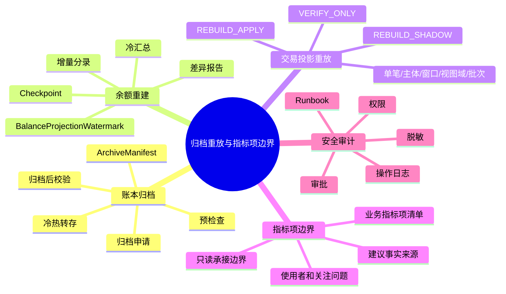
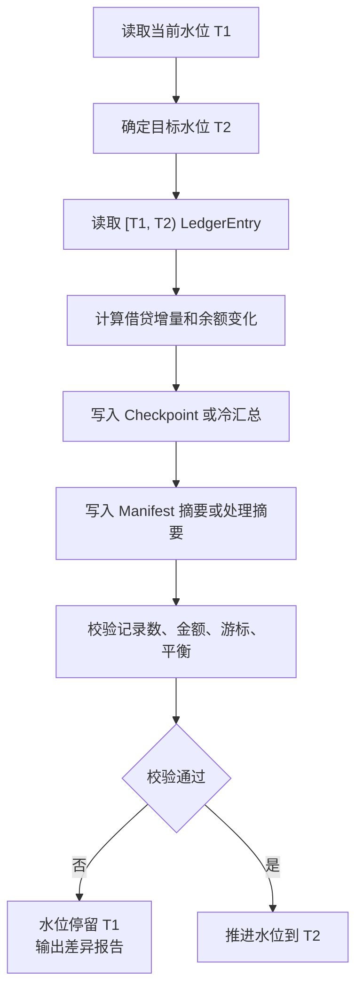
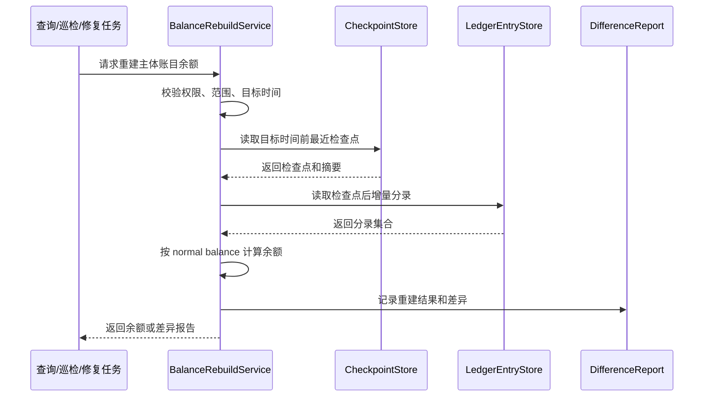
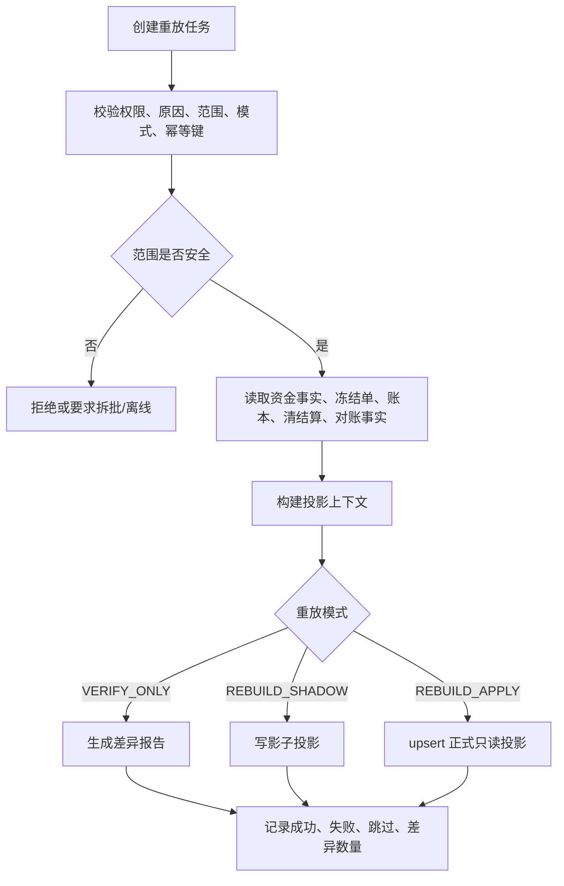

# 归档、重放与资金交易指标项系统分析设计

## 文档定位

本文是归档、余额重建、交易投影重放和资金交易指标项的系统分析设计分册，负责说明大数据量下事实归档、投影重放、检查点、水位、Manifest、差异报告和指标边界如何落到系统对象、数据表、任务状态、可观测和准入门禁。

## 一、需求背景

账本交易、分录、交易明细、余额投影、交易投影、清结算批次和对账差错会持续增长。系统必须在大数据量下仍能证明三件事：

1. 历史事实归档后，余额仍能被重建。
2. 只读投影出错后，可以有边界地重放修复。
3. 资金交易指标只作为报表指标模块的业务输入，不反向污染资金事实。

本设计定义归档、余额重建、交易投影重放和指标项承接边界。

## 二、目标

### 2.1 业务目标

1. 让历史账本事实在归档后仍然可查、可核对、可重建。
2. 让余额投影和交易投影出现差异时，可以有范围、有审批、有差异报告地修复。
3. 让资金交易指标作为报表指标模块输入，不进入交易、账本、余额、清结算和对账主链路。

### 2.2 技术目标

| 目标 | 系统设计要求 |
| --- | --- |
| 归档可审计 | 每次归档必须有范围、检查点、Manifest、摘要、审批和归档后校验。 |
| 余额可重建 | 余额从检查点或冷汇总加增量分录重建，不读取交易投影或报表。 |
| 重放有边界 | 交易投影重放必须指定单笔、主体、时间窗口、视图域或批次范围。 |
| 水位不混用 | 余额水位、归档 Manifest 和交易投影重放范围独立管理。 |
| 指标只读 | 指标项只作为报表指标模块输入，不修改交易、账本、余额或清结算状态。 |
| 生产可控 | 归档、重建、重放必须有权限、原因、审批、差异报告和 Runbook。 |

### 2.3 非目标

1. 不通过交易投影、用户账单、商户账单或报表反推余额。
2. 不把归档 Manifest、余额水位和重放 checkpoint 复用为同一个对象。
3. 不在本分册设计报表指标模块内部实现。
4. 不允许生产环境无范围、无审批、无差异报告的全量在线重放。

## 三、概要设计

### 3.1 能力地图



### 3.2 分层边界

| 能力 | 事实来源 | 写入对象 | 禁止 |
| --- | --- | --- | --- |
| 账本归档 | `LedgerTransaction`、`LedgerPostingPlan`、`LedgerEntry` | 归档清单、冷区数据、归档索引、Manifest | 改变事实身份或删除审计链路。 |
| 余额重建 | `LedgerEntry`、Checkpoint、Watermark、ArchiveManifest | 差异报告、修复任务、重建后的余额投影 | 从交易投影、用户账单、商户账单或报表反推余额。 |
| 交易投影重放 | 交易事实、冻结单、账本、清结算、对账差错 | 影子投影、正式只读投影、差异报告 | 重新入账、补写交易明细、修改分录。 |
| 指标项边界 | 交易、账本、投影、清结算、对账、外部文件 | 指标项清单、使用者、关注问题、建议事实来源 | 在本分册设计报表指标模块内部实现或反写资金事实。 |

## 四、详细设计

### 4.1 账本归档设计

#### 4.1.1 归档前置条件

| 条件 | 系统校验 |
| --- | --- |
| 范围明确 | 租户、主体、账本、账目、币种、时间范围、原因、发起人。 |
| 水位覆盖 | 归档截止小于等于已校验余额水位或检查点覆盖边界。 |
| 检查点存在 | 范围末端有已校验 Checkpoint 或冷汇总。 |
| 事实摘要一致 | 账本交易、posting plan、ledger entry 数量和金额摘要一致。 |
| 差错已处理 | 范围内不存在未关闭的高风险账务差异。 |
| Manifest 草稿 | 归档对象、范围、数量、金额、游标、冷热位置、摘要已生成。 |
| 审批通过 | 财务、研发或安全按风险等级审批。 |

#### 4.1.2 归档流程


#### 4.1.3 ArchiveManifest

| 字段 | 说明 |
| --- | --- |
| `manifestSn` | 归档清单号。 |
| `tenantId` | 租户。 |
| `scope` | 主体、账本、账目、币种、时间范围。 |
| `objectTypes` | 账本交易、posting plan、分录、相关投影索引。 |
| `recordCount` | 记录数。 |
| `debitAmount/creditAmount` | 借贷金额摘要。 |
| `lastCursor` | 最后游标。 |
| `checkpointRef` | 检查点或冷汇总引用。 |
| `watermarkRef` | 余额水位引用。 |
| `hotLocation/coldLocation` | 热区和冷区位置。 |
| `digest` | 防篡改摘要。 |
| `status` | `DRAFT`、`APPROVED`、`RUNNING`、`COMPLETED`、`FAILED`。 |
| `audit` | 发起人、审批人、执行人、原因、traceId。 |

Manifest 红线：

1. 缺 Manifest 不得标记归档成功。
2. Manifest 与冷区记录、热区索引或金额摘要不一致时不得推进状态。
3. Manifest 只能证明归档范围，不能作为余额水位、报表统计窗口或其他处理边界复用。

### 4.2 余额重建设计

#### 4.2.1 水位模型

```text
cold balance = watermark 之前的已校验检查点或冷汇总
hot delta    = [watermark, targetTime) 的增量 LedgerEntry
balance      = cold balance + hot delta
```

`BalanceProjectionWatermark` 表示余额冷热拼接和检查点覆盖边界，不是自然日、归档日期、清算账期、报表周期或热数据保留天数。

#### 4.2.2 水位推进



水位推进约束：

1. 必须先计算、写入、校验，再推进水位。
2. 失败时水位停留在旧值。
3. 不能用当前时间、自然日或 180 天热保留期替代水位。
4. 水位推进必须有批次号、操作者、处理范围和摘要。

#### 4.2.3 余额重建流程



余额重建红线：

1. 不从用户账单、商户账单、交易投影或指标报表反推余额。
2. 缺检查点、缺水位、缺 Manifest 或摘要不一致时，不得返回成功。
3. 重建发现差异时输出差异报告，不直接修改历史分录。
4. 生产重建必须限制范围并保留审批和审计。

### 4.3 交易投影重放设计

#### 4.3.1 重放范围

| 范围 | 必填参数 |
| --- | --- |
| 单笔 | 来源对象类型、来源流水号。 |
| 主体 | 主体类型、主体 ID、币种、时间范围。 |
| 时间窗口 | 开始时间、结束时间、最大窗口限制。 |
| 视图域 | 用户账单、商户账单、运营时间线、财务报表投影。 |
| 批次 | 清算批次、结算单、出款单、对账批次或差错单引用。 |

#### 4.3.2 重放模式

| 模式 | 行为 | 写入 |
| --- | --- | --- |
| `VERIFY_ONLY` | 只比对事实源和当前投影。 | 写差异报告，不写投影。 |
| `REBUILD_SHADOW` | 重建影子投影。 | 写影子表或影子索引。 |
| `REBUILD_APPLY` | 重建并 upsert 正式只读投影。 | 写正式只读投影，不写事实。 |

#### 4.3.3 重放流程



重放任务字段：

| 字段 | 说明 |
| --- | --- |
| `taskSn` | 任务号。 |
| `tenantId` | 租户。 |
| `scopeType/scopeValue` | 重放范围。 |
| `viewDomain` | 用户、商户、运营、财务。 |
| `mode` | `VERIFY_ONLY`、`REBUILD_SHADOW`、`REBUILD_APPLY`。 |
| `idempotencyKey` | 幂等键。 |
| `status` | `CREATED`、`RUNNING`、`PAUSED`、`COMPLETED`、`FAILED`。 |
| `checkpoint` | 断点续跑位置。 |
| `resultSummary` | 成功数、失败数、跳过数、差异数。 |
| `audit` | 发起人、审批、原因、traceId。 |

重放红线：

1. 重放不得重新入账。
2. 重放不得补写资金交易或交易明细。
3. 重放不得修改账本交易、分录或余额投影。
4. 无范围全量在线重放必须失败。
5. 超过最大窗口或记录数必须拆批、离线或先跑影子重放。

### 4.4 资金交易指标项承接边界

资金交易指标是报表指标模块承接的只读能力，不是交易、路由、钱包、账本、清结算或对账主链路的一部分。本分册只提供报表指标模块需要理解的业务输入：指标域、可能关心的指标项、使用者、关注问题和建议事实来源。

本分册不设计报表指标模块内部实现。指标采集、计算、存储、调度、展示、导出和质量校验由报表指标模块在独立系分中完成。

#### 4.4.1 承接输入

| 输入 | 说明 | 承接边界 |
| --- | --- | --- |
| 指标项 | 产品和业务可能关心的观察项。 | 报表指标模块定义正式编码、名称和状态。 |
| 业务问题 | 指标用于回答增长、风险、资金安全、运营效率或异常定位问题。 | 报表指标模块定义使用场景、看板和报表。 |
| 使用者 | 产品、运营、财务、风控、客服、审计或管理层。 | 报表指标模块定义权限、脱敏和导出审计。 |
| 理解口径 | 用自然语言解释纳入范围、排除范围和常见误用。 | 报表指标模块定义正式口径版本和数据质量规则。 |
| 建议事实来源 | 交易、账本、余额投影、清结算、对账、归档和重放任务。 | 报表指标模块选择具体数据链路和存储方案。 |

#### 4.4.2 产品和业务关注指标项

| 指标域 | 可能关心的指标项 | 主要使用者 | 建议事实来源 |
| --- | --- | --- | --- |
| 交易规模 | 交易笔数、交易金额、成功交易、失败交易、授权批准、授权拒绝、退款、手续费。 | 产品、运营、财务 | 资金交易、交易明细、账本交易、费用分录。 |
| 余额账户 | 用户可用余额、冻结余额、授权占用、商户待清算、可结算、出款中、负余额主体数和金额。 | 产品、运营、风控、财务 | 余额投影、账本分录、冻结单、授权交易。 |
| 清结算 | 清算候选、清算确认、结算净额、出款提交、出款成功、出款失败、准备金。 | 财务、运营 | 清算批次、结算单、出款单、账本分录。 |
| 对账差错 | 对账批次、对平笔数、差错金额、挂账金额、核销金额、平均处理时长、超 SLA 差错数。 | 财务、运营、审计 | 对账批次、匹配结果、差错单、核销记录。 |
| 风控运营 | 冻结金额、解冻金额、风控阻断、审批通过率、争议案件、追偿金额。 | 风控、运营、客服 | 冻结单、审批单、争议记录、追偿单。 |
| 归档重放 | 归档批次、归档记录、余额重建差异、重放任务、重放成功率、重放差异数。 | 研发、运营、审计 | 归档申请、Manifest、重放任务、差异报告。 |

#### 4.4.3 系分边界

1. 指标项只读消费事实或读模型，不反写交易、账本、余额、清结算或对账状态。
2. 指标结果不能作为余额修复、账务调整、清算确认或差错核销依据。
3. 报表指标模块可独立设计指标编码、口径版本、数据质量、权限导出和报表展示，本分册不提前约束其实现形态。
4. 涉及监管、合规、外汇、备付金或持牌报送的指标，需要在报表指标模块系分和上线前补规则来源、版本、生效日期、确认方和确认结论。

### 4.5 数据表设计

本节只定义归档、余额重建和交易投影重放的最终设计表。归档和重放均属于生产高危能力，所有任务表必须记录租户、范围、发起人、原因、审批、状态、checkpoint、摘要、差异报告和 traceId。

#### 4.5.1 归档申请表

物理表名：`t_archive_request`

业务用途：承载一次归档操作的申请、范围、审批、执行策略和结果。申请通过后才允许生成 Manifest 和执行归档。

| 字段名称 | 字段类型 | 是否必填 | 字段说明 | 值示例 |
| --- | --- | --- | --- | --- |
| `id` | BIGINT(20) | 是 | 主键 | `10001` |
| `gmt_create` / `gmt_modified` | DATETIME | 是 | 创建和更新时间 | - |
| `request_sn` | VARCHAR(64) | 是 | 归档申请号 | `AR202605180001` |
| `tenant_id` | BIGINT(20) | 是 | 租户 ID | `1` |
| `scope_type` | VARCHAR(50) | 是 | 归档范围类型 | `LEDGER_ENTRY` |
| `scope_value` | TEXT | 是 | 范围 JSON，包含主体、账目、币种、时间窗口 | `{}` |
| `archive_reason` | VARCHAR(512) | 是 | 归档原因 | `hot table retention` |
| `expected_cutoff_time` | DATETIME | 是 | 归档截止时间 | `2026-01-01 00:00:00` |
| `precheck_status` | VARCHAR(30) | 是 | 预检查状态 | `PASSED` |
| `approval_sn` | VARCHAR(64) | 否 | 审批引用 | `AP202605180001` |
| `manifest_sn` | VARCHAR(64) | 否 | 关联 Manifest | `AM202605180001` |
| `status` | VARCHAR(30) | 是 | 申请状态 | `APPROVED` |
| `operator_id` / `trace_id` | VARCHAR | 否 | 操作人和链路追踪 | - |

状态说明：`CREATED` 已创建，`PRECHECKING` 预检查中，`PRECHECK_FAILED` 预检查失败，`APPROVING` 审批中，`APPROVED` 已批准，`RUNNING` 执行中，`COMPLETED` 完成，`FAILED` 失败，`CANCELLED` 取消。

唯一索引：`uk_archive_request_sn(request_sn)`。

普通索引：`idx_archive_request_tenant_status(tenant_id, status)`；`idx_archive_request_cutoff(expected_cutoff_time)`。

#### 4.5.2 归档 Manifest 表

物理表名：`t_archive_manifest`

业务用途：承载归档对象、范围、冷热位置、记录数量、金额摘要、游标、检查点、水位和防篡改摘要。缺 Manifest 不得标记归档成功。

| 字段名称 | 字段类型 | 是否必填 | 字段说明 | 值示例 |
| --- | --- | --- | --- | --- |
| `id` / `gmt_create` / `gmt_modified` | 通用字段 | 是 | 主键和时间字段 | - |
| `manifest_sn` | VARCHAR(64) | 是 | Manifest 号 | `AM202605180001` |
| `tenant_id` | BIGINT(20) | 是 | 租户 ID | `1` |
| `request_sn` | VARCHAR(64) | 是 | 归档申请号 | `AR202605180001` |
| `object_types` | VARCHAR(256) | 是 | 归档对象类型集合 | `LEDGER_TRANSACTION,LEDGER_ENTRY` |
| `scope_value` | TEXT | 是 | 归档范围 JSON | `{}` |
| `record_count` | BIGINT(20) | 是 | 记录数量 | `1000000` |
| `debit_amount` / `credit_amount` | BIGINT(20) | 是 | 借贷金额摘要 | `1000000` |
| `last_cursor` | VARCHAR(128) | 否 | 最后处理游标 | `LE1000000` |
| `checkpoint_sn` / `watermark_sn` | VARCHAR(64) | 是 | 检查点和水位引用 | `CP...` / `BW...` |
| `hot_location` / `cold_location` | VARCHAR(512) | 是 | 热区和冷区位置 | `table:t_ledger_entry` |
| `digest` | VARCHAR(128) | 是 | 防篡改摘要 | `sha256...` |
| `status` | VARCHAR(30) | 是 | Manifest 状态 | `COMPLETED` |
| `operator_id` / `trace_id` | VARCHAR | 否 | 操作人和链路追踪 | - |

状态说明：`DRAFT` 草稿，`APPROVED` 已批准，`RUNNING` 执行中，`COMPLETED` 完成，`FAILED` 失败。

唯一索引：`uk_archive_manifest_sn(manifest_sn)`。

普通索引：`idx_archive_manifest_request(request_sn)`；`idx_archive_manifest_status(tenant_id, status)`；`idx_archive_manifest_checkpoint(checkpoint_sn)`。

#### 4.5.3 余额检查点表

物理表名：`t_balance_checkpoint`

业务用途：保存某主体、账目、币种、账本周期在某时间点的已校验余额、借贷摘要和分录游标，用于冷热拼接、余额重建和归档门禁。

| 字段名称 | 字段类型 | 是否必填 | 字段说明 | 值示例 |
| --- | --- | --- | --- | --- |
| `id` / `gmt_create` / `gmt_modified` | 通用字段 | 是 | 主键和时间字段 | - |
| `checkpoint_sn` | VARCHAR(64) | 是 | 检查点号 | `CP202605180001` |
| `tenant_id` | BIGINT(20) | 是 | 租户 ID | `1` |
| `subject_id` / `subject_type` | VARCHAR | 是 | 主体 | `M1001` / `MERCHANT` |
| `ledger_subject_code` | VARCHAR(50) | 是 | 账目编码 | `CLEARING` |
| `currency` | VARCHAR(10) | 是 | 币种 | `USD` |
| `period_type` / `period_id` | VARCHAR | 是 | 账本周期 | `LIFETIME` / `LIFETIME` |
| `checkpoint_time` | DATETIME | 是 | 检查点时间 | `2026-05-18 00:00:00` |
| `last_entry_sn` | VARCHAR(64) | 是 | 覆盖到的最后分录 | `LE202605180001` |
| `balance_amount` | BIGINT(20) | 是 | 检查点余额 | `1000000` |
| `debit_amount` / `credit_amount` | BIGINT(20) | 是 | 借贷累计摘要 | `1000000` |
| `entry_count` | BIGINT(20) | 是 | 覆盖分录数量 | `100000` |
| `digest` | VARCHAR(128) | 是 | 摘要 | `sha256...` |
| `status` | VARCHAR(30) | 是 | 状态 | `VERIFIED` |

状态说明：`CREATED` 已创建，`VERIFYING` 校验中，`VERIFIED` 已校验，`FAILED` 失败。

唯一索引：`uk_balance_checkpoint_bucket_time(tenant_id, subject_type, subject_id, ledger_subject_code, currency, period_type, period_id, checkpoint_time)`。

普通索引：`idx_balance_checkpoint_sn(checkpoint_sn)`；`idx_balance_checkpoint_status(status)`。

#### 4.5.4 余额投影水位表

物理表名：`t_balance_projection_watermark`

业务用途：记录余额投影和冷热拼接的已处理边界。水位必须先计算、写检查点和校验通过后推进。

| 字段名称 | 字段类型 | 是否必填 | 字段说明 | 值示例 |
| --- | --- | --- | --- | --- |
| `id` / `gmt_create` / `gmt_modified` | 通用字段 | 是 | 主键和时间字段 | - |
| `watermark_sn` | VARCHAR(64) | 是 | 水位号 | `BW202605180001` |
| `tenant_id` | BIGINT(20) | 是 | 租户 ID | `1` |
| `subject_id` / `subject_type` | VARCHAR | 是 | 主体 | `M1001` / `MERCHANT` |
| `ledger_subject_code` | VARCHAR(50) | 是 | 账目编码 | `CLEARING` |
| `currency` | VARCHAR(10) | 是 | 币种 | `USD` |
| `period_type` / `period_id` | VARCHAR | 是 | 账本周期 | `LIFETIME` / `LIFETIME` |
| `watermark_time` | DATETIME | 是 | 水位时间 | `2026-05-18 00:00:00` |
| `last_entry_sn` | VARCHAR(64) | 是 | 最后处理分录 | `LE202605180001` |
| `checkpoint_sn` | VARCHAR(64) | 是 | 最近检查点 | `CP202605180001` |
| `status` | VARCHAR(30) | 是 | 水位状态 | `ACTIVE` |
| `version` | INT(11) | 是 | 乐观锁版本 | `0` |

唯一索引：`uk_balance_watermark_bucket(tenant_id, subject_type, subject_id, ledger_subject_code, currency, period_type, period_id)`。

普通索引：`idx_balance_watermark_time(watermark_time)`；`idx_balance_watermark_checkpoint(checkpoint_sn)`。

#### 4.5.5 交易投影重放任务表

物理表名：`t_projection_replay_task`

业务用途：承载交易投影重放的范围、模式、状态、checkpoint、差异摘要和审批信息。

| 字段名称 | 字段类型 | 是否必填 | 字段说明 | 值示例 |
| --- | --- | --- | --- | --- |
| `id` / `gmt_create` / `gmt_modified` | 通用字段 | 是 | 主键和时间字段 | - |
| `task_sn` | VARCHAR(64) | 是 | 重放任务号 | `PRT202605180001` |
| `tenant_id` | BIGINT(20) | 是 | 租户 ID | `1` |
| `scope_type` / `scope_value` | VARCHAR / TEXT | 是 | 重放范围类型和值 | `SINGLE_TRANSACTION` / `{}` |
| `view_domain` | VARCHAR(50) | 是 | 视图域 | `MERCHANT_BILL` |
| `mode` | VARCHAR(30) | 是 | 重放模式 | `VERIFY_ONLY` |
| `idempotency_key` | VARCHAR(128) | 是 | 幂等键 | `sha256...` |
| `status` | VARCHAR(30) | 是 | 任务状态 | `RUNNING` |
| `checkpoint` | VARCHAR(512) | 否 | 断点续跑位置 | `cursor-001` |
| `success_count` / `failed_count` / `skipped_count` / `difference_count` | BIGINT | 是 | 结果摘要 | `100` / `0` / `0` / `2` |
| `approval_sn` | VARCHAR(64) | 否 | 审批引用 | `AP...` |
| `reason` | VARCHAR(512) | 是 | 重放原因 | `projection repair` |
| `operator_id` / `trace_id` | VARCHAR | 否 | 操作人和链路追踪 | - |

状态说明：`CREATED` 已创建，`RUNNING` 运行中，`PAUSED` 暂停，`COMPLETED` 完成，`FAILED` 失败，`CANCELLED` 取消。

唯一索引：`uk_projection_replay_task_sn(task_sn)`；`uk_projection_replay_idempotency(tenant_id, idempotency_key)`。

普通索引：`idx_projection_replay_status(status, gmt_modified)`；`idx_projection_replay_scope(scope_type, view_domain)`。

#### 4.5.6 差异报告表

物理表名：`t_projection_difference_report`

业务用途：承载归档校验、余额重建和交易投影重放产生的差异样本和复核状态。

| 字段名称 | 字段类型 | 是否必填 | 字段说明 | 值示例 |
| --- | --- | --- | --- | --- |
| `id` / `gmt_create` / `gmt_modified` | 通用字段 | 是 | 主键和时间字段 | - |
| `report_sn` | VARCHAR(64) | 是 | 差异报告号 | `DR202605180001` |
| `tenant_id` | BIGINT(20) | 是 | 租户 ID | `1` |
| `task_type` / `task_sn` | VARCHAR | 是 | 来源任务类型和任务号 | `PROJECTION_REPLAY` / `PRT...` |
| `difference_type` | VARCHAR(50) | 是 | 差异类型 | `AMOUNT_MISMATCH` |
| `source_type` / `source_sn` | VARCHAR | 是 | 来源对象 | `FUNDS_TRANSACTION` / `FT...` |
| `expected_value` / `actual_value` | TEXT | 否 | 期望值和实际值摘要 | `{}` |
| `severity` | VARCHAR(20) | 是 | 严重等级 | `HIGH` |
| `status` | VARCHAR(30) | 是 | 处理状态 | `OPEN` |
| `exception_sn` | VARCHAR(64) | 否 | 关联差错单 | `EC...` |
| `operator_id` / `trace_id` | VARCHAR | 否 | 操作人和链路追踪 | - |

唯一索引：`uk_difference_report_sn(report_sn)`；`uk_difference_report_source(task_sn, source_type, source_sn, difference_type)`。

普通索引：`idx_difference_report_task(task_type, task_sn)`；`idx_difference_report_status(status, severity)`。

### 4.6 一致性与补偿设计

| 场景 | 一致性策略 |
| --- | --- |
| 归档转存中断 | Manifest 标记失败，保留已处理范围和修复入口，不删除热区索引。 |
| 冷区校验失败 | 阻断归档完成，输出差异报告。 |
| 水位计算失败 | 水位不推进，保留失败样本。 |
| 余额重建差异 | 不自动改分录，生成差异报告或修复任务。 |
| 投影重放失败 | 任务可暂停、续跑、跳过坏样本并输出差异。 |
| 指标项误用 | 如果指标结果被用于修复余额、调账或改变清结算状态，必须在设计和测试中阻断。 |

### 4.7 测试设计

| 测试对象 | 必测场景 |
| --- | --- |
| 归档前置 | 缺范围、缺水位、缺检查点、巡检失败、未审批必须失败。 |
| Manifest | 缺 Manifest 不得完成；摘要不一致不得完成；归档后查询可定位。 |
| 水位推进 | 先计算再推进；失败时停留旧水位；不得用自然日替代。 |
| 余额重建 | 检查点 + 增量分录重建；缺检查点失败；不读交易投影。 |
| 投影重放 | 三种模式；无范围全量失败；重放不生成 route 或 entry。 |
| 指标项边界 | 指标项只作为报表指标模块输入；指标结果不得反写资金事实或驱动余额修复。 |
| 权限审计 | 未授权归档、无审批重放必须失败；指标查询和导出权限由报表指标模块承接。 |

## 五、非功能设计

### 5.1 性能与容量

| 链路 | 设计要求 |
| --- | --- |
| 归档 | 按租户、主体、账目、币种、周期、时间窗口和游标分批处理，不允许在线无界扫描。 |
| 余额重建 | 优先使用最近检查点加增量分录；缺检查点不得降级为全量在线扫描。 |
| 交易投影重放 | 按单笔、主体、窗口、视图域或批次拆分，超过最大窗口必须拆批或离线。 |
| 指标项承接 | 本分册只输出指标项、业务问题、使用者和建议事实来源；计算、存储和展示性能由报表指标模块设计。 |

### 5.2 可用性与生产就绪

1. 归档、重建和重放任务必须支持暂停、续跑、失败样本、差异报告和人工兜底。
2. Manifest、Checkpoint、Watermark、DifferenceReport 是上线门禁，缺一不得标记成功。
3. 生产 `REBUILD_APPLY` 必须有审批、范围、影子校验或差异报告。
4. 指标项承接不得影响归档、重建和重放的上线门禁。

### 5.3 可观测性

| 链路 | 指标 |
| --- | --- |
| 归档 | 申请数、成功率、失败数、记录数、金额摘要、耗时、冷区校验失败。 |
| 水位 | 水位延迟、推进次数、失败次数、差异数。 |
| 余额重建 | 任务数、差异数、失败样本、平均耗时。 |
| 交易投影重放 | 任务数、成功率、失败率、差异数、影子对比结果。 |
| 指标项承接 | 指标项覆盖域、待确认口径数、报表指标模块承接状态。 |
| 安全审计 | 高危任务发起数、审批拒绝数、越权拦截数。 |

### 5.4 安全与生产红线

1. 归档不改变事实身份、审计链路和查询能力。
2. 缺检查点、缺水位、缺 Manifest 或摘要不一致时不得归档成功。
3. 水位必须先算后推，失败不得推进。
4. 余额重建不得依赖交易投影、用户账单、商户账单或报表。
5. 交易投影重放不得重新入账、补写交易或修改分录。
6. 生产重放必须有范围、权限、原因、审批、差异报告和断点续跑。
7. 指标结果不得反写交易、账本、余额、清结算和对账状态。

## 六、实施切片与准入门禁

本章只定义编码落地顺序和验收门禁。

| 切片 | 交付内容 | 准入门禁 |
| --- | --- | --- |
| 归档门禁 | 归档申请、预检查、Manifest、审批、归档后校验。 | 缺范围、缺检查点、缺水位、缺 Manifest、摘要不一致必须失败。 |
| 余额重建 | Checkpoint、BalanceWatermark、增量分录重建、差异报告。 | 先算后推；失败水位不推进；不读交易投影。 |
| 交易投影重放 | ReplayTask、三种模式、checkpoint、DifferenceReport。 | 有范围、有模式、有审批；不重新入账，不改分录。 |
| 指标项承接 | 指标域、指标项、使用者、业务问题、建议事实来源和只读边界。 | 不设计报表指标模块内部实现；不进入资金主链路；不反写事实。 |

进入编码前检查：

1. 归档、余额重建和交易投影重放使用独立表和独立状态机。
2. 所有生产任务都有范围、原因、审批、checkpoint、差异报告和 traceId。
3. 所有重建和重放测试都证明不会写交易事实、账本事实和余额事实。
4. 指标项只在报表指标模块承接，不进入交易、路由、钱包、账本主链路。

## 七、参考资料

- [docs/产品设计/04-归档重放与指标治理.md](../产品设计/04-归档重放与指标治理.md)
- [docs/产品设计/05-产品验收与TDD用例矩阵.md](../产品设计/05-产品验收与TDD用例矩阵.md)
- [docs/DSL设计/支付资金底座DSL承载层设计.md](../DSL设计/支付资金底座DSL承载层设计.md)
- [docs/系分设计/02-交易路由钱包账目与投影系分设计.md](02-交易路由钱包账目与投影系分设计.md)
- [docs/系分设计/03-清结算与对账系分设计.md](03-清结算与对账系分设计.md)
