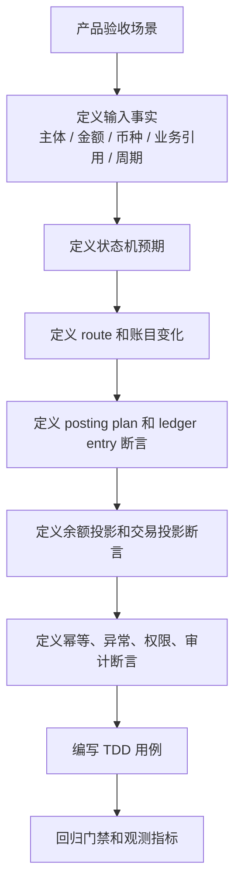

# 测试、观测、安全与金融红线专项设计

## 一、文档定位

本文是支付资金底座系分设计的横切专项，不是独立业务模块系分，也不承载业务表设计。业务模块的数据表、接口、状态机和流程设计分别见 02、03、04；本文把产品验收矩阵、DSL 契约和模块系分设计转成测试设计、可观测设计、安全审计和金融红线，作为开发、测试、评审和上线前检查的统一入口。

## 二、测试驱动设计总则

资金系统测试不是覆盖代码分支，而是证明资金事实可信。每个有资金影响的场景，都必须同时回答：

1. 输入事实是什么。
2. 状态如何变化。
3. 哪些主体、账目、账本周期发生余额变化。
4. route snapshot 和 posting plan 是否可追溯、可平衡。
5. ledger entry 和余额投影是否一致。
6. 幂等、异常、权限和审计是否成立。
7. 必须失败的红线是否真的失败。



## 三、测试分层

| 测试类型 | 保护对象 | 真实链路要求 |
| --- | --- | --- |
| 领域单元测试 | 金额、币种、周期、状态、规则、值对象。 | 直接测试真实逻辑，替换时间和 ID。 |
| 指令转换测试 | Request 到 `FundsInstructionSpec`、金额快照、上下文。 | 真实转换器，不访问数据库。 |
| 路由契约测试 | `RouteResolver`、`ResolvedRouteSpec`、route snapshot。 | 真实路由逻辑，替换账户查询或使用测试 fixture。 |
| 账务组装测试 | `LedgerPostingAssembler`、posting plan、ledger entry spec。 | 真实 assembler，断言独立平衡。 |
| 应用流程测试 | 直接交易、授权交易、余额控制、清结算、对账差错。 | 真实内部编排，替换外部通道和不可控依赖。 |
| 数据库测试 | 唯一约束、事务、幂等、查询条件、周期 bucket。 | 使用测试库或 H2 MySQL Mode，不 mock Mapper。 |
| 契约测试 | `*-face`、DTO、Query、Spec、DSL JSON 样例。 | 不依赖私有实现。 |
| 架构边界测试 | 模块依赖、包依赖、Entity 外露、tests 依赖。 | 静态扫描或 ArchUnit。 |
| 红线失败测试 | 外部账户入账、直接改余额、缺快照逆向等。 | 必须证明失败且无副作用。 |

## 四、场景到测试矩阵

### 4.1 交易、路由、钱包、账目与投影

| 场景 | 最低测试组合 | 核心断言 |
| --- | --- | --- |
| 充值成功 | 指令转换、路由、账务、流程、数据库 | 外部账户只做引用；用户 `AVAILABLE` 增加；分录平衡。 |
| 商户订单收款 | 路由、账务、流程、余额断言 | 用户 `AVAILABLE` 减少；商户 `CLEARING` 增加；费用拆分。 |
| 普通转账 | 路由、账务、流程、幂等 | 付款方减少、收款方增加；币种一致；同主体失败。 |
| 授权批准 | 授权流程、账务、余额断言 | `AVAILABLE -> AUTHORIZATION`；保存授权快照。 |
| 授权拒绝 | 授权流程、红线 | 不生成 route、posting plan、ledger entry、chargeback。 |
| 授权撤销/结算/退款 | 原路径回放、状态机、余额断言 | 不超过剩余额度或已结算金额；缺快照失败。 |
| 冻结/解冻 | 余额控制流程、冻结单状态、账务 | 只做同主体 `AVAILABLE <-> FROZEN`。 |
| 调账 | 审批、差错引用、账务、审计 | 无审批失败；历史分录不变；追加新事实。 |
| 账本周期 | 路由、账本、余额查询 | 非 `LIFETIME` 缺 `periodId` 失败；不同周期不串账。 |
| 余额日志 | 余额投影、事件补偿 | 日志失败不回滚投影；日志不反写余额。 |
| 交易投影 | 只读投影、重放 | 投影不写事实；无范围重放失败。 |

### 4.2 清结算与对账

| 场景 | 最低测试组合 | 核心断言 |
| --- | --- | --- |
| 清算候选生成 | 候选规则、数据库、幂等 | 只来自成功交易和商户 `CLEARING` 明细。 |
| 候选排除 | 规则、状态、审计 | 退款、争议、冻结、差错、风控阻断可见。 |
| 清算批次确认 | 批次状态、交易事实、账务 | 只确认一次；触发 `CLEARING -> AVAILABLE`。 |
| 结算单生成 | 净额计算、规则版本、审批 | 每个金额项可追溯；策略解析失败不静默实时。 |
| 结算锁定 | 交易事实、账务、幂等 | `AVAILABLE -> SETTLEMENT`；出款中不可再次结算。 |
| 出款成功/失败 | 出款状态、外部回单、账务 | 受理不等于成功；失败回退只一次。 |
| 对账差错 | 对账批次、差错单、调账 | 差错不直接改账；核销前必须重新对账。 |
| 追偿 | 追偿状态、负余额、抵扣 | 已出款后逆向不回滚历史出款。 |

### 4.3 归档、重放与指标

| 场景 | 最低测试组合 | 核心断言 |
| --- | --- | --- |
| 归档前置 | 规则、数据、权限 | 缺范围、检查点、水位、Manifest、审批必须失败。 |
| 归档后查询 | 冷热查询、审计 | 历史明细、余额和对账追溯可定位。 |
| 水位推进 | 批处理、差异报告 | 先计算、写摘要、校验，再推进。 |
| 余额重建 | 检查点、增量分录、差异报告 | 不从交易投影或报表反推余额。 |
| 交易投影重放 | 三种模式、范围、幂等 | 不重新入账，不改分录，不改余额事实。 |
| 指标项承接 | 指标项、业务问题、建议事实来源 | 指标只读；异常不反写资金事实。 |
| 敏感导出 | 权限、安全、审计 | 无审批、无脱敏、超范围必须失败。 |

## 五、测试用例模板

```text
场景：
角色：
前置条件：
输入：
动作：
期望状态：
期望账目变化：
期望账本事实：
期望投影：
幂等断言：
异常断言：
权限和审计断言：
红线：
```

示例：

```text
场景：用户向商户付款，商户订单款进入待清算。
角色：用户、商户、平台。
前置条件：用户资金账户已建账且 AVAILABLE 充足；商户资金账户已建账；平台费用账户已配置。
输入：订单金额 100.00，手续费 2.00，币种 USD，业务流水固定。
动作：调用付款交易。
期望状态：资金交易完成，交易明细完成。
期望账目变化：用户 AVAILABLE -100.00；商户 CLEARING +98.00；平台 FEE +2.00。
期望账本事实：保存 route snapshot；posting plan 同币种借贷平衡；ledger entry 可追溯。
期望投影：用户账单显示付款成功，商户账单显示待清算。
幂等断言：同业务键同摘要重复调用不重复入账。
异常断言：同业务键不同摘要拒绝。
权限和审计断言：记录操作者、业务引用和 traceId。
红线：商户订单款不得直入 AVAILABLE 或 SETTLEMENT。
```

## 六、可观测设计

### 6.1 Trace 维度

所有写入链路和高危任务必须贯穿：

| 字段 | 说明 |
| --- | --- |
| `traceId` | 单次调用链路追踪。 |
| `tenantId` | 租户。 |
| `businessScene/businessSn` | 业务场景和业务流水。 |
| `fundsTransactionSn` | 资金交易流水。 |
| `ledgerTransactionSn` | 账本交易流水。 |
| `routeSnapshotId` | 路由快照引用或摘要。 |
| `batchSn/taskSn` | 清结算、对账、归档、重放和指标任务号。 |
| `operator` | 操作者和系统身份。 |

### 6.2 日志规范

| 日志类型 | 必须包含 | 禁止 |
| --- | --- | --- |
| 交易日志 | 阶段、业务流水、交易流水、状态、失败原因。 | 敏感账户、卡号、密钥、完整外部凭证。 |
| 路由日志 | 解析器、参与方摘要、账目、周期、失败原因。 | 支付工具完整号、外部账户原文。 |
| 账本日志 | 账本交易、posting 数、entry 数、平衡结果。 | 分录全量敏感上下文。 |
| 清结算日志 | 批次、金额摘要、状态、审批。 | 未脱敏导出路径。 |
| 重放日志 | 范围、模式、checkpoint、差异摘要。 | 无范围全量明细。 |
| 安全日志 | 操作者、权限、审批、资源、结果。 | 密钥、token、证件原文。 |

### 6.3 指标和告警

| 域 | 告警条件 |
| --- | --- |
| 交易 | 成功率下降、账本失败、摘要冲突突增、余额不足异常突增。 |
| 路由 | 缺平台账户、缺账本周期、缺快照回放、路由失败突增。 |
| 账本 | posting 不平衡、重复入账冲突、余额投影失败、分录摘要异常。 |
| 清结算 | 候选积压、批次失败、结算锁定失败、出款失败率升高。 |
| 对账 | 差错金额超阈值、超 SLA 差错、文件解析失败、重复流水异常。 |
| 归档 | 水位延迟、Manifest 差异、冷区校验失败、归档失败。 |
| 重放 | 无法续跑、差异数异常、影子对比不一致。 |
| 指标项承接 | 指标项缺口、来源口径待确认、异常反写风险。 |
| 安全 | 越权访问、无审批导出、高危操作失败、异常批量查询。 |

## 七、安全设计

### 7.1 权限模型

| 资源 | 动作 | 控制要求 |
| --- | --- | --- |
| 资金账户和余额 | 查询、导出 | 租户、主体、角色、数据范围校验。 |
| 资金交易 | 创建、查询、退款、调账 | 业务接入身份、幂等、操作权限和审计。 |
| 冻结单 | 冻结、解冻、查询 | 风控或运营权限，必要时审批。 |
| 清算批次 | 创建、复核、确认、撤回 | 运营和财务分权，确认动作审计。 |
| 结算单和出款单 | 锁定、触发出款、确认回单 | 财务、出纳、风控分权，高危动作审批。 |
| 对账差错 | 分派、调账、核销 | 财务和运营权限，调账必须审批。 |
| 归档重放 | 创建、执行、应用 | 研发、财务或数据权限，生产应用需审批。 |
| 指标和导出 | 查询、导出、发布 | 口径权限、敏感级别、审批、脱敏和水印。 |

### 7.2 审计字段

高危操作至少记录：

| 字段 | 说明 |
| --- | --- |
| `operatorId/operatorType` | 操作者。 |
| `operationType` | 操作类型。 |
| `resourceType/resourceSn` | 操作对象。 |
| `beforeValue/afterValue` | 前后值或摘要。 |
| `reason` | 操作原因。 |
| `approvalSn` | 审批引用。 |
| `evidenceRefs` | 凭证和外部证据。 |
| `traceId` | 链路追踪。 |
| `result` | 成功、失败、拒绝。 |
| `createdAt` | 操作时间。 |

### 7.3 敏感数据

1. 外部账户、支付工具、卡、VA、手机号、邮箱、证件、token、密钥、凭证必须脱敏或加密。
2. 日志、异常、指标、导出、告警不得输出敏感信息原文。
3. 敏感导出必须审批、脱敏、水印、下载审计和过期控制。
4. 测试数据不得使用真实客户、商户、账户、卡号、证件或生产流水。

## 八、金融系统红线

| 红线 | 系统控制 |
| --- | --- |
| 直接改余额 | 生产代码和后台禁止绕过交易、路由、账本修改余额投影。 |
| 外部账户入账 | Route 只允许内部可入账主体；外部账户和支付工具只能做引用。 |
| 分录不平衡 | `LedgerPostingAssembler` 和账本写入口必须双重校验。 |
| 历史分录可变 | DAL 和后台不提供修改或删除已过账分录入口。 |
| 缺快照逆向 | 退款、撤销、拒付、退费、解冻缺原快照必须失败或人工处理。 |
| 周期串账 | 查询和过账必须携带账本周期；非 `LIFETIME` 缺 `periodId` 失败。 |
| 授权拒绝入账 | 授权拒绝只记录拒绝事实，不生成账务路径。 |
| 冻结表达消费 | 冻结只做同主体可用性控制；扣划必须另建事实。 |
| 清结算对象混用 | 候选、批次、结算单、出款单、对账批次、差错单、追偿单分别建模。 |
| 对账差异直接改账 | 差异必须经过差错、审批、调账、重新对账和核销。 |
| 无范围重放 | 生产重放没有范围、原因、审批和差异报告必须失败。 |
| 指标反写事实 | 指标结果和报表处理不得修改资金事实。 |

## 九、进入编码前检查清单

| 检查项 | 通过标准 |
| --- | --- |
| 目标对齐 | 需求能映射到产品验收 ID、DSL 场景和系分模块。 |
| 模块边界 | 明确改动属于 `core`、`wallet`、`transaction`、`ledger`、清结算、对账、归档或指标。 |
| 契约完整 | Request、Query、DTO、Spec、错误码和幂等键已定义。 |
| 状态机完整 | 初态、处理中、成功、失败、人工处理、终态和非法流转清楚。 |
| 数据约束 | 唯一键、索引、金额精度、币种、周期、租户和审计字段清楚。 |
| 一致性 | 事务边界、幂等、重试、补偿、对账和人工兜底清楚。 |
| 测试设计 | 正常、异常、边界、权限、幂等、并发、红线测试清楚。 |
| 可观测 | 日志、指标、trace、告警和 Runbook 清楚。 |
| 安全审计 | 权限、审批、脱敏、导出和审计清楚。 |
| 金融红线 | 不存在直接改余额、直接改分录、无范围重放、周期混用等风险。 |

## 十、评审结论模板

```text
评审对象：
产品验收 ID：
涉及模块：
核心对象：
写入链路：
查询链路：
状态机：
数据约束：
一致性方案：
测试清单：
观测指标：
安全审计：
金融红线：
结论：通过 / 有条件通过 / 不通过
遗留风险：
```
