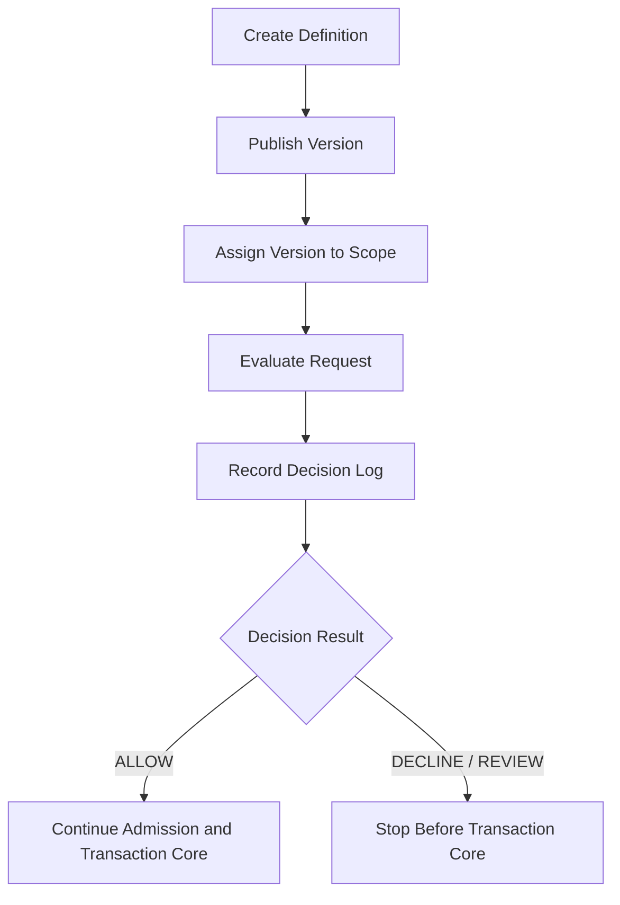

# Spend Rule 支出规则系分设计

## 1. 文档定位

本文是 Spend Rule 的独立系统分析设计分册，承接 [../产品设计/09-SpendRule支出规则产品设计.md](../产品设计/09-SpendRule支出规则产品设计.md) 的产品语义，并把规则定义、不可变版本、规则挂载、决策日志、控制活动、预算控制投影和交易投影解释拆成可编码、可测试、可审计的系统边界。

交易、路由、钱包、账目与投影主链路仍以 [02-交易路由钱包账目与投影系分设计.md](02-交易路由钱包账目与投影系分设计.md) 为准。本文不改变交易 canonical 入参，不新增账本主体，不授权 Controller、HTTP/RPC、事件消费、生产 DDL 或上线迁移。

## 2. 需求背景、目标与边界

需求背景：Spend Rule 已经从“支付工具授权控制扩展”演进为钱包、支付工具、预算控制和交易投影共同依赖的规则能力。如果继续把规则定义、控制活动、预算控制视图和交易投影解释散落在交易路由主线文档中，后续编码会难以区分规则事实、资金事实和账本事实。

背景问题：

1. Spend Rule 容易被误当成资金账户、预算账户、支付工具余额或 ledger subject。
2. 支出控制准入、控制活动和预算控制投影已有服务层证据，但缺少独立系统分册承接规则定义、版本、挂载和决策日志。
3. 不做独立分册的风险是后续规则引擎、事件消费、投影解释和 VCC facade 继续复用旧 Grant，扩大写入范围。

目标：

1. 将规则定义、不可变版本、规则挂载、决策日志、控制活动和预算控制投影拆成清晰系统边界。
2. 让 wallet application 在交易内核前消费 Spend Rule 证据，拒绝路径无资金事实副作用。
3. 让交易投影只读解释历史规则证据，不重算历史规则，不反写 route、posting、LedgerEntry 或余额投影。

非目标：

1. 不实现完整规则引擎、规则表达式执行器、运营后台、审批流、事件消费、outbox 或生产迁移。
2. 不改变直接交易、授权交易、余额控制的账户主体 canonical 入参。
3. 不让 Spend Rule、预算组、支付工具、卡号、外部账户或业务订单成为账本主体。

系统边界：Spend Rule 系统能力落在 wallet application 和 wallet impl 的规则事实、控制事实与只读查询边界；transaction 只消费已固化证据，ledger 只接受资金账户或信用账户等可入账主体。

数据边界：规则定义、版本、挂载、决策日志、控制活动和预算控制投影是规则与控制数据；资金交易、route、posting plan、LedgerEntry、ledger transaction 和账本余额投影仍属于交易与账本事实。

安全边界：规则条件、请求摘要、商户、卡、外部账户和风控证据必须脱敏、租户隔离、权限控制和审计追踪；真实资金、卡组织、银行、ACH、跨境、税务、会计或合规最终规则必须由专业角色确认。

## 3. 概要设计、核心方案和设计结论

概要设计：Spend Rule 按“规则事实 -> 准入决策 -> 控制活动 -> 只读投影解释”四层承接。同步链路用于授权前准入和规则拒绝，异步或后置链路用于交易结果消费、预算控制投影重建和运营解释。

核心方案：

1. 规则定义、版本、挂载和决策日志先以 `SpendRuleDefinitionApplicationService` 形成最小持久化边界。
2. 支出控制准入继续由 `SpendControlAdmissionApplicationService` 消费外部或上层决策证据。
3. 控制活动和预算控制投影继续作为控制事实和只读视图，不进入 ledger posting。
4. 交易投影解释只读取历史规则版本、挂载、决策流水和控制活动。

关键依赖：支付工具预交易快照、资金责任解析、账户能力来源、账户主体型交易内核、ledger posting 主体护栏、预算组非建账和交易投影解释。

| 主题 | 系统结论 | 禁止方向 |
| --- | --- | --- |
| 模块归属 | Spend Rule 属于 wallet application 支出控制能力，交易内核只消费已固化的规则证据和控制事实。 | 在 transaction 内新增支付工具或 Spend Rule 专用交易内核。 |
| 事实分层 | 规则定义、版本、挂载、决策日志是规则事实；控制活动是执行过程事实；预算控制投影是只读视图。 | 用 SpendControlActivity 反向替代规则定义，或用预算投影替代账本余额。 |
| 账务边界 | Spend Rule、预算组、支付工具、卡号、PAN、token 和外部账户都不能成为 route leg、posting 或 LedgerEntry 主体。 | ledger posting 接受 BUDGET_GROUP、SPEND_RULE、PAYMENT_INSTRUMENT 或 cardRef。 |
| 准入边界 | 规则拒绝必须停在交易内核前，最多写决策日志或控制证据。 | 拒绝后生成 route、posting、LedgerEntry、资金交易扣款、余额投影或 chargeback。 |
| 历史解释 | 交易投影只能读取历史规则版本、挂载、决策流水和控制活动。 | 按当前规则定义、当前挂载或当前工具绑定重算历史交易。 |

## 4. 详细设计：模块边界

| 模块 | 职责 | 不承担 |
| --- | --- | --- |
| core | 定义 Spend Rule 枚举、值对象或 DSL 承载类型，例如规则类型、规则域、scope 类型、状态枚举。 | 依赖 DAL、Mapper、Spring Bean、测试或具体规则实现。 |
| wallet-face | 暴露 Spend Rule application 契约、Request、Query、DTO。 | 暴露 Entity、Mapper、内部实现类或 HTTP/RPC 控制器。 |
| wallet-impl | 实现规则定义、版本发布、规则挂载、决策日志、控制活动和预算控制投影。 | 写资金交易事实、route、posting、LedgerEntry、ledger transaction 或账本余额投影。 |
| transaction-face / transaction-impl | 在授权、付款、退款和投影解释中读取已固化规则证据。 | 计算 Spend Rule、管理规则定义、更新规则挂载或把规则作为 canonical 入参主体。 |
| ledger-face / ledger-impl | 只接受资金账户、信用账户或平台角色解析后的资金账户作为账本主体。 | 为 Spend Rule 或预算组建账、过账或投影余额。 |
| reconciliation / governance | 校验规则证据、交易事实、控制活动和外部证据的引用一致性。 | 用对账或治理任务重算规则并反写交易或账本事实。 |
| tests | 承载服务层流程、H2 schema、边界测试、失败无副作用和只读投影断言。 | 用内存版业务实现冒充生产闭环。 |

### 4.1 模块归属强约束

Spend Rule 主能力归属于 `wallet` 支出控制域，`transaction` 只消费已固化证据。该约束不是目录偏好，而是资金事实边界：规则配置和控制活动可以决定是否继续进入交易，但不能成为交易内核的主体能力。

| 包或模块 | 允许 | 禁止 |
| --- | --- | --- |
| `wallet/wallet-face` | 暴露 Spend Rule 定义、版本、挂载、决策日志、准入、控制活动和预算控制投影契约。 | 直接写交易事实、账本分录或余额投影。 |
| `wallet/wallet-impl` | 持久化规则事实和控制事实，组合支付工具、账户能力、资金责任和交易 canonical 服务。 | 绕过 transaction/ledger 契约直接写交易表、route、posting 或 LedgerEntry。 |
| `transaction-face / transaction-impl` | 读取 `spendRuleDecision`、route snapshot、控制活动引用等已固化证据用于历史解释。 | 依赖 `wallet.application.spend` 服务、规则定义 / 挂载 / 决策日志 Entity 或 Mapper，或在交易内核内执行 Spend Rule。 |
| `ledger` | 校验可入账主体并过账资金账户、信用账户或平台资金账户。 | 为 Spend Rule、预算组、支付工具或控制 scope 建账、过账或投影余额。 |
| `core` | 承载必要枚举和 DSL 值对象。 | 引入 DAL、Spring Bean、规则执行器或具体服务实现。 |

工程守卫：

1. 交易模块可以使用资金交易上下文中的 `spendRuleDecision` allow-list 字段。
2. 交易模块不得 import 或注入 `SpendRuleDefinitionApplicationService`、`SpendControlAdmissionApplicationService`、`SpendControlActivityApplicationService`、`SpendControlTransactionConsumptionApplicationService` 等 wallet 支出控制主服务。
3. 交易模块不得 import `SpendRuleDefinition`、`SpendRuleVersion`、`SpendRuleAssignment`、`SpendRuleDecisionLog`、`SpendControlActivity` 等 wallet DAL 实体或 Mapper。
4. 边界测试需扫描 `transaction-*` 生产源码，防止 Spend Rule 主能力反向沉入交易内核。

## 5. 详细设计：应用服务能力和接口设计

当前最小系统闭环可先由一个 application service 承载规则定义、版本、挂载和决策日志；后续如果职责继续增大，再拆为 Definition、Assignment、Decision 三组服务。

| 应用服务 | 能力 | 入参 | 出参 | 边界 |
| --- | --- | --- | --- | --- |
| SpendRuleDefinitionApplicationService | 创建规则定义、发布不可变版本、挂载规则版本、查询挂载、解释挂载可用性、记录决策日志。 | CreateSpendRuleDefinitionRequest、PublishSpendRuleVersionRequest、AssignSpendRuleVersionRequest、SpendRuleAssignmentQuery、SpendRuleAssignmentExplainQuery、RecordSpendRuleDecisionLogRequest。 | SpendRuleDefinitionDTO、SpendRuleVersionDTO、SpendRuleAssignmentDTO、SpendRuleAssignmentExplanationDTO、SpendRuleDecisionLogDTO。 | 只管理规则事实和决策事实；查询和解释为只读能力，不计算复杂规则、不创建交易、不写账本。 |
| SpendControlAdmissionApplicationService | 消费外部或上层提供的 Spend Rule 决策证据，组合支付工具预交易快照形成准入结论。 | 支付工具快照、规则版本、决策流水、决策摘要、拒绝原因。 | 支出控制准入快照。 | 不持久化规则定义，不写控制活动，不更新预算投影。 |
| SpendControlActivityApplicationService | 记录控制活动并派生预算控制投影。 | 控制活动流水、活动类型、目标主体、预算 scope、金额币种、规则引用、决策引用。 | 控制活动 DTO、预算控制投影 DTO。 | 不写资金交易、route、posting、LedgerEntry 或账本余额投影。 |
| SpendControlTransactionConsumptionApplicationService | 交易成功、失败、撤销、过期、退款或争议后消费、释放或补偿控制活动。 | 原控制活动、资金交易引用、交易结果、退款引用。 | 交易后控制活动。 | 只桥接交易事实和控制事实，不改交易 canonical 入参。 |
| TransactionProjectionExplanationSource | 读取规则决策和控制活动，生成交易投影解释。 | 资金交易、route snapshot、规则决策、控制活动、账本摘要。 | 只读解释 payload 和 evidenceRefs。 | 不重算规则，不反写事实。 |

服务分层规则：

1. 规则定义服务负责“规则是什么、哪个版本、挂到谁、这次决策是什么”。
2. 准入服务负责“交易前是否允许继续”，失败必须停在交易内核前。
3. 控制活动服务负责“规则执行后的控制证据”，例如预留、消耗、释放、退款补偿。
4. 投影解释服务负责“给用户、运营、财务和审计解释历史”，只能只读消费证据。

### 5.1 DSL v1.1 结构化契约

Spend Rule DSL v1.1 在系统上拆成三个稳定契约，不把 JSON 直接等同于 Controller 报文或数据库列。

| 契约 | 系统职责 | 持久化映射建议 |
| --- | --- | --- |
| SpendRuleVersionSpec | 保存不可变规则版本正文，包含条件、窗口、额度、裁决和安全策略。 | `condition_spec` 承载 `matchSpec`；`limit_spec` 承载 `counterSpec` 和 `limitSpec`；`action_spec` 承载 `decisionSpec`、`safetySpec` 和 `display` 摘要，或后续 Grant 决定拆列。 |
| SpendRuleAssignmentSpec | 保存规则版本挂载 scope、优先级、冲突策略和生效窗口。 | 映射到规则挂载表的 `scope_type`、`scope_id`、`priority`、`conflict_policy`、`effective_from`、`effective_to`。 |
| SpendRuleDecisionEvidenceSpec | 保存一次请求的评估证据、最终裁决、命中规则列表和摘要。 | 映射到决策日志表的 `decision_result`、`reject_reason`、`request_digest`、`decision_digest`；多规则明细可先进入决策正文摘要，后续由单一 Grant 明确是否新增明细表或 JSON 字段。 |

字段分组规则：

| 分组 | 必填条件 | 校验口径 |
| --- | --- | --- |
| display | 规则版本必填。 | 不允许敏感原文；用于运营、客服和审计展示。 |
| matchSpec | 规则版本必填。 | 至少明确业务场景、控制范围或请求事实集合之一；空匹配不得默认全量放行。 |
| counterSpec | 周期金额、周期次数和频控规则必填。 | 必须明确窗口、时区、累计依据和退款净额策略。 |
| limitSpec | 限额、次数、集合控制类规则必填。 | 金额必须带币种；集合控制必须说明允许还是拒绝。 |
| decisionSpec | 规则版本必填。 | 缺证据、未知字段或版本摘要冲突时默认不放行。 |
| safetySpec | 规则版本必填。 | 敏感字段最小化，历史解释按快照和摘要回放。 |
| evaluatedRules | 决策证据必填。 | 一次评估涉及多条规则时必须记录每条规则的结果、原因和摘要。 |

多规则裁决规则：

1. 同一请求可评估支付工具、预算 scope、账户层级、使用主体和业务场景上的多条规则。
2. `priority` 只决定评估顺序或裁决权重，不得替代 `conflictPolicy`。
3. `DENY_OVERRIDES`、`MOST_RESTRICTIVE`、`FIRST_MATCH` 等冲突策略必须在挂载或决策证据中可追踪。
4. 最终结果以 `finalDecision` 为准，`evaluatedRules` 保留全部局部结果，不能只保存最后一条命中规则。
5. 决策拒绝或待复核时，系统不得生成资金交易、route、posting plan、LedgerEntry、ledger transaction 或账本余额投影。

## 6. 详细设计：数据设计和数据模型

### 6.1 规则定义表

业务用途：记录 Spend Rule 的稳定规则定义，用于运营配置、版本发布和审计追踪。

| 字段 | 类型 | 必填 | 说明 | 示例 |
| --- | --- | --- | --- | --- |
| id | bigint(20) | 是 | 主键。 | 1001 |
| tenant_id | varchar(64) | 是 | 租户编号。 | T001 |
| rule_id | varchar(64) | 是 | 系统内稳定规则标识。 | SR-DAILY-001 |
| rule_code | varchar(64) | 否 | 业务可读规则编码。 | DAILY_LIMIT_USD |
| rule_name | varchar(128) | 是 | 规则名称。 | 员工卡日限额 |
| rule_type | varchar(50) | 是 | 规则类型。 | PERIOD_AMOUNT_LIMIT |
| rule_domain | varchar(50) | 是 | 规则域。 | AUTHORIZATION |
| owner_type | varchar(50) | 否 | 规则归属类型。 | ENTERPRISE |
| owner_id | varchar(64) | 否 | 规则归属编号。 | E10001 |
| status | varchar(32) | 是 | 定义状态。 | ACTIVE |
| created_by | varchar(64) | 否 | 创建人。 | ops001 |
| gmt_create | datetime(3) | 是 | 创建时间。 | 2026-06-22 10:00:00.000 |
| gmt_modified | datetime(3) | 是 | 修改时间。 | 2026-06-22 10:00:00.000 |

索引：

| 索引 | 类型 | 字段 | 用途 |
| --- | --- | --- | --- |
| uk_sr_definition_tenant_rule_id | 唯一索引 | tenant_id, rule_id | 保证租户内规则标识唯一。 |
| idx_sr_definition_tenant_code | 普通索引 | tenant_id, rule_code | 支持运营按编码查询。 |
| idx_sr_definition_tenant_status | 普通索引 | tenant_id, status | 支持状态筛选。 |

### 6.2 规则版本表

业务用途：记录不可变规则版本，发布后不得原地覆盖正文。

| 字段 | 类型 | 必填 | 说明 | 示例 |
| --- | --- | --- | --- | --- |
| id | bigint(20) | 是 | 主键。 | 2001 |
| tenant_id | varchar(64) | 是 | 租户编号。 | T001 |
| rule_id | varchar(64) | 是 | 规则标识。 | SR-DAILY-001 |
| version | varchar(64) | 是 | 规则版本。 | v1 |
| condition_spec | text | 否 | 条件定义，保存脱敏后的结构化 JSON 或等价摘要。 | {"mcc":["5812"]} |
| limit_spec | text | 否 | 限额、次数、窗口或币种规则。 | {"amount":"100.00","currency":"USD"} |
| action_spec | text | 否 | 通过、拒绝、待复核等动作定义。 | {"overLimit":"DECLINE"} |
| effective_from | datetime(3) | 否 | 生效开始时间。 | 2026-06-22 00:00:00.000 |
| effective_to | datetime(3) | 否 | 生效结束时间。 | 2026-07-22 00:00:00.000 |
| status | varchar(32) | 是 | 版本状态。 | PUBLISHED |
| version_digest | varchar(128) | 是 | 版本内容摘要。 | sha256:xxx |
| published_by | varchar(64) | 否 | 发布人。 | ops001 |
| published_at | datetime(3) | 否 | 发布时间。 | 2026-06-22 10:00:00.000 |
| gmt_create | datetime(3) | 是 | 创建时间。 | 2026-06-22 10:00:00.000 |
| gmt_modified | datetime(3) | 是 | 修改时间。 | 2026-06-22 10:00:00.000 |

索引：

| 索引 | 类型 | 字段 | 用途 |
| --- | --- | --- | --- |
| uk_sr_version_rule_version | 唯一索引 | tenant_id, rule_id, version | 保证版本唯一。 |
| idx_sr_version_rule_status | 普通索引 | tenant_id, rule_id, status | 查询规则下版本。 |
| idx_sr_version_effective | 普通索引 | tenant_id, effective_from, effective_to | 查询生效窗口。 |

不可变规则：

1. ruleId + version 已发布后，conditionSpec、limitSpec、actionSpec 和 versionDigest 不得被不同内容覆盖。
2. 同摘要重复发布可以幂等返回既有版本。
3. 需要修改规则时发布新 version。

### 6.3 规则挂载表

业务用途：记录某一规则版本作用到哪个 scope、优先级和冲突策略。

| 字段 | 类型 | 必填 | 说明 | 示例 |
| --- | --- | --- | --- | --- |
| id | bigint(20) | 是 | 主键。 | 3001 |
| tenant_id | varchar(64) | 是 | 租户编号。 | T001 |
| assignment_id | varchar(64) | 是 | 挂载标识。 | ASG-001 |
| rule_id | varchar(64) | 是 | 规则标识。 | SR-DAILY-001 |
| version | varchar(64) | 是 | 规则版本。 | v1 |
| scope_type | varchar(50) | 是 | 挂载范围类型。 | PAYMENT_INSTRUMENT |
| scope_id | varchar(64) | 是 | 挂载范围编号。 | PI-10001 |
| priority | int(11) | 是 | 优先级，数值越小越先裁决或按工程任务约定。 | 10 |
| conflict_policy | varchar(50) | 是 | 冲突策略。 | DENY_OVERRIDES |
| effective_from | datetime(3) | 否 | 生效开始时间。 | 2026-06-22 00:00:00.000 |
| effective_to | datetime(3) | 否 | 生效结束时间。 | 2026-07-22 00:00:00.000 |
| status | varchar(32) | 是 | 挂载状态。 | ACTIVE |
| assigned_by | varchar(64) | 否 | 操作人。 | ops001 |
| gmt_create | datetime(3) | 是 | 创建时间。 | 2026-06-22 10:00:00.000 |
| gmt_modified | datetime(3) | 是 | 修改时间。 | 2026-06-22 10:00:00.000 |

索引：

| 索引 | 类型 | 字段 | 用途 |
| --- | --- | --- | --- |
| uk_sr_assignment_tenant_assignment | 唯一索引 | tenant_id, assignment_id | 保证挂载标识唯一。 |
| idx_sr_assignment_scope | 普通索引 | tenant_id, scope_type, scope_id, status | 查询 scope 下有效规则。 |
| idx_sr_assignment_rule | 普通索引 | tenant_id, rule_id, version | 查询规则版本挂载。 |

挂载边界：

1. scopeType 可以是支付工具、预算组、资金账户、信用账户、账户层级、使用主体或业务场景。
2. scopeType 只是控制范围，不输出资金责任主体。
3. 挂载关系不能生成 route、posting、LedgerEntry 或 ledger bucket。

### 6.4 决策日志表

业务用途：记录一次支出规则评估的结果、原因和摘要，用于拒绝解释、审计和投影。

| 字段 | 类型 | 必填 | 说明 | 示例 |
| --- | --- | --- | --- | --- |
| id | bigint(20) | 是 | 主键。 | 4001 |
| tenant_id | varchar(64) | 是 | 租户编号。 | T001 |
| decision_sn | varchar(64) | 是 | 决策流水号。 | DEC-001 |
| assignment_id | varchar(64) | 否 | 命中的挂载标识。 | ASG-001 |
| rule_id | varchar(64) | 是 | 规则标识。 | SR-DAILY-001 |
| version | varchar(64) | 是 | 规则版本。 | v1 |
| scope_type | varchar(50) | 否 | 决策 scope 类型。 | PAYMENT_INSTRUMENT |
| scope_id | varchar(64) | 否 | 决策 scope 编号。 | PI-10001 |
| business_scene | varchar(64) | 否 | 业务场景。 | VCC_AUTHORIZATION |
| business_sn | varchar(64) | 否 | 业务流水。 | BIZ-001 |
| decision_result | varchar(32) | 是 | 决策结果。 | DECLINED |
| reject_reason | varchar(256) | 否 | 拒绝原因。 | DAILY_LIMIT_EXCEEDED |
| request_digest | varchar(128) | 是 | 请求摘要。 | sha256:req |
| decision_digest | varchar(128) | 是 | 决策摘要。 | sha256:decision |
| evaluated_at | datetime(3) | 是 | 评估时间。 | 2026-06-22 10:00:00.000 |
| gmt_create | datetime(3) | 是 | 创建时间。 | 2026-06-22 10:00:00.000 |
| gmt_modified | datetime(3) | 是 | 修改时间。 | 2026-06-22 10:00:00.000 |

索引：

| 索引 | 类型 | 字段 | 用途 |
| --- | --- | --- | --- |
| uk_sr_decision_tenant_sn | 唯一索引 | tenant_id, decision_sn | 决策幂等。 |
| idx_sr_decision_rule | 普通索引 | tenant_id, rule_id, version | 按规则版本查询决策。 |
| idx_sr_decision_business | 普通索引 | tenant_id, business_scene, business_sn | 按业务流水查询决策。 |
| idx_sr_decision_scope | 普通索引 | tenant_id, scope_type, scope_id, evaluated_at | 按 scope 查询时间线。 |

幂等规则：

1. 同 tenantId + decisionSn + decisionDigest 重复提交时返回既有日志。
2. 同 tenantId + decisionSn 但 requestDigest 或 decisionDigest 不一致时拒绝。
3. 决策日志不可修改；纠错应追加新决策或审计更正记录。

## 7. 状态机、主流程和异常流程

### 7.1 规则配置主流程



### 7.2 状态机

| 对象 | 状态 | 进入条件 | 退出条件 | 终态 |
| --- | --- | --- | --- | --- |
| SpendRuleDefinition | DRAFT | 创建规则但未启用。 | 激活或归档。 | 否 |
| SpendRuleDefinition | ACTIVE | 规则定义可发布版本或被引用。 | 暂停或归档。 | 否 |
| SpendRuleDefinition | SUSPENDED | 暂停新版本或新挂载。 | 恢复或归档。 | 否 |
| SpendRuleDefinition | ARCHIVED | 规则定义退役。 | 不允许普通恢复。 | 是 |
| SpendRuleVersion | DRAFT | 版本草稿。 | 发布或废弃。 | 否 |
| SpendRuleVersion | PUBLISHED | 版本已发布。 | 过期或退役。 | 否 |
| SpendRuleVersion | EXPIRED | 生效窗口结束。 | 退役。 | 否 |
| SpendRuleVersion | RETIRED | 版本退役。 | 不允许普通恢复。 | 是 |
| SpendRuleAssignment | ACTIVE | 规则版本挂载生效。 | 暂停、过期或移除。 | 否 |
| SpendRuleAssignment | SUSPENDED | 临时停止作用。 | 恢复或移除。 | 否 |
| SpendRuleAssignment | REMOVED | 挂载移除。 | 不允许普通恢复。 | 是 |
| SpendRuleDecisionLog | RECORDED | 决策日志写入。 | 不更新，必要时追加新日志。 | 是 |

状态红线：

1. 已发布版本正文不得更新。
2. 已移除挂载不得被历史交易重新解释为未发生。
3. 决策日志不可改写。
4. 规则状态变化不得反写交易事实或账本事实。

### 7.3 异常流程、补偿流程和人工介入

1. 规则版本摘要冲突、挂载 scope 非法、冲突策略缺失或决策摘要冲突时，直接拒绝并返回可审计错误，不进入交易内核。
2. 交易成功后控制活动写入失败时，不回滚已成功交易事实；应进入补偿任务或人工介入，后续补写控制事实并保留审计。
3. 规则投影解释缺失历史证据时，只能标记解释不完整或转人工处理，不能按当前规则重算。
4. 外部风控、银行、卡组织、合规或财务确认缺失时，准入结果默认 REVIEW 或拒绝，不能自动放行。

## 8. 一致性、事务与失败无副作用

| 场景 | 事务边界 | 失败处理 | 无副作用证明 |
| --- | --- | --- | --- |
| 创建规则定义 | 规则定义单表写入。 | ruleId 冲突返回既有或拒绝。 | 不写版本、挂载、交易或账本。 |
| 发布规则版本 | 版本表写入，必要时读取定义状态。 | 摘要一致幂等，摘要不一致拒绝覆盖。 | 不影响旧版本和历史投影。 |
| 规则挂载 | 挂载表写入，读取版本状态和 scope 合法性。 | 缺版本、停用定义、缺冲突策略时拒绝。 | 不输出资金责任主体，不写 route/ledger。 |
| 记录决策日志 | 决策日志表写入。 | 摘要一致幂等，摘要冲突拒绝。 | 拒绝结果不得生成交易事实或账本事实。 |
| 准入组合 | 先决策或消费决策证据，再进入交易内核。 | 规则拒绝、工具拒绝、账户拒绝都停在交易内核前。 | 测试断言无 route、posting、LedgerEntry、ledger transaction、余额变化。 |
| 交易后控制活动 | 交易事实成功后追加控制活动。 | 控制活动失败不得反写交易成功事实；进入补偿或人工处理。 | 不创建新的资金交易或账本分录。 |

一致性要求：

1. 规则定义、版本、挂载和决策日志之间通过稳定 ID 引用，不使用数据库外键。
2. 规则拒绝不进入交易事务；交易失败不回滚规则定义或规则版本。
3. 预算控制投影可以从控制活动重建，不能成为资金余额事实源。
4. 交易投影可以从规则决策日志和控制活动重建，不能反写规则事实或资金事实。

## 9. 接口和错误码口径

候选错误码或错误语义：

| 错误语义 | 触发条件 | 处理 |
| --- | --- | --- |
| SPEND_RULE_DEFINITION_NOT_FOUND | 发布版本或挂载时 ruleId 不存在。 | 拒绝本次操作。 |
| SPEND_RULE_VERSION_IMMUTABLE | 已发布版本尝试以不同摘要覆盖。 | 拒绝并保留既有版本。 |
| SPEND_RULE_ASSIGNMENT_SCOPE_INVALID | scopeType 或 scopeId 不符合当前支持范围。 | 拒绝挂载。 |
| SPEND_RULE_CONFLICT_POLICY_REQUIRED | 多规则或生产挂载缺冲突策略。 | 拒绝挂载或准入。 |
| SPEND_RULE_DECISION_DIGEST_CONFLICT | 同 decisionSn 摘要不一致。 | 拒绝重复写入。 |
| SPEND_RULE_DECLINED | 规则明确拒绝本次请求。 | 停在交易内核前，返回拒绝原因和决策流水。 |
| SPEND_RULE_REVIEW_REQUIRED | 规则要求人工复核。 | 不自动生成资金事实。 |

接口命名建议：

1. 创建定义：createDefinition。
2. 发布版本：publishVersion。
3. 挂载版本：assignVersion。
4. 记录决策：recordDecision。
5. 查询规则时间线或决策日志可后续单独拆 Query Service，不在首切片内扩大。

## 10. 投影和查询

交易投影可消费以下 Spend Rule 证据：

| 证据 | 来源 | 投影用途 | 禁止 |
| --- | --- | --- | --- |
| 规则定义摘要 | SpendRuleDefinition | 展示规则名称、规则类型、规则域。 | 用当前定义覆盖历史版本。 |
| 规则版本摘要 | SpendRuleVersion | 展示版本、条件摘要、限额摘要和生效窗口。 | 用当前版本重算历史交易。 |
| 规则挂载摘要 | SpendRuleAssignment | 展示当时 scope、优先级和冲突策略。 | 把 scope 当资金责任主体。 |
| 决策日志 | SpendRuleDecisionLog | 展示通过、拒绝、复核、拒绝原因和请求摘要。 | 生成资金交易或账本分录。 |
| 控制活动 | SpendControlActivity | 展示预留、消耗、释放、退款补偿和控制时间线。 | 替代账本余额或余额投影。 |

查询入口最低要求：

1. 按 tenantId + decisionSn 精确查询。
2. 按 businessScene + businessSn 查询规则决策时间线。
3. 按 ruleId + version 查询命中记录。
4. 按 scopeType + scopeId 查询规则挂载和决策记录。
5. 查询必须只读，不能修复状态、推进交易或重建账本。

### 10.1 交易投影解释实现口径

交易投影解释采用“自解释已固化事实”的实现口径：交易链路在准入通过后把最小 `spendRuleDecision` 快照写入资金交易上下文，解释服务只读解析该快照并生成 `evidenceRefs` 与解释 payload。

`spendRuleDecision` 最小字段：

| 字段 | 含义 |
| --- | --- |
| decisionLogId | 已固化的决策日志主键或引用。 |
| ruleId | Spend Rule 稳定规则标识。 |
| ruleVersion | 本次交易使用的规则版本。 |
| assignmentSn | 本次交易使用的规则挂载流水。 |
| scopeType / scopeId | 当时生效的控制 scope。 |
| decisionSn | 本次规则决策流水。 |
| decisionResult | PASSED、REJECTED 或 REVIEW 类决策结果。 |
| decisionDigest | 决策摘要，用于幂等、回放和对账追踪。 |
| budgetGroupSn | 预算组或预算控制范围引用。 |

实现约束：

1. 解释服务不得查询当前规则定义、当前规则挂载或当前支付工具绑定来重算历史。
2. 解释服务不得执行规则 DSL、脚本、风控模型或外部服务。
3. 本切片不引入 `wind-script` 依赖；`wind-script` 只可作为未来规则执行器或规则校验器候选，需由独立 Grant 明确规则执行边界、沙箱、安全、版本、幂等和回放策略。
4. 解释 payload 只允许输出 allow-list 字段，不输出 ruleSpec、script、完整卡号、CVC、明文 token 或外部账户敏感原文。
5. 解释查询只读，不反写资金交易、route、posting、LedgerEntry、账本余额、Spend Rule 决策日志或控制活动。

## 11. 非功能、可用性、安全、审计和观测

非功能要求：

1. 性能：授权前规则准入应以低延迟为目标，复杂规则或外部风控模型不得阻塞交易内核；MVP 可先消费已固化决策证据。
2. 容量：决策日志、控制活动和预算控制投影会随交易量增长，查询必须按租户、业务流水、scope、规则版本和时间窗口建立索引。
3. 可用性：规则服务不可用或证据不完整时，资金安全优先，默认 REVIEW 或拒绝；不得降级为绕过规则直接交易。
4. 兼容性：已发布规则版本、历史挂载和历史决策日志不可被当前规则覆盖；新版本通过新增记录演进。
5. 生产就绪：进入生产前必须具备权限、审计、告警、Runbook、回滚和生产迁移策略。

安全要求：

1. 规则条件、请求摘要和决策摘要不得保存完整卡号、CVC、明文 token、完整外部账户号或超范围商户敏感原文。
2. 规则定义、版本发布、挂载变更、决策查询需要租户隔离和权限控制。
3. 规则发布和挂载建议具备操作者、审批或变更原因；首切片可先保留操作者和审计字段，不做审批流。

审计要求：

| 动作 | 审计字段 | 说明 |
| --- | --- | --- |
| 创建规则定义 | tenantId、ruleId、ruleCode、operator、createdAt。 | 说明规则来源和归属。 |
| 发布版本 | ruleId、version、versionDigest、publishedBy、publishedAt。 | 证明版本不可变。 |
| 挂载规则 | assignmentId、scopeType、scopeId、priority、conflictPolicy、assignedBy。 | 证明规则适用范围。 |
| 记录决策 | decisionSn、requestDigest、decisionDigest、decisionResult、rejectReason、evaluatedAt。 | 证明拒绝或放行依据。 |

观测建议：

1. 规则评估耗时。
2. 规则拒绝率。
3. 待复核率。
4. 摘要冲突次数。
5. 配置冲突次数。
6. 决策日志写入失败次数。

## 12. 测试设计和验证

目标测试资产：

| 测试资产 | 证明内容 |
| --- | --- |
| SpendRuleDefinitionApplicationServiceTests | 规则定义、版本不可变、挂载、决策日志和拒绝无资金副作用。 |
| AuthorizationAdmissionApplicationServiceTests | 支付工具、账户能力、资金责任和 Spend Rule 决策组合后，拒绝停在交易内核前。 |
| SpendControlActivityApplicationServiceTests | 控制活动幂等、预算控制投影只读、非账本余额。 |
| SpendControlTransactionConsumptionApplicationServiceTests | 交易结果消费、失败释放、退款补偿不反写资金事实。 |
| TransactionProjectionExplanationTests | 历史规则版本、挂载、决策日志和控制活动可解释且只读。 |
| LayerBoundaryTests | wallet 不写交易事实，ledger 不接受 Spend Rule 或预算组主体。 |

测试类型：

1. 单元测试覆盖规则摘要、状态枚举、错误语义和不可变版本校验。
2. 集成测试覆盖真实 Spring Bean、H2 schema、Entity、Mapper、application service 和事务边界。
3. 契约测试覆盖 wallet-face Request/DTO、core 枚举、route snapshot 或投影解释所需字段。
4. 回归测试覆盖授权准入、控制活动、交易消费、预算控制投影和 ledger 主体护栏。

最低 Red：

| Red ID | 目标行为 | Forbidden Facts |
| --- | --- | --- |
| RED-SR-DEF-001 | 已发布规则版本不得被原地覆盖。 | 同版本不同摘要覆盖成功。 |
| RED-SR-ASSIGN-001 | 规则挂载不能输出资金责任主体。 | scope 被 route 或 ledger 当成主体。 |
| RED-SR-DECISION-001 | 规则拒绝无资金事实副作用。 | 出现 route、posting、LedgerEntry、ledger transaction 或余额变化。 |
| RED-SR-PROJECTION-001 | 历史投影不按当前规则重算。 | 修改规则后历史交易解释变化。 |

验证命令候选：

```bash
just test-one SpendRuleDefinitionApplicationServiceTests tests
just test-one AuthorizationAdmissionApplicationServiceTests tests
just test-one SpendControlActivityApplicationServiceTests tests
just test-one SpendControlTransactionConsumptionApplicationServiceTests tests
just test-boundary
just compile
just pmd
git diff --check
```

## 13. 当前实现基线和 Not Done

当前已形成的首轮服务层基线：

1. 规则定义、版本发布、规则挂载和决策日志已有最小 application service、DTO、Entity、Mapper、H2 schema 和目标服务流测试。
2. 已证明已发布版本不可变、支付工具和预算组只作为控制 scope、规则拒绝不生成资金交易或账本副作用。
3. 该基线不等于完整规则引擎生产完成。

Not Done：

1. 完整规则表达式解析、规则引擎和冲突合成器。
2. SpendRuleAssignment 独立查询服务和运营后台。
3. SpendRuleDecision 与 SpendControlAdmission / AuthorizationAdmission 的生产组合闭环。
4. 交易投影读取规则定义、版本、挂载和决策日志的完整解释。
5. 事件消费、outbox、生产 DDL、迁移、回滚和历史数据回填。
6. VCC、ACH、全球账户、收单等外部规则生产适用性确认。

## 14. 研发计划、负责人和验收方式

| 里程碑 | 负责人 | 交付物 | 验收方式 |
| --- | --- | --- | --- |
| M1 规则定义闭环 | wallet owner、架构师、测试 | 规则定义、不可变版本、挂载、决策日志服务层能力。 | `SpendRuleDefinitionApplicationServiceTests`、compile、PMD、diff。 |
| M2 决策消费闭环 | wallet owner、transaction owner、测试 | 授权前规则决策消费，拒绝无资金事实副作用。 | 授权准入和支出控制准入回归。 |
| M3 投影解释闭环 | transaction owner、wallet owner、测试 | 历史规则版本、挂载、决策日志和控制活动只读解释。 | 交易投影解释目标测试和只读边界测试。 |
| M4 生产启用准备 | 架构师、SRE、安全、DBA、产品 | 生产 DDL、迁移、权限、审计、告警、Runbook 和回滚策略。 | 生产变更评审、数据校验、灰度验收和回滚演练。 |

本分册当前只完成 M1/M2 的部分设计和历史服务层证据承接；M3/M4 必须另起单一 Execution Grant。

## 15. 工程进入门禁

后续编码必须单一 Grant 推进，并明确：

| 门禁 | 要求 |
| --- | --- |
| writeScope | 允许触碰的 face、impl、tests、H2 schema 或 DSL 文件。 |
| noWriteScope | 不触碰 Controller、HTTP/RPC、交易 canonical 入参、ledger posting、完整规则引擎、生产迁移。 |
| schemaDecision | 是否允许新增或调整规则表、H2 schema 和迁移脚本。 |
| targetTests | 目标测试类、相邻回归和边界测试。 |
| moneyInvariant | 拒绝无资金事实副作用；规则和预算控制不入账；历史解释不重算。 |
| verification | 至少执行目标测试、compile、pmd 和 git diff --check；文档-only 切片只需结构检查和 git diff --check。 |
