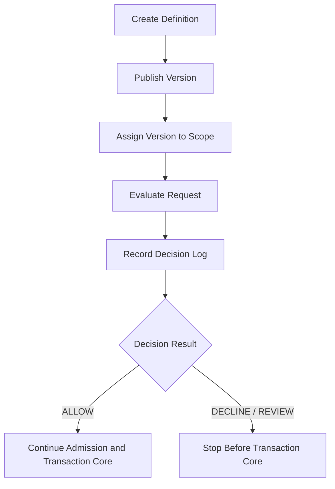

# Spend Rule 支出规则系分设计

## 文档状态与版本信息

- 当前版本：v1.0
- 文档状态：Review
- owner：wallet owner、transaction owner、ledger owner、架构 owner、测试 owner、产品 owner
- 发布日期：2026-06-23
- 评审结论摘要：本文是 Spend Rule 支出规则系统分析设计文档，只保留当前有效系统边界、接口、数据、状态、事务、非功能、测试、生产未覆盖项和工程承接门禁；过程性工程规划、历史讨论和被拒方案不再作为当前交付材料保留。
- 影响范围：wallet application、wallet impl 规则事实和控制事实、transaction 投影解释只读消费、ledger 入账主体护栏、tests 服务层和边界测试。

## 1. 文档定位

本文是 Spend Rule 的独立系统分析设计分册，承接 [../产品设计/09-SpendRule支出规则产品设计.md](../产品设计/09-SpendRule支出规则产品设计.md) 的产品语义，并把规则定义、不可变版本、规则挂载、决策记录、控制额度变动流水、预算控制投影和交易投影解释拆成可编码、可测试、可审计的系统边界。

交易、路由、钱包、账目与投影主链路仍以 [02-交易路由钱包账目与投影系分设计.md](02-交易路由钱包账目与投影系分设计.md) 为准。本文不改变交易 canonical 入参，不新增账本主体，不授权 Controller、HTTP/RPC、事件消费、生产 DDL 或上线迁移。

## 2. 需求背景、目标与边界

需求背景：Spend Rule 已经从“支付工具授权控制扩展”演进为钱包、支付工具、预算控制和交易投影共同依赖的规则能力。如果继续把规则定义、控制额度变动流水、预算控制视图和交易投影解释散落在交易路由主线文档中，实现和评审会难以区分规则事实、资金事实和账本事实。

背景问题：

1. Spend Rule 容易被误当成资金账户、预算账户、支付工具余额或 ledger subject。
2. 支出控制准入、控制额度变动流水和预算控制投影已有服务层证据，但缺少独立系统分册承接规则定义、版本、挂载和决策记录。
3. 不做独立分册的风险是规则引擎、控制证据和投影解释继续复用旧工程边界，扩大写入范围；VCC facade 和 issuer 事件消费由 Fincone 承接，不进入本分册。

目标：

1. 将规则定义、不可变版本、规则挂载、决策记录、控制额度变动流水和预算控制投影拆成清晰系统边界。
2. 让 wallet application 在交易内核前消费 Spend Rule 证据，拒绝路径无资金事实副作用。
3. 让交易投影只读解释历史规则证据，不重算历史规则，不反写 route、posting、LedgerEntry 或余额投影。

非目标：

1. 不实现完整规则引擎、规则表达式执行器、运营后台、审批流、事件消费、outbox 或生产迁移。
2. 不改变直接交易、授权交易、余额控制的账户主体 canonical 入参。
3. 不让 Spend Rule、支出控制范围、支付工具、卡号、外部账户或业务订单成为账本主体。

系统边界：Spend Rule 系统能力落在 wallet application 和 wallet impl 的规则事实、控制事实与只读查询边界；transaction 只消费已固化证据，ledger 只接受资金账户或信用账户等可入账主体。

数据边界：规则定义、版本、挂载、决策记录、控制额度变动流水和预算控制投影是规则与控制数据；资金交易、route、posting plan、LedgerEntry、ledger transaction 和账本余额投影仍属于交易与账本事实。

安全边界：规则条件、请求摘要、商户、卡、外部账户和风控证据必须脱敏、租户隔离、权限控制和审计追踪；真实资金、卡组织、银行、ACH、跨境、税务、会计或合规最终规则必须由专业角色确认。

### 2.1 产品语义输入

| 追踪ID | 输入项 | PRD 来源 | 当前状态 | 缺失时处理 |
| --- | --- | --- | --- | --- |
| REQ-SR-001 | 规则定义、不可变版本和规则挂载。 | 产品设计 3.4、5、6、8。 | 已确认 | 不能进入规则准入或交易投影解释。 |
| REQ-SR-002 | 授权前或资金动作前规则决策、拒绝原因和审计证据。 | 产品设计 3.4、6、7、11。 | 已确认 | 默认 fail-fast，不进入交易内核。 |
| REQ-SR-003 | 控制额度变动流水和预算控制只读投影。 | 产品设计 5、6、11。 | 已确认 | 不得用支出控制范围账本或账本余额临时代替。 |
| REQ-SR-004 | 历史交易投影只读解释规则证据。 | 产品设计 8.2、9、13。 | 已确认 | 解释不完整时只标记缺证据或转人工，不重算历史。 |
| QA-SR-001 | 拒绝无资金事实副作用、历史解释不重算、敏感字段不外泄。 | 产品设计 10、11、12。 | 已确认 | 作为编码和测试红线。 |
| Q-SR-001 | 完整规则引擎、多规则明细、生产迁移、运营后台和外部规则适用性。 | 产品设计 14。 | 待确认 | 只能进入 未完成交付或后续单一工程边界。 |

### 2.2 业务目标、技术目标和非目标

业务目标：

1. 支持 VCC、企业卡、员工卡、预算 scope 和钱包付款统一使用 Spend Rule 表达支出限制。
2. 支持运营、风控、客服、财务和审计解释规则命中、拒绝原因、控制占用和历史交易。

技术目标：

1. wallet 服务层能以分层契约管理规则事实、决策事实和控制事实；不是所有对外服务都命名或实现为 application service。
2. transaction 只读消费已固化 `spendRuleDecision` 和控制额度变动引用，不计算规则。
3. ledger 对 Spend Rule、支出控制范围、支付工具和控制 scope 保持不可入账主体护栏。
4. 规则拒绝、摘要冲突、挂载非法、证据缺失等失败路径无 route、posting、LedgerEntry、ledger transaction 或余额投影副作用。

非目标：

1. 不实现完整规则表达式解析器、规则执行器、冲突合成器、运营后台、审批流、事件消费、outbox 或生产迁移。
2. 不改变交易 canonical 入参，不新增支付工具交易内核，不让 Spend Rule 或支出控制范围成为账本主体。
3. 不替代外部风控、法务、合规、税务、会计、银行、ACH、卡组织或跨境规则专业确认。

## 3. 概要设计、核心方案和设计结论

概要设计：Spend Rule 按“规则事实 -> 准入决策 -> 控制额度变动 -> 只读投影解释”四层承接。同步链路用于授权前准入和规则拒绝，异步或后置链路用于交易结果消费、预算控制投影重建和运营解释。

### 3.1 设计视图清单

| 视图 | 是否需要 | 用途 | 对应章节 | 产物 |
| --- | --- | --- | --- | --- |
| 上下文视图 | 是 | 说明 wallet、transaction、ledger、reconciliation 和外部风控 / 通道确认的边界。 | 3、4 | 本节文字和模块边界表。 |
| 模块 / 组件视图 | 是 | 说明 Spend Rule 在 wallet 支出控制域，transaction 和 ledger 只消费固化证据或护栏。 | 4、4.1 | 模块边界表和强约束表。 |
| 运行时 / 流程视图 | 是 | 说明创建规则、发布版本、挂载、决策、交易后控制变动和投影解释。 | 7 | Mermaid 流程图和异常流程。 |
| 状态机视图 | 是 | 说明规则定义、规则版本、规则挂载和决策记录生命周期。 | 7.2 | 状态机表。 |
| 部署 / 运维视图 | 暂不单独绘制 | 当前范围不涉及运行时部署、事件消费、outbox 或生产迁移。 | 11、14、15 | 以非功能、生产未覆盖项和工程门禁承接。 |

### 3.2 业务驱动追踪表

| 追踪ID | 产品语义 | 工程承接 | 设计结论 | 验证资产 |
| --- | --- | --- | --- | --- |
| REQ-SR-001 | 规则定义、版本和挂载。 | `SpendRuleDefinitionService`、`SpendRuleVersionService`、`SpendRuleBindingService`。 | 已发布版本不可变，挂载必须有 scope、优先级和冲突策略。 | `SpendRuleDefinitionServiceTests`、`SpendRuleDefinitionServiceFlowTests`。 |
| REQ-SR-002 | 决策记录和拒绝原因。 | RecordSpendRuleDecisionRecordRequest、决策记录表、准入组合。 | 决策记录不可改写，同流水同摘要幂等，同流水不同摘要拒绝。 | SpendControlAdmissionApplicationServiceTests、PaymentInstrumentTransactionAuthorizationTests。 |
| REQ-SR-003 | 控制额度变动和预算控制投影。 | `SpendControlMovementService`、`SpendControlTransactionConsumptionApplicationService`、BudgetControlProjectionDTO。 | 控制额度变动流水不写账本，预算控制投影按 `controlScopeId + periodId` 可重建。 | SpendControlMovementServiceFlowTests、BudgetControlLimitAdjustmentApplicationServiceTests、SpendControlTransactionConsumptionApplicationServiceTests。 |
| REQ-SR-004 | 历史交易投影解释。 | TransactionProjectionExplanationSource 和已固化 `spendRuleDecision` 快照。 | 只读解释历史版本、挂载、决策和控制引用，不执行规则 DSL。 | FundsTransactionProjectionExplainApplicationServiceTests。 |
| QA-SR-001 | 金融红线和敏感信息安全。 | ledger posting 主体护栏、allow-list payload、脱敏摘要、边界测试。 | Spend Rule、支出控制范围、支付工具和控制 scope 不得入账；不输出 ruleSpec、script 或敏感原文。 | LayerBoundaryTests、投影解释测试、pmd / diff 检查。 |

### 3.3 方案取舍

| 方案 | 优点 | 缺点 / 风险 | 结论 |
| --- | --- | --- | --- |
| Spend Rule 放在 wallet 支出控制域，transaction 只读消费固化证据。 | 规则、准入、控制视图和支付工具能力在同一产品门面；交易内核保持账户主体 canonical 入参。 | wallet 需要清晰 application facade，避免调用方自行拼资源服务。 | 采用。 |
| Spend Rule 下沉到 transaction 交易内核。 | 交易上下文能直接拿到规则计算结果。 | 会让交易内核依赖 wallet 规则事实、规则引擎和预算控制表，破坏 canonical 入参和模块边界。 | 放弃。 |
| Spend Rule 或支出控制范围作为 ledger subject。 | 可直接用账本余额表达预算。 | 会把控制视图伪装成资金事实，破坏账务可信度、清结算和对账。 | 明确禁止。 |
| 当前切片引入完整规则引擎和 `wind-script`。 | 可执行复杂规则。 | 需要沙箱、安全、版本、回放、幂等、灰度和生产迁移，超出当前服务层闭环。 | 作为后续独立工程边界候选。 |

核心方案：

1. 规则定义、版本、挂载和决策记录当前已按基础服务和场景应用服务收敛；新增能力不得再聚合成规则大 application facade。
2. 可信规则或业务决策方通过 `SpendRuleDecisionRecordService` 固化决策；`SpendControlAdmissionApplicationService` 自行解析当前可确定的适用 binding，并按 `decisionSn` 回读验真。
3. 控制额度变动流水和预算控制投影继续作为控制事实和只读视图，不进入 ledger posting。
4. 交易投影解释只读取历史规则版本、挂载、决策流水和控制额度变动引用。

关键依赖：支付工具预交易快照、资金责任解析、账户能力来源、账户主体型交易内核、ledger posting 主体护栏、支出控制范围非建账和交易投影解释。

| 主题 | 系统结论 | 禁止方向 |
| --- | --- | --- |
| 模块归属 | Spend Rule 属于 wallet application 支出控制能力，交易内核只消费已固化的规则证据和控制事实。 | 在 transaction 内新增支付工具或 Spend Rule 专用交易内核。 |
| 事实分层 | 规则定义、版本、挂载、决策记录是规则事实；控制额度变动流水是金额控制过程事实；预算控制投影是只读视图。 | 用 SpendControlMovement / SpendControlMovement 反向替代规则定义，或用预算投影替代账本余额。 |
| 账务边界 | Spend Rule、支出控制范围、支付工具、卡号、PAN、token 和外部账户都不能成为 route leg、posting 或 LedgerEntry 主体。 | ledger posting 接受 SPEND_CONTROL_SCOPE、SPEND_RULE、PAYMENT_INSTRUMENT 或 cardRef。 |
| 准入边界 | 规则拒绝必须停在交易内核前，只能写决策记录；不写控制额度变动流水。 | 拒绝后生成 route、posting、LedgerEntry、资金交易扣款、余额投影或 chargeback。 |
| 历史解释 | 交易投影只能读取历史规则版本、挂载、决策流水和控制额度变动引用。 | 按当前规则定义、当前挂载或当前工具绑定重算历史交易。 |

## 4. 详细设计：模块边界

| 模块 | 职责 | 不承担 |
| --- | --- | --- |
| core | 定义 Spend Rule 枚举、值对象或 DSL 承载类型，例如规则类型、规则域、scope 类型、状态枚举。 | 依赖 DAL、Mapper、Spring Bean、测试或具体规则实现。 |
| wallet-face | 暴露 Spend Rule application 契约、Request、Query、DTO。 | 暴露 Entity、Mapper、内部实现类或 HTTP/RPC 控制器。 |
| wallet-impl | 实现规则定义、版本发布、规则挂载、决策记录、控制额度变动流水和预算控制投影。 | 写资金交易事实、route、posting、LedgerEntry、ledger transaction 或账本余额投影。 |
| transaction-face / transaction-impl | 在授权、付款、退款和投影解释中读取已固化规则证据。 | 计算 Spend Rule、管理规则定义、更新规则挂载或把规则作为 canonical 入参主体。 |
| ledger-face / ledger-impl | 只接受资金账户、信用账户或平台角色解析后的资金账户作为账本主体。 | 为 Spend Rule 或支出控制范围建账、过账或投影余额。 |
| reconciliation / governance | 校验规则证据、交易事实、控制额度变动流水和外部证据的引用一致性。 | 用对账或治理任务重算规则并反写交易或账本事实。 |
| tests | 承载服务层流程、H2 schema、边界测试、失败无副作用和只读投影断言。 | 用内存版业务实现冒充生产闭环。 |

### 4.1 模块归属强约束

Spend Rule 主能力归属于 `wallet` 支出控制域，`transaction` 只消费已固化证据。该约束不是目录偏好，而是资金事实边界：规则配置和控制额度变动流水可以决定是否继续进入交易，但不能成为交易内核的主体能力。

| 包或模块 | 允许 | 禁止 |
| --- | --- | --- |
| `wallet/face` | 暴露 Spend Rule 定义、版本、挂载、决策记录、准入、控制额度变动流水和预算控制投影契约。 | 直接写交易事实、账本分录或余额投影。 |
| `wallet/impl` | 持久化规则事实和控制事实，提供支付工具、账户能力、资金责任和准入证据。 | 依赖 transaction-face/impl，或直接写交易表、route、posting、LedgerEntry。 |
| `transaction-face / transaction-impl` | 读取 `spendRuleDecision`、route snapshot、控制额度变动引用等已固化证据用于历史解释；`transaction-impl` 可通过 `wallet-face` 契约实现交易后控制消费或退款补偿适配；支付工具授权 facade 可在进入交易内核前调用 wallet-face 准入契约解析 binding 并验真决策引用。 | 依赖 `wallet-impl`、wallet DAL / Mapper、规则定义 / 挂载 / 决策记录 Entity，查询预算控制投影模型，或在交易内核内执行 Spend Rule。 |
| `ledger` | 校验可入账主体并过账资金账户、信用账户或平台资金账户。 | 为 Spend Rule、支出控制范围、支付工具或控制 scope 建账、过账或投影余额。 |
| `core` | 承载必要枚举和 DSL 值对象。 | 引入 DAL、Spring Bean、规则执行器或具体服务实现。 |

工程守卫：

1. 交易模块可以使用资金交易上下文中的 `spendRuleDecision` allow-list 字段。
2. `SpendControlTransactionConsumptionApplicationService` 的交易后控制事实适配可以由 `transaction-impl` 实现，但源码包必须归属 `com.wind.funds.transaction`，且只能依赖 `wallet-face` 契约、`SpendControlMovementService` 和交易查询契约。
3. `PaymentInstrumentAuthorizationProcessor` 是 `PaymentInstrumentTransactionApplicationService` 的内部授权处理器，可调用 `SpendControlAdmissionApplicationService` 固化准入证据，但不得作为 face 契约暴露；其他交易模块源码不得 import 或注入钱包侧准入、评估、规则定义、规则挂载或决策记录服务，例如 `SpendRuleEvaluationApplicationService` 或 Spend Rule 基础服务。
4. 交易模块不得 import `SpendRuleDefinition`、`SpendRuleVersion`、`SpendRuleBinding`、`SpendRuleDecisionRecord`、`SpendControlMovement` 等 wallet DAL 实体或 Mapper；交易投影只能消费已固化快照和证据引用。
5. 边界测试需扫描 `transaction-*` 生产源码，防止 Spend Rule 主能力反向沉入交易内核。

### 4.2 服务层分层基线

Spend Rule 服务层按项目统一基础服务模板收敛，不再拆旧式领域写服务或领域查询服务。基础服务承载单对象创建、读取、查询、幂等、状态守卫和只读解释；只有跨对象用例编排才使用 application service。

| 服务类型 | Spend Rule 目标服务 | 职责 |
| --- | --- | --- |
| 基础服务 | `SpendRuleDefinitionService`、`SpendRuleVersionService`、`SpendRuleBindingService`、`SpendRuleDecisionRecordService`、`SpendControlMovementService` | 规则定义、版本、挂载、决策记录、控制额度变动流水和预算控制投影的标准服务能力；允许访问 Mapper / Repository，并在服务内保留必要业务守卫。 |
| 场景应用服务 | `SpendControlAdmissionApplicationService`、`SpendControlTransactionConsumptionApplicationService`、`PaymentInstrumentTransactionApplicationService` | 授权前准入、交易后消费 / 退款补偿、支付工具授权与收款入口等跨对象用例编排和事务边界。 |

服务命名规则：

1. 新增规则定义、版本、挂载、决策记录或控制流水能力时，优先并入对应基础服务。
2. 只有需要组合支付工具、账户能力、资金责任、交易事实或多个基础服务时，才新增或扩展 application service。
3. 不再新增旧式领域写服务、领域查询服务、兼容 facade 或只做委派的浅服务。
4. 代码收敛必须采用小切片；不得在同一 工程边界中改 Controller、HTTP/RPC、交易 canonical 入参、ledger posting 或生产 DDL。

## 5. 详细设计：服务能力和接口设计

当前最小系统闭环已拆分为基础服务和场景 application service。规则定义、版本发布、挂载写入、挂载查询 / 解释、决策记录写入 / 查询 / 解释、控制额度变动流水写入 / 查询和预算控制投影均由对应基础服务承接；application service 只保留准入、交易消费和支付工具生命周期等跨对象用例编排。

| 服务或组件 | 能力 | 入参 | 出参 | 边界 |
| --- | --- | --- | --- | --- |
| SpendRuleDefinitionService | 规则定义创建、不可变版本发布和规则挂载。 | CreateSpendRuleDefinitionRequest、PublishSpendRuleVersionRequest、CreateSpendRuleBindingRequest、tenantId、ruleId。 | definitionId、SpendRuleDefinitionDTO、SpendRuleVersionDTO、SpendRuleBindingDTO。 | 可访问 Mapper；校验定义幂等、版本不可原地覆盖、已发布版本挂载和挂载幂等；不执行规则、不记录决策记录、不生成交易、route、posting、LedgerEntry 或余额投影。 |
| SpendRuleVersionService | 规则版本基础创建、按版本读取和已发布版本读取。 | PublishSpendRuleVersionRequest、tenantId、ruleId、ruleVersion。 | SpendRuleVersionDTO。 | 基础服务可访问 Mapper；不判断发布业务不变量，不执行规则，不生成交易或账务事实。 |
| SpendRuleBindingService | 规则挂载创建、生命周期状态更新、读取、条件查询、有效挂载读取和挂载可用性解释。 | CreateSpendRuleBindingRequest、SuspendSpendRuleBindingRequest、ResumeSpendRuleBindingRequest、RetireSpendRuleBindingRequest、SpendRuleBindingQuery、SpendRuleBindingExplainQuery、tenantId、sn。 | SpendRuleBindingDTO、SpendRuleBindingExplanationDTO。 | 可访问 Mapper；生命周期命令只校验并更新状态，不承接操作者、原因、审批引用、变更摘要或审计日志；只读解释不重新执行规则、不记录决策记录、不调整控制额度。 |
| SpendRuleDecisionRecordService | 可信规则或业务决策方写入决策记录，并提供单条读取、窄条件查询和解释。 | RecordSpendRuleDecisionRecordRequest、SpendRuleDecisionRecordQuery、SpendRuleDecisionExplainQuery。 | decisionRecordId、SpendRuleDecisionRecordDTO、SpendRuleDecisionExplanationDTO。 | 可访问 Mapper；只接受 `PASSED` / `REJECTED`，校验规则版本、挂载、有效期、支付工具 scope 一致性、幂等摘要冲突和拒绝原因语义；不接受 `NO_APPLICABLE_RULE`，不生成交易、route、posting、LedgerEntry 或余额投影。 |
| SpendControlAdmissionApplicationService | 组合支付工具预交易快照，自行解析当前有效 Spend Rule 挂载，并按 `decisionSn` 回读、验真决策记录形成准入结论。 | ResolveSpendControlAdmissionRequest；规则、binding、结果和摘要字段仅为可选诊断回显。 | 支出控制准入快照。 | 只读；不执行规则、不写决策记录或控制额度变动流水；无适用挂载显式返回 `NO_APPLICABLE_RULE`，多个适用挂载或不可验真证据 fail-closed。 |
| SpendControlMovementService | 控制额度变动流水写入、单条读取、窄条件查询和预算控制投影重建。 | RecordSpendControlMovementRequest、SpendControlMovementQuery、BudgetControlProjectionQuery。 | movementId、SpendControlMovementDTO、BudgetControlProjectionDTO。 | 可访问 Mapper；校验目标账务主体、变动类型、幂等摘要、释放上限、调额上限、控制范围和控制周期边界；不写资金交易、route、posting、LedgerEntry 或账本余额投影。 |
| SpendControlTransactionConsumptionApplicationService | 交易成功、授权完成、退款或争议后消费或补偿控制额度变动；失败或拒绝通过同一资金事务回滚控制预留，不写释放补偿；超时不写控制流水。 | 原预留流水、资金交易引用、交易结果、退款引用。 | 交易后控制额度变动流水。 | 只桥接交易事实和控制事实，不改交易 canonical 入参。 |
| TransactionProjectionExplanationSource | 读取规则决策和控制额度变动流水，生成交易投影解释。 | 资金交易、route snapshot、规则决策、控制额度变动引用、账本摘要。 | 只读解释 payload 和 evidenceRefs。 | 不重算规则，不反写事实。 |

服务分层规则：

1. 基础服务负责“规则定义、版本、挂载、决策记录、控制流水如何写入、读取、查询、解释和守卫不变量”。
2. 场景应用服务负责“交易前是否允许继续、交易后如何消费或补偿控制额度、支付工具入口如何委派账户主体交易”。
3. 基础服务可访问 Mapper / Repository；场景应用服务只编排基础服务和外部能力，不直接写 Mapper。
4. 失败必须停在交易内核前或只追加控制事实，不能反写交易、route、posting、LedgerEntry 或账本余额投影。

### 5.1 当前接口契约

| 接口 | 方法 | 入参 | 出参 | 幂等 / 事务 | 错误语义 | 副作用边界 |
| --- | --- | --- | --- | --- | --- | --- |
| SpendRuleDefinitionService | createDefinition | CreateSpendRuleDefinitionRequest | definitionId | ruleId 租户内唯一；单表事务。 | 规则定义重复、字段缺失、租户不一致。 | 只写规则定义，不写版本、挂载、交易或账本。 |
| SpendRuleDefinitionService | publishVersion | PublishSpendRuleVersionRequest | SpendRuleVersionDTO | ruleId + ruleVersion + ruleDigest 幂等；摘要冲突拒绝。 | 定义不存在、定义停用、版本摘要冲突。 | 只写规则版本，不覆盖历史版本。 |
| SpendRuleDefinitionService | createSpendRuleBinding | CreateSpendRuleBindingRequest | SpendRuleBindingDTO | ruleId + ruleVersion + scopeType + scopeId + auditReferenceSn 幂等；sn 由资金底座内部生成。 | 版本不存在、scope 非法、冲突策略缺失、有效期非法、审计引用缺失。 | 只写规则挂载，不输出资金责任主体。 |
| SpendRuleBindingService | explainSpendRuleBinding | SpendRuleBindingExplainQuery | SpendRuleBindingExplanationDTO | 只读查询。 | scope 不支持、规则挂载不可用。 | 不计算复杂规则，不写决策记录或控制流水。 |
| SpendRuleDecisionRecordService | recordDecision | RecordSpendRuleDecisionRecordRequest | SpendRuleDecisionRecordDTO | 仅可信决策生产方调用；decisionSn + decisionDigest 幂等；摘要冲突拒绝。 | 决策摘要冲突、规则版本缺失、决策结果不是 `PASSED` / `REJECTED`。 | 只写决策记录；记录成功不等于准入放行，拒绝不生成交易、route、posting 或账本事实。 |
| SpendRuleDecisionRecordService | queryDecisions | SpendRuleDecisionRecordQuery | List<SpendRuleDecisionRecordDTO> | 只读查询；tenantId 可作为可选过滤条件，但必须至少提供一个业务窄条件。 | 缺查询条件。 | 不重算规则，不写控制流水，不生成交易、route、posting 或账本事实。 |
| SpendRuleDecisionRecordService | explainDecision | SpendRuleDecisionExplainQuery | SpendRuleDecisionExplanationDTO | tenantId + decisionSn 精确查询；`decisionSummary` 仅由 `decisionResult + rejectReason` 派生，用于排查阅读。 | 决策记录不存在。 | 只解释历史决策事实、拒绝原因和证据引用，不反写任何事实；业务判断以 `decision.decisionResult` 为准。 |
| SpendControlAdmissionApplicationService | resolveSpendControlAdmission | ResolveSpendControlAdmissionRequest | SpendControlAdmissionDecisionDTO | 只读解析当前有效挂载，并按 tenantId + decisionSn 回读已固化记录。 | 有适用挂载但缺 decisionSn、记录不存在、binding / 上下文不一致、裸结果 / 摘要或多个适用挂载。 | 不写规则定义、决策记录或控制额度变动流水；失败不进交易内核。 |
| SpendControlMovementService | recordMovement | RecordSpendControlMovementRequest | SpendControlMovementDTO | movementSn + movementDigest 幂等；摘要冲突拒绝。 | 历史决策兼容类型新写入拒绝、调额后额度低于已使用或已占用金额拒绝。 | 只写控制额度变动流水，不写资金事实。 |
| SpendControlTransactionConsumptionApplicationService | consume / refund | 交易结果和控制流水引用。 | SpendControlMovementDTO | 基于原控制流水、交易流水和变动摘要幂等。 | 原控制流水缺失、跨业务场景、跨目标账户、金额超限。 | 只追加控制流水，不反写交易或账本。 |
| TransactionProjectionExplanationSource | explain | 资金交易、route snapshot、规则决策快照和控制引用。 | 解释 payload 和 evidenceRefs。 | 只读。 | 历史证据缺失、敏感字段超 allow-list。 | 不重算规则，不反写任何事实。 |

### 5.2 DSL v1.1 结构化契约

Spend Rule DSL v1.1 在系统上拆成三个稳定契约，不把 JSON 直接等同于 Controller 报文或数据库列。

| 契约 | 系统职责 | 持久化映射建议 |
| --- | --- | --- |
| SpendRuleVersionSpec | 保存不可变规则版本正文，包含条件、窗口、额度、裁决和安全策略。 | 当前代码以 `rule_spec` 保存完整结构化 JSON，以 `rule_digest` 做不可变校验；`display`、`matchSpec`、`counterSpec`、`limitSpec`、`decisionSpec`、`safetySpec` 是 DSL 分组，不是当前已拆列字段。 |
| SpendRuleBindingSpec | 保存规则版本挂载 scope、优先级、冲突策略、生效窗口和创建审计引用。 | 映射到规则挂载表的 `scope_type`、`scope_id`、`priority`、`conflict_policy`、`effective_from`、`effective_to`、`audit_reference_sn`；`sn` 由资金底座内部生成。 |
| SpendRuleDecisionEvidenceSpec | 保存一次请求的评估证据、最终裁决、命中规则列表和摘要。 | 当前代码以 `decision_sn`、`rule_id`、`rule_version`、`spend_rule_binding_sn`、scope、instrument、action、amount、currency、business、`decision_result`、`reject_reason`、`decision_digest` 固化单条决策证据；`requestDigest`、`evaluatedRules`、`decisionPolicy`、`finalDecision` 属于目标 DSL，未独立落库。 |

字段分组规则：

| 分组 | 必填条件 | 校验口径 |
| --- | --- | --- |
| display | 规则版本必填。 | 不允许敏感原文；用于运营、客服和审计展示。 |
| matchSpec | 规则版本必填。 | 至少明确业务场景、控制范围或请求事实集合之一；空匹配不得默认全量放行。 |
| counterSpec | 周期金额、周期次数和频控规则必填。 | 必须明确窗口、时区、累计依据和退款净额策略。 |
| limitSpec | 限额、次数、集合控制类规则必填。 | 金额必须带币种；集合控制必须说明允许还是拒绝。 |
| decisionSpec | 规则版本必填。 | 缺证据、未知字段或版本摘要冲突时默认不放行。 |
| safetySpec | 规则版本必填。 | 敏感字段最小化，历史解释按快照和摘要回放。 |
| evaluatedRules | 决策证据必填。 | 一次评估涉及多条规则时必须记录每条规则的结果、原因和摘要。 |

多规则裁决规则：

1. 同一请求可评估支付工具、预算 scope、账户层级、使用主体和业务场景上的多条规则。
2. `priority` 只决定评估顺序或裁决权重，不得替代 `conflictPolicy`。
3. `DENY_OVERRIDES`、`MOST_RESTRICTIVE`、`FIRST_MATCH` 等冲突策略必须在挂载或决策证据中可追踪。
4. 最终结果以 `finalDecision` 为准，`evaluatedRules` 保留全部局部结果，不能只保存最后一条命中规则。
5. 决策拒绝或待复核时，系统不得生成资金交易、route、posting plan、LedgerEntry、ledger transaction 或账本余额投影。

当前代码基线口径：

1. 当前公共类名、表名和字段采用 `SpendRuleDecisionRecord`、`SpendControlMovement`、`movementSn`、`movementType` 和 `movementDigest` 等最终交付名。
2. 当前稳定流水字段采用 Spend Rule 挂载自身 `sn`、外部引用挂载的 `spendRuleBindingSn`、`decisionSn` 和 `movementSn`。
3. 当前 `SpendRuleVersion` 不拆 `condition_spec`、`limit_spec`、`action_spec`，而是以 `ruleSpec / ruleDigest` 承载完整规则规格与摘要。
4. 当前决策记录是单条 rule / binding / scope 的服务层证据；完整规则引擎、多规则 `evaluatedRules`、冲突合成器和决策明细持久化不在当前实现基线内。
5. 当前准入遇到多个适用挂载时不按 `priority` 或查询顺序擅自选取单条记录，而是 fail-closed；待公共契约能够表达全部 `evaluatedRules`、`decisionPolicy` 和 `finalDecision` 后再放开多规则准入。

## 6. 详细设计：数据设计和数据模型

数据设计总原则：

1. 本章描述当前代码和 H2 schema 的服务层目标结构，不等同于生产迁移授权。
2. 所有表均由应用层维护逻辑关联，不使用数据库外键或级联删除。
3. 新增、改名、删除公共字段或迁移物理表必须另起单一工程边界，并补 DDL/H2、兼容发布、回滚和历史数据校验。
4. 金额字段统一使用最小货币单位；币种字段使用 ISO 货币码；预算控制金额不代表账本余额。
5. `tenant_id` 当前代码类型为 `bigint(20)` / Long；本文不把资金账户、信用账户、支出控制范围或支付工具既有 sn 统一改名为 code。

### 6.1 规则定义表

表中文名：Spend Rule 规则定义表

表名：t_spend_rule_definition

业务用途：记录 Spend Rule 的稳定规则定义，用于运营配置、版本发布和审计追踪。

数据归属：租户级规则定义，归属 wallet 支出控制域。

| 字段 | 类型 | 必填 | 说明 | 示例 |
| --- | --- | --- | --- | --- |
| id | bigint(20) | 是 | 主键。 | 1001 |
| gmt_create | datetime(3) | 是 | 创建时间。 | 2026-06-22 10:00:00.000 |
| gmt_modified | datetime(3) | 是 | 修改时间。 | 2026-06-22 10:00:00.000 |
| tenant_id | bigint(20) | 是 | 租户 ID。 | 10001 |
| rule_id | varchar(64) | 是 | 系统内稳定规则标识。 | SR-DAILY-001 |
| rule_name | varchar(128) | 是 | 规则名称。 | 员工卡日限额 |
| rule_type | varchar(50) | 是 | 规则类型。 | PERIOD_AMOUNT_LIMIT |
| rule_domain | varchar(50) | 是 | 规则域。 | AUTHORIZATION |
| status | varchar(32) | 是 | 定义状态。 | ACTIVE |
| description | varchar(512) | 否 | 规则定义说明。 | 员工卡日限额说明 |

索引：

| 索引 | 类型 | 字段 | 用途 |
| --- | --- | --- | --- |
| uk_spend_rule_definition_rule | 唯一索引 | tenant_id, rule_id | 保证租户内规则标识唯一。 |
| idx_spend_rule_definition_domain | 普通索引 | tenant_id, rule_domain, status | 支持按规则域和状态筛选。 |

状态说明：

- DRAFT：草稿定义，不能生产挂载。
- ACTIVE：可发布版本或被引用。
- SUSPENDED：暂停新版本或新挂载。
- ARCHIVED：已归档，普通流程不可恢复。

数据约束与兼容：

1. 同一 tenantId 下 ruleId 唯一。
2. 停用或归档定义不能创建新版本或新挂载。
3. 规则定义删除采用状态归档，不物理删除。

### 6.2 规则版本表

表中文名：Spend Rule 规则版本表

表名：t_spend_rule_version

业务用途：记录不可变规则版本，发布后不得原地覆盖正文。

数据归属：租户级规则版本，归属 wallet 支出控制域。

| 字段 | 类型 | 必填 | 说明 | 示例 |
| --- | --- | --- | --- | --- |
| id | bigint(20) | 是 | 主键。 | 2001 |
| gmt_create | datetime(3) | 是 | 创建时间。 | 2026-06-22 10:00:00.000 |
| gmt_modified | datetime(3) | 是 | 修改时间。 | 2026-06-22 10:00:00.000 |
| tenant_id | bigint(20) | 是 | 租户 ID。 | 10001 |
| rule_id | varchar(64) | 是 | 规则标识。 | SR-DAILY-001 |
| rule_version | varchar(64) | 是 | 规则版本。 | v1 |
| rule_spec | text | 是 | 规则规格 JSON，承载 DSL 分组正文。 | {"limitSpec":{"amountLimit":{"amount":"100.00","currency":"USD"}}} |
| rule_digest | varchar(128) | 是 | 规则规格摘要。 | sha256:xxx |
| status | varchar(32) | 是 | 版本状态。 | PUBLISHED |
| operator_id | varchar(64) | 是 | 操作者。 | ops001 |
| audit_reference_sn | varchar(128) | 是 | 审计引用。 | AUDIT-001 |
| description | varchar(512) | 否 | 规则版本说明。 | v1 发布 |

索引：

| 索引 | 类型 | 字段 | 用途 |
| --- | --- | --- | --- |
| uk_spend_rule_version_rule | 唯一索引 | tenant_id, rule_id, rule_version | 保证版本唯一。 |
| idx_spend_rule_version_status | 普通索引 | tenant_id, status | 查询状态。 |

状态说明：

- DRAFT：草稿版本，不能作为生产准入依据。
- PUBLISHED：已发布版本，正文不可变。
- EXPIRED：生效窗口结束或被新版本替代。
- RETIRED：退役版本，只能用于历史解释。

不可变规则：

1. ruleId + ruleVersion 已发布后，ruleSpec 和 ruleDigest 不得被不同内容覆盖。
2. 同摘要重复发布可以幂等返回既有版本。
3. 需要修改规则时发布新 ruleVersion。

### 6.3 规则挂载表

表中文名：Spend Rule 规则挂载表

表名：t_spend_rule_binding

业务用途：记录某一规则版本作用到哪个 scope、优先级和冲突策略。

数据归属：租户级规则挂载，scope 只是控制范围，不是资金主体。

| 字段 | 类型 | 必填 | 说明 | 示例 |
| --- | --- | --- | --- | --- |
| id | bigint(20) | 是 | 主键。 | 3001 |
| gmt_create | datetime(3) | 是 | 创建时间。 | 2026-06-22 10:00:00.000 |
| gmt_modified | datetime(3) | 是 | 修改时间。 | 2026-06-22 10:00:00.000 |
| tenant_id | bigint(20) | 是 | 租户 ID。 | 10001 |
| sn | varchar(64) | 是 | 规则挂载流水号，由资金底座内部生成。 | SRB20260622100000000001 |
| rule_id | varchar(64) | 是 | 规则标识。 | SR-DAILY-001 |
| rule_version | varchar(64) | 是 | 规则版本。 | v1 |
| scope_type | varchar(50) | 是 | 挂载范围类型。 | PAYMENT_INSTRUMENT |
| scope_id | varchar(64) | 是 | 挂载范围编号。 | PI-10001 |
| priority | int(11) | 是 | 优先级，数值越小越先裁决或按工程任务约定。 | 10 |
| conflict_policy | varchar(50) | 是 | 冲突策略。 | DENY_OVERRIDES |
| effective_from | datetime(3) | 是 | 生效开始时间。 | 2026-06-22 00:00:00.000 |
| effective_to | datetime(3) | 是 | 生效结束时间。 | 2026-07-22 00:00:00.000 |
| status | varchar(32) | 是 | 挂载状态。 | ACTIVE |
| audit_reference_sn | varchar(128) | 是 | 创建挂载的审计引用，参与业务幂等。 | APPROVAL-001 |
| description | varchar(512) | 否 | 挂载说明。 | 员工卡日限额挂载 |

索引：

| 索引 | 类型 | 字段 | 用途 |
| --- | --- | --- | --- |
| uk_spend_rule_binding_sn | 唯一索引 | tenant_id, sn | 保证挂载流水唯一。 |
| uk_spend_rule_binding_scope | 唯一索引 | tenant_id, scope_type, scope_id, rule_id, rule_version, audit_reference_sn | 支撑同一上层审批或业务事实的挂载幂等。 |
| idx_spend_rule_binding_rule | 普通索引 | tenant_id, rule_id, rule_version, status | 查询规则版本挂载。 |
| idx_spend_rule_binding_scope | 普通索引 | tenant_id, scope_type, scope_id, status | 查询 scope 下有效规则。 |

挂载边界：

1. scopeType 可以是支付工具、支出控制范围、资金账户、信用账户、账户层级、使用主体或业务场景。
2. scopeType 只是控制范围，不输出资金责任主体。
3. 挂载关系不能生成 route、posting、LedgerEntry 或 ledger bucket。
4. 挂载生效窗口当前代码为必填，生产迁移不得把 null 解释为永久有效。

### 6.4 决策记录表

表中文名：Spend Rule 决策记录表

表名：t_spend_rule_decision_record

业务用途：记录一次支出规则评估的结果、原因和摘要，用于拒绝解释、审计和投影。物理表和实体使用 `t_spend_rule_decision_record` / `SpendRuleDecisionRecord`。

数据归属：租户级规则决策证据，归属 wallet 支出控制域；交易投影只读消费。

| 字段 | 类型 | 必填 | 说明 | 示例 |
| --- | --- | --- | --- | --- |
| id | bigint(20) | 是 | 主键。 | 4001 |
| gmt_create | datetime(3) | 是 | 创建时间。 | 2026-06-22 10:00:00.000 |
| tenant_id | bigint(20) | 是 | 租户 ID。 | 10001 |
| decision_sn | varchar(64) | 是 | 决策流水号。 | DEC-001 |
| spend_rule_binding_sn | varchar(64) | 否 | 命中的挂载流水。 | ASG-001 |
| rule_id | varchar(64) | 是 | 规则标识。 | SR-DAILY-001 |
| rule_version | varchar(64) | 是 | 规则版本。 | v1 |
| scope_type | varchar(50) | 是 | 决策 scope 类型。 | PAYMENT_INSTRUMENT |
| scope_id | varchar(64) | 是 | 决策 scope 编号。 | PI-10001 |
| instrument_sn | varchar(64) | 否 | 支付工具号。 | PI-VCC-10001 |
| action | varchar(50) | 是 | 支付工具动作。 | AUTHORIZE |
| amount | bigint(20) | 是 | 交易金额，最小货币单位。 | 3500 |
| currency | varchar(10) | 是 | 币种。 | USD |
| business_scene | varchar(64) | 是 | 业务场景。 | VCC_AUTHORIZATION |
| business_sn | varchar(64) | 是 | 业务流水。 | BIZ-001 |
| decision_result | varchar(32) | 是 | 决策结果。 | DECLINED |
| reject_reason | varchar(256) | 否 | 拒绝原因。 | DAILY_LIMIT_EXCEEDED |
| decision_digest | varchar(128) | 是 | 决策摘要。 | sha256:decision |

索引：

| 索引 | 类型 | 字段 | 用途 |
| --- | --- | --- | --- |
| uk_spend_rule_decision_record_sn | 唯一索引 | tenant_id, decision_sn | 决策幂等。 |
| idx_spend_rule_decision_record_business | 普通索引 | tenant_id, business_scene, business_sn | 按业务流水查询决策。 |
| idx_spend_rule_decision_record_rule | 普通索引 | tenant_id, rule_id, rule_version | 按规则版本查询决策。 |
| idx_spend_rule_decision_record_scope | 普通索引 | tenant_id, scope_type, scope_id | 按 scope 查询时间线。 |
| idx_spend_rule_decision_record_binding | 普通索引 | tenant_id, spend_rule_binding_sn | 按挂载查询决策。 |

幂等规则：

1. 同 tenantId + decisionSn + decisionDigest 重复提交时返回既有记录。
2. 同 tenantId + decisionSn 但 decisionDigest 不一致时拒绝。
3. 决策记录不可修改；纠错应追加新决策或审计更正记录。
4. 决策记录不设置 gmtModified，避免被误认为可更新事实；如未来增加更正记录，需另起设计。

### 6.5 控制额度变动流水模型

`SpendControlMovement` 表达控制额度变动流水。新写入必须按职责分流，准入 / 拒绝决策写入 `SpendRuleDecisionRecord` / `recordDecision`，只有额度调整、预留、消耗、可信释放和策略授权的退款控制补偿写入控制额度变动流水：

表中文名：支出控制额度变动流水表

表名：t_spend_control_movement

业务用途：记录额度调增、调减、预留、消耗、可信释放和策略授权的退款控制补偿；超时、失败、拒绝和单纯发生资金退款都不自动写控制流水。

数据归属：租户级控制事实，目标主体只允许资金账户或信用账户；支出控制范围只作为控制 scope 或展示归属。

关键字段：

| 字段 | 类型 | 必填 | 说明 | 示例 |
| --- | --- | --- | --- | --- |
| id | bigint(20) | 是 | 主键。 | 5001 |
| gmt_create | datetime(3) | 是 | 创建时间。 | 2026-06-22 10:00:00.000 |
| gmt_modified | datetime(3) | 是 | 最后修改时间。 | 2026-06-22 10:00:00.000 |
| movement_sn | varchar(64) | 是 | 控制额度变动流水，用于幂等、回放和审计。 | ACT-001 |
| tenant_id | bigint(20) | 是 | 租户 ID。 | 10001 |
| movement_type | varchar(50) | 是 | 控制额度变动类型。 | RESERVED |
| business_scene | varchar(64) | 是 | 业务场景。 | VCC_AUTHORIZATION |
| business_sn | varchar(64) | 是 | 业务流水或请求幂等号。 | BIZ-001 |
| original_movement_sn | varchar(64) | 否 | 原控制额度变动流水，用于消费、释放或退款补偿回链。 | ACT-RES-001 |
| transaction_sn | varchar(64) | 否 | 已存在的资金交易流水。 | TXN-001 |
| instrument_sn | varchar(64) | 否 | 支付工具号。 | PI-VCC-10001 |
| action | varchar(50) | 否 | 支付工具动作。 | AUTHORIZE |
| target_subject_id | varchar(64) | 是 | 控制额度变动目标资金主体 ID。 | FA-001 |
| target_subject_type | varchar(50) | 是 | 控制额度变动目标资金主体类型，只允许资金账户或信用账户。 | FUNDING_ACCOUNT |
| amount | bigint(20) | 是 | 控制金额，最小货币单位。 | 3500 |
| currency | varchar(10) | 是 | 币种。 | USD |
| spend_rule_id | varchar(64) | 是 | Spend Rule 标识。 | SR-DAILY-001 |
| spend_rule_version | varchar(64) | 是 | Spend Rule 版本。 | v1 |
| spend_decision_sn | varchar(64) | 否 | Spend Rule 决策流水。 | DEC-001 |
| control_scope_id | varchar(64) | 否 | 控制范围标识，不表达账务主体。 | BG-001 |
| period_id | varchar(64) | 否 | 控制周期标识；预算控制投影类流水必填，用于当前周期和历史周期追溯。 | 2026-07 |
| movement_digest | varchar(128) | 是 | 控制额度变动摘要。 | sha256:activity |

索引：

| 索引 | 类型 | 字段 | 用途 |
| --- | --- | --- | --- |
| uk_spend_control_movement_sn | 唯一索引 | tenant_id, movement_sn | 活动幂等。 |
| idx_spend_control_movement_business | 普通索引 | tenant_id, business_scene, business_sn | 按业务流水查询控制时间线。 |
| idx_spend_control_movement_original | 普通索引 | tenant_id, original_movement_sn | 按原控制流水查询消费、释放或补偿。 |
| idx_spend_control_movement_target | 普通索引 | tenant_id, target_subject_type, target_subject_id | 按目标账户查询预算控制投影。 |
| idx_spend_control_movement_scope | 普通索引 | tenant_id, control_scope_id, period_id, currency | 按控制范围和周期查询预算控制投影。 |
| idx_spend_control_movement_rule | 普通索引 | tenant_id, spend_rule_id, spend_rule_version | 按规则版本查询控制流水。 |
| idx_spend_control_movement_rolling_count | 普通索引 | tenant_id, control_scope_id, currency, spend_rule_id, spend_rule_version, target_subject_type, target_subject_id, gmt_create | 支撑滚动窗口次数 evaluator 的窄范围只读查询。 |

滚动窗口次数 evaluator 需要按 `tenant_id + control_scope_id + currency + spend_rule_id + spend_rule_version + target_subject_type + target_subject_id + gmt_create` 组合读取控制流水。当前 H2 schema 已补齐目标组合索引，只证明服务层和测试基线具备对应访问路径；生产启用前仍必须同步真实 DDL、执行计划和慢查询风险评审，未完成前不得把该 evaluator 声明为生产强一致频控能力。

| 当前 movementType | 目标语义 | 是否参与预算控制投影 | 说明 |
| --- | --- | --- | --- |
| LIMIT_INCREASED | 控制额度调增流水 | 是 | 增加当前周期或 scope 的控制额度。 |
| LIMIT_DECREASED | 控制额度调减流水 | 是 | 减少当前周期或 scope 的控制额度。 |
| RESERVED | 控制预留流水 | 是 | 授权或付款前占用控制额度。 |
| CONSUMED | 控制消耗流水 | 是 | 交易成功后将预留解释为已使用。 |
| REFUND_COMPENSATED | 退款控制补偿流水 | 是 | 上层产品策略明确允许退款恢复周期控制额度后，降低周期净消费并恢复可用控制额度；资金退款事实本身不足以触发，不恢复已经被消费的原控制预留，也不允许同一 reservation 再次消费。 |
| RELEASED | 控制释放流水 | 是 | 收到可信业务释放事实后释放已提交的预留控制占用；交易失败或拒绝由同一资金事务回滚控制预留，不写 `RELEASED` 补偿；超时不写控制流水。 |

预算控制投影计算口径：

1. `limitAmount = limitIncreasedAmount - limitDecreasedAmount`。
2. `consumedAmount = grossConsumedAmount - refundCompensatedAmount`，表示净消耗；退款只影响该净消耗口径。
3. `remainingControlAmount = reservedAmount - grossConsumedAmount - releasedAmount`，表示尚未消费或可信释放的控制占用；退款不得重新打开已消费 reservation。
4. `availableControlAmount = limitAmount - consumedAmount - remainingControlAmount`，表示周期或 scope 内还能继续使用的控制额度。
5. 调减预算控制额度时，新的 `limitAmount` 不得低于 `consumedAmount + remainingControlAmount`。
6. 查询当前周期额度时使用 `controlScopeId + periodId`；历史周期同理，只替换 `periodId`。
7. `controlScopeId` 是公共契约、控制流水和投影的统一控制范围标识，落库字段为 `control_scope_id`。
8. `period_id` 只表达 Spend Rule 控制周期，不创建支出控制范围账本，也不复用 ledger bucket 作为控制事实。
9. 若未来将 `remainingControlAmount` 改名为 `occupiedControlAmount`，必须单独评估公共 DTO、表字段、测试和调用方兼容。
10. 准入和拒绝证据只写入 `SpendRuleDecisionRecord`，不进入 `SpendControlMovementService#recordMovement`。
11. `SpendControlMovementType` 是控制额度变动的工程分类契约，必须由枚举自身表达 `budgetProjectionMovement`、`limitAdjustmentMovement` 和 `releaseMovement`；application 实现只能消费这些分类方法，不得在实现类中重复硬编码类型集合；释放类只保留 `RELEASED`。
12. 相同 `movementSn` 的并发重放先由 `tenantId + movementSn` 唯一键裁决；插入失败方通过 current read 回读胜者事实并校验摘要，不得触碰目标账户 `version` 或重做控制变动。不同 `movementSn` 的写入先落候选控制流水，再读取目标资金账户或信用账户 `version`，按包含候选流水的 after-state 校验 `RESERVED`、`CONSUMED`、`RELEASED`、`REFUND_COMPENSATED`、`LIMIT_INCREASED` 和 `LIMIT_DECREASED` 聚合不变量，最后做一次乐观 CAS；校验或 CAS 失败必须删除候选流水并快速失败，由调用方在整笔事务结束后重试，不得在当前事务内重读版本后继续写入。首次初始化有限额度也不得低于既有净消费与剩余占用之和。

## 7. 状态机、主流程和异常流程

### 7.1 规则配置主流程



### 7.2 状态机

| 对象 | 状态 | 进入条件 | 退出条件 | 终态 |
| --- | --- | --- | --- | --- |
| SpendRuleDefinition | DRAFT | 创建规则但未启用。 | 激活或归档。 | 否 |
| SpendRuleDefinition | ACTIVE | 规则定义可发布版本或被引用。 | 暂停或归档。 | 否 |
| SpendRuleDefinition | SUSPENDED | 暂停新版本或新挂载。 | 恢复或归档。 | 否 |
| SpendRuleDefinition | ARCHIVED | 规则定义退役。 | 不允许普通恢复。 | 是 |
| SpendRuleVersion | DRAFT | 版本草稿。 | 发布或废弃。 | 否 |
| SpendRuleVersion | PUBLISHED | 版本已发布。 | 过期或退役。 | 否 |
| SpendRuleVersion | EXPIRED | 生效窗口结束。 | 退役。 | 否 |
| SpendRuleVersion | RETIRED | 版本退役。 | 不允许普通恢复。 | 是 |
| SpendRuleBinding | ACTIVE | 规则版本挂载生效。 | 暂停解释为 SUSPENDED，退役解释为 RETIRED，生效窗口结束解释为 EXPIRED。 | 否 |
| SpendRuleBinding | SUSPENDED | 临时停止作用。 | 恢复或退役。 | 否 |
| SpendRuleBinding | RETIRED | 挂载退役。 | 不允许普通恢复。 | 是 |
| SpendRuleDecisionRecord | RECORDED | 决策记录写入。 | 不更新，必要时追加新记录。 | 是 |

状态红线：

1. 已发布版本正文不得更新。
2. 已退役挂载不得被历史交易重新解释为未发生。
3. 决策记录不可改写。
4. 规则状态变化不得反写交易事实或账本事实。

### 7.3 异常流程、补偿流程和人工介入

1. 规则版本摘要冲突、挂载 scope 非法、冲突策略缺失或决策摘要冲突时，直接拒绝并返回可审计错误，不进入交易内核。
2. 交易成功后控制额度变动流水写入失败时，不回滚已成功交易事实；应进入补偿任务或人工介入，后续补写控制事实并保留审计。
3. 规则投影解释缺失历史证据时，只能标记解释不完整或转人工处理，不能按当前规则重算。
4. 外部风控、银行、卡组织、合规或财务确认缺失时，准入结果默认 REVIEW 或拒绝，不能自动放行。

### 7.4 运行时场景与状态工程规则

| 运行时场景 | 业务入口 | 状态与工程规则 | 守卫条件 | 失败处理 |
| --- | --- | --- | --- | --- |
| 规则配置 | 创建定义、发布版本、挂载规则。 | 已发布版本不可变；挂载按生效时间、状态、优先级和冲突策略解释。 | 定义可用、版本摘要一致、scope 合法、冲突策略和生效时间完整。 | 快速失败，不覆盖既有版本，不生成交易或账本事实。 |
| 交易准入 | wallet application 在交易内核前解析适用挂载并回读决策。 | `PASSED` 且验真通过或显式 `NO_APPLICABLE_RULE` 才能继续；`REJECTED`、不可验真、多挂载或存在无法解析的有效挂载时停在交易内核前。 | 当前有效 binding、决策引用、规则版本、scope、支付工具、动作、金额币种和业务上下文一致。 | 返回可审计原因，断言无 route、posting、LedgerEntry 和余额变化。 |
| 已成立授权重放 | transaction application 先按业务键读取已成立授权。 | 完全相同的请求返回原交易号并沿用固化准入快照，不按当前 binding 重算；关键请求或决策证据变化时拒绝。 | 原交易状态稳定，交易模式、金额币种、工具、授权结果和 Spend Rule 快照与重放请求一致。 | 不新增交易、route、posting、LedgerEntry 或余额变化；处理中和失败状态继续走当前准入。 |
| 控制额度变动 | 交易成功后记录预占、消耗、可信释放，或在产品策略明确授权时记录退款控制补偿。 | 控制事实与资金事实分层；资金退款不自动恢复周期控制额度，周期投影从控制流水重建。 | 原交易/控制流水引用、周期、scope、金额和 movementDigest 完整；`REFUND_COMPENSATED` 还需上层策略已明确。 | 记录失败进入补偿或人工处理，不回滚已经成功的资金事实。 |
| 历史解释 | 查询交易投影和规则时间线。 | 只读历史规则、决策和控制事实，不按当前规则重算。 | 历史证据引用存在且调用方有权查看脱敏摘要。 | 标记证据缺失或转人工，不推断结果、不反写事实。 |

## 8. 一致性、事务与失败无副作用

| 场景 | 事务边界 | 失败处理 | 无副作用证明 |
| --- | --- | --- | --- |
| 创建规则定义 | 规则定义单表写入。 | ruleId 冲突返回既有或拒绝。 | 不写版本、挂载、交易或账本。 |
| 发布规则版本 | 版本表写入，必要时读取定义状态。 | 摘要一致幂等，摘要不一致拒绝覆盖。 | 不影响旧版本和历史投影。 |
| 规则挂载 | 挂载表写入，读取版本状态和 scope 合法性。 | 缺版本、停用定义、缺冲突策略时拒绝。 | 不输出资金责任主体，不写 route/ledger。 |
| 记录决策记录 | 可信决策生产方写入决策记录表。 | 摘要一致幂等，摘要冲突或 `NO_APPLICABLE_RULE` 写入拒绝。 | 记录本身不授权放行；拒绝结果不得生成交易事实或账本事实。 |
| 准入组合 | 解析当前有效 binding，并按 decisionSn 回读、验真后进入交易内核。 | 无适用且无不可解析 binding 时显式返回 `NO_APPLICABLE_RULE`；单 binding 缺证据或不一致、多 binding、不可解析有效 binding、规则拒绝、工具拒绝、账户拒绝都停在交易内核前。 | 测试断言无伪造决策记录，且拒绝路径无 route、posting、LedgerEntry、ledger transaction、余额变化。 |
| 交易后控制额度变动流水 | 交易事实成功后追加控制额度变动流水。 | 控制流水失败不得反写交易成功事实；进入补偿或人工处理。 | 不创建新的资金交易或账本分录。 |

一致性要求：

1. 规则定义、版本、挂载和决策记录之间通过稳定 ID 引用，不使用数据库外键。
2. 规则拒绝不进入交易事务；交易失败不回滚规则定义或规则版本。
3. 预算控制投影可以从控制额度变动流水重建，不能成为资金余额事实源。
4. 交易投影可以从规则决策记录和控制额度变动流水重建，不能反写规则事实或资金事实。

## 9. 接口和错误码口径

候选错误码或错误语义：

| 错误语义 | 触发条件 | 处理 |
| --- | --- | --- |
| SPEND_RULE_DEFINITION_NOT_FOUND | 发布版本或挂载时 ruleId 不存在。 | 拒绝本次操作。 |
| SPEND_RULE_VERSION_IMMUTABLE | 已发布版本尝试以不同摘要覆盖。 | 拒绝并保留既有版本。 |
| SPEND_RULE_BINDING_SCOPE_INVALID | scopeType 或 scopeId 不符合当前支持范围。 | 拒绝挂载。 |
| SPEND_RULE_CONFLICT_POLICY_REQUIRED | 多规则或生产挂载缺冲突策略。 | 拒绝挂载或准入。 |
| SPEND_RULE_DECISION_DIGEST_CONFLICT | 同 decisionSn 摘要不一致。 | 拒绝重复写入。 |
| SPEND_RULE_DECLINED | 规则明确拒绝本次请求。 | 停在交易内核前，返回拒绝原因和决策流水。 |
| SPEND_RULE_REVIEW_REQUIRED | 规则要求人工复核。 | 不自动生成资金事实。 |

接口命名建议：

1. 创建定义：createDefinition。
2. 发布版本：publishVersion。
3. 挂载版本：createSpendRuleBinding。
4. 记录决策：recordDecision。
5. 查询规则时间线或决策记录可后续单独拆 Query Service，不在首切片内扩大。

## 10. 投影和查询

交易投影可消费以下 Spend Rule 证据：

| 证据 | 来源 | 投影用途 | 禁止 |
| --- | --- | --- | --- |
| 规则定义摘要 | SpendRuleDefinition | 展示规则名称、规则类型、规则域。 | 用当前定义覆盖历史版本。 |
| 规则版本摘要 | SpendRuleVersion | 展示版本、条件摘要、限额摘要和生效窗口。 | 用当前版本重算历史交易。 |
| 规则挂载摘要 | SpendRuleBinding | 展示当时 scope、优先级和冲突策略。 | 把 scope 当资金责任主体。 |
| 决策记录 | SpendRuleDecisionRecord | 展示通过、拒绝、复核、拒绝原因和请求摘要。 | 生成资金交易或账本分录。 |
| 控制额度变动流水 | SpendControlMovement | 展示预留、消耗、释放、退款补偿和控制时间线。 | 替代账本余额或余额投影。 |

查询入口最低要求：

1. 按 tenantId + decisionSn 精确查询。
2. 按 businessScene + businessSn 查询规则决策时间线。
3. 按 ruleId + version 查询命中记录。
4. 按 scopeType + scopeId 查询规则挂载和决策记录。
5. 查询必须只读，不能修复状态、推进交易或重建账本。

### 10.1 交易投影解释实现口径

交易投影解释采用“自解释已固化事实”的实现口径：交易链路在准入通过后把最小 `spendRuleDecision` 快照写入资金交易上下文，解释服务只读解析该快照并生成 `evidenceRefs` 与解释 payload。

`spendRuleDecision` 最小字段：

| 字段 | 含义 |
| --- | --- |
| decisionRecordId | 已固化的决策记录主键或引用。 |
| ruleId | Spend Rule 稳定规则标识。 |
| ruleVersion | 本次交易使用的规则版本。 |
| spendRuleBindingSn | 本次交易使用的规则挂载流水。 |
| scopeType / scopeId | 当时生效的控制 scope。 |
| decisionSn | 本次规则决策流水。 |
| decisionResult | PASSED、REJECTED 或 REVIEW 类决策结果。 |
| decisionDigest | 决策摘要，用于幂等、回放和对账追踪。 |
| controlScopeId | 控制范围引用。 |

实现约束：

1. 解释服务不得查询当前规则定义、当前规则挂载或当前支付工具绑定来重算历史。
2. 解释服务不得执行规则 DSL、脚本、风控模型或外部服务。
3. 本切片不引入 `wind-script` 依赖；`wind-script` 只可作为未来规则执行器或规则校验器候选，需由独立工程边界明确规则执行边界、沙箱、安全、版本、幂等和回放策略。
4. 解释 payload 只允许输出 allow-list 字段，不输出 ruleSpec、script、完整卡号、CVC、明文 token 或外部账户敏感原文。
5. 解释查询只读，不反写资金交易、route、posting、LedgerEntry、账本余额、Spend Rule 决策记录或控制额度变动流水。

## 11. 非功能、可用性、安全、审计和观测

非功能要求：

1. 性能：授权前规则准入应以低延迟为目标，复杂规则或外部风控模型不得阻塞交易内核；最小交付可先消费已固化决策证据。
2. 容量：决策记录、控制额度变动流水和预算控制投影会随交易量增长，查询必须按租户、业务流水、scope、规则版本和时间窗口建立索引。
3. 可用性：规则服务不可用或证据不完整时，资金安全优先，默认 REVIEW 或拒绝；不得降级为绕过规则直接交易。
4. 兼容性：已发布规则版本、历史挂载和历史决策记录不可被当前规则覆盖；新版本通过新增记录演进。
5. 生产就绪：进入生产前必须具备权限、审计、告警、Runbook、回滚和生产迁移策略。

### 11.1 性能与容量

| 项 | 目标口径 | 设计约束 | 验证方式 |
| --- | --- | --- | --- |
| 授权前准入延迟 | 服务层优先低延迟；完整规则引擎未落地前只消费已固化决策证据或轻量上下文。 | 不在交易内核内执行脚本、外部风控模型或跨模块复杂查询。 | 授权准入服务流测试和后续压测 / 观测。 |
| 决策记录增长 | 随授权、付款和预算控制请求增长。 | 按 tenant、business、rule、scope、binding 建索引；批量报表后续另起任务。 | H2 schema / MySQL 索引评审、慢查询监控。 |
| 控制流水增长 | 随预留、消耗、释放、退款补偿增长。 | 按目标账户、规则、原活动、业务流水查询；投影可重建。 | 目标服务层测试和查询计划评估。 |
| 历史投影解释 | 面向客服、运营、财务和审计查询。 | 只读读取固化证据，不重算规则，不扫全量活动。 | 投影解释测试和生产查询指标。 |

### 11.2 兼容、迁移、灰度和回滚

| 事项 | 当前设计 | 后续进入生产前要求 |
| --- | --- | --- |
| 公共命名 | 当前代码、表结构和 DTO 使用 `SpendRuleDecisionRecord` / `SpendControlMovement` 作为最终交付命名。 | 若未来再次改公共类名、表名或 DTO 字段，必须单独 工程边界，提供兼容发布、调用方清单和回滚。 |
| DSL v1.1 | 当前 JSON 样例为 `DOC_ONLY`，不等同于 Controller 报文或机器契约。 | 升级为可执行 DSL 前必须新增 fixture、解析器、规则执行器安全评估、测试和回放策略。 |
| 表结构和索引 | 本文只描述当前服务层目标结构，不授权生产 DDL。 | 生产迁移必须包含 DDL、H2、数据校验、双版本兼容、灰度开关、回滚 SQL 或禁写策略。 |
| 灰度和回滚 | 当前范围不配置运行时开关。 | 生产启用需具备按租户、规则域、支付工具类型或业务场景灰度；回滚必须能停止新规则挂载和新决策写入。 |

### 11.3 质量属性场景

| 质量属性ID | 质量属性 | 业务 driver | 触发条件 | 受影响资产 | 期望响应 | 度量验收 | 验证资产 |
| --- | --- | --- | --- | --- | --- | --- | --- |
| QA-SR-001 | 一致性 | 规则拒绝不能产生资金事实。 | 决策结果为 DECLINED 或 REVIEW。 | transaction、route、ledger、balance projection。 | 停在交易内核前，仅记录决策证据。 | forbidden facts 数量为 0。 | PaymentInstrumentTransactionAuthorizationTests、SpendRuleDecisionRecordServiceTests、SpendRuleDefinitionServiceFlowTests。 |
| QA-SR-002 | 可追溯 | 客服、风控和审计要解释历史交易。 | 查询历史交易投影。 | route snapshot、decision log、control activity。 | 只读输出版本、挂载、决策和控制引用。 | 不读取当前规则重算，不输出敏感原文。 | FundsTransactionProjectionExplainApplicationServiceTests。 |
| QA-SR-003 | 安全 | 卡、外部账户、商户和风控证据含敏感信息。 | 写入规则条件、请求摘要或解释 payload。 | ruleSpec、decisionDigest、payload、evidenceRefs。 | 只保存摘要、脱敏值或引用。 | PAN、CVC、明文 token、完整外部账户号不出现。 | 投影解释 allow-list 测试、代码 CR。 |
| QA-SR-004 | 可运维 | 规则、决策和控制流水故障需要快速定位。 | 摘要冲突、挂载冲突、决策写入失败、控制流水失败。 | 日志、指标、告警、Runbook。 | 告警并进入人工或补偿任务，不反写资金事实。 | 指标和告警覆盖 P0 错误语义。 | 生产启用专项工程边界。 |

安全要求：

1. 规则条件、请求摘要和决策摘要不得保存完整卡号、CVC、明文 token、完整外部账户号或超范围商户敏感原文。
2. 规则定义、版本发布、挂载变更、决策查询需要租户隔离和权限控制。
3. 规则发布和挂载变更建议具备操作者、审批或变更原因；这些字段由 web / 运营审计层统一记录，不进入 SpendRuleBinding 生命周期请求，也不覆盖规则挂载主表字段。

审计要求：

| 动作 | 审计字段 | 说明 |
| --- | --- | --- |
| 创建规则定义 | tenantId、ruleId、ruleCode、operator、createdAt。 | 说明规则来源和归属。 |
| 发布版本 | ruleId、version、versionDigest、publishedBy、publishedAt。 | 证明版本不可变。 |
| 挂载规则 | sn、scopeType、scopeId、priority、conflictPolicy、effectiveFrom、effectiveTo、status；操作者、原因和变更摘要由 web / 运营审计层记录。 | 证明规则适用范围和状态变化边界。 |
| 记录决策 | decisionSn、ruleId、ruleVersion、spendRuleBindingSn、scope、instrument、amount、currency、business、decisionDigest、decisionResult、rejectReason。 | 证明拒绝或放行依据。 |

观测建议：

1. 规则评估耗时。
2. 规则拒绝率。
3. 待复核率。
4. 摘要冲突次数。
5. 配置冲突次数。
6. 决策记录写入失败次数。

Runbook 最低要求：

1. 摘要冲突：停止重试，按 decisionSn / movementSn 查询既有记录和请求摘要，交由运营或研发确认来源。
2. 规则挂载冲突：暂停该 scope 新挂载，保留审计引用，重新发布或移除挂载。
3. 控制流水写入失败：不回滚已成功交易事实，登记补偿任务或人工处理，后续补写控制事实。
4. 历史解释缺证据：返回“解释不完整”状态并提示人工核验，不按当前规则重算。

## 12. 测试设计和验证

目标测试资产：

| 测试资产 | 证明内容 |
| --- | --- |
| SpendRuleDefinitionServiceFlowTests | 规则定义、版本不可变、挂载、查询解释、决策记录和拒绝无资金副作用。 |
| PaymentInstrumentTransactionAuthorizationTests | 支付工具、账户能力、资金责任和 Spend Rule 决策组合后，拒绝停在交易内核前。 |
| SpendControlAdmissionApplicationServiceTests | 支出控制准入消费决策证据，证明通过、拒绝、缺证据、幂等和摘要冲突边界。 |
| SpendControlMovementServiceFlowTests | 控制额度变动流水幂等、预算控制投影只读、历史决策兼容类型不再允许新写入。 |
| BudgetControlLimitAdjustmentApplicationServiceTests | 预算额度调增、调减、投影占用下限和幂等摘要冲突。 |
| SpendControlTransactionConsumptionApplicationServiceTests | 交易结果消费、退款补偿和目标账户隔离不反写资金事实。 |
| SpendControlMovementTypeContractTests | 枚举分类契约：决策记录兼容类型不参与预算投影，控制额度变动类型统一解释为 SpendControlMovement。 |
| FundsTransactionProjectionExplainApplicationServiceTests / PaymentInstrumentTransactionAuthorizationTests | 历史规则决策快照可被投影只读解释，不输出 ruleSpec 或敏感原文。 |
| LayerBoundaryTests | wallet 不写交易事实，ledger 不接受 Spend Rule 或支出控制范围主体。 |

测试类型：

1. 单元测试覆盖规则摘要、状态枚举、错误语义和不可变版本校验。
2. 集成测试覆盖真实 Spring Bean、H2 schema、Entity、Mapper、application service 和事务边界。
3. 契约测试覆盖 wallet-face Request/DTO、core 枚举、route snapshot 或投影解释所需字段。
4. 回归测试覆盖授权准入、控制额度变动流水、交易消费、预算控制投影和 ledger 主体护栏。

最低 Red：

| Red ID | 目标行为 | Forbidden Facts |
| --- | --- | --- |
| RED-SR-DEF-001 | 已发布规则版本不得被原地覆盖。 | 同版本不同摘要覆盖成功。 |
| RED-SR-ASSIGN-001 | 规则挂载不能输出资金责任主体。 | scope 被 route 或 ledger 当成主体。 |
| RED-SR-DECISION-001 | 规则拒绝无资金事实副作用。 | 出现 route、posting、LedgerEntry、ledger transaction 或余额变化。 |
| RED-SR-PROJECTION-001 | 历史投影不按当前规则重算。 | 修改规则后历史交易解释变化。 |

验证命令候选：

```bash
just test-one SpendRuleDefinitionServiceFlowTests tests
just test-one PaymentInstrumentTransactionAuthorizationTests tests
just test-one SpendControlMovementServiceFlowTests tests
just test-one SpendControlTransactionConsumptionApplicationServiceTests tests
just test-boundary
just compile
just pmd
git diff --check
```

### 12.1 业务驱动验证承接

| 追踪ID | 业务目标 / 验收种子 / 质量属性 | 类型 | 推荐验证资产 | 第一批失败反馈候选 | 通过标准 | owner |
| --- | --- | --- | --- | --- | --- | --- |
| AC-SR-001 | 规则定义和不可变版本。 | 可代码化 | SpendRuleDefinitionServiceFlowTests、SpendRuleDefinitionServiceTests | 同 ruleId + version 不同摘要覆盖成功。 | 覆盖失败，摘要一致幂等返回既有版本。 | wallet owner、测试 owner。 |
| AC-SR-002 | 规则挂载 scope、优先级、冲突策略和有效期。 | 可代码化 | SpendRuleDefinitionServiceFlowTests、SpendRuleDefinitionServiceTests | 缺冲突策略或 scope 非法仍挂载成功。 | 挂载失败且不生成资金事实。 | wallet owner、产品 owner。 |
| AC-SR-003 | 授权前规则拒绝。 | 可代码化 | PaymentInstrumentTransactionAuthorizationTests | 拒绝后出现 route、posting、LedgerEntry 或余额变化。 | forbidden facts 为 0。 | transaction owner、ledger owner。 |
| AC-SR-005 | 历史投影解释。 | 可代码化 / 可观测化 | FundsTransactionProjectionExplainApplicationServiceTests | 修改当前规则后历史解释变化，或输出 ruleSpec / 敏感原文。 | 只读解释历史快照且敏感字段不外泄。 | transaction owner、审计 owner。 |
| QA-SR-004 | 生产观测、告警和 Runbook。 | 可观测化 / 可评审化 | 生产启用专项工程边界 | 摘要冲突、写入失败和解释缺证据没有指标或处置路径。 | 指标、告警、Runbook 和 owner 已确认。 | SRE、安全、运营。 |

### 12.2 规则落地表

| 规则 ID | 业务表达 | 工程承接 | 验证证据 |
| --- | --- | --- | --- |
| SR-R-001 | Spend Rule 只做非现金支出控制，不成为资金账户、信用账户或账本主体。 | wallet rule/control services、transaction 只读证据消费、ledger 主体护栏。 | scope 不可入账边界测试和无 LedgerEntry 断言。 |
| SR-R-002 | 已发布规则版本和已记录决策不可原地修改。 | version digest 唯一约束、decision digest 幂等约束。 | 同标识不同摘要 must-fail、历史记录不变断言。 |
| SR-R-003 | 规则拒绝或复核停在交易内核前。 | wallet admission facade、decision record、transaction canonical entry。 | `PaymentInstrumentTransactionAuthorizationTests` 和 forbidden facts 断言。 |
| SR-R-004 | 周期控制余额由控制流水和周期投影实现，与 FundingAccount/CreditAccount 资金账本分层。 | spend control movement、budget projection、period initializer。 | 跨周期拒绝、周期切换、历史周期查询和资金余额不受控制投影反写测试。 |

## 13. 当前实现基线和 未完成交付

当前已形成的初始服务层基线：

1. 规则定义、版本发布、规则挂载、挂载查询、挂载解释、决策记录、决策记录只读查询和决策事实解释已有最小 application service、DTO、Entity、Mapper、H2 schema 和目标服务流测试。
2. 已证明已发布版本不可变、挂载必须携带冲突策略和有效期、支付工具和支出控制范围只作为控制 scope、规则拒绝不生成资金交易或账本副作用。
3. 支出控制准入已改为自行解析当前有效 binding，并按 `decisionSn` 回读、验真由可信决策方预先固化的单条决策记录；授权准入只把可验真的决策引用传入 wallet，裸 `PASSED + sha256` 不放行。有效 `SPEND_CONTROL_SCOPE` 未被请求精确解析、或存在当前无法解析的有效 `ACCOUNT_HIERARCHY` 挂载时 fail-closed，不返回 `NO_APPLICABLE_RULE`。
4. 已成立授权的相同业务请求按固化交易上下文核对并幂等返回，不受当前 binding 暂停影响；金额、币种、支付工具、授权结果或决策证据变化时拒绝。
5. 控制额度变动流水、预算额度调额、交易成功消耗、策略授权的退款控制补偿和预算控制投影已有服务层证据，且不反写资金交易或账本事实。
6. `SpendControlMovementType` 已统一承载控制额度变动语义分类，当前服务实现消费枚举分类方法，避免各实现重复硬编码类型集合。
7. 该基线不等于完整规则引擎、生产迁移、运营后台或外部通道规则生产适用性已完成。

未完成交付：

1. 完整规则表达式解析、规则引擎和冲突合成器。
2. 多规则 `evaluatedRules`、`decisionPolicy`、`finalDecision` 的明细持久化和冲突裁决执行器。
3. 独立规则时间线 Query Service、运营后台、审批流和批量配置能力；当前只落地决策记录服务层窄查询和单条解释。
4. 交易投影读取规则定义、版本、挂载、决策记录和控制额度变动流水的完整解释矩阵。
5. 事件消费、outbox、生产 DDL、迁移、回滚和历史数据回填。
6. VCC、ACH、全球账户、收单等外部规则生产适用性确认。
7. 决策记录可信写入方的生产 IAM / 安全 facade、灰度开关、告警、Runbook、数据迁移和回滚演练；wallet 服务层当前只校验线程租户与请求租户一致。

Highnote Spend Controls 对齐后的后续工程边界以产品分册 09 的能力边界为准。当前接入口径已同步为“上游可信决策方裁决并固化、wallet 解析 binding 并回读验真、transaction 消费准入快照”；后续若进入多规则证据、velocity 强一致拦截或协同授权接入，必须按单一工程边界重新确认写入范围、数据结构决策、目标测试和停止条件。

挂载范围映射实现边界：

| 项 | 结论 |
| --- | --- |
| 能力项 | Spend Rule 挂载范围映射 |
| 目标 | 明确 Highnote payment card、financial account、authorized user/cardholder 和 card product 在 wind-funds Spend Rule 挂载范围中的映射。 |
| 写入范围 | `core` 新增 `SpendRuleScopeType.ACCOUNT_HIERARCHY`；`wallet-face` 补充挂载和查询公共契约注释；`tests` 补服务层挂载、查询和解释 TDD。 |
| 只读范围 | `SpendRuleDefinitionService`、`SpendRuleBindingService`、`CreateSpendRuleBindingRequest`、`SpendRuleBindingQuery`、现有资金事实断言支撑。 |
| 数据结构决策 | 不新增 DDL。`scope_type` 继续保存枚举名，`scope_id` 继续保存系统内稳定引用；payment card 用 `PAYMENT_INSTRUMENT`，financial account 用 `FUNDING_ACCOUNT` 或 `CREDIT_ACCOUNT`，authorized user/cardholder/员工/账户层级用 `ACCOUNT_HIERARCHY`，card product 按产品侧稳定场景用 `BUSINESS_SCENE`。 |
| 目标测试 | `SpendRuleDefinitionServiceTests#testAssignVersionShouldSupportHighnoteScopeMappingsWithoutFundsSideEffect`。 |
| 验证命令 | `just test-one SpendRuleDefinitionServiceTests tests`。 |
| 停止条件 | 需要新增授权用户主数据、卡产品主数据、改表、改交易 canonical 入参或让 scope 成为资金主体 / 账本主体时停止。 |

币种和本地授权时间窗口实现边界：

| 项 | 结论 |
| --- | --- |
| 能力项 | Spend Rule 币种和本地授权时间窗口评估 |
| 目标 | 补齐 Highnote Spend Rules 中常见的币种控制和授权时间窗口控制，保持 wallet evaluator 只读、单条规则和无资金事实副作用。 |
| 写入范围 | `wallet-face` 为 `EvaluateSpendRuleRequest` 补充 `authorizationTime`；`wallet-impl` 增加 `currencyControl` 和 `timeWindowControl` 评估；`tests` 补服务层场景 TDD；文档同步接入口径。 |
| 只读范围 | `SpendRuleEvaluationApplicationService`、`SpendRuleEvaluationApplicationServiceImpl`、`SpendRuleEvaluationApplicationServiceTests`、产品分册 09、TDD README、用户接入指南。 |
| 数据结构决策 | 不新增 DDL。币种控制读取 `ruleSpec.limitSpec.currencyControl.deniedCurrencies / allowedCurrencies` 和请求 `currency`；时间窗口读取 `ruleSpec.limitSpec.timeWindowControl.allowedWindows[].startTime / endTime` 和请求 `authorizationTime` 的本地时间。窗口起点包含、终点不包含；跨日窗口支持；`startTime == endTime` 视为非法配置。 |
| 目标测试 | `SpendRuleEvaluationApplicationServiceTests#testEvaluateCurrencyDeniedShouldRejectWithoutFundsSideEffect`、`testEvaluateCurrencyAllowedShouldPassWithoutFundsSideEffect`、`testEvaluateTimeWindowOutsideAllowedWindowShouldRejectWithoutFundsSideEffect`、`testEvaluateTimeWindowAtAllowedWindowStartShouldPassWithoutFundsSideEffect`。 |
| 验证命令 | `just test-one SpendRuleEvaluationApplicationServiceTests tests`。 |
| 停止条件 | 需要时区换算、节假日、cooldown、生产调度、规则运营后台、多规则冲突合成、DDL 或交易层执行 Spend Rule 时停止。 |

滚动窗口次数实现边界：

| 项 | 结论 |
| --- | --- |
| 能力项 | Spend Rule 滚动窗口次数评估 |
| 目标 | 补齐 Highnote velocity controls 中最小滚动窗口次数判断，保持 wallet evaluator 只读、单条规则和无资金事实副作用。 |
| 写入范围 | `wallet-face` 为 `SpendControlMovementQuery` 增加可选 `gmtCreateMin / gmtCreateMax` 查询条件；`wallet-impl` 增加 `counterSpec.windowMode=ROLLING` + `windowSizeMinutes` 的次数评估；`tests` 补服务层场景 TDD；文档同步接入口径。 |
| 只读范围 | `SpendRuleEvaluationApplicationService`、`SpendRuleEvaluationApplicationServiceImpl`、`SpendControlMovementService`、`SpendRuleEvaluationApplicationServiceTests`、产品分册 09、TDD README、用户接入指南。 |
| 数据结构决策 | 不新增 DDL，不新增调度，不新增聚合表。滚动窗口读取 `ruleSpec.counterSpec.windowMode=ROLLING`、`windowSizeMinutes` 和 `limitSpec.countLimit.maxCount`，以请求 `authorizationTime` 为窗口结束时间，按同一 `tenantId + controlScopeId + currency + ruleId + ruleVersion + targetAccountId` 查询既有 `SpendControlMovement`，用 `gmtCreate` 限定窗口内流水，并按原始占用流水去重计数；该评估是只读候选判断，不把 evaluate 和 RESERVED 写入合并为强一致事务。 |
| 目标测试 | `SpendRuleEvaluationApplicationServiceTests#testEvaluateRollingCountLimitShouldRejectByWindowMovementsWithoutFundsSideEffect`、`testEvaluateRollingCountLimitShouldIgnoreMovementsBeforeWindowStart`。 |
| 验证命令 | `just test-one SpendRuleEvaluationApplicationServiceTests tests`。 |
| 停止条件 | 需要 rolling amount、cooldown、独立窗口聚合表、生产调度、时区换算、强一致频控拦截、复杂组合规则、生产 DDL / 索引校验或交易层执行 Spend Rule 时停止。 |

轻量规则评估实现边界：

| 项 | 结论 |
| --- | --- |
| 能力项 | Spend Rule 轻量规则评估 |
| 目标 | 补一个可选轻量 evaluator，只判断单条已发布 Spend Rule 在当前请求事实下是否通过，不替代外部风控或完整规则引擎。 |
| 写入范围 | `wallet-face` 已新增独立 evaluator 公共契约、Request 和 DTO；`wallet-impl` 已新增单笔限额、周期金额只读投影、周期次数只读计数、滚动窗口次数只读计数、MCC 黑白名单、商户国家黑白名单、卡数据输入能力黑白名单、卡交易处理类型黑白名单、商户标识黑白名单、PAN 录入方式黑白名单、POS 类别黑白名单、CVV 必填、AVS 邮编校验结果、币种黑白名单和本地授权时间窗口评估实现；`tests` 已新增服务层 H2 流程测试。 |
| 只读范围 | `SpendRuleDefinitionService`、`SpendRuleVersionService`、`SpendControlMovementService`、`BudgetControlProjectionDTO`、`SpendControlAdmissionApplicationService`、现有 Spend Rule 流程测试。 |
| 禁止范围 | evaluator 不替代 `SpendControlAdmissionApplicationService` 的 binding 解析和 decisionRef 回读验真职责；不新增 DDL；不引入表达式引擎、脚本、运营后台、webhook、外部风控协议或多规则冲突合成。 |
| 数据结构决策 | 已落地单笔限额切片使用已存在的 `ruleSpec.limitSpec.amountLimit` JSON；`EvaluateSpendRuleRequest.amount` 只表示调用方已归一后的本次评估金额，不从外部 requested amount、退款、撤销或异步规则结果推导授权累计口径；已落地周期金额切片通过 `counterSpec + limitSpec.amountLimit` 读取预算控制投影；已落地周期次数切片通过 `counterSpec + limitSpec.countLimit.maxCount` 读取同一控制范围和周期下的控制占用 / 消耗流水，并按原始占用流水去重；已落地滚动窗口次数切片通过 `counterSpec.windowMode=ROLLING + windowSizeMinutes + limitSpec.countLimit.maxCount` 读取窗口内控制占用 / 消耗流水，并按原始占用流水去重；已落地 MCC 切片通过 `EvaluateSpendRuleRequest.merchantCategoryCode` 和 `ruleSpec.limitSpec.merchantCategoryControl.deniedMccCodes / allowedMccCodes` 判断；已落地商户国家切片通过 `EvaluateSpendRuleRequest.merchantCountryCode` 和 `ruleSpec.limitSpec.merchantCountryControl.deniedCountryCodes / allowedCountryCodes` 判断；已落地卡数据输入能力切片通过 `EvaluateSpendRuleRequest.cardDataInputCapability` 和 `ruleSpec.limitSpec.cardDataInputCapabilityControl.deniedCardDataInputCapabilities / allowedCardDataInputCapabilities` 判断；已落地卡交易处理类型切片通过 `EvaluateSpendRuleRequest.cardTransactionProcessingType` 和 `ruleSpec.limitSpec.cardTransactionProcessingTypeControl.deniedCardTransactionProcessingTypes / allowedCardTransactionProcessingTypes` 判断；已落地商户标识切片通过 `EvaluateSpendRuleRequest.merchantId` 和 `ruleSpec.limitSpec.merchantIdControl.deniedMerchantIds / allowedMerchantIds` 判断；已落地 PAN 录入方式切片通过 `EvaluateSpendRuleRequest.panEntryMode` 和 `ruleSpec.limitSpec.panEntryModeControl.deniedPanEntryModes / allowedPanEntryModes` 判断；已落地 POS 类别切片通过 `EvaluateSpendRuleRequest.pointOfServiceCategory` 和 `ruleSpec.limitSpec.pointOfServiceCategoryControl.deniedPointOfServiceCategories / allowedPointOfServiceCategories` 判断；已落地 CVV 必填切片通过 `EvaluateSpendRuleRequest.cvvProvided` 和 `ruleSpec.limitSpec.cvvControl.required` 判断；已落地 AVS 邮编校验结果切片通过 `EvaluateSpendRuleRequest.postalCodeVerificationResult` 和 `ruleSpec.limitSpec.postalCodeVerificationControl.deniedVerificationResults / allowedVerificationResults` 判断；已落地币种切片通过 `EvaluateSpendRuleRequest.currency` 和 `ruleSpec.limitSpec.currencyControl.deniedCurrencies / allowedCurrencies` 判断；已落地时间窗口切片通过 `EvaluateSpendRuleRequest.authorizationTime` 和 `ruleSpec.limitSpec.timeWindowControl.allowedWindows` 判断，不新增 DDL，不保存 CVV、邮编或街道地址原文，也不承接 credit limit variance、conditional rule、authorization hold configuration、deposit amount / count / processing network 规则。 |
| 目标测试 | `SpendRuleEvaluationApplicationServiceTests` 已覆盖单笔限额超限拒绝、限额内通过、摘要稳定、周期金额可用额度不足拒绝、周期次数达到上限拒绝、同一授权占用后消费不重复计数、滚动窗口次数达到上限拒绝、窗口外历史流水不误拒绝、MCC 黑名单命中拒绝、白名单未命中拒绝、白名单命中通过、商户国家黑名单命中拒绝、白名单命中通过、卡数据输入能力黑名单命中拒绝、白名单命中通过、卡交易处理类型黑名单命中拒绝、卡交易处理类型白名单命中通过、商户标识黑名单命中拒绝、商户标识白名单命中通过、PAN 录入方式黑名单命中拒绝、PAN 录入方式白名单命中通过、POS 类别黑名单命中拒绝、POS 类别白名单命中通过、CVV 必填缺失拒绝、CVV 已提供通过、AVS 邮编校验结果不匹配拒绝、AVS 邮编校验结果匹配通过、币种拒绝、币种通过、时间窗口拒绝、时间窗口起点通过和无资金事实副作用；回归 `SpendControlAdmissionApplicationServiceTests` 证明准入服务职责未漂移。 |
| 验证命令 | 原子实现优先 `just test-one SpendRuleEvaluationApplicationServiceTests tests`；若新增公共契约，再执行 `just compile` 和相关 wallet spend control 回归。 |
| 停止条件 | 需要破坏公共兼容、改表、改交易 canonical 入参、引入规则引擎或让 transaction 执行 Spend Rule 时停止。 |

Velocity 控制映射边界：

1. Highnote `PER_TRANSACTION` 只映射为本次评估，不生成控制窗口；`DAILY` / `WEEKLY` / `MONTHLY` / `QUARTERLY` / `YEARLY` 由上游生成稳定 `periodId` 后进入 `SpendControlMovement` / `BudgetControlProjection` 查询。
2. `NINETY_DAYS`、滚动次数和自定义滚动窗口只允许走 `counterSpec.windowMode=ROLLING + windowSizeMinutes` 的只读候选评估；当前不新增窗口聚合表、调度器或强一致频控锁。
3. `COOLDOWN_MINUTE` / `COOLDOWN_HOUR`、rolling amount、每个 velocity control 三条规则上限和每个挂载对象十个 velocity controls 上限，均不是当前 wallet 运行时硬约束；需要时按独立工程边界补规则挂载容量校验和性能验证。
4. Highnote velocity balance 查询只映射为预算控制投影查询，读取 `controlScopeId + periodId + currency + 可选 targetAccountId` 下的控制口径；不得返回资金账户余额、账本余额或授权占用余额。

## 14. 能力状态和生产未覆盖项

| 能力域 | 当前证据 | 生产准入前还需 | 验证入口 |
| --- | --- | --- | --- |
| 规则定义闭环 | 规则定义、不可变版本、挂载、查询解释、决策记录、决策查询和决策解释已有服务层能力。 | 完整权限模型、生产迁移、规则变更审计和运营入口。 | `SpendRuleDefinitionServiceFlowTests`、`SpendRuleDefinitionServiceTests`、compile、PMD、diff。 |
| 决策消费闭环 | 授权前规则决策可被准入链路消费，拒绝路径无资金事实副作用。 | 完整业务策略准入、外部规则适用性确认和更完整的组合回归。 | 授权准入和支出控制准入回归。 |
| 控制额度变动闭环 | 预算额度调额、预留、消耗、可信释放、策略授权的退款控制补偿和预算控制投影已有服务层证据。 | 事件消费、outbox、历史数据回填、生产告警和 Runbook。 | 控制额度变动、交易消费和枚举契约测试。 |
| 投影解释闭环 | 交易投影解释已有只读边界和敏感信息保护基础。 | 历史规则版本、挂载、决策记录和控制额度变动流水的完整解释矩阵。 | 交易投影解释目标测试和只读边界测试。 |
| 生产启用准备 | 系分已定义生产准入口径。 | 生产 DDL、滚动窗口查询索引、迁移、权限、审计、告警、Runbook、灰度和回滚策略。 | 生产变更评审、数据校验、慢查询评审、灰度验收和回滚演练。 |

本分册只声明上述证据和缺口，不把初始服务层证据外推为完整规则引擎、生产迁移、运营后台或外部通道规则生产适用性。

### 14.1 规则变更审计与 Runbook 工程门禁

本节是 Spend Controls 生产准入的最小工程门禁，不新增运行时代码、不改变公共契约，也不把现有服务层测试外推为生产上线批准。后续若要编码落地审计表、运营后台、告警或迁移脚本，必须以本节为独立工程边界重新确认写入范围、数据结构决策、目标测试和停止条件。

| 项 | 结论 |
| --- | --- |
| 门禁项 | Spend Controls 规则变更审计与 Runbook |
| 目标 | 让规则变更、准入决策、控制窗口和异常恢复在生产试点前具备可审计、可定位、可回滚和可验收的最小证据链。 |
| 写入范围 | 仅文档和 TDD 锚点；不修改 Java、H2 schema、DDL、Mapper、公共 DTO 或交易 canonical 入参。 |
| 只读范围 | `SpendRuleDefinitionServiceTests`、`SpendControlAdmissionApplicationServiceTests`、`SpendControlMovementServiceFlowTests`、`SpendControlTransactionConsumptionApplicationServiceTests`、`WalletSpendControlsAcceptanceFlowTests`。 |
| 数据结构决策 | 当前不新增表。生产落地审计和告警前，需单独评审接入统一操作审计或新增规则变更审计表；不得把操作者、原因、审批引用或变更摘要补回 SpendRuleBinding 生命周期请求。 |
| 验证方式 | 文档切片执行 `git diff --check`；若进入代码或 schema，最小回归为 `just verify-slice SpendRuleDefinitionServiceTests,SpendControlAdmissionApplicationServiceTests,SpendControlMovementServiceFlowTests,WalletSpendControlsAcceptanceFlowTests tests`。 |
| 停止条件 | 需要运营后台、审批流、webhook、生产 DDL / 索引、历史回填、强一致频控拦截、敏感原文存储或多规则明细落库时停止，拆独立工程任务。 |

规则变更审计最小证据：

| 变更对象 | 必须记录 | 禁止 |
| --- | --- | --- |
| 规则定义 | tenantId、ruleId、ruleCode、changeType、operator、reason、traceId、auditReferenceSn、变更前后状态摘要。 | 无操作者创建或直接删除生产规则事实。 |
| 规则版本 | ruleId、ruleVersion、ruleDigest、ruleSpec 摘要、发布人、发布时间、审批或审计引用。 | 覆盖已发布版本正文，或用当前版本改写历史解释。 |
| 规则挂载 | 资金底座记录 sn、scopeType、scopeId、priority、conflictPolicy、effectiveFrom、effectiveTo、status；web / 运营审计层记录操作者、原因、审批引用和变更前后摘要。 | 缺冲突策略上线，删除历史挂载证据，或把生命周期审计字段塞回资金底座请求。 |
| 决策记录 | decisionSn、spendRuleBindingSn、ruleId、ruleVersion、decisionResult、rejectReason、decisionDigest、业务引用和外部决策引用。 | 按当前规则重算历史决策，或把多规则明细塞入未确认公共契约。 |
| 控制额度变动 | movementSn、movementType、controlScopeId、periodId、targetAccountId、amount、currency、movementDigest、原控制流水引用。 | 修改历史控制流水金额，或用账本余额替代控制投影。 |

Runbook 最低信号和处置：

| 信号 | 发现方式 | 止血动作 | 恢复验收 |
| --- | --- | --- | --- |
| 规则版本摘要冲突 | 版本发布或幂等重放返回摘要冲突。 | 暂停该规则新挂载，保留冲突请求和 traceId。 | 同 ruleId + version 只能保留一个已发布摘要；冲突请求无资金事实副作用。 |
| 挂载冲突或缺冲突策略 | 挂载校验失败、准入无法解释有效挂载。 | 停用问题挂载或恢复旧挂载，不覆盖历史版本。 | 指定 scope 在评估时间只能得到可解释挂载集合。 |
| 准入拒绝异常升高 | 拒绝率、拒绝原因或外部决策拒绝数量超过灰度阈值。 | 暂停灰度、切回旧挂载或转人工复核。 | 拒绝无 route、posting、LedgerEntry 和余额副作用；拒绝原因可查询。 |
| 控制投影缺证据 | `controlScopeId + periodId` 查询缺 LIMIT 或历史控制流水不闭合。 | 阻断自动授权，要求补调额证据或人工处理。 | 指定控制窗口可以重建 limit、occupied、consumed、available 控制口径。 |
| 滚动窗口查询慢或超阈值 | evaluator 查询耗时、扫描范围或 H2 / 生产索引评审失败。 | 关闭该滚动窗口规则或限制灰度范围。 | 只读评估不写资金事实；恢复前完成索引、容量和慢查询评审。 |
| 生产迁移或回填失败 | dry-run、批次校验、摘要校验或回填差异失败。 | 停止批次、保留游标和差异样本，不推进生产启用。 | 回填范围、影响行数、差异报告、回滚或前滚方案可审计。 |

## 15. 工程进入门禁

进入编码必须按单一工程边界推进，并明确：

| 门禁 | 要求 |
| --- | --- |
| 写入范围 | 允许触碰的 face、impl、tests、H2 schema 或 DSL 文件。 |
| 禁止写入范围 | 不触碰 Controller、HTTP/RPC、交易 canonical 入参、ledger posting、完整规则引擎、生产迁移。 |
| 数据结构决策 | 是否允许新增或调整规则表、H2 schema 和迁移脚本。 |
| 目标测试 | 目标测试类、相邻回归和边界测试。 |
| 资金不变量 | 拒绝无资金事实副作用；规则和预算控制不入账；历史解释不重算。 |
| 验证方式 | 至少执行目标测试、compile、pmd 和 git diff --check；文档-only 切片只需结构检查和 git diff --check。 |

### 15.1 研发计划与验收方式

Spend Rule 后续研发计划按单一工程边界推进，不把本分册中的生产缺口合并成一次性大任务。每个里程碑进入编码前都必须重新确认负责人、写入范围、目标测试和停止条件。

| 里程碑 | 负责人 | 验收方式 |
| --- | --- | --- |
| 服务层能力维护 | wallet owner、测试 owner | 目标服务测试和 `just verify-slice` 证明规则定义、挂载、决策、控制流水和投影仍满足无资金事实副作用。 |
| 生产准入审计与 Runbook | 架构 owner、SRE、安全、运营 | 规则变更审计、告警信号、止血动作、恢复验收、灰度和回滚方案经过生产变更评审。 |
| 生产迁移或历史回填 | 架构 owner、DBA、SRE、研发 owner | DDL / 索引、dry-run、批次校验、差异报告、回滚或前滚方案和审计证据齐备。 |
| 外部规则生产适用性 | 产品 owner、法务、合规、通道、财务 | 外部规则来源、版本、生效日期、适用法域、核验日期和确认方齐备；未确认时不得自动放行。 |

## 16. 参考资料

- PRD：[../产品设计/09-SpendRule支出规则产品设计.md](../产品设计/09-SpendRule支出规则产品设计.md)
- DSL：[../DSL设计/README.md#spend-rule-dsl-v11-规则版本挂载和决策证据](../DSL设计/README.md#spend-rule-dsl-v11-规则版本挂载和决策证据)
- TDD：[../TDD设计/README.md](../TDD设计/README.md)
