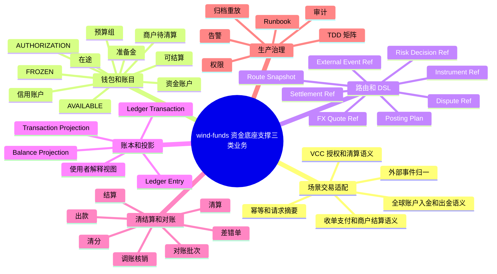
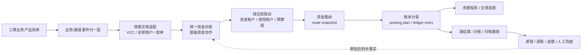

# wind-funds 支撑 VCC、全球账户收付款与收单业务评估

## 1. 背景、目标和结论摘要

### 1.1 背景

`wind-funds` 当前定位是支付资金底座，已经在 PRD、DSL、系分和 TDD 中把交易接入、资金账户、钱包余额、资金路由、账本分录、余额投影、交易投影、清结算、对账、归档重放和金融红线作为核心能力基线。

未来上层业务可能同时覆盖：

1. VCC 发卡业务。
2. 全球账户收付款。
3. 收单业务。

这三类业务都涉及真实资金、外部网络、合规规则、敏感数据、清结算和对账，但它们不是同一种产品。本文使用产品架构专家和资深架构师视角，评估 `wind-funds` 作为资金底座支撑三类业务的可行性、可用性、可扩展性、风险点和未来发展方向。

### 1.2 目标

| 目标 | 说明 |
| --- | --- |
| 业务模式定性 | 先判断 VCC、全球账户收付款、收单分别是什么业务，不把三者混成一个支付模板。 |
| 底座适配评估 | 判断哪些能力适合沉淀在 `wind-funds`，哪些必须留在上层业务、通道、银行、卡组织、PSP 或合规系统。 |
| 产品架构评估 | 从用户价值、能力地图、业务对象、状态、流程、规则矩阵、运营后台、指标、报表和验收角度评估。 |
| 系统架构评估 | 从系统边界、模块职责、接口契约、数据方案、一致性、补偿、对账、可靠性、安全、权限、审计、告警、发布和回滚角度评估。 |
| 演进建议 | 给出未来 capability pack、OpenSpec、TDD 和生产准入方向，避免一次性把资金底座扩成大而全支付平台。 |

### 1.3 非目标

1. 本文不替代 VCC 发卡 PRD、全球账户 PRD、收单 PRD、通道接入方案或外部协议设计。
2. 本文不替代法务、税务、财务、合规、审计、卡组织、银行、PSP、清算网络或持牌机构最终确认。
3. 本文不授权修改代码、数据库、公共 API、OpenSpec 或既有 PRD/DSL/系分/TDD 权威基线。
4. 本文不把 `wind-funds` 定义为完整发卡处理商、银行核心、支付网关、收单系统、商户入网系统、PCI 敏感数据系统或跨境外汇执行系统。

### 1.4 总体结论

`wind-funds` 可以作为三类业务共享的资金底座，但不应该承载三类业务的完整产品域。

推荐定位是：

```text
业务产品层外置
  -> 业务/通道/银行/卡组织事件归一
  -> 场景交易适配层保留各业务交易语义
  -> wind-funds 统一资金内核
  -> 钱包、账本、账目、资金路由、投影、清算、结算、对账、归档重放
```

需要特别区分的是：交易层能力不应被判断为完全通用。VCC、全球账户收付款和收单的交易对象、状态机、外部事件和异常路径差异很大；适合统一的是交易适配后的钱包、账本、账目、清算、结算、对账、投影和归档重放。

| 业务 | 统一资金内核支撑可行性 | 交易层通用性 | 端到端产品落地可行性 | 关键判断 |
| --- | --- | --- | --- |
| VCC 发卡业务 | 高 | 不完全通用 | 中 | VCC 的钱包、信用账户、预算组、账本、账目、授权占用、清算入账、退款、拒付、费用和对账适合进入统一资金内核；授权交易适配、卡片生命周期、PAN/CVC、发卡处理、卡组织报文和 PCI 边界必须外置或独立包化。 |
| 全球账户收付款 | 中高 | 不完全通用 | 中 | 多币种资金账户、账本、账目、在途、费用、结算、对账和投影适合进入统一资金内核；全球账户入金、出金、退汇、银行状态、VA、SWIFT/本地清算网络、FX 执行和跨境合规必须外置或独立包化。 |
| 收单业务 | 中高 | 不完全通用 | 中 | 商户待结算、清分、清算、结算、出款、退款、拒付、准备金、对账和归档适合统一设计、统一实现；payment attempt、capture、PSP 状态、商户入网、收银台、支付网关、通道协议、tokenization 和 PCI 数据边界必须外置或独立包化。 |

成功标准不是“三类业务都放进一个系统”，而是三类业务进入资金层后都能回答同一个资金问题：

```text
谁的钱，因什么业务事实，在什么主体和账户下，沿哪条资金路径，以什么规则入账，何时可用，谁承担风险，如何对账，如何被审计证明。
```

## 2. 三种业务模式顶层定性和分析

### 2.1 顶层定性

| 业务模式 | 本质定性 | 核心对象 | 资金复杂度 | 外部依赖复杂度 | `wind-funds` 适合承接的部分 |
| --- | --- | --- | --- | --- | --- |
| VCC 发卡业务 | 授权控制驱动的卡支付和企业支出管理业务。 | Program、企业客户、Funding Account、Credit Account、Budget Group、Cardholder、Virtual Card、Spend Control、Authorization、Clearing、Dispute。 | 授权成功不等于入账；预算、额度、现金、授权占用、费用、退款和拒付必须分开。 | 发卡银行、发卡处理商、卡组织、HSM、PCI、风控和卡规则。 | 资金账户、信用账户、预算组、授权生命周期、route snapshot、ledger entry、交易投影、对账和归档。 |
| 全球账户收付款 | 多法域、多币种、多银行轨道下的账户型收付和资金归集业务。 | 客户、全球账户、VA、本地银行账户、收款指令、付款指令、FX Quote、Nostro/Vostro 引用、银行流水、退汇。 | 币种、汇率、费用、在途、退汇、合规拦截和到账时效复杂。 | 银行、代理行、本地清算网络、SWIFT、本地 PSP、外汇和合规系统。 | 内部资金账户、多币种账本、入金/出金事实、在途、费用、对账差错、余额投影、交易投影。 |
| 收单业务 | 商户收款、清分、结算、出款和争议处理业务。 | Merchant、Payment Order、Payment Attempt、Capture、Refund、Clearing、Settlement、Payout、Reserve、Dispute、Chargeback。 | 支付成功、清算完成、商户可结算、出款成功、银行到账必须分开。 | PSP、收单行、卡组织、本地支付方式、商户入网、风控、PCI 和争议系统。 | 商户待清算/可结算账户、清分清算、结算出款、准备金、退款/拒付资金影响、对账和归档重放。 |

### 2.2 三类业务的共同底层问题

三类业务表面分别是卡、账户和收单，但资金底层共同问题一致：

1. 外部事件是否先被场景交易适配层归一，而不是直接塞进统一资金内核。
2. 资金主体是否能解析为内部可记账主体，而不是直接用卡、VA、银行账户、商户号或通道号入账。
3. 钱包、账本、账目、清算、结算和对账是否使用同一套资金语义。
4. 金额、币种、费用、税费、汇率、退款、拒付、退汇和调账是否有结构化拆分。
5. 授权、清算、结算、出款和到账是否分层表达。
6. 账本分录、余额投影、交易投影、清结算批次、对账批次和归档重放是否能互相证明。

### 2.3 三类业务的关键差异

| 维度 | VCC 发卡业务 | 全球账户收付款 | 收单业务 |
| --- | --- | --- | --- |
| 先发生的核心动作 | 授权请求和授权控制。 | 收款入账或付款指令。 | 支付订单或支付尝试。 |
| 资金状态主线 | 额度/预算/现金可用 -> 授权占用 -> 清算入账 -> 退款/拒付。 | 外部受理 -> 在途 -> 到账/退汇/合规拦截 -> 内部入账或出款。 | 支付成功 -> 清分 -> 清算 -> 可结算 -> 出款 -> 到账/退回。 |
| 风险主线 | 卡滥用、超额、延迟清算、争议、PAN/CVC 泄露。 | 跨境合规、AML、制裁、退汇、汇率和银行到账不确定。 | 商户风险、退款、拒付、保证金、结算前阻断和 PCI。 |
| 用户解释视角 | 为什么这张卡能刷或不能刷，授权占用和实际入账为何不同。 | 为什么款项在途、退汇、费用或汇率导致到账金额变化。 | 为什么订单成功但商户还不能提现，哪些金额被扣费、暂扣或争议。 |
| 主要红线 | 不保存完整 PAN/CVC，不把卡当账本主体，不把授权成功当消费完成。 | 不把外部银行账户当内部账本主体，不隐式换汇，不把外部受理当到账。 | 不触碰 PCI 敏感卡数据，不把通道成功当商户可结算，不绕过清账对账直接出款。 |

## 3. 业务目标、用户价值和能力地图

### 3.1 业务目标

`wind-funds` 支撑三类业务的业务目标是把三条不同上层业务线经过场景交易适配后的资金结果，统一落到同一套钱包、账本、账目、路由、清算、结算、对账和审计证据中。

用户价值包括：

1. 业务系统可以通过各自 capability pack 表达 VCC 授权、全球账户收付、收单支付等交易语义，再适配为底座可处理的资金动作。
2. 用户、商户、企业管理员、运营、财务、风控和合规可以看到可解释的余额、账单、批次和差错状态。
3. 财务和审计可以从任何一笔金额追溯到业务事实、外部引用、route snapshot、posting plan、ledger transaction、ledger entry、对账批次和归档证据。
4. 研发可以用稳定 DSL 和 TDD 矩阵扩展三类业务，而不是为每条业务线复制一套余额、流水、结算和对账逻辑。

成功指标：

| 指标 | 成功标准 |
| --- | --- |
| 资金可解释 | 任意余额变化都能追溯到资金事实、资金路由、账本分录和投影来源。 |
| 业务可扩展 | 新增 VCC、全球账户或收单 capability pack 时，不破坏已有钱包、账本、账目、清算、结算、对账和投影契约。 |
| 对账可闭环 | 外部文件、银行流水、卡组织或 PSP 结果与内部账本差异能形成差错单、处理动作、审批和核销。 |
| 风险可阻断 | 授权拒绝、错币种、缺快照、重复事件、外部非终态、无审批调账和敏感数据越界必须失败或隔离。 |
| 运营可用 | 运营后台能按业务、主体、币种、批次、外部引用、风险原因和账务影响定位问题。 |

### 3.2 能力地图



### 3.3 能力域分层

| 能力域 | 前台能力 | 后台能力 | 数据能力 | 是否属于 `wind-funds` |
| --- | --- | --- | --- | --- |
| 业务产品层 | 发卡、全球账户、收单、商户入网、收银台、付款申请。 | 业务订单、卡片管理、VA 管理、商户管理、通道管理。 | 业务单、卡片、VA、商户资料、外部协议数据。 | 否，外层系统负责。 |
| 事件归一层 | 接收外部授权、清算、银行流水、PSP 通知和争议事件。 | 通道回调处理、文件解析、状态映射、敏感数据隔离。 | 外部事件、原始报文摘要、外部 reference。 | 主要外置。 |
| 场景交易适配层 | VCC 授权、全球账户收付、收单支付和争议等场景交易语义。 | 场景状态机、幂等、请求摘要、外部引用、拒绝或异常原因。 | 业务交易事实、适配后的资金动作、外部 reference。 | 可由独立 capability pack 承接，不应假设完全通用。 |
| 钱包账本账目层 | 可用余额、冻结余额、授权占用、待清算、可结算、在途、准备金。 | 资金路由、posting plan、分录平衡、投影重建。 | 钱包账户、账目 bucket、账本交易、账本分录、余额投影。 | 是，应统一设计、统一实现。 |
| 清算结算对账层 | 商户结算、出款状态、差错解释、调账核销。 | 批次、规则版本、审批、对账任务、差错单、追偿。 | 清分批次、清算批次、结算单、出款单、对账批次。 | 是，应统一设计、统一实现，但仅表达内部清分、内部清算和资金运营闭环。 |
| 数据治理层 | 账单、报表、客服查询、审计导出。 | 归档、水位、重放、指标、权限和告警。 | 交易投影、归档清单、重放差异、指标口径。 | 是。 |

## 4. 领域对象、状态和业务流程

### 4.1 业务对象模型

| 对象类别 | VCC 发卡业务 | 全球账户收付款 | 收单业务 | 底座统一承接方式 |
| --- | --- | --- | --- | --- |
| 业务主体 | 企业客户、持卡人、Program。 | 客户、收款方、付款方、境内外主体。 | 商户、门店、平台、消费者。 | 解析为内部资金账户、信用账户、预算组或平台账户角色。 |
| 支付工具 | Virtual Card、token、掩码卡号。 | VA、银行账户、钱包、本地支付工具。 | 卡、APM、钱包、银行转账、本地支付方式。 | 只进入 `instrumentRef`、`externalAccountRef` 或上下文，不能作为账本主体。 |
| 外部事件 | Authorization、Clearing、Refund、Chargeback。 | Bank Credit、Bank Debit、Payout Status、Return、FX。 | Payment、Capture、Refund、Dispute、Payout、Settlement File。 | 上层归一后进入资金事实；底座不消费未解释原始报文。 |
| 账务主体 | Funding Account、Credit Account、Budget Group。 | 内部资金账户、币种账户、在途账户、差错账户。 | 商户待清算账户、可结算账户、准备金账户、平台手续费账户。 | 统一使用可记账主体和账目 bucket。 |
| 运营对象 | 授权拒绝、卡交易争议、账单。 | 在途、退汇、长短款、合规拦截。 | 清分批次、结算单、出款单、拒付、准备金。 | 处理单据是事实；通过补事实、冲正、调账或追偿影响资金。 |

### 4.2 状态和生命周期差异

| 生命周期 | 推荐状态主线 | 底座红线 |
| --- | --- | --- |
| VCC 授权生命周期 | `AUTHORIZED`、`DECLINED`、`REVERSED`、`EXPIRED`、`SETTLED`、`PARTIALLY_SETTLED`、`REFUNDED`、`DISPUTED`。 | 授权拒绝不得生成 route、posting、entry；清算、退款、拒付必须回指原授权或外部原消费引用。 |
| 全球账户入金生命周期 | `EXTERNAL_ACCEPTED`、`IN_TRANSIT`、`RECEIVED`、`MATCHED`、`POSTED`、`RETURNED`、`EXCEPTION`。 | 外部受理不等于到账；缺银行流水或合规证据不得直接确认为可用资金。 |
| 全球账户出金生命周期 | `REQUESTED`、`PRECHECKED`、`SUBMITTED`、`PROCESSING`、`PAID`、`RETURNED`、`FAILED`、`RECONCILED`。 | 外部提交不等于付款成功；失败、退汇、部分成功和长时间未达必须分开。 |
| 收单生命周期 | `PAYMENT_ACCEPTED`、`AUTHORIZED`、`CAPTURED`、`CLEARED`、`SETTLEABLE`、`PAYOUT_SUBMITTED`、`PAID`、`DISPUTED`、`CHARGEBACKED`。 | 支付成功不等于商户可结算；清算完成不等于出款到账；退款和拒付不能混用。 |

### 4.3 主流程



### 4.4 异常流程和人工兜底

| 异常 | 触发条件 | 判断逻辑 | 人工兜底 | 验收样例 |
| --- | --- | --- | --- | --- |
| 外部事件缺引用 | 缺原授权、原付款、原清算、原银行流水或原结算引用。 | 不允许按当前账户绑定重新选路。 | 进入差错单，补证据后通过补事实或调账处理。 | 重复回调、迟到清算、退汇缺原付款引用时不得落账。 |
| 金额或币种不一致 | 外部文件金额、币种、费用或 FX 与内部记录不一致。 | 差异必须分类为本金、费用、汇率、税费、调账或外部差错。 | 挂账、审批、补记、冲正或人工核销。 | 错币种不隐式换汇；金额差不得静默净额处理。 |
| 外部非终态 | PSP、银行或卡组织只返回受理、处理中、待清算。 | 用户可见状态、商户可用余额和财务确认状态分开。 | 超时告警、主动查询、补拉文件、人工确认。 | `SUBMITTED` 不展示为 `PAID`。 |
| 风控或合规阻断 | 高风险商户、制裁命中、资料缺失、争议、准备金不足。 | 不直接改历史账；阻断后续清算、出款或可用性。 | 风控复核、补资料、提高准备金、暂停结算。 | 商户出款前命中风险时结算单不出款。 |
| 重放或归档差异 | 余额投影、交易投影或报表投影与账本事实不一致。 | 以账本分录和归档清单为事实源重放。 | 生成差异报告，按批次修复投影。 | 重放不改变原交易事实或历史分录。 |

## 5. 规则矩阵、运营后台和数据口径

### 5.1 规则矩阵

| 规则域 | 触发条件 | 判断逻辑 | 优先级 | 版本和审计 |
| --- | --- | --- | --- | --- |
| 主体准入 | 三类业务提交资金事实前。 | 主体、租户、业务场景、币种、账户能力、资质状态必须匹配。 | P0 | 记录规则版本、操作者、外部规则核验状态。 |
| 授权控制 | VCC 或预授权类交易。 | Spend controls、预算、额度、余额、MCC、商户、地区、风控结果都通过后才能占用。 | P0 | 拒绝只记录拒绝事实，不生成账务分录。 |
| 入金确认 | 全球账户收款或收单入账。 | 外部到账、文件匹配、合规状态、币种和金额匹配后才能入可用或待清算。 | P0 | 保留银行流水、PSP 文件、匹配规则和处理人。 |
| 清算准入 | 收单、VCC clearing 或全球账户费用确认。 | 交易已过账、退款/争议/差错无阻断、清分规则已锁定。 | P1 | 批次号、规则版本、排除原因必须可查。 |
| 出款准入 | 商户结算、全球付款或内部调拨出款。 | 余额足够、风险未阻断、外部规则核验通过、幂等键唯一。 | P0 | 记录 preflight evidence，外部提交不等于付款成功。 |
| 对账差错 | 内部账本、外部文件、银行流水或报表不一致。 | 按单边、金额差、状态差、重复、迟到、费用差、汇率差分类。 | P0 | 差错单必须有责任方、处理动作、SLA 和核销凭证。 |
| 数据导出 | 运营、财务、审计或客服查询导出。 | 权限、最小必要、脱敏、审批和审计。 | P1 | 敏感字段访问记录不可缺失。 |

### 5.2 运营后台

| 使用者 | 运营后台能力 | 数据口径 |
| --- | --- | --- |
| 企业管理员 | VCC 卡交易、授权拒绝原因、预算占用、账单和退款。 | 不展示完整 PAN/CVC；授权占用、清算入账和退款分开。 |
| 全球账户客户 | 入金、出金、在途、退汇、费用、汇率、到账解释。 | 外部受理、处理中、到账、退汇和对账完成分开。 |
| 商户 | 订单款、退款、手续费、准备金、争议、可结算、出款状态。 | 支付成功、清算、可结算、出款、到账分开。 |
| 运营 | 差错单、挂账、重放任务、批次排除、人工补证据。 | 所有人工动作必须有审批、凭证、操作者和审计日志。 |
| 财务 | 清分批次、清算批次、结算单、出款回单、总分核对。 | 以账本事实和外部文件为依据，不以页面状态反推账务。 |
| 风控/合规 | 风险阻断、名单命中、争议、准备金、外部规则核验。 | 规则版本、核验时间、确认方和待确认项必须可查。 |

### 5.3 指标、报表和数据能力

| 数据能力 | 指标或报表 | 用途 |
| --- | --- | --- |
| VCC 报表 | 发卡量、授权通过率、拒绝原因、授权占用、清算金额、退款、拒付、费用。 | 企业支出管理、风控、客服和财务核对。 |
| 全球账户报表 | 入金量、出金量、在途金额、退汇率、费用、FX 差异、到账时效、对账差异。 | 跨境资金运营、银行对账、客户解释。 |
| 收单报表 | 支付成功率、清分金额、可结算金额、出款金额、准备金、退款率、拒付率。 | 商户运营、清结算、风险管理。 |
| 账务报表 | 主体余额、账目余额、分录明细、总分核对、长短款、调账核销。 | 财务确认、审计和重放验证。 |
| 生产指标 | 核心接口成功率、P95/P99、批处理耗时、对账差异数、重放差异数、告警数。 | SLO、容量评估、发布和回滚决策。 |

## 6. 可行性评估

### 6.1 总体可行性

| 维度 | 评估 | 说明 |
| --- | --- | --- |
| 产品定位 | 可行 | 现有定位已经声明不是单一 VCC、ACH、收单、全球付款或钱包产品，适合作为共享资金底座。 |
| 领域模型 | 基本可行 | 钱包、账本、账目、route snapshot、posting plan、账本分录、投影、清算、结算和对账能覆盖三类业务的共同资金语义；交易层需要按业务场景适配。 |
| 工程边界 | 可行但需守边界 | `core` 承载 DSL 和契约，`wallet` 承接钱包和账户，`ledger` 承接账本和账目，清算结算对账承接资金运营闭环；三类业务交易适配不应污染统一内核。 |
| 生产交付 | 部分可行 | 底座主链路可逐步交付；三类业务的外部协议、敏感数据、合规规则、银行/卡组织/PSP 文件处理需要独立生产准入。 |
| 合规与金融红线 | 需要强确认 | 真实资金、跨境、卡组织、收单、备付金、外汇、PCI 和客户资金均需要法务、合规、财务和合作机构确认。 |

### 6.2 分业务可行性

| 业务 | 可行能力 | 当前基础 | 主要缺口 | 建议结论 |
| --- | --- | --- | --- | --- |
| VCC 发卡业务 | 授权占用、额度/预算/资金账户分录、账目变化、清算入账、退款、拒付承接、投影和对账。 | DSL 已明确 VCC 信息只作为 `instrumentRef`、`merchantInfo` 或上下文；账务主体只能是内部资金账户、信用账户或预算组。 | VCC 交易适配层、Program/Card/Cardholder 生命周期、发卡处理商适配、卡组织清算文件、PAN/CVC/PCI、stand-in/SAF、卡账单和争议证据链。 | 适合作为 VCC 统一资金内核，不适合作为完整发卡处理系统；交易层不完全通用。 |
| 全球账户收付款 | 内部多币种账户、钱包余额、账本、账目、在途、费用、退汇资金影响、结算、对账和余额投影。 | 资金账户、账本、清算结算、对账、出款前置检查和归档重放可复用。 | 全球账户交易适配层、VA/银行账户模型、跨境消息网络、Nostro/Vostro 引用、FX Quote/Rate、合规拦截、退汇原因码和银行文件适配。 | 适合作为内部账户和资金内核；全球银行网络、FX 执行和收付交易语义需外置或独立包化。 |
| 收单业务 | 商户待清算、清分、清算、结算、出款、退款资金影响、拒付、准备金、对账和归档。 | 已有清结算与对账设计，并已有收单业务专项设计输入。 | 收单交易适配层、Payment Order/Attempt、Capture、PSP 事件、商户入网、PCI、tokenization、风控评分、争议运营和商户结算账单细节。 | 适合作为收单统一资金内核；支付网关、交易层、商户运营和敏感卡数据必须外置或独立包化。 |

## 7. 可用性评估

### 7.1 对业务接入方的可用性

| 需求 | 当前适配度 | 需要补强 |
| --- | --- | --- |
| 统一内核资金语义 | 高 | 增加三类业务交易适配指南，明确哪些留在场景交易层，哪些进入钱包、账本、账目、清算、结算和对账。 |
| 幂等和重放 | 高 | 对 VCC clearing、银行流水、PSP 回调、出款回单建立业务幂等键规范。 |
| 错误解释 | 中高 | 面向调用方返回稳定错误码、拒绝原因、外部非终态说明和人工处理入口。 |
| 查询视图 | 中 | 需要按 VCC、全球账户、收单分别定义使用者解释视图，避免只暴露底层账本语言。 |
| 外部状态映射 | 中 | 需要为卡组织、银行、PSP、本地支付方式建立状态映射矩阵和兼容策略。 |

### 7.2 对运营、财务和风控的可用性

| 使用者 | 可用性要求 | 设计建议 |
| --- | --- | --- |
| 运营 | 能定位单笔、批次、差错、阻断原因和处理动作。 | 建立统一单笔资金链路查询：业务单 -> 外部引用 -> 资金交易 -> route -> 分录 -> 投影 -> 批次 -> 差错。 |
| 财务 | 能确认账务事实、总分核对、出款回单和会计期间。 | 增强账务报表、清算批次、结算单和银行/通道资金对账之间的引用。 |
| 风控 | 能在交易前、清算前、出款前和争议后施加阻断。 | 资金底座只接收风控决策引用和规则版本；风控模型与策略系统外置。 |
| 合规 | 能看到外部规则核验状态、确认方、证据和待确认项。 | 高风险动作必须保留核验时间、核验结果、确认人、凭证和过期时间。 |
| 客服 | 能解释用户或商户看到的金额为何变化。 | 交易投影需要保存用户可理解的原因、来源、金额拆分和下一步处理状态。 |

## 8. 可扩展性评估

### 8.1 推荐扩展方式

推荐采用“一套统一资金内核 + 三类场景交易 capability pack”的方式扩展。

```text
unified funds core
  - wallet account
  - ledger account / ledger subject
  - ledger bucket / account code
  - route snapshot
  - posting plan
  - ledger transaction / entry
  - balance projection / transaction projection
  - clearing / settlement / reconciliation
  - archive / replay / governance

scenario transaction capability packs
  - vcc transaction adapter pack
  - global account transaction adapter pack
  - acquiring transaction adapter pack
```

### 8.2 应抽象为底座扩展点的对象

| 扩展点 | 作用 | 适用业务 |
| --- | --- | --- |
| `InstrumentRef` | 承接卡、token、VA、银行账户、本地支付工具等外部工具引用。 | VCC、全球账户、收单。 |
| `ExternalEventRef` | 承接卡组织、银行、PSP、通道文件、回调和人工凭证引用。 | VCC、全球账户、收单。 |
| `SettlementRef` | 承接清算文件、结算批次、商户账单、银行回单或外部结算引用。 | 全球账户、收单、VCC clearing。 |
| `DisputeRef` | 承接争议、拒付、retrieval、chargeback、representment 和证据包引用。 | VCC、收单。 |
| `FXQuoteRef` | 承接汇率报价、汇率来源、锁汇状态、清算汇率和记账汇率。 | 全球账户、跨境 VCC、跨境收单。 |
| `RiskDecisionRef` | 承接风控、合规、名单、商户风险、准备金和出款阻断决策。 | VCC、全球账户、收单。 |
| `RuleSnapshot` | 固化费率、清分、结算、风控、额度、退款和调账规则版本。 | VCC、全球账户、收单。 |

### 8.3 不应抽象进底座的对象

| 对象 | 不进入底座的原因 |
| --- | --- |
| 完整 PAN、CVV、卡密钥、HSM 会话 | PCI 和密钥安全边界，不应进入普通资金底座。 |
| 卡片生命周期和卡生产资料 | 属于发卡产品和处理商域，不是资金账本事实。 |
| 商户入网、KYB、MCC 审核、网站审核 | 属于商户运营和风控域，底座只消费结果。 |
| 收银台、SDK、前端支付组件 | 属于支付接入和用户体验域，不是资金事实源。 |
| 银行协议报文、SWIFT 原始报文、本地清算文件原文 | 属于通道适配和合规归档边界；底座只保留摘要、引用和归一后字段。 |
| FX 执行和报价系统 | 属于外汇交易和合作机构能力；底座只承接可核验报价、汇率结果和账务影响。 |

### 8.4 架构取舍

| 方案 | 优点 | 缺点 | 建议 |
| --- | --- | --- | --- |
| 把三类业务都做进 `wind-funds` | 接入路径短，概念集中。 | 边界膨胀，合规、PCI、银行协议、商户运营和卡生命周期污染资金底座。 | 不推荐。 |
| `wind-funds` 只做纯账本 | 边界极窄，资金安全高。 | 上层业务重复建设交易、余额、路由、清结算和对账。 | 不推荐。 |
| 统一资金内核 + 场景交易 capability pack + 外部适配层 | 钱包、账本、账目、清算、结算、对账可统一实现，交易差异留在场景适配层。 | 需要更严格的契约、TDD 和准入治理；交易层不能假装完全通用。 | 推荐。 |

## 9. 系统架构可落地性评估

### 9.1 核心决策、职责边界和影响范围

核心决策：

1. `wind-funds` 的统一资金内核只接收场景交易适配后的资金动作，不直接消费未归一的卡组织、银行、PSP 或本地清算原始事件。
2. 外部账户、卡、VA、商户号、通道账户和银行账户只做引用或对账来源，不作为内部账本主体。
3. 所有金额变化必须通过资金交易、资金路由、账务计划和账本分录表达，不能由运营、投影、报表或对账任务直接改余额。
4. VCC、全球账户、收单以场景交易 capability pack 扩展 DSL、TDD、OpenSpec 和运营视图，不直接打破统一资金内核边界。

影响范围：

| 模块 | 影响判断 |
| --- | --- |
| `core` | 可新增或扩展通用引用、枚举、值对象和 DSL 契约，但必须保持业务无关。 |
| `transaction-face` / `transaction-impl` | 可承接底座资金动作、授权资金动作、幂等和请求摘要；不应被误用为三类业务完全通用交易层。 |
| `ledger-face` / `ledger-impl` | 可统一承接账本交易、账目、分录、余额投影和账务巡检，不承接业务产品状态。 |
| `wallet-face` / `wallet-impl` | 可统一承接钱包账户、余额桶、信用账户、预算组和产品门面，不承接卡片、VA、商户入网或网关协议。 |
| `tests` | 需要新增三类业务 capability pack 的契约测试、服务流测试、对账/清结算测试和红线测试。 |
| `docs` / `openspec` | 进入编码前必须把正式批次同步到 PRD、DSL、系分、TDD 和 OpenSpec。 |

### 9.2 接口契约、入参、出参、错误码和兼容

进入编码前，建议先定义三类业务的场景交易适配契约，以及适配后进入统一资金内核的资金动作契约，而不是直接新增大而全业务 API。

| 契约方向 | 入参要求 | 出参要求 | 错误码要求 | 兼容要求 |
| --- | --- | --- | --- | --- |
| VCC 授权/清算事实 | 租户、业务场景、业务流水、金额、币种、内部账务主体、外部授权引用、工具快照、规则版本。 | 资金交易号、状态、拒绝原因、route snapshot、剩余授权金额。 | 授权拒绝、额度不足、预算不足、缺原授权、重复清算、敏感数据越界。 | 不保存完整 PAN/CVV；新增字段应为可选或版本化。 |
| 全球账户入金/出金事实 | 外部银行流水、VA 引用、付款/收款主体、金额、币种、费用、FX 引用、合规状态。 | 资金交易号、在途状态、入账状态、出款状态、对账引用。 | 外部非终态、错币种、缺到账证据、FX 过期、合规阻断、退汇。 | 外部状态映射必须版本化；不能把处理中改义为成功。 |
| 收单清分/结算事实 | 商户、支付尝试、capture/refund/dispute 引用、金额拆分、费率规则、清算批次。 | 清分结果、清算批次、结算单、出款单、阻断原因。 | 重复入批、结算净额不平、准备金不足、争议阻断、通道文件缺失。 | 支付订单和资金交易解耦；对账文件适配外置。 |

幂等键建议：

| 场景 | 幂等键 |
| --- | --- |
| VCC 授权 | 业务场景 + 外部授权流水 + 请求摘要。 |
| VCC 清算 | 原授权引用 + clearing/presentment 引用 + 金额序号。 |
| 全球入金 | 银行流水号或 VA 流水 + 交易日 + 金额 + 币种 + 来源机构。 |
| 全球出金 | 付款指令号 + 外部提交流水 + 请求摘要。 |
| 收单支付/退款 | payment attempt/capture/refund/dispute 外部引用 + 请求摘要。 |
| 结算出款 | 结算单号 + 出款批次 + 外部提交流水。 |

### 9.3 数据方案、事务边界、一致性、补偿和对账

数据方案：

1. 内部资金事实、route snapshot、posting plan、ledger transaction、ledger entry 是底座事实链。
2. 外部事件原文不默认进入底座；底座保存最小必要摘要、引用、归一字段、规则版本和审计上下文。
3. 多币种和 FX 不得隐式换算；需要明确交易币种、清算币种、结算币种、记账币种、汇率来源和确认状态。
4. 对账差错、挂账、调账、核销和追偿必须作为独立处理事实，不修改历史分录。

事务边界：

| 边界 | 必须本地一致 | 可最终一致 |
| --- | --- | --- |
| 底座资金动作写入 | 幂等记录、适配后的资金动作、生命周期状态、route snapshot、posting plan、ledger entry。 | 投影刷新、指标、报表、归档。 |
| 授权占用 | 授权状态、占用分录、剩余金额、拒绝事实。 | 外部通知、客服视图、报表聚合。 |
| 清结算批次 | 批次锁定、明细归属、净额校验、账务影响。 | 出款外部回单、银行到账确认。 |
| 对账差错 | 差错单、责任方、处理状态、审计。 | 后续补记、调账、追偿和报表刷新。 |

一致性和补偿要求：

1. 所有写入路径必须有幂等键、唯一约束、状态机守卫和重复请求稳定结果。
2. 外部回调、文件、MQ 和批任务必须支持重复、乱序、迟到、补拉和重放。
3. 资金写入失败不能依赖“最终一致”兜底，核心不变量必须在本地事务保护。
4. 补偿动作必须可审计、可重跑、可前滚，不能依赖人工直接改库。
5. 对账不是唯一一致性保障，而是发现外部差异和修复投影、批次、外部引用的必要观察面。

### 9.4 可靠性、安全、权限、审计和告警

| 维度 | 生产要求 |
| --- | --- |
| 可靠性 | 外部依赖必须有超时、重试上限、退避、熔断、限流、降级和人工兜底；重试必须绑定幂等键。 |
| 安全 | PAN/CVV、银行账号、身份资料、制裁筛查结果、风控证据和导出文件必须最小化、脱敏、加密和审计。 |
| 权限 | 高危操作按角色、租户、主体、金额、币种、批次和操作类型授权；导出和人工调账必须审批。 |
| 审计 | 所有资金事实、规则版本、外部规则核验状态、人工动作、导出、补证据和调账核销必须留痕。 |
| 告警 | 授权拒绝异常升高、外部回调积压、批次失败、对账差异、出款失败、重放差异、敏感访问异常都要告警。 |
| Runbook | 每类故障必须说明现象、影响、定位、止血、恢复、回滚、验收和复盘材料。 |

### 9.5 验证方案、测试、静态检查、压测和回归

进入编码前建议新增三类业务 TDD 能力矩阵：

| 业务 | 必测场景 |
| --- | --- |
| VCC | 授权批准、授权拒绝、余额不足、预算不足、spend controls 拒绝、部分清算、超额清算失败、撤销释放、过期释放、延迟清算、退款、拒付、重复清算、缺原授权、PAN/CVV 越界。 |
| 全球账户 | 入金匹配、入金未匹配、错币种、费用拆分、FX 过期、合规阻断、出金提交、付款失败、退汇、重复银行流水、长时间在途、银行文件迟到、对账差异和挂账核销。 |
| 收单 | 支付成功、capture、退款、部分退款、清分入批、重复入批、清算阻断、准备金扣留、结算净额不平、出款失败、拒付扣回、追偿、商户负余额、通道文件差异。 |

验证命令建议在正式编码批次中按影响范围选择：

1. 文档和规格变更：产品交付物检查、架构交付物检查、`git diff --check`。
2. DSL 或契约变更：编译、契约测试、边界测试。
3. 资金交易变更：交易服务测试、账本测试、业务流测试、PMD。
4. 清结算或对账变更：清结算对账测试、归档重放测试、幂等和重跑测试。
5. 完整 CAD 准入：`just verify-cad`。

### 9.6 发布、灰度、回滚、风险和待确认

三类业务进入生产时必须拆批发布：

| 批次 | 发布建议 | 灰度 | 回滚 |
| --- | --- | --- | --- |
| P0 设计准入 | 只补 PRD、DSL、系分、TDD、OpenSpec 和任务基线。 | 不涉及运行时。 | 文档回滚或修订。 |
| P1 通用引用和 DSL | 新增通用外部引用、规则快照、错误码和测试。 | 默认不开启业务入口。 | 兼容保留旧契约，禁用新入口。 |
| P2 单业务 capability pack | 先选一个业务模式，建议从边界最清楚的 VCC 或收单资金链路开始。 | 按租户、业务场景、币种、通道灰度。 | 关闭入口、暂停批次、保留已生成事实并通过补偿处理。 |
| P3 三业务统一运营视图 | 查询、报表、对账、归档重放和告警。 | 只读灰度。 | 回退旧查询或隐藏新视图。 |

待确认项：

1. VCC 的实际资金模式是 credit、debit、prepaid、charge card、commercial card 还是一次性 token。
2. 全球账户是否涉及真实跨境支付、外汇执行、客户资金归集、备付金或监管报送。
3. 收单业务是自营收单、PSP 代理、外部收单事件接入，还是只做商户资金结算承接。
4. 三类业务的主体资质、合同边界、法域、币种、清算周期、对账文件、争议责任和外部规则确认方。
5. 哪些能力由 `wind-funds` 提供公共契约，哪些由上层产品系统、通道适配层、风控系统、财务系统或数据平台提供。

## 10. 风险点和金融红线

### 10.1 产品语义风险

| 风险 | 后果 | 控制建议 |
| --- | --- | --- |
| 把三类业务混成一个支付模板 | 状态、资金归属、清结算和对账口径混乱。 | 以 capability pack 分别定义业务语义，底座只统一资金事实。 |
| 把外部账户或卡当账本主体 | 分录无法解释，审计和对账失真。 | 外部对象只作为引用；内部账务主体必须是资金账户、信用账户、预算组或平台账户角色。 |
| 把授权成功当最终消费 | VCC、预授权和收单 capture 资金状态错误。 | 授权、清算、结算、出款、到账分层建模。 |
| 把外部受理当到账 | 全球出金或收单出款对用户/商户误导。 | `SUBMITTED`、`PROCESSING`、`PAID`、`RETURNED` 分开。 |

### 10.2 资金安全风险

| 风险 | 后果 | 控制建议 |
| --- | --- | --- |
| 重复回调或文件重复入账 | 重复扣款、重复出款或重复清算。 | 幂等键、唯一约束、状态守卫、对账差异告警。 |
| 错币种或隐式换汇 | 金额错误、财务核算错误、合规风险。 | 交易币种、清算币种、结算币种、记账币种和 FX 引用显式化。 |
| 运营直接改余额 | 历史分录和报表不可追溯。 | 只能通过补事实、冲正、调账、追偿进入资金链。 |
| 清账未完成直接结算 | 漏扣、漏退、漏争议或商户多付。 | 先清账对账，再结算出款。 |

### 10.3 合规和金融红线

| 红线 | 说明 |
| --- | --- |
| 不得表达持牌清算业务 | `wind-funds` 的清算默认是平台内部明细确认和账务转换，不是清算机构业务。 |
| 不得替代外汇和跨境合规确认 | 跨境支付、FX、Nostro/Vostro、代理行和本地清算必须由合规、财务和合作机构确认。 |
| 不得扩大 PCI 范围 | 完整 PAN、CVV、卡密钥、敏感认证数据不得进入普通资金底座。 |
| 不得绕过 KYC/KYB/AML/制裁筛查 | 底座只消费合规结果和证据引用，不替代最终合规判断。 |
| 不得混淆客户资金、商户待结算资金和平台自有资金 | 每类资金必须有独立主体、账目、余额桶、规则和对账来源。 |

## 11. 未来发展方向

### 11.1 推荐演进路线

| 阶段 | 目标 | 交付物 |
| --- | --- | --- |
| Phase 0：设计准入 | 冻结“资金底座不做完整业务产品”的边界。 | 本评估、三类业务顶层定性、待确认清单。 |
| Phase 1：统一资金内核扩展 | 补齐钱包、账本、账目、清算、结算、对账共享引用、错误码、规则快照、外部证据和 TDD 矩阵。 | PRD/DSL/系分/TDD/OpenSpec 同步变更。 |
| Phase 2：单业务交易适配 capability pack | 选择一个业务先做可验证闭环，建议优先 VCC 授权资金链或收单清结算资金链。 | 独立 OpenSpec change、Execution Grant、RED 测试、最小代码实现。 |
| Phase 3：多业务统一运营面 | 统一单笔链路查询、对账差错、批次、归档重放和告警。 | 运营后台、报表、Runbook、权限审计。 |
| Phase 4：全球化和高风险能力 | 多币种、FX、跨境、外部规则核验、容量压测和生产演练。 | 多法域合规确认、外部文件适配、SLO、灰度和回滚方案。 |

### 11.2 建议优先级

| 优先级 | 建议 | 原因 |
| --- | --- | --- |
| P0 | 保持资金底座定位，三类业务产品域外置。 | 防止系统边界失控。 |
| P0 | 建立 `ExternalEventRef`、`InstrumentRef`、`RuleSnapshot`、`RiskDecisionRef` 等通用引用模型。 | 让三类业务交易适配层都能携带外部证据，又不污染账本主体。 |
| P0 | 补统一资金内核 TDD 矩阵和三类业务交易适配红线用例。 | 钱包、账本、账目、清算、结算、对账必须先可验证。 |
| P1 | VCC 授权交易适配 capability pack。 | 现有 DSL 已有授权生命周期和 VCC 承接口径，最容易形成闭环。 |
| P1 | 收单清结算 capability pack。 | 已有收单业务专项设计和清结算对账设计，可优先沉淀统一清算、结算、对账内核。 |
| P2 | 全球账户多币种和 FX capability pack。 | 复杂度和合规依赖更高，需要先确认业务模式和合作机构。 |
| P2 | 统一运营解释视图。 | 提升可用性和客服、财务、风控协作效率。 |

## 12. 编码准入建议

在没有进一步业务模式确认前，不建议直接编码三类业务。

建议编码准入条件：

1. 明确本轮只做哪个业务 capability pack，不做三类业务一次性大包。
2. 明确本轮是否允许修改公共契约、枚举、请求模型、状态机、表结构和测试基类。
3. PRD、DSL、系分、TDD、OpenSpec 和任务基线已经同步。
4. TDD 红线用例已经列出，并能先写失败测试。
5. 外部规则核验状态、确认方、待确认项和非目标已经在文档中显式表达。
6. 验证方案已经明确，包括编译、目标测试、边界测试、PMD 或 `verify-cad` 的适用范围。

当前本文只作为设计评估和后续任务输入，不作为编码授权。
