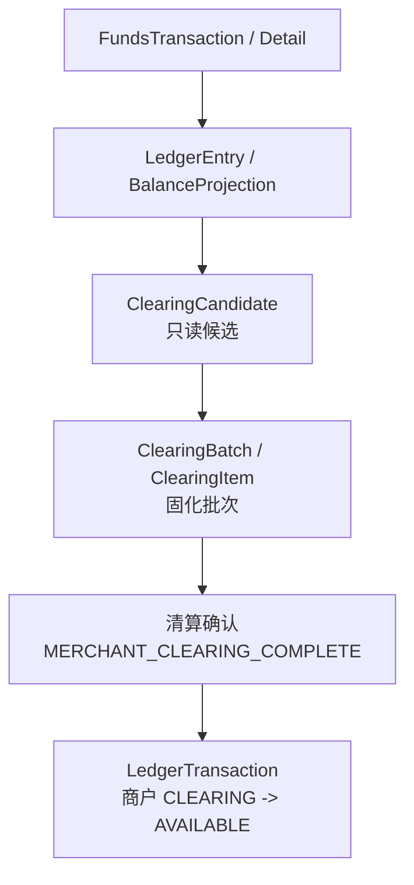
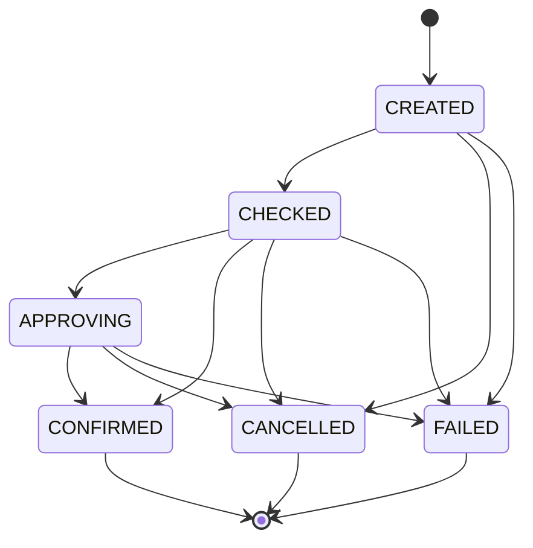

# Design: P1 Clearing Batch

## Context

清算批次是商户待清算余额从 `CLEARING` 进入 `AVAILABLE` 的产品事实。它承接已经成功入账的交易、退款、费用、争议和风控结果，但不替代交易层或账本事实。



本 change 只把清算批次的实现边界准备到可评审状态；不直接编码，不新增 DDL。

## Product Semantics

| 对象 | 职责 | 入账边界 |
| --- | --- | --- |
| `ClearingCandidate` | 描述某主体、币种、账期、策略版本下的可清算明细、排除明细和原因。 | 不入账。 |
| `ClearingBatch` | 固化一组候选结果、金额构成、状态、策略快照和审批引用。 | 确认时入账。 |
| `ClearingItem` | 批次内单条可清算明细，追溯交易明细、账本分录、退款、费用或争议扣减。 | 随批次确认标记已清算。 |

产品语义红线：

1. `ClearingCandidate` 是计算结果和候选版本，不是资金事实。
2. `ClearingBatch` 是内部清算批次，不是外部清算机构批次。
3. 清算确认只表达商户待清算资金可用化，即 `CLEARING -> AVAILABLE`。
4. 若规则错误、文件延迟或人工审核发现问题，必须创建新版本、反向调整或补差批次，不覆盖历史批次金额。
5. 清算批次不处理结算锁定、出款成功、出款失败回退、对账差错调账和报表发布。

## State Machine



| 状态 | 说明 |
| --- | --- |
| `CREATED` | 候选结果已固化，尚未完成金额校验。 |
| `CHECKED` | 金额公式、重复候选、排除原因、策略版本和阻断规则校验通过。 |
| `APPROVING` | 命中人工审批规则，等待审批。 |
| `CONFIRMED` | 已完成清算确认入账，批次和明细不可覆盖。 |
| `CANCELLED` | 未入账前取消。 |
| `FAILED` | 候选、校验或确认失败，保留失败原因。 |

规则：

1. `CONFIRMED`、`CANCELLED`、`FAILED` 为终态。
2. 只有 `CHECKED` 或已审批通过的 `APPROVING` 可以确认。
3. `CONFIRMED` 批次不得再次确认；同一幂等键重试只返回原确认结果，不重复入账。
4. 已确认批次不得修改金额、币种、主体、策略版本或候选版本。

## Candidate Selection

候选生成输入：

| 输入 | 要求 |
| --- | --- |
| 主体 | `settlementSubjectType`、`settlementSubjectId` 必须明确。 |
| 币种 | 同一候选版本只能单币种。 |
| 账期 | 由 `SettlementPolicySpec` 表达式、时区、基准时间和账期窗口计算。 |
| 策略快照 | 保存 `policyCode`、`policyExpression`、`policyVersion`。 |
| 数据源版本 | 保存交易、账本、退款、费用、争议、风险和对账阻断的数据源版本或查询窗口。 |

候选幂等键：

```text
tenantId
settlementSubjectType
settlementSubjectId
currency
settlementPeriod
policyCode
policyVersion
candidateVersion
dataSourceVersion
```

排除原因必须可审计：

| reasonCode | 语义 |
| --- | --- |
| `ALREADY_CLEARED` | 明细已进入确认批次。 |
| `NOT_IN_CLEARING_BUCKET` | 账本余额或分录不在 `CLEARING` 口径。 |
| `REFUND_OR_REVERSAL_PENDING` | 退款、撤销或拒付影响未闭合。 |
| `FEE_OR_RESERVE_PENDING` | 费用、准备金或暂扣未确认。 |
| `RECONCILIATION_BLOCKED` | 命中高风险对账差错阻断。 |
| `RISK_HOLD` | 商户、交易或主体命中风险暂缓。 |
| `POLICY_NOT_MATCHED` | 不满足策略窗口、起结金额或主体规则。 |

## Confirmation Transaction

未来实现时，清算确认的事务边界应为：

```text
load ClearingBatch
  -> assert batch status and approval result
  -> assert idempotency key
  -> assert no blocking reconciliation exception
  -> assert every item is not cleared by confirmed batch
  -> build funds instruction with sourceFactRef = CLEARING_BATCH
  -> route MERCHANT_CLEARING_COMPLETE
  -> post LedgerTransaction(CLEARING -> AVAILABLE)
  -> save ledgerTransactionSn on batch and items
  -> mark batch CONFIRMED
  -> mark items cleared
  -> commit
```

资金不变量：

1. 入账金额等于批次确认净额。
2. 借贷或余额变化必须平衡，且只在同一商户主体内 `CLEARING -> AVAILABLE`。
3. 单条 `ClearingItem` 最多关联一个已确认批次。
4. 确认失败不得把批次标记为 `CONFIRMED`。
5. Ledger 幂等命中不得造成二次余额投影。

## Transaction Layer Boundary

未来清算确认进入交易层时：

1. `businessScene/businessSn` 表达上游清算确认动作身份。
2. `sourceFactRef` 表达资金域来源事实，类型必须为 `CLEARING_BATCH`。
3. `sourceFactRef.factSn` 使用 `clearingBatchSn`。
4. `sourceFactRef.factVersion` 使用批次版本。
5. 不恢复无边界的 `sourceObjectType/sourceObjectSn` 字段。
6. 不把 `ClearingCandidate` 作为入账来源事实。

## Test Matrix

后续实现前，先落 `MerchantClearingBatchServiceTests`：

| 场景 | 断言 |
| --- | --- |
| 候选生成幂等 | 同一主体、币种、账期、策略版本、候选版本和数据源版本重复生成返回同一候选版本，不重复写候选明细。 |
| 已清算明细排除 | 已进入 `CONFIRMED` 批次的明细再次候选时标记 `ALREADY_CLEARED`，不得进入可确认金额。 |
| 对账阻断排除 | 命中高风险未解决差错的明细标记 `RECONCILIATION_BLOCKED`，批次不得确认。 |
| 策略快照保存 | 候选、批次和明细保存 `policyCode`、`policyExpression`、`policyVersion`。 |
| 清算确认入账 | 批次确认后生成 `MERCHANT_CLEARING_COMPLETE`，商户 `CLEARING` 减少、`AVAILABLE` 增加，金额平衡。 |
| 确认幂等 | 相同幂等键重复确认返回同一确认结果和账本交易引用，不重复入账。 |
| 重复确认拒绝 | 不同幂等键或不同确认请求再次确认同一终态批次失败，不生成新账本交易。 |
| 确认失败原子性 | 入账失败时批次不进入 `CONFIRMED`，明细不标记 cleared。 |
| 重跑版本 | 数据源或规则变化时创建新候选版本；历史已确认批次不被覆盖。 |

## Harness Manual Approval Gate

后续任一动作必须停在人工审批：

1. 新增或修改清算候选、批次、明细 DDL。
2. 实现清算确认入账路径。
3. 实现批次重跑补差、反向调整或历史清算修复。
4. 引入外部文件、通道、银行、清算机构或生产调度。

审批材料至少包含：

| 材料 | 要求 |
| --- | --- |
| 范围 | 对象、表、状态机、route event、非目标。 |
| 资金影响 | 主体、币种、余额桶、金额公式、幂等键。 |
| 数据影响 | DDL、唯一约束、迁移、回滚、历史数据处理。 |
| 审计权限 | 操作者、审批、原因、批次版本、规则版本、证据引用。 |
| 验证证据 | 失败用例、聚焦测试、编译、静态检查或无法执行原因。 |

## CAD Boundary

当前 change 的 CAD 自动推进只允许修改 OpenSpec 和设计材料。即使用户继续说“继续”，在未确认具体 P1 Execution Grant 前，也不得自动进入：

1. Java 实现。
2. DDL 或测试 schema。
3. 真实清算确认入账。
4. 外部通道、银行、清算机构或 Harness pipeline。
