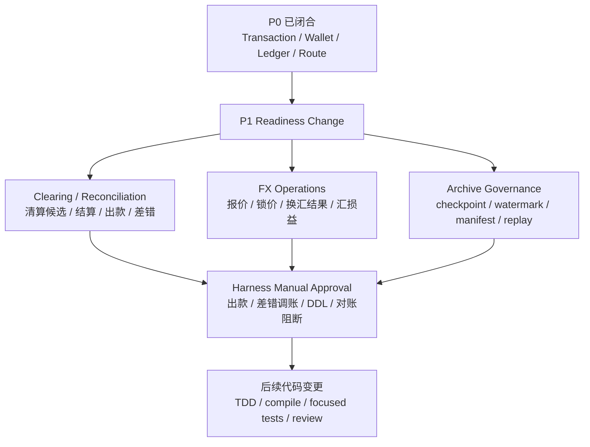

# Design: P1 Readiness and Manual Approval Gates

## Architecture

## Readiness Principles

1. **先独立对象，再入账动作**：清算批次、结算单、出款单、对账差错、FX 报价、归档清单等必须先有对象、状态机和审计，再设计入账。
2. **先审批边界，再自动化**：出款、差错调账、归档、余额重建、FX execution 和 DDL 不进入无审批自动推进。
3. **先来源事实，再资金指令**：P1 来源事实必须能表达清算批次、结算单、出款单、对账差错、FX execution 和归档任务，不复用业务流水伪装资金事实。
4. **先只读/影子，再正式写入**：交易视图重放、报表重算、余额重建和指标治理必须先支持 verify-only 或 shadow 模式。
5. **先合规待确认，再能力开放**：跨境、备付金、外汇、客户资金、商户待结算资金相关能力不得写成合规结论。

## Workstream A: Clearing and Reconciliation

### Scope

| 能力 | P1 准入对象 | 关键红线 |
| --- | --- | --- |
| 清算候选 | `ClearingCandidate`、候选版本、排除原因 | 候选生成不入账，不重复纳入已清算明细。 |
| 清算确认 | `ClearingBatch`、`ClearingItem` | 已确认批次不得覆盖金额，只能反向或补差。 |
| 结算锁定 | `SettlementOrder`、`SettlementLine` | 外部出款前必须 `AVAILABLE -> SETTLEMENT`。 |
| 出款结果 | `PayoutOrder`、回单快照 | 外部受理不等于成功，金额/币种/账户不匹配进入差错。 |
| 对账差错 | `ReconciliationBatch`、`ReconciliationException` | 差错不直接改历史 entry 或余额。 |
| 报表边界 | `ReportSnapshot`、口径版本 | 报表只读，不反写账本、钱包或清结算事实。 |

### Manual Approval Triggers

1. 新增或修改清结算、对账、出款相关 DDL。
2. 结算锁定、出款成功、失败回退、差错调账或挂账认领产生账务变化。
3. 对账阻断规则影响自动清算、结算或出款。
4. 报表重算影响已发布财务或商户报表。

### Future Change Split

| 未来 change | 范围 | 来源事实 | 先行测试 | 审批门禁 |
| --- | --- | --- | --- | --- |
| `p1-clearing-batch` | `ClearingCandidate`、`ClearingBatch`、`ClearingItem`、候选版本和排除原因。 | `CLEARING_BATCH`，字段至少包含 batchSn、version、policyCode、policyVersion、operator、approvalRef。 | `MerchantClearingBatchServiceTests`、重复清算失败、阻断差错排除候选。 | DDL、清算确认入账、重跑补差。 |
| `p1-settlement-payout` | `SettlementOrder`、`SettlementLine`、`PayoutOrder`、出款回单和失败回退。 | `SETTLEMENT_ORDER`、`PAYOUT_ORDER`，保留结算单版本、出款单流水和外部回单引用。 | `SettlementOrderServiceTests`、`PayoutResultServiceTests`、外部受理不等于成功、失败只回退一次。 | 出款、出款成功入账、失败回退、DDL。 |
| `p1-reconciliation-exception` | `ReconciliationBatch`、`ReconciliationException`、匹配维度、阻断规则和处理动作。 | `RECONCILIATION_EXCEPTION`，保留 exceptionSn、differenceType、responsibleParty、evidenceRef、approvalRef。 | `ReconciliationMatchingServiceTests`、`ReconciliationExceptionAdjustmentTests`、差错不直接改历史 entry。 | 差错调账、阻断规则、挂账认领、DDL。 |
| `p1-reporting-readonly` | `ReportSnapshot`、报表口径版本、重算任务和只读报表边界。 | `REPORT_SNAPSHOT` 只作为报表版本引用，不触发资金入账。 | 报表边界测试、已发布报表重算版本化、报表不反写事实。 | 影响已发布财务/商户报表的正式重算。 |

## Workstream B: FX Operations

### Scope

P1 FX operations 只处理业务层或外汇域已经显式决策后的事实，不恢复交易层自动调用 `FxService`。

| 能力 | P1 准入对象 | 关键红线 |
| --- | --- | --- |
| 报价 | `FxQuote`、报价来源、有效期 | 过期报价不得执行换汇。 |
| 锁价 | `FxQuoteLock`、用户确认、审批 | 缺确认或审批不得生成换汇结果。 |
| 执行结果 | `FxExecution`、外部回单 | 原币、目标币、汇率、费用和差额必须可解释。 |
| 汇损益 | `FxGainLossFact` 或等价事实 | 不用交易层 route 隐式吸收汇差。 |
| 跨境/监管 | `RegulatoryReportTask`、材料引用 | 不替代法务、合规、财务和合作机构确认。 |

### Manual Approval Triggers

1. 引入 FX quote/execution/汇损益持久化模型或 DDL。
2. 换汇执行、跨境付款、退汇或监管报送进入正式写入路径。
3. 任何把错币种交易从“失败或差错”改为“自动换汇后入账”的行为。

### Future Change Split

| 未来 change | 范围 | 来源事实 | 先行测试 | 审批门禁 |
| --- | --- | --- | --- | --- |
| `p1-fx-quote-lock` | 报价、锁价、有效期、用户确认、审批和报价失效。 | `FX_QUOTE`、`FX_QUOTE_LOCK`，保留 quoteId、rateId、expiresAt、confirmedAt、approvalRef。 | `FxQuoteExecutionTests` 中报价过期、缺确认、缺审批失败。 | DDL、报价锁定影响真实交易。 |
| `p1-fx-execution-result` | 换汇执行结果、外部回单、费用、汇差和回补路径。 | `FX_EXECUTION`，保留 executionSn、externalRef、originalAmount、targetAmount、feeAmount、gainLossAmount。 | 换汇结果金额可解释、费用和汇损益不混入本金 route。 | FX execution 正式写入、跨境付款、退汇。 |
| `p1-cross-border-compliance` | 跨境材料、真实性、数据跨境、监管或机构报送任务。 | `REGULATORY_REPORT_TASK` 或合规材料引用，不作为资金入账事实。 | `CrossBorderComplianceBoundaryTests`、`RegulatoryReportingRetryTests`。 | 监管报送、跨境数据、外部机构正式提交。 |

## Workstream C: Archive, Replay and Metrics Governance

### Scope

| 能力 | P1 准入对象 | 关键红线 |
| --- | --- | --- |
| 余额检查点 | `BalanceCheckpoint` | 必须由不可变 `LedgerEntry` 生成，未校验不得使用。 |
| 水位推进 | `BalanceProjectionWatermark` | 先计算、写入、校验，再推进水位。 |
| 归档清单 | `ArchiveManifest` | 归档只改变冷热位置，不改变事实身份。 |
| 余额重建 | `BalanceRebuildTask` 或等价任务 | 不从交易视图、报表或当前余额反推。 |
| 视图重放 | `TransactionViewReplayTask` | 有界范围，只写视图或差异报告，不入账。 |
| 指标治理 | `MetricWatermark`、`MetricSnapshot` | 指标异常不直接改资金事实。 |

### Manual Approval Triggers

1. 新增 checkpoint、watermark、manifest、replay、metric 相关 DDL。
2. 手动归档、冷热移动、历史数据重建、正式视图重放或指标重算。
3. 任何删除、迁移、修复历史资金事实或账本事实的方案。

### Future Change Split

| 未来 change | 范围 | 来源事实 | 先行测试 | 审批门禁 |
| --- | --- | --- | --- | --- |
| `p1-balance-checkpoint-watermark` | `BalanceCheckpoint`、`BalanceProjectionWatermark`、摘要和水位推进。 | `BALANCE_WATERMARK_TASK`，保留 batchNo、previousWatermark、targetWatermark、digest。 | `BalanceWatermarkAdvanceTests`、失败时水位不推进。 | DDL、水位正式推进、历史数据扫描。 |
| `p1-archive-manifest` | `ArchiveManifest`、归档预检查、清单、校验和冷热位置。 | `ARCHIVE_MANIFEST`，保留 archiveNo、cutoffTime、watermarkTime、approvalRef。 | `BalanceProjectionArchiveContractTests`、cutoff 晚于水位失败、缺检查点失败。 | 手动归档、冷热移动、DDL。 |
| `p1-balance-rebuild` | 余额重建任务、差异报告和修复任务引用。 | `BALANCE_REBUILD_TASK`，不作为入账事实，只产生差异和后续修复建议。 | checkpoint + hot entries 重建；缺 manifest/digest 失败；不从视图反推余额。 | 正式余额修复、修数、回填。 |
| `p1-transaction-view-replay` | 交易视图有界重放、游标、差异和 apply 模式。 | `TRANSACTION_VIEW_REPLAY_TASK`，只写读模型或差异报告。 | `TransactionViewReplayRangeTests`、无范围失败、apply 不写 ledger/transaction/frozen facts。 | 正式 apply、跨表大范围重放。 |
| `p1-metric-governance` | `MetricWatermark`、`MetricSnapshot`、指标口径版本和重算。 | `METRIC_WATERMARK_TASK`，只驱动指标快照，不入账。 | `MetricWatermarkTests`、指标失败不推进水位、不改事实。 | 指标大范围回填、正式报表重算。 |

## Approval Packet

每个进入 P1 实现的工作包必须提供：

| 材料 | 要求 |
| --- | --- |
| 变更范围 | 模块、对象、表、状态机、入账动作和不纳入范围。 |
| 规格追溯 | PRD、DSL、OpenSpec spec、系分设计和测试矩阵引用。 |
| 资金影响 | 涉及账户主体、余额桶、账务方向、金额公式和幂等键。 |
| 数据影响 | DDL、迁移、冷热位置、回填、修复、保留和回滚策略。 |
| 审计和权限 | 操作者、审批、原因、凭证、证据、脱敏和访问控制。 |
| 验证证据 | 失败用例、聚焦测试、编译、静态检查或无法执行原因。 |
| 回滚/补偿 | 可撤销范围、反向账务、补差批次、重跑策略和人工兜底。 |

## Future Change Execution Gates

| 未来 change | source fact / reference | 状态机最低要求 | 幂等与审计 | posting event | 先行测试 | manual approval |
| --- | --- | --- | --- | --- | --- | --- |
| `p1-clearing-batch` | `CLEARING_BATCH`，包含 batchSn、version、policyVersion。 | `CREATED -> CHECKED -> APPROVING -> CONFIRMED / CANCELLED / FAILED`。 | 以主体、币种、账期、策略版本、候选版本和数据源版本幂等；记录 operator、approvalRef、rerunReason。 | `MERCHANT_CLEARING_COMPLETE`。 | `MerchantClearingBatchServiceTests`。 | DDL、确认入账、重跑补差。 |
| `p1-settlement-payout` | `SETTLEMENT_ORDER`、`PAYOUT_ORDER`，包含 orderSn、payoutSn、externalReceiptRef。 | 结算：`DRAFT -> CALCULATED -> APPROVING -> LOCKED / CANCELLED / FAILED`；出款：`CREATED -> SUBMITTED -> SUCCEEDED / FAILED / RETURNED / MANUAL_REVIEW / CLOSED`。 | 结算单版本和出款单流水幂等；回单核验、失败原因、审批和操作人留痕。 | `MERCHANT_SETTLEMENT_LOCK`、`MERCHANT_PAYOUT_SUCCESS`、`MERCHANT_PAYOUT_FAIL_RESTORE`。 | `SettlementOrderServiceTests`、`PayoutResultServiceTests`。 | 出款提交、成功入账、失败回退、DDL。 |
| `p1-reconciliation-exception` | `RECONCILIATION_EXCEPTION`，包含 exceptionSn、differenceType、responsibleParty、evidenceRef。 | `CREATED -> CONFIRMED -> WAITING_APPROVAL -> PROCESSING -> RESOLVED / REJECTED / FAILED / CLOSED`。 | 对账批次、外部 reference、处理动作和 adjustmentSn 幂等；记录前后值、原因、凭证和审批。 | `FUNDING_BALANCE_ADJUST_STANDARD` 或后续专项调账事件。 | `ReconciliationMatchingServiceTests`、`ReconciliationExceptionAdjustmentTests`。 | 差错调账、阻断规则、挂账认领、DDL。 |
| `p1-reporting-readonly` | `REPORT_SNAPSHOT` 仅表达报表版本和 source window。 | `CREATED -> GENERATED -> PUBLISHED -> RECALCULATED / INVALIDATED`。 | snapshotVersion、sourceWindow、metricVersion 幂等；导出、查看和重算留审计。 | 无；报表不得触发资金 posting。 | 报表边界测试。 | 已发布财务或商户报表正式重算。 |
| `p1-fx-quote-lock` | `FX_QUOTE`、`FX_QUOTE_LOCK`，包含 quoteId、rateId、expiresAt、confirmedAt。 | `QUOTED -> LOCKED -> EXPIRED / CANCELLED / READY_FOR_EXECUTION`。 | quoteId、rateId、lockSn 幂等；记录报价来源、用户确认、审批和有效期。 | 无；报价和锁价不入账。 | `FxQuoteExecutionTests`。 | DDL、锁价影响真实交易。 |
| `p1-fx-execution-result` | `FX_EXECUTION`，包含 executionSn、externalRef、originalAmount、targetAmount、feeAmount、gainLossAmount。 | `READY -> SUBMITTED -> EXECUTED / FAILED / REVERSED / MANUAL_REVIEW`。 | executionSn 和 externalRef 幂等；记录外部回单、费用、汇差、审批和失败原因。 | 后续专项 FX posting event，不能复用普通交易自动换汇。 | `FxQuoteExecutionTests`。 | FX execution 正式写入、跨境付款、退汇。 |
| `p1-cross-border-compliance` | `REGULATORY_REPORT_TASK` 或合规材料引用，不作为入账事实。 | `CREATED -> REVIEWING -> APPROVED / REJECTED -> SUBMITTED / FAILED / CLOSED`。 | reportTaskSn、sourceBatchSn 和 ackRef 幂等；材料、确认方、规则版本和提交结果留痕。 | 无；报送不入账。 | `CrossBorderComplianceBoundaryTests`、`RegulatoryReportingRetryTests`。 | 监管报送、跨境数据、外部机构正式提交。 |
| `p1-balance-checkpoint-watermark` | `BALANCE_WATERMARK_TASK`，包含 batchNo、previousWatermark、targetWatermark、digest。 | `CREATED -> CALCULATED -> VERIFIED -> WATERMARK_ADVANCED / FAILED`。 | batchNo 和 watermark range 幂等；摘要、数量、金额、执行人和失败原因留痕。 | 无；水位推进不入账。 | `BalanceWatermarkAdvanceTests`。 | DDL、水位正式推进、历史数据扫描。 |
| `p1-archive-manifest` | `ARCHIVE_MANIFEST`，包含 archiveNo、cutoffTime、watermarkTime、approvalRef。 | `CREATED -> PRECHECKED -> APPROVED -> ARCHIVING -> COMPLETED / FAILED / PARTIAL_FAILED`。 | archiveNo、cutoff、object range 幂等；冷热位置、摘要、抽样和审批留痕。 | 无；归档不入账。 | `BalanceProjectionArchiveContractTests`。 | 手动归档、冷热移动、DDL。 |
| `p1-balance-rebuild` | `BALANCE_REBUILD_TASK`，只生成重建结果和差异。 | `CREATED -> VERIFY_ONLY -> DIFFERENCE_FOUND / MATCHED -> CLOSED`。 | taskSn、targetTime、subject range 幂等；差异、建议、审批和操作者留痕。 | 无；修复需另走补记、冲正或调账事实。 | 余额重建契约测试。 | 正式余额修复、修数、回填。 |
| `p1-transaction-view-replay` | `TRANSACTION_VIEW_REPLAY_TASK`，只写视图或差异报告。 | `CREATED -> VERIFY_ONLY -> SHADOW_BUILT -> APPLIED / FAILED / CANCELLED`。 | taskSn、projectionCode、range、mode 幂等；游标、差异和 apply 审计留痕。 | 无；不得生成 route、posting 或 ledger entry。 | `TransactionViewReplayRangeTests`。 | 正式 apply、跨表大范围重放。 |
| `p1-metric-governance` | `METRIC_WATERMARK_TASK`，只驱动指标快照。 | `CREATED -> CALCULATED -> VERIFIED -> PUBLISHED / FAILED`。 | metricCode、dimension、sourceWindow 幂等；口径版本、摘要和重算原因留痕。 | 无；指标差异不改事实。 | `MetricWatermarkTests`。 | 指标大范围回填、正式报表重算。 |

## CAD Boundary

在用户未单独确认 P1 Execution Grant 前，CAD 自动推进只允许：

1. 修改 OpenSpec、系分、测试计划和审批材料。
2. 新增只读边界测试或契约测试计划。
3. 做不触发 DDL、出款、归档、换汇执行、真实外部调用的代码审查。

不得自动推进：

1. DDL 或 schema 变更。
2. 出款、差错调账、归档、余额重建、FX execution 生产路径。
3. 真实 Harness pipeline、外部账户、银行/通道 API 或生产数据操作。
