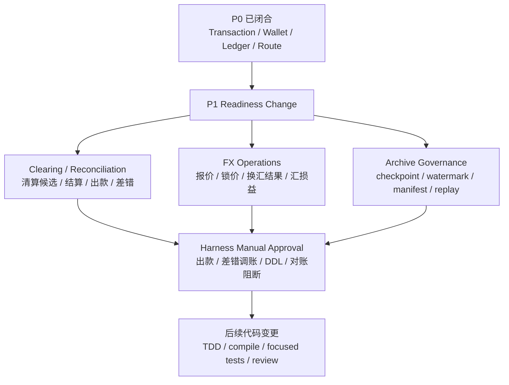

# Design: P1 Readiness and Manual Approval Gates

## Architecture

## Readiness Principles

1. **先独立对象，再入账动作**：清算批次、结算单、出款单、对账差错、FX 报价、归档清单等必须先有对象、状态机和审计，再设计入账。
2. **先审批边界，再自动化**：出款、差错调账、归档、余额重建、FX execution 和 DDL 不进入无审批自动推进。
3. **先来源事实，再资金指令**：P1 来源事实必须能表达清算批次、结算单、出款单、对账差错、FX execution 和归档任务，不复用业务流水伪装资金事实。
4. **先只读/影子，再正式写入**：交易视图重放、报表重算、余额重建和指标治理必须先支持 verify-only 或 shadow 模式。
5. **先合规待确认，再能力开放**：跨境、备付金、外汇、客户资金、商户待结算资金相关能力不得写成合规结论。

## Workstream A: Clearing and Reconciliation

### Scope

| 能力 | P1 准入对象 | 关键红线 |
| --- | --- | --- |
| 清算候选 | `ClearingCandidate`、候选版本、排除原因 | 候选生成不入账，不重复纳入已清算明细。 |
| 清算确认 | `ClearingBatch`、`ClearingItem` | 已确认批次不得覆盖金额，只能反向或补差。 |
| 结算锁定 | `SettlementOrder`、`SettlementLine` | 外部出款前必须 `AVAILABLE -> SETTLEMENT`。 |
| 出款结果 | `PayoutOrder`、回单快照 | 外部受理不等于成功，金额/币种/账户不匹配进入差错。 |
| 对账差错 | `ReconciliationBatch`、`ReconciliationException` | 差错不直接改历史 entry 或余额。 |
| 报表边界 | `ReportSnapshot`、口径版本 | 报表只读，不反写账本、钱包或清结算事实。 |

### Manual Approval Triggers

1. 新增或修改清结算、对账、出款相关 DDL。
2. 结算锁定、出款成功、失败回退、差错调账或挂账认领产生账务变化。
3. 对账阻断规则影响自动清算、结算或出款。
4. 报表重算影响已发布财务或商户报表。

## Workstream B: FX Operations

### Scope

P1 FX operations 只处理业务层或外汇域已经显式决策后的事实，不恢复交易层自动调用 `FxService`。

| 能力 | P1 准入对象 | 关键红线 |
| --- | --- | --- |
| 报价 | `FxQuote`、报价来源、有效期 | 过期报价不得执行换汇。 |
| 锁价 | `FxQuoteLock`、用户确认、审批 | 缺确认或审批不得生成换汇结果。 |
| 执行结果 | `FxExecution`、外部回单 | 原币、目标币、汇率、费用和差额必须可解释。 |
| 汇损益 | `FxGainLossFact` 或等价事实 | 不用交易层 route 隐式吸收汇差。 |
| 跨境/监管 | `RegulatoryReportTask`、材料引用 | 不替代法务、合规、财务和合作机构确认。 |

### Manual Approval Triggers

1. 引入 FX quote/execution/汇损益持久化模型或 DDL。
2. 换汇执行、跨境付款、退汇或监管报送进入正式写入路径。
3. 任何把错币种交易从“失败或差错”改为“自动换汇后入账”的行为。

## Workstream C: Archive, Replay and Metrics Governance

### Scope

| 能力 | P1 准入对象 | 关键红线 |
| --- | --- | --- |
| 余额检查点 | `BalanceCheckpoint` | 必须由不可变 `LedgerEntry` 生成，未校验不得使用。 |
| 水位推进 | `BalanceProjectionWatermark` | 先计算、写入、校验，再推进水位。 |
| 归档清单 | `ArchiveManifest` | 归档只改变冷热位置，不改变事实身份。 |
| 余额重建 | `BalanceRebuildTask` 或等价任务 | 不从交易视图、报表或当前余额反推。 |
| 视图重放 | `TransactionViewReplayTask` | 有界范围，只写视图或差异报告，不入账。 |
| 指标治理 | `MetricWatermark`、`MetricSnapshot` | 指标异常不直接改资金事实。 |

### Manual Approval Triggers

1. 新增 checkpoint、watermark、manifest、replay、metric 相关 DDL。
2. 手动归档、冷热移动、历史数据重建、正式视图重放或指标重算。
3. 任何删除、迁移、修复历史资金事实或账本事实的方案。

## Approval Packet

每个进入 P1 实现的工作包必须提供：

| 材料 | 要求 |
| --- | --- |
| 变更范围 | 模块、对象、表、状态机、入账动作和不纳入范围。 |
| 规格追溯 | PRD、DSL、OpenSpec spec、系分设计和测试矩阵引用。 |
| 资金影响 | 涉及账户主体、余额桶、账务方向、金额公式和幂等键。 |
| 数据影响 | DDL、迁移、冷热位置、回填、修复、保留和回滚策略。 |
| 审计和权限 | 操作者、审批、原因、凭证、证据、脱敏和访问控制。 |
| 验证证据 | 失败用例、聚焦测试、编译、静态检查或无法执行原因。 |
| 回滚/补偿 | 可撤销范围、反向账务、补差批次、重跑策略和人工兜底。 |

## CAD Boundary

在用户未单独确认 P1 Execution Grant 前，CAD 自动推进只允许：

1. 修改 OpenSpec、系分、测试计划和审批材料。
2. 新增只读边界测试或契约测试计划。
3. 做不触发 DDL、出款、归档、换汇执行、真实外部调用的代码审查。

不得自动推进：

1. DDL 或 schema 变更。
2. 出款、差错调账、归档、余额重建、FX execution 生产路径。
3. 真实 Harness pipeline、外部账户、银行/通道 API 或生产数据操作。
