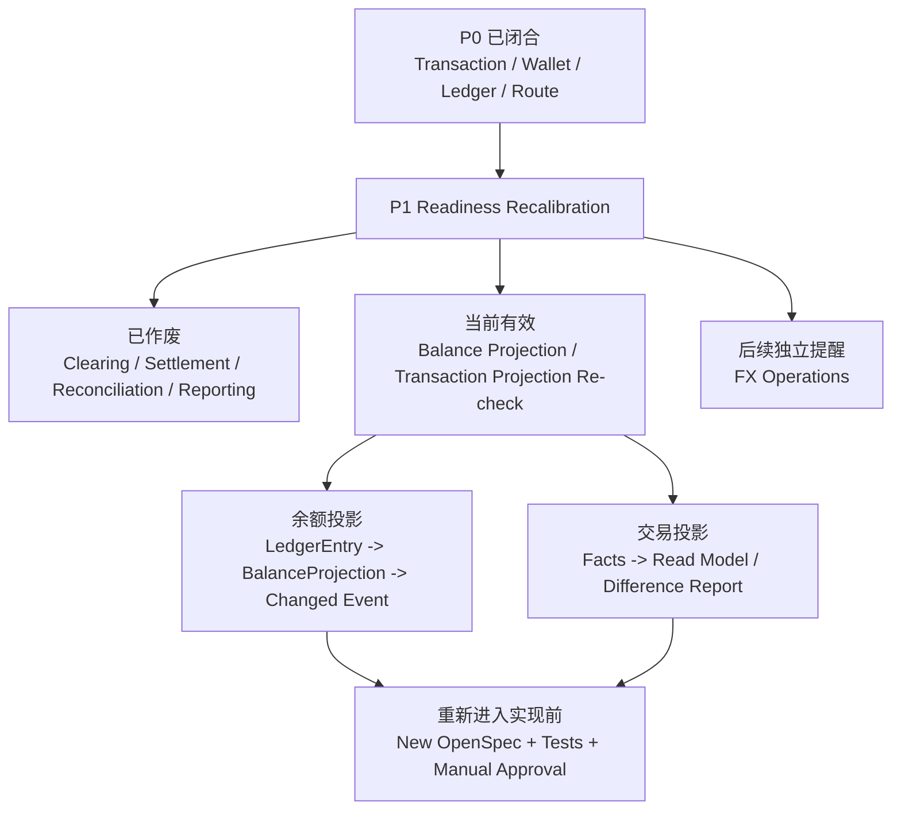

# Design: P1 Readiness Recalibration

## 1. Current Effective Scope



当前 change 只允许继续设计和确认余额投影、交易投影的边界。清算、清结算、结算出款、对账差错、报表、归档移动、指标治理、formal rebuild 和 formal replay 都不属于当前自动推进实现队列。

## 2. Evidence Snapshot

| 证据 | 当前结论 |
| --- | --- |
| `LedgerBalanceProjectionServiceImpl#project` | 余额投影由 `LedgerEntrySpec` 分组后更新账本余额，不从交易视图、账单或报表反推。 |
| `LedgerBalanceProjectionEventTests` | 已验证每条 entry 发布余额变更观察事件，且事件发布失败不回滚余额投影。 |
| `LedgerBalanceChangedEvent` | 事件包含主体、账本、账目、币种、前后余额、变更额、ledger transaction、ledger entry、digest 和业务引用，可作为业务余额变更日志切入口。 |
| `TransactionViewProjectionBoundaryTests` | 当前生产代码不得出现 `TransactionViewProjector`、`TransactionViewReplayService` 等交易投影写模型。 |
| `p1-clearing-batch` / `p1-settlement-payout` / `p1-reconciliation-exception` tasks | 已标记为历史草稿和作废 implementation queue。 |

## 3. Voided Workstreams

| 队列 | 当前处理 | 重新进入条件 |
| --- | --- | --- |
| 清算 / 清结算 | 历史草稿保留，不作为实现、测试或 DDL 依据。 | 重新做产品语义、状态机、账务矩阵、OpenSpec change 和审批材料。 |
| 结算出款 | 历史草稿保留，不接外部出款、不设计 DDL。 | 重新确认出款成功标准、回单、失败回退、权限和人工审批。 |
| 对账差错 | 历史草稿保留，不设计调账执行。 | 重新确认数据源、匹配维度、差错状态、阻断和调账审计。 |
| 报表 / 指标治理 | 从当前队列移除，不与投影一起推进。 | 重新设计指标口径、来源事实、版本、重算和只读边界。 |

## 4. Balance Projection Re-check

### 4.1 Facts and Flow

余额投影的设计边界是：

```text
LedgerTransaction / LedgerEntry
    -> LedgerBalanceProjectionService
    -> BalanceProjection
    -> LedgerBalanceChangedEvent
    -> optional business balance-change log
```

确认口径：

1. `LedgerEntry`、`LedgerTransaction` 引用、ledger profile、normal balance 和受控负余额策略是余额投影事实链的输入。
2. `LedgerBalanceChangedEvent` 是观察事件，不是余额事实源；事件失败不得回滚已经校验通过的投影。
3. 业务余额变更日志只能消费观察事件或从 ledger facts 再派生，不得反向修改 `LedgerEntry`、`LedgerTransaction` 或 `BalanceProjection`。
4. 当前允许保留余额投影主链路和事件测试；不新增 checkpoint/watermark/rebuild/archive DDL。

### 4.2 Deferred Items

以下事项只作为下一轮待重新设计能力：

| 事项 | 重新设计必须回答 |
| --- | --- |
| `BalanceCheckpoint` | 粒度、摘要、校验状态、账本/主体/账目/币种范围、失败处置。 |
| `BalanceProjectionWatermark` | 推进顺序、幂等键、批次状态、失败停留、和热区增量分录边界。 |
| `BalanceRebuildTask` | verify-only、差异报告、修复入口、权限和禁止自动修数。 |
| `ArchiveManifest` | 冷热位置、cutoff、审批、回滚、抽样校验和不改变事实身份。 |

### 4.3 Test Matrix Entrance

下一轮若恢复余额投影治理，测试矩阵必须先覆盖：

1. checkpoint 缺失或未校验时重建失败。
2. watermark 先推进再计算必须失败。
3. 交易视图、用户账单、商户账单、报表或业务余额日志反推余额必须失败。
4. 事件发布失败不回滚余额投影继续作为回归保护。

## 5. Transaction Projection Re-check

### 5.1 Facts and Flow

交易投影的设计边界是：

```text
FundsTransaction / FundsInstruction lifecycle / FrozenOrder / RouteSnapshot / Ledger references
    -> TransactionViewProjector
    -> TransactionView or DifferenceReport
```

确认口径：

1. `TransactionView` 是只读读模型，不是资金事实、账务事实或余额事实。
2. 交易投影可以服务用户账单、商户账单、运营时间线或运营 case view，但不能提前承接清结算、对账或财务报表字段。
3. 交易视图重放不等同于 route replay。route replay 生成后续资金路径；transaction view replay 只能补齐或校验读模型。
4. 任何正式 replay 都必须限定 tenant、projectionCode、主体、时间窗口、批次或单笔来源，并提供 verify-only / shadow 模式。
5. 正式 replay 不得创建 route leg、posting plan、ledger entry、funds transaction、frozen order 或余额投影修复。

### 5.2 Deferred Items

以下事项只作为下一轮待重新设计能力：

| 事项 | 重新设计必须回答 |
| --- | --- |
| `TransactionView` 字段集 | 最小字段、索引、权限、脱敏、来源引用和 contextVariables 边界。 |
| `TransactionViewProjector` | 输入事实、幂等键、投影版本、失败重试和重复消费。 |
| `TransactionViewReplayTask` | 范围、模式、游标、差异报告、apply 审批和回滚策略。 |
| 账单/运营视图 | 用户、商户、运营视图的差异化字段和不可反写事实红线。 |

### 5.3 Test Matrix Entrance

下一轮若恢复交易投影实现，测试矩阵必须先覆盖：

1. 生产代码出现投影写模型前必须有明确 OpenSpec change 和用户确认。
2. 无范围在线全量重放必须失败。
3. replay apply 尝试写 route、ledger entry、funds transaction 或 frozen order 必须失败。
4. 用 transaction view 修正余额或历史交易事实必须失败。

## 6. Manual Approval Gates

以下事项不得在当前 CAD 自动提交队列中直接实现：

1. 任何 projection DDL、索引、迁移或大范围回填。
2. `BalanceCheckpoint`、`BalanceProjectionWatermark`、`ArchiveManifest`、`BalanceRebuildTask` 的生产路径。
3. `TransactionViewProjector`、`TransactionViewReplayTask` 的 formal apply 模式。
4. 已发布账单、商户报表、财务报表或指标快照的正式重算。
5. 任何删除、迁移、修复历史资金事实或账本事实的方案。

重新进入实现前必须提供：新的 OpenSpec change、测试矩阵、DDL/回滚方案、权限审计、验证命令、Manual Approval 材料和用户确认的 Execution Grant。
