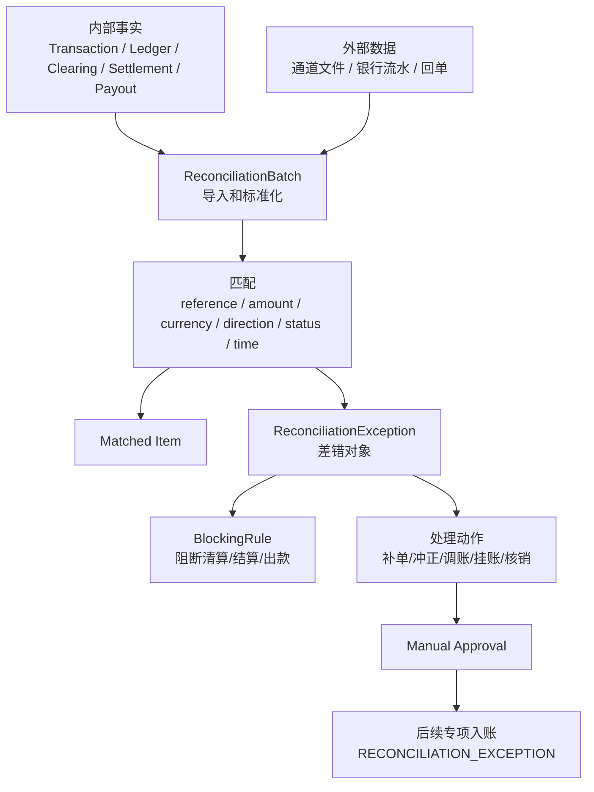
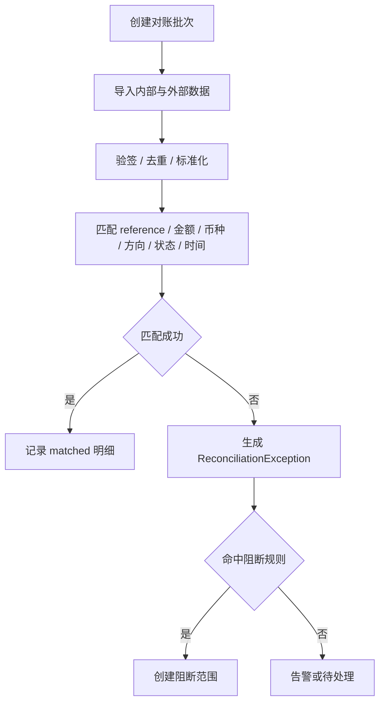
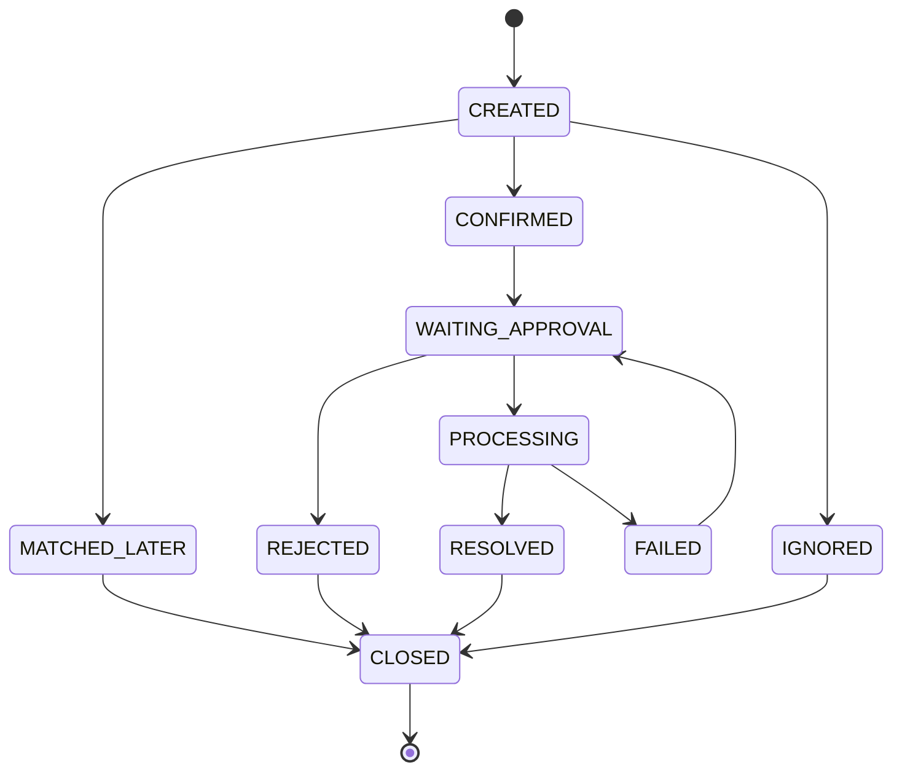

# Design: P1 Reconciliation Exception

## Context

对账差错负责把内部交易、账本、清结算单据、外部文件、回单和资金流水之间的差异对象化，并在风险较高时阻断清算、结算、出款或自动处理动作。它不能反向覆盖历史账本事实。

本 change 只准备对账差错实现边界；不直接编码，不新增 DDL，不接外部文件，不执行调账。

## Product Semantics

| 对象 | 职责 | 入账边界 |
| --- | --- | --- |
| `ReconciliationBatch` | 管理一次对账导入、标准化、匹配和结果汇总。 | 不入账。 |
| `ReconciliationItem` | 标准化后的内部或外部明细，保存匹配 key、金额、币种、方向、状态和来源。 | 不入账。 |
| `ReconciliationException` | 承载差异类型、责任方、影响范围、证据、处理动作、审批和终态。 | 处理动作可能入账。 |
| `BlockingRule` | 定义差错是否阻断清算、结算、出款、自动调账或报表发布。 | 不入账。 |
| `ExceptionEvidence` | 保存文件、回单、截图、工单、操作记录等证据引用。 | 不入账。 |

产品语义红线：

1. 对账差错是独立产品事实，不是 `LedgerEntry` 的状态字段。
2. 对账差错不得直接修改历史分录、余额投影、资金交易、清算批次、结算单或出款单。
3. 差错处理形成资金变化时，必须创建新的来源事实和新的账务分录。
4. 阻断规则只暂停后续自动动作，不代表已经完成资金修复。
5. 核销只表示差错处理闭环，不表示原始差异不存在。
6. 对账文件和外部回单涉及真实资金和敏感数据，不替代法务、合规、财务、银行或通道确认。

## Reconciliation Batch Flow

匹配维度：

| 维度 | 要求 |
| --- | --- |
| 引用 | 业务单号、资金交易号、外部 reference、回单号、route snapshot 外部引用。 |
| 金额 | 本金、手续费、税费、汇率差、通道成本拆开匹配。 |
| 币种 | 交易币种、账本币种、回单币种不一致时生成错币种差错。 |
| 方向 | 入金、出金、退款、退汇、争议扣回、费用方向必须一致。 |
| 状态 | 内部状态和外部状态使用映射表，不直接按文案匹配。 |
| 时间 | 按交易日、账务日、清算日、结算日、外部文件日配置窗口。 |
| 唯一性 | 同一外部 reference 多次成功必须生成重复差错。 |

## Exception Types

| differenceType | 语义 | 默认风险 |
| --- | --- | --- |
| `PLATFORM_SINGLE_SIDE` | 平台有记录，外部无记录。 | 中 |
| `EXTERNAL_SINGLE_SIDE` | 外部有记录，平台无记录。 | 中 |
| `AMOUNT_MISMATCH` | 金额不一致。 | 高 |
| `CURRENCY_MISMATCH` | 币种不一致。 | 高 |
| `STATUS_MISMATCH` | 状态不一致。 | 中 |
| `DUPLICATE_EXTERNAL_SUCCESS` | 同一外部 reference 多次成功。 | 高 |
| `LEDGER_MISSING` | 交易存在但账务缺失。 | 高 |
| `LEDGER_UNBALANCED` | 账务不平或余额投影不可重建。 | 高 |
| `RECEIPT_MISMATCH` | 回单金额、币种、账户或 reference 不匹配。 | 高 |
| `DELAYED_RECORD` | 文件或记录延迟。 | 低 |
| `FEE_MISMATCH` | 手续费或通道成本差异。 | 中 |

## Exception State Machine

规则：

1. `CLOSED` 为最终关闭状态。
2. `MATCHED_LATER` 只能由后续批次或可信回查证明差异消失。
3. `IGNORED` 必须保留误报原因、操作者和审批或规则依据。
4. `PROCESSING` 不代表已经入账成功，必须等待处理动作完成。
5. `RESOLVED` 必须保存处理结果、凭证、审批和后续账务引用。

## Blocking Rules

阻断作用域必须精确，不能用全局开关掩盖数据边界：

| blockScope | 说明 |
| --- | --- |
| `SUBJECT_PERIOD` | 阻断某主体、币种、账期的清算或结算。 |
| `SETTLEMENT_ORDER` | 阻断指定结算单锁定、取消或后续出款。 |
| `PAYOUT_ORDER` | 阻断指定出款单成功、失败回退或重试。 |
| `TRANSACTION` | 阻断指定交易后续退款、追偿或争议处理。 |
| `SOURCE_FILE` | 阻断指定外部文件或批次继续自动处理。 |

默认阻断规则：

| 条件 | 默认动作 | 释放条件 |
| --- | --- | --- |
| 账务不平、账本交易缺失、分录重复、余额投影不可重建 | 阻断相关主体、币种和账期的清算、结算、出款和自动调账。 | 修复任务完成，账务巡检通过，财务复核确认。 |
| 出款回单金额或币种不匹配、同一外部 reference 重复成功、出款状态不明且超过回查窗口 | 阻断该出款单、关联结算单和同批次后续出款。 | 外部回单确认、失败回退、追偿或调账完成。 |
| 涉及客户资金、商户待结算资金、准备金、负余额或跨境外汇资金的未核销差错 | 阻断相关资金继续出款或结算释放。 | 差错核销、审批完成，并形成可追溯凭证。 |
| 单笔差错金额、累计金额、笔数或 SLA 超过配置阈值 | 暂停对应主体、币种和账期的结算或出款。 | 复核、调账、补单、冲正或核销完成。 |

## Action Boundary

| actionType | 适用场景 | 是否可能入账 | CAD 边界 |
| --- | --- | --- | --- |
| `REQUERY_EXTERNAL` | 状态不明、通道单边、平台单边。 | 否 | 只定义，不接真实回查。 |
| `SUPPLEMENT_ORDER` | 外部成功但平台缺业务或资金事实。 | 可能 | 需要专项审批。 |
| `SUPPLEMENT_POSTING` | 交易成功但账务缺失。 | 是 | 需要专项审批和资金影响说明。 |
| `REVERSE_TRANSACTION` | 平台误记成功或需冲正。 | 是 | 需要专项审批和原事实引用。 |
| `BALANCE_ADJUST` | 金额差、长短款、费用差异。 | 是 | 需要专项审批，不复用普通余额调整掩盖差错。 |
| `SUSPENSE` | 未知入金、未知长款。 | 可能 | 需要挂账账户和审计设计。 |
| `CLAIM` | 挂账认领。 | 是 | 需要归属证明和审批。 |
| `RETURN_FUNDS` | 未知入金退回或退汇。 | 是或外部动作 | 需要外部动作审批。 |
| `WRITE_OFF` | 小额差异或长期无法处理差异核销。 | 是或财务动作 | 需要财务确认。 |
| `MANUAL_CLOSE` | 误报或无需处理。 | 否 | 需要原因、权限和审计。 |

## Transaction Layer Boundary

未来差错处理形成资金指令时：

1. 入账来源事实类型必须为 `RECONCILIATION_EXCEPTION`。
2. `sourceFactRef.factSn` 使用 `exceptionSn`。
3. `sourceFactRef.factVersion` 使用差错处理版本或处理动作版本。
4. `businessScene/businessSn` 只表达当前处理动作身份，不替代来源事实。
5. `ReconciliationBatch`、`ReconciliationItem`、`BlockingRule` 和 `ExceptionEvidence` 不作为入账来源事实。
6. 不恢复无边界的 `sourceObjectType/sourceObjectSn` 字段。

## Test Matrix

后续实现前，先落 `ReconciliationMatchingServiceTests` 与 `ReconciliationExceptionAdjustmentTests`：

| 测试 | 场景 | 断言 |
| --- | --- | --- |
| `ReconciliationMatchingServiceTests` | 标准化和去重 | 同一外部 reference 重复成功生成 `DUPLICATE_EXTERNAL_SUCCESS`，不覆盖原明细。 |
| `ReconciliationMatchingServiceTests` | 平台单边 | 平台成功但外部无记录生成 `PLATFORM_SINGLE_SIDE`，不直接冲正。 |
| `ReconciliationMatchingServiceTests` | 外部单边 | 外部成功但平台无记录生成 `EXTERNAL_SINGLE_SIDE`，不自动补单。 |
| `ReconciliationMatchingServiceTests` | 金额或币种差异 | 生成 `AMOUNT_MISMATCH` 或 `CURRENCY_MISMATCH`，阻断相关结算或出款。 |
| `ReconciliationMatchingServiceTests` | 账务缺失或不平 | 生成高风险差错，阻断相关主体和账期自动处理。 |
| `ReconciliationMatchingServiceTests` | 后续匹配 | 后续文件匹配成功后进入 `MATCHED_LATER`，保留前后批次引用。 |
| `ReconciliationExceptionAdjustmentTests` | 差错处理需审批 | 未审批的补单、冲正、调账、挂账认领和核销失败。 |
| `ReconciliationExceptionAdjustmentTests` | 差错调账来源事实 | 调账资金指令使用 `RECONCILIATION_EXCEPTION`，保存责任方、原因、凭证和审批引用。 |
| `ReconciliationExceptionAdjustmentTests` | 不改历史事实 | 差错处理不得修改历史 `LedgerEntry`、余额投影或交易事实。 |
| `ReconciliationExceptionAdjustmentTests` | 阻断释放 | 处理完成并审批通过后释放精确阻断范围，不释放无关主体、币种或账期。 |

## Harness Manual Approval Gate

后续任一动作必须停在人工审批：

1. 新增或修改对账批次、差错单、阻断规则、证据相关 DDL。
2. 接入真实外部文件、银行流水、回单、回查接口、凭据或生产调度。
3. 实现阻断规则影响自动清算、结算、出款或报表发布。
4. 实现补单、补入账、冲正、调账、挂账、认领、退回或核销。
5. 执行任何生产数据修复、历史事实重放、余额修复或资金调整。

审批材料至少包含：

| 材料 | 要求 |
| --- | --- |
| 范围 | 对象、表、状态机、阻断作用域、处理动作和非目标。 |
| 资金影响 | 主体、币种、余额桶、账务方向、金额公式和幂等键。 |
| 数据影响 | DDL、唯一约束、迁移、回滚、外部文件保留和历史数据处理。 |
| 证据与权限 | 文件、回单、截图、工单、脱敏、访问控制和审计。 |
| 审批和职责 | 责任方、处理人、复核人、审批引用、原因和凭证。 |
| 验证证据 | 失败用例、聚焦测试、编译、静态检查或无法执行原因。 |
| 回滚/补偿 | 可撤销范围、反向账务、补差批次、重跑策略和人工兜底。 |

## CAD Boundary

当前 change 的 CAD 自动推进只允许修改 OpenSpec 和设计材料。即使用户继续说“继续”，在未确认具体 P1 Execution Grant 前，也不得自动进入：

1. Java 实现。
2. DDL 或测试 schema。
3. 真实差错调账、挂账认领、核销、补单、冲正或余额修复。
4. 外部文件、银行、通道、回单、凭据、调度任务或 Harness pipeline。
