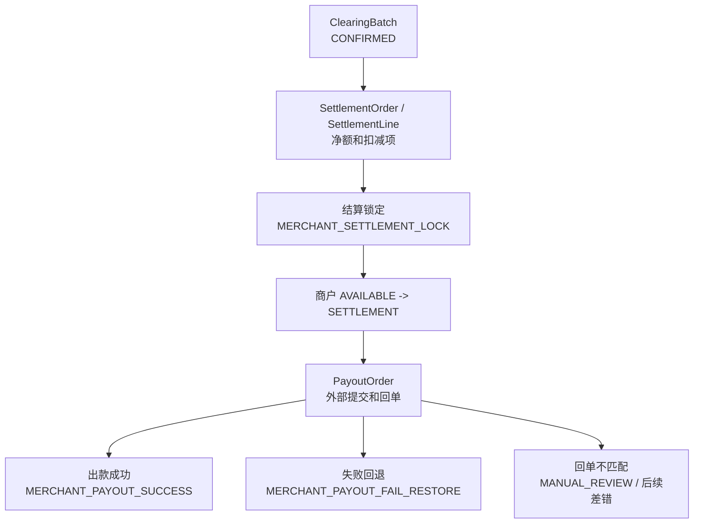
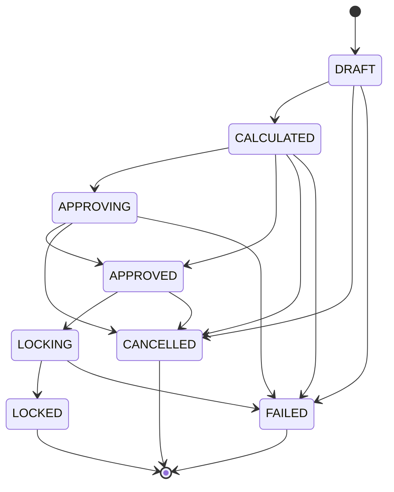
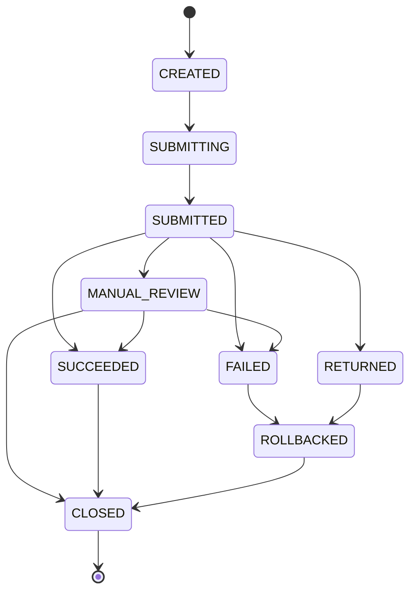

# Design: P1 Settlement and Payout

## Context

结算单与出款单负责把已清算的商户可用余额转换为排他锁定、外部出款、成功确认或失败回退。它们位于清算批次之后、对账差错和报表之前。



本 change 只准备结算与出款实现边界；不直接编码，不新增 DDL，不连接外部出款通道。

## Product Semantics

| 对象 | 职责 | 入账边界 |
| --- | --- | --- |
| `SettlementOrder` | 固化某主体、币种、账期、策略版本下的可出款净额、扣减项、审批和锁定状态。 | 结算锁定时入账。 |
| `SettlementLine` | 结算单明细，追溯清算批次、费用、退款、争议、准备金、负余额或调整项。 | 随结算单锁定标记 locked。 |
| `PayoutOrder` | 管理外部出款提交、受理、回单核验、成功、失败、退回和人工复核。 | 成功或失败回退时入账。 |
| `PayoutReceipt` | 外部回单或回查结果的证据快照。 | 不直接入账，只驱动结果判定。 |

产品语义红线：

1. `SettlementOrder` 不是报表汇总，必须能追溯到清算批次、明细和扣减项。
2. `SETTLEMENT` 是排他锁定余额桶，表示出款处理中或等待结果，不是普通展示状态。
3. 外部受理只表示通道、银行或外部系统接收请求，不等于资金已出。
4. 出款成功必须基于可信回单，且金额、币种、账户、外部流水匹配。
5. 状态不明、金额不一致、币种不一致或收款账户不一致时，不得自动成功或自动回退。
6. 结算与出款方案不替代法务、合规、财务、银行或通道规则确认。

## Settlement Order State Machine



规则：

1. `LOCKED`、`CANCELLED`、`FAILED` 为结算单终态。
2. 只有 `APPROVED` 可以进入锁定。
3. 锁定成功后必须创建或关联 `PayoutOrder`。
4. 锁定失败不得创建可提交出款单。
5. 已锁定结算单不得重算金额；后续差异走新版本、补差、反向或对账差错。

## Payout Order State Machine



规则：

1. `SUBMITTED` 不得触发 `MERCHANT_PAYOUT_SUCCESS`。
2. `SUCCEEDED` 必须有可信回单，且回单匹配金额、币种、收款账户和外部流水。
3. `FAILED` 或 `RETURNED` 只有在失败结果可信且未回退过时才能进入 `ROLLBACKED`。
4. `MANUAL_REVIEW` 只能由人工复核或后续对账差错处理释放。
5. `CLOSED` 只表示出款单流程闭合，不表达对账差错一定消失。

## Settlement Amount Formula

结算净额必须可解释：

```text
netSettlementAmount
  = clearedAmount
  - refundAmount
  - chargebackAmount
  - feeAmount
  - channelCostAmount
  - reserveAmount
  - negativeBalanceOffsetAmount
  - riskHoldAmount
  - unresolvedExceptionDeductionAmount
  + adjustmentAmount
```

每个金额项必须保存来源明细、批次、规则版本、审批凭证或差错引用。后续实现时，结算单幂等键至少包含：

```text
tenantId
settlementSubjectType
settlementSubjectId
currency
settlementPeriod
policyCode
policyVersion
settlementOrderVersion
sourceBatchRange
```

## Lock Transaction

未来实现时，结算锁定事务边界应为：

```text
load SettlementOrder
  -> assert APPROVED
  -> assert idempotency key
  -> assert merchant AVAILABLE sufficient
  -> assert payout account verified
  -> assert no blocking reconciliation exception
  -> build funds instruction with sourceFactRef = SETTLEMENT_ORDER
  -> route MERCHANT_SETTLEMENT_LOCK
  -> post LedgerTransaction(AVAILABLE -> SETTLEMENT)
  -> mark SettlementOrder LOCKED
  -> create PayoutOrder
  -> commit
```

资金不变量：

1. 锁定金额等于结算单净额。
2. 锁定只在同一结算主体内 `AVAILABLE -> SETTLEMENT`。
3. 同一 `SettlementLine` 最多进入一个已锁定结算单。
4. 锁定失败不得创建可提交的 `PayoutOrder`。
5. Ledger 幂等命中不得造成二次余额投影。

## Payout Success Transaction

未来实现时，出款成功事务边界应为：

```text
load PayoutOrder
  -> assert external receipt trustworthy
  -> assert receipt amount, currency and account matched
  -> assert not already succeeded or rolled back
  -> build funds instruction with sourceFactRef = PAYOUT_ORDER
  -> route MERCHANT_PAYOUT_SUCCESS
  -> post LedgerTransaction(consumes SETTLEMENT according to payout path)
  -> save receipt reference and ledgerTransactionSn
  -> mark PayoutOrder SUCCEEDED
  -> close or release related payout workflow
  -> commit
```

规则：

1. 外部受理、处理中、排队、银行处理中不得作为成功证据。
2. 成功后发生退款、争议或差错，不回滚已完成出款；走追偿、准备金、负余额、后续结算抵扣或差错调账。
3. 成功入账必须可追溯到外部回单和原结算单。

## Payout Failure Restore Transaction

未来实现时，失败回退事务边界应为：

```text
load PayoutOrder
  -> assert failure result trustworthy
  -> assert rollback not consumed
  -> assert original settlement lock exists
  -> build funds instruction with sourceFactRef = PAYOUT_ORDER
  -> route MERCHANT_PAYOUT_FAIL_RESTORE
  -> post LedgerTransaction(SETTLEMENT -> AVAILABLE)
  -> save failure reason and ledgerTransactionSn
  -> mark PayoutOrder ROLLBACKED
  -> commit
```

规则：

1. 只能回退原锁定金额。
2. 同一出款单只能成功回退一次。
3. 状态不明、回单金额不一致、币种不一致、账户不一致不得自动回退。
4. 回退后再次出款必须创建新的出款单或新版本流程，不能复用已回退结果。

## Transaction Layer Boundary

未来结算与出款进入交易层时：

1. 结算锁定资金指令的 `sourceFactRef` 类型必须为 `SETTLEMENT_ORDER`。
2. 出款成功和失败回退资金指令的 `sourceFactRef` 类型必须为 `PAYOUT_ORDER`。
3. `businessScene/businessSn` 只表达当前上游动作身份，不替代来源事实。
4. `SettlementLine` 和 `PayoutReceipt` 不作为资金入账来源事实。
5. 不恢复无边界的 `sourceObjectType/sourceObjectSn` 字段。

## Test Matrix

后续实现前，先落 `SettlementOrderServiceTests` 与 `PayoutResultServiceTests`：

| 测试 | 场景 | 断言 |
| --- | --- | --- |
| `SettlementOrderServiceTests` | 结算净额计算 | 净额公式每个金额项可追溯，规则版本和审批引用保存。 |
| `SettlementOrderServiceTests` | 结算锁定成功 | 生成 `MERCHANT_SETTLEMENT_LOCK`，商户 `AVAILABLE` 减少、`SETTLEMENT` 增加，金额平衡。 |
| `SettlementOrderServiceTests` | 结算锁定超额 | `AVAILABLE` 不足时失败，结算单状态和余额不变。 |
| `SettlementOrderServiceTests` | 重复锁定幂等 | 相同幂等键返回原锁定结果，不重复入账。 |
| `SettlementOrderServiceTests` | 重复锁定拒绝 | 不同幂等键再次锁定终态结算单失败，不创建新出款单。 |
| `PayoutResultServiceTests` | 外部受理不是成功 | `SUBMITTED` 不产生 `MERCHANT_PAYOUT_SUCCESS`，`SETTLEMENT` 不被消耗。 |
| `PayoutResultServiceTests` | 出款成功 | 回单匹配金额、币种、账户后生成 `MERCHANT_PAYOUT_SUCCESS`，保存外部回单引用。 |
| `PayoutResultServiceTests` | 回单不匹配 | 金额、币种或账户不一致进入 `MANUAL_REVIEW`，不得成功或自动回退。 |
| `PayoutResultServiceTests` | 失败回退 | 外部明确失败且未回退过时生成 `MERCHANT_PAYOUT_FAIL_RESTORE`，`SETTLEMENT -> AVAILABLE`。 |
| `PayoutResultServiceTests` | 失败只回退一次 | 同一出款单重复失败回退返回原结果或拒绝重复动作，不重复释放余额。 |

## Harness Manual Approval Gate

后续任一动作必须停在人工审批：

1. 新增或修改结算单、出款单、回单相关 DDL。
2. 实现结算锁定、出款成功或失败回退入账路径。
3. 接入外部出款通道、银行账户、回单文件、回查接口或凭据配置。
4. 实现真实出款提交、重试、退回、追偿、准备金扣减、负余额抵扣或补差。

审批材料至少包含：

| 材料 | 要求 |
| --- | --- |
| 范围 | 对象、表、状态机、route event、外部依赖和非目标。 |
| 资金影响 | 主体、币种、余额桶、净额公式、锁定金额、回退金额和幂等键。 |
| 数据影响 | DDL、唯一约束、迁移、回滚、回单证据和历史数据处理。 |
| 外部依赖 | 通道、银行、账号、回单、回查、重试和失败语义。 |
| 审计权限 | 操作者、审批、原因、出款账号脱敏、回单引用和访问审计。 |
| 验证证据 | 失败用例、聚焦测试、编译、静态检查或无法执行原因。 |

## CAD Boundary

当前 change 的 CAD 自动推进只允许修改 OpenSpec 和设计材料。即使用户继续说“继续”，在未确认具体 P1 Execution Grant 前，也不得自动进入：

1. Java 实现。
2. DDL 或测试 schema。
3. 真实结算锁定、出款成功或失败回退入账。
4. 外部通道、银行、账户、凭据、调度任务或 Harness pipeline。
