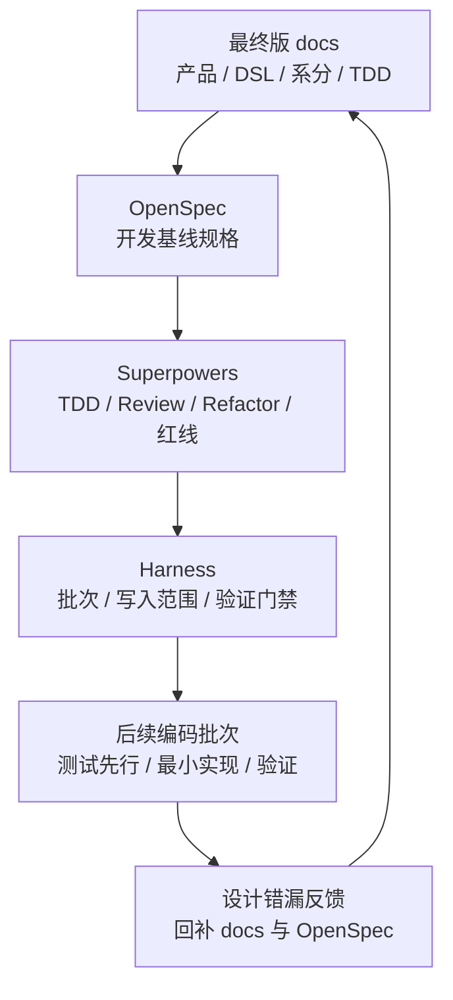

# TDD 基线重置设计

## 一、三层基线

## 二、作废策略

| 对象 | 处理方式 | 保留内容 |
| --- | --- | --- |
| 旧 OpenSpec specs | 删除并重建。 | 新规格 `payment-funds-foundation/spec.md`。 |
| 旧 OpenSpec changes | 删除并重建。 | 新 change `tdd-baseline-reset`。 |
| 旧 Superpowers/Harness 计划 | 以新 `tasks.md` 取代。 | TDD 纪律和 Harness 门禁。 |
| 旧测试代码 | 删除 `*/src/test/java`。 | `*/src/test/resources`。 |

## 三、差距复核方法

后续执行先按设计文档域排序：`02-交易路由钱包账目与投影` 优先，`03-清结算与对账` 次之，`04-归档重放与指标治理` 最后。每个具体批次按以下顺序复核：

1. 从 TDD 用例 ID 选择本批次最小目标。
2. 回看产品验收、DSL 契约和系分模块，确认语义一致。
3. 扫描当前代码服务、枚举、请求、转换器、路由、生命周期、账本、投影差距。
4. 先写失败测试或契约测试。
5. 做最小实现。
6. 运行批次验证命令。
7. 若发现设计错漏，先改 docs 和 OpenSpec，再继续。

## 四、首批差距

| 差距 | 影响 | 处理批次 |
| --- | --- | --- |
| 授权 `EXPIRE` 事件和服务入口缺失 | 授权过期无法与外部撤销区分。 | 批次 4 授权交易。 |
| `settle` 强制完成模式缺少契约字段 | 无前置授权强制完成无法证明策略、上限、原因和审计。 | 批次 4 授权交易。 |
| `settleRefund` 无授权退款模式引用和审计字段需复核 | 无前置授权但有外部原消费、原完成或差错凭证时，需要可证明不补造授权占用且可追溯。 | 批次 4 授权交易。 |
| 权益快照 DSL 当前仅在设计层闭合 | `FundsBenefitSnapshotSpec`、组件、引用、退款策略和权益枚举尚未落到 core 契约；直接交易、授权、退款回放、清结算和对账还不能声明已实现。 | 批次 1 先落 DSL 契约，批次 3、4、6、7 分段消费。 |
| 目标态测试已局部重建但覆盖未闭环 | 不能依赖旧测试或少量局部测试证明目标态。 | 02 阶段仍从批次 1 起按覆盖索引逐步闭环；已重建测试作为对应批次局部基线。 |
| 清结算、对账、归档、指标已有骨架但不得混入主链路 | 容易误以为 03、04 已获准抢跑，或把治理能力写回交易主链路。 | 先完成 02 阶段；03、04 分别独立处理。`reconciliation-*` 仅保留空模块骨架；`governance-*` 只视为候选落点和局部基线。 |

## 五、Replay 与重放边界

| 名称 | 任务规划落点 | 边界 |
| --- | --- | --- |
| Route Replay | 02 阶段批次 1、批次 6 | 只解决后续资金事件沿原 route snapshot 回放，缺快照必须失败或进入人工处理。 |
| Transaction Projection Replay | 02 阶段批次 6 建立正常投影入口和只读边界；04 阶段批次 8 承接治理重放任务 | 只修复只读交易视图、账单、时间线或批次视图，不重新入账、不修改余额。 |
| Balance Rebuild | 04 阶段批次 8 | 只从账本分录、检查点、水位和 Manifest 重建余额投影，不从余额日志、交易投影或报表反推余额。 |
| Archive Resume | 04 阶段批次 8 | 只用于归档或重放任务断点续跑，不替代账本周期、余额水位或资金路径选择。 |

## 六、人工确认点

以下事项进入编码前必须人工确认：

1. 公共契约字段新增、删除或兼容策略。
2. 枚举新增、状态机变更和数据库表结构变更。
3. 授权过期、强制完成和无授权直接退款对历史数据、幂等键、外部凭证和对账解释的影响。
4. Route Replay、交易投影正常入口、交易投影治理重放、余额重建和归档续跑是否会产生边界混用。
5. 03 清结算与对账、04 归档重放与指标治理是否进入本轮实现；默认顺序为先 02，再 03，再 04。
6. 是否开启 CAD Mode、Git 策略和 Execution Grant。
7. 权益快照是否允许修改 `FundsInstructionSpec` 公共契约、是否新增 `FundsBenefit*` 枚举、route snapshot 是否固化权益摘要、平台补贴/储值券资金性质由谁最终确认。
