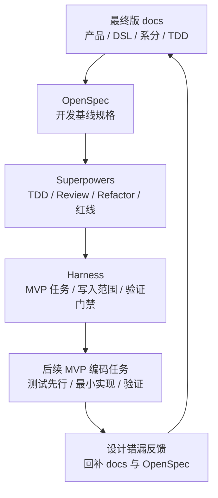

# TDD 基线重置设计

## 一、三层基线

## 二、作废策略

| 对象 | 处理方式 | 保留内容 |
| --- | --- | --- |
| 旧 OpenSpec specs | 删除并重建。 | 新规格 `payment-funds-foundation/spec.md`。 |
| 旧 OpenSpec changes | 删除并重建。 | 新 change `tdd-baseline-reset`。 |
| 旧 Superpowers/Harness 计划 | 以新 `tasks.md` 取代。 | TDD 纪律和 Harness 门禁。 |
| 旧测试代码 | 删除 `*/src/test/java`。 | `*/src/test/resources`。 |

## 三、差距复核方法

后续执行先按 MVP 任务切片选择最小闭环，不按整章目标态一次性推进。`02-交易路由钱包账目与投影`、`03-清结算与对账` 和 B8 资金数据治理都可以作为设计输入；产品 `04-归档重放与指标治理` 仅保留拆分索引，具体内容反查 02、03、05。每个具体任务按以下顺序复核：

1. 从 TDD 用例 ID 选择本任务最小目标。
2. 回看产品验收、DSL 契约和系分模块，确认语义一致。
3. 扫描当前代码服务、枚举、请求、转换器、路由、生命周期、账本、投影差距。
4. 先写失败测试或契约测试。
5. 做最小实现。
6. 运行本任务验证命令。
7. 若发现设计错漏，先改 docs 和 OpenSpec，再继续。

## 四、首批差距

| 差距 | 影响 | 处理方式 |
| --- | --- | --- |
| 授权 `EXPIRE` 事件和服务入口已作废 | 授权过期、超时或通道未返回不是可信资金事实，不能与外部可信撤销混用。 | `b0666ba feat: 补齐授权过期释放 canonical 能力` 只保留为历史实现痕迹；2026-06-26 目标态裁决要求移除 `expire` 服务入口、`EXPIRE` 事件和 `EXPIRED` 终态，释放占用必须由可信撤销、余额调整或对账差错补事实承接。 |
| `settle` 强制完成首轮 canonical 能力已闭合 | `616dac1` 和 `3825466` 已证明 FORCE 模式、内部受信策略、上限、原因、外部原事实引用、凭证、审计、普通完成与 FORCE 分支隔离，以及失败无资金副作用。现有普通完成仍依赖内部原授权流水，首轮 FORCE 不携带 `authorizationTransactionSn`、不构造 `AUTHORIZATION` reference、不查询原授权账本交易。 | 后续只作为 B4 授权交易回归基线；若要扩展生产策略引擎、审批流、额度窗口、带原授权 overcapture、外部清算文件或运营审批系统，必须另起单一 MVP Execution Grant。 |
| `settleRefund` 无授权退款模式引用和审计字段需复核 | 无前置授权但有可追溯外部引用时，需要可证明不补造授权占用且可追溯；当前扫描确认普通授权链退款仍依赖 `authorizationTransactionSn`、`AUTHORIZATION` reference 和原授权/原完成 route replay。 | 归入 B4 授权交易覆盖索引；进入编码时按单一 MVP 任务授权，并显式确认 `authorizationTransactionSn` 空值语义、`externalReferenceSn`、退款原因、操作者/审计字段和 `NO_AUTH` 内部上下文标签；普通授权链退款继续要求内部授权流水，NO_AUTH 模式不得携带或查询内部授权流水。 |
| 让利出资记账交易 DSL 已从旧快照契约重基线，生产链路仍需分段闭合 | 旧 `FundsBenefitSnapshotSpec`、组件、引用、退款策略、稳定摘要对象和 JSON 夹具曾作为 B1-10 历史契约承载基线；当前目标态已由 `GSD2-BENEFIT-FUNDING-TRANSACTION-REBASE-001`、`GSD2-BENEFIT-FUNDING-TRANSACTION-IMPL-001` 和 `GSD2-BENEFIT-LEGACY-SNAPSHOT-REMOVE-001` 重基线为 `FundsBenefitContributionTransactionService`、让利出资记账请求模型、旧字段拒绝和历史摘要兼容。即使契约与首个真实入账切片通过，直接交易、授权、退款回放、清结算和对账也不能自动声明已实现；Phase 2/3 必须补 Phase 能力边界、任务切片、`fixtureLevel`、权益事实源、零实付表达和专业确认准入。 | 后续 route、posting、replay、清结算和对账必须拆成独立 MVP 任务消费；不得恢复旧快照 DSL、来源引用或 `ledgerEffect` 作为公共契约。 |
| 目标态测试已局部重建但覆盖未闭环 | 不能依赖旧测试或少量局部测试证明目标态；`DefaultLedgerPostingAssemblerTests` 长 ID 用例规范化只证明账务计划装配器的局部追溯边界。 | 02 设计域仍从 B1 起按覆盖索引逐步闭合；已重建测试作为对应覆盖索引局部基线。 |
| 清结算、对账和资金数据治理已有骨架或候选实现但不得混入主链路 | 容易误以为 03 或 B8 已获准抢跑，或把治理能力写回交易主链路。 | 03 和 B8 分别独立处理。冻结基线中 `reconciliation-*` 仅具备模块骨架和 B7-00 出款前准入候选实现，只视为候选输入；`governance-*` 只视为候选落点和局部基线。 |

## 五、Replay 与重放边界

| 名称 | 任务规划落点 | 边界 |
| --- | --- | --- |
| Route Replay | 02 设计域 B1、B6 覆盖索引 | 只解决后续资金事件沿原 route snapshot 回放，缺快照必须失败或进入人工处理。 |
| Transaction Projection Replay | 02 设计域 B6 覆盖索引建立正常投影入口和只读边界；B8 覆盖索引承接治理重放任务 | 只修复只读交易视图、账单、时间线或清结算批次视图，不重新入账、不修改余额。 |
| Balance Rebuild | 02 余额投影和 B8 覆盖索引 | 只从账本分录、检查点、水位和 Manifest 重建余额投影，不从余额日志、交易投影或报表反推余额。 |
| Archive Resume | B8 覆盖索引 | 只用于事实留存或重放任务断点续跑，不替代账本周期、余额水位或资金路径选择。 |

## 六、人工确认点

以下事项进入编码前必须人工确认：

1. 公共契约字段新增、删除或目标态语义调整。
2. 枚举新增、状态机变更和数据库表结构变更。
3. 无授权直接退款对历史数据、幂等键、外部凭证和对账解释的影响；授权过期不再作为资金交易 canonical 能力，强制完成首轮已在 B4-FORCE-SETTLE 中闭合，后续若扩展并发、投影解释、生产策略引擎、审批快照、带原授权 overcapture 或业务 facade 仍需单独授权。
4. Route Replay、交易投影正常入口、交易投影治理重放、余额重建和归档续跑是否会产生边界混用。
5. 03 清结算与对账、B8 资金数据治理是否进入本轮实现；默认顺序为先 02，再 03，再由 B8 按独立 Execution Grant 承接。
6. 是否开启 CAD Mode、Git 策略和 Execution Grant。
7. 含权益资金流是否允许新增一等字段、事实表或不可变存储，route snapshot 是否固化权益资金事实摘要，平台补贴/储值券资金性质由谁最终确认；不得恢复旧 `FundsInstructionSpec.benefitSnapshot`、旧 `FundsBenefit*` 快照枚举或旧重型权益 DSL。

## 七、架构准入映射

| 审查项 | 本 change 口径 |
| --- | --- |
| 背景、目标、非目标、成功标准 | 背景是旧 OpenSpec、旧 Harness 和旧测试资产已不能准确表达当前资金底座目标态；目标是用最终版 docs、OpenSpec、TDD 和 Harness 重新建立可验证基线；非目标是不在本 change 中直接完成所有生产能力；成功标准是每个后续 MVP 都能追溯到产品验收、DSL、系分、TDD、写入范围和验证门禁。 |
| 现状、约束、问题和影响范围 | 现状是 B1 至 B8 已有局部代码与测试基线，但覆盖未闭环；约束是公共契约、表结构、资金事实和跨模块依赖必须经 Execution Grant 明确授权；问题影响交易、账本、钱包、授权、清结算、对账和治理任务的准入判断。 |
| 核心决策、职责边界和取舍 | 核心决策是按 MVP 任务切片推进，职责上由 docs 和 OpenSpec 定义语义、由 Harness 定义写入范围、由测试先证明缺口；边界是不得把支付工具 facade、清结算对账、治理 apply 或 P2 能力混入 B1 至 B6；取舍是先闭合账户主体型 canonical 内核，再独立处理应用 facade 和扩展产品。 |
| 接口契约、入参、错误码、幂等和兼容 | 公共接口契约、Request/DTO、枚举、状态机、错误码、幂等摘要和兼容策略必须在对应 Execution Grant 中列名；未列名时不得修改 `*-face`、`core` 或跨模块调用契约。 |
| 数据方案、事务边界、一致性、补偿和对账 | 数据方案以账本事实、route snapshot、posting plan、ledger entry、余额投影和只读投影为边界；事务边界必须保证资金事实、账务事实和投影解释一致；补偿、对账、清结算追偿和治理重放只能进入对应独立任务。 |
| 可靠性、安全、权限、审计和告警 | 可靠性以幂等、失败无副作用和可重放解释为底线；安全和权限涉及公共契约、敏感数据、外部协议或生产配置时必须停止确认；审计要求原因、凭证、外部引用和操作者可追溯，告警只在生产发布任务中单独展开。 |
| 验证方案、测试、静态检查和回归 | 每个 MVP 先写 Red，再做最小 Green；验证方案按任务选择 `just test-one`、模块测试、`just compile`、`just pmd` 和 `git diff --check`；静态检查和回归结论必须区分代码问题与私服、网络或本地环境问题。 |
| 发布、灰度、回滚、风险和待确认 | 本 change 不发布生产能力，也不定义灰度或回滚动作；后续涉及生产行为、数据迁移、表结构、外部协议或不可逆操作时，必须补发布、灰度、回滚、风险和待确认项。 |
