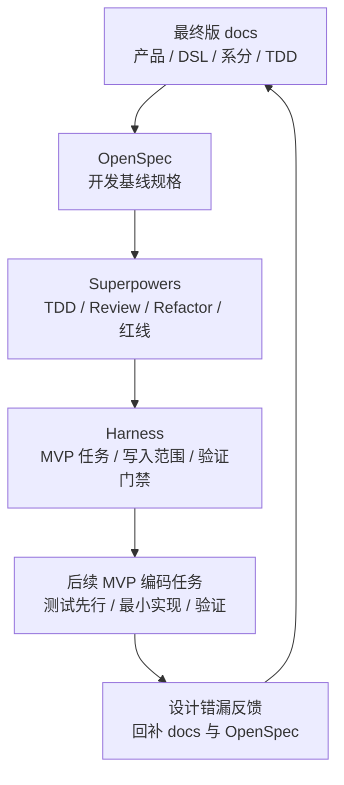

# TDD 基线重置设计

## 一、三层基线

## 二、作废策略

| 对象 | 处理方式 | 保留内容 |
| --- | --- | --- |
| 旧 OpenSpec specs | 删除并重建。 | 新规格 `payment-funds-foundation/spec.md`。 |
| 旧 OpenSpec changes | 删除并重建。 | 新 change `tdd-baseline-reset`。 |
| 旧 Superpowers/Harness 计划 | 以新 `tasks.md` 取代。 | TDD 纪律和 Harness 门禁。 |
| 旧测试代码 | 删除 `*/src/test/java`。 | `*/src/test/resources`。 |

## 三、差距复核方法

后续执行先按 MVP 任务切片选择最小闭环，不按整章目标态一次性推进。`02-交易路由钱包账目与投影`、`03-清结算与对账`、`04-归档重放与指标治理` 都可以作为设计输入，但每个具体任务按以下顺序复核：

1. 从 TDD 用例 ID 选择本任务最小目标。
2. 回看产品验收、DSL 契约和系分模块，确认语义一致。
3. 扫描当前代码服务、枚举、请求、转换器、路由、生命周期、账本、投影差距。
4. 先写失败测试或契约测试。
5. 做最小实现。
6. 运行本任务验证命令。
7. 若发现设计错漏，先改 docs 和 OpenSpec，再继续。

## 四、首批差距

| 差距 | 影响 | 处理方式 |
| --- | --- | --- |
| 授权 `EXPIRE` 事件和服务入口缺失 | 授权过期无法与外部撤销区分。 | 归入 B4 授权交易覆盖索引；进入编码时按单一 MVP 任务授权。 |
| `settle` 强制完成模式缺少契约字段 | 无前置授权强制完成无法证明策略、上限、原因和审计。 | 归入 B4 授权交易覆盖索引；进入编码时按单一 MVP 任务授权。 |
| `settleRefund` 无授权退款模式引用和审计字段需复核 | 无前置授权但有外部原消费、原完成或差错凭证时，需要可证明不补造授权占用且可追溯。 | 归入 B4 授权交易覆盖索引；进入编码时按单一 MVP 任务授权。 |
| 权益快照 DSL 已统一到主 DSL 文档，生产链路仍需分段闭合 | `FundsBenefitSnapshotSpec`、组件、闭合角色、引用、退款策略、权益枚举和 JSON 夹具已在 `6be9c99` 纳入 B1-10 契约承载基线，并在 `75b46ef`、`9db3eba` 收敛请求摘要和稳定摘要支撑；是否可声明完成仍以 Execution Grant 覆盖范围和验证命令结果为准。即使 Phase 1 契约已通过，直接交易、授权、退款回放、清结算和对账也不能自动声明已实现；Phase 2/3 必须补 Phase 能力边界、任务切片、`fixtureLevel`、权益事实源、零实付表达和专业确认准入。 | B1-10 只证明契约承载；后续 route、posting、replay、清结算和对账必须拆成独立 MVP 任务消费。 |
| 目标态测试已局部重建但覆盖未闭环 | 不能依赖旧测试或少量局部测试证明目标态；`DefaultLedgerPostingAssemblerTests` 长 ID 用例规范化只证明账务计划装配器的局部追溯边界。 | 02 设计域仍从 B1 起按覆盖索引逐步闭合；已重建测试作为对应覆盖索引局部基线。 |
| 清结算、对账、归档、指标已有骨架或候选实现但不得混入主链路 | 容易误以为 03、04 已获准抢跑，或把治理能力写回交易主链路。 | 03、04 分别独立处理。冻结基线中 `reconciliation-*` 仅具备模块骨架和 B7-00 出款前准入候选实现，只视为候选输入；`governance-*` 只视为候选落点和局部基线。 |

## 五、Replay 与重放边界

| 名称 | 任务规划落点 | 边界 |
| --- | --- | --- |
| Route Replay | 02 设计域 B1、B6 覆盖索引 | 只解决后续资金事件沿原 route snapshot 回放，缺快照必须失败或进入人工处理。 |
| Transaction Projection Replay | 02 设计域 B6 覆盖索引建立正常投影入口和只读边界；04 设计域 B8 覆盖索引承接治理重放任务 | 只修复只读交易视图、账单、时间线或清结算批次视图，不重新入账、不修改余额。 |
| Balance Rebuild | 04 设计域 B8 覆盖索引 | 只从账本分录、检查点、水位和 Manifest 重建余额投影，不从余额日志、交易投影或报表反推余额。 |
| Archive Resume | 04 设计域 B8 覆盖索引 | 只用于归档或重放任务断点续跑，不替代账本周期、余额水位或资金路径选择。 |

## 六、人工确认点

以下事项进入编码前必须人工确认：

1. 公共契约字段新增、删除或目标态语义调整。
2. 枚举新增、状态机变更和数据库表结构变更。
3. 授权过期、强制完成和无授权直接退款对历史数据、幂等键、外部凭证和对账解释的影响。
4. Route Replay、交易投影正常入口、交易投影治理重放、余额重建和归档续跑是否会产生边界混用。
5. 03 清结算与对账、04 归档重放与指标治理是否进入本轮实现；默认顺序为先 02，再 03，再 04。
6. 是否开启 CAD Mode、Git 策略和 Execution Grant。
7. 权益快照是否允许修改 `FundsInstructionSpec` 公共契约、是否新增 `FundsBenefit*` 枚举和 `FundsBenefitAmountClosureRole`，route snapshot 是否固化权益摘要、平台补贴/储值券资金性质由谁最终确认。
